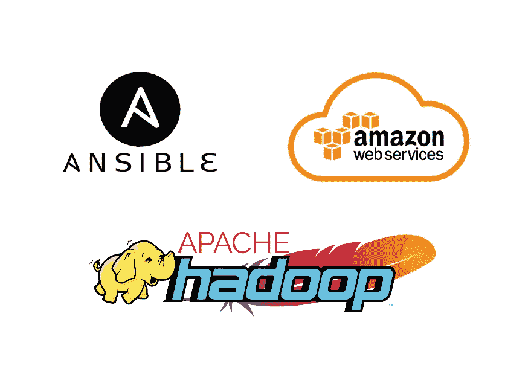
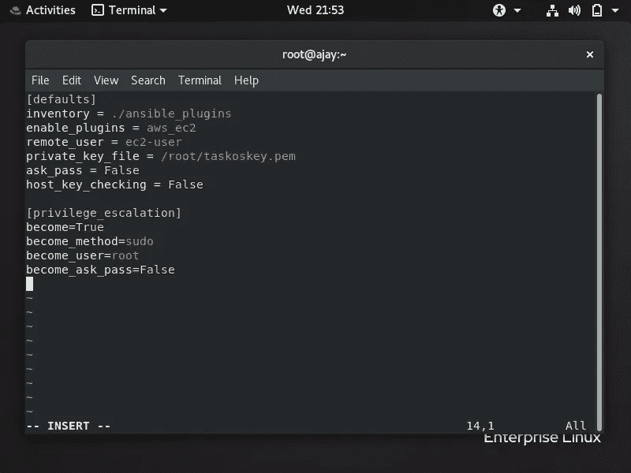
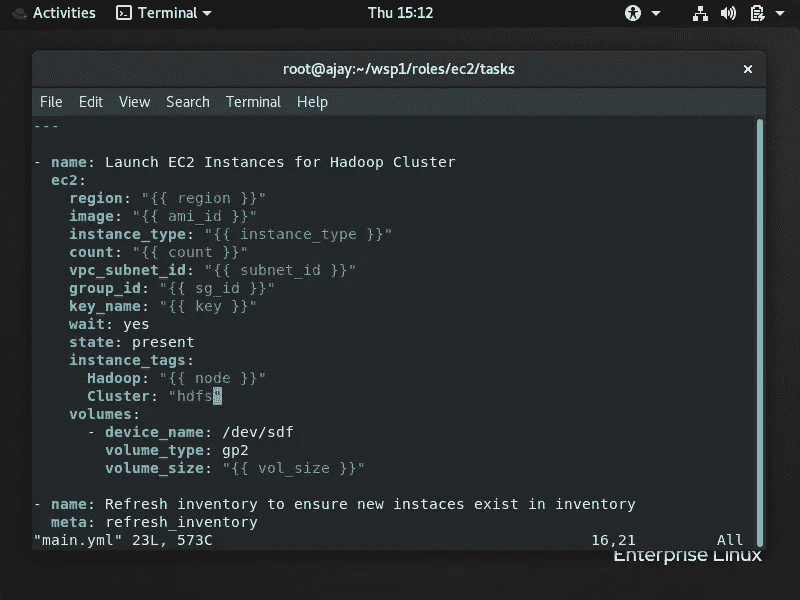
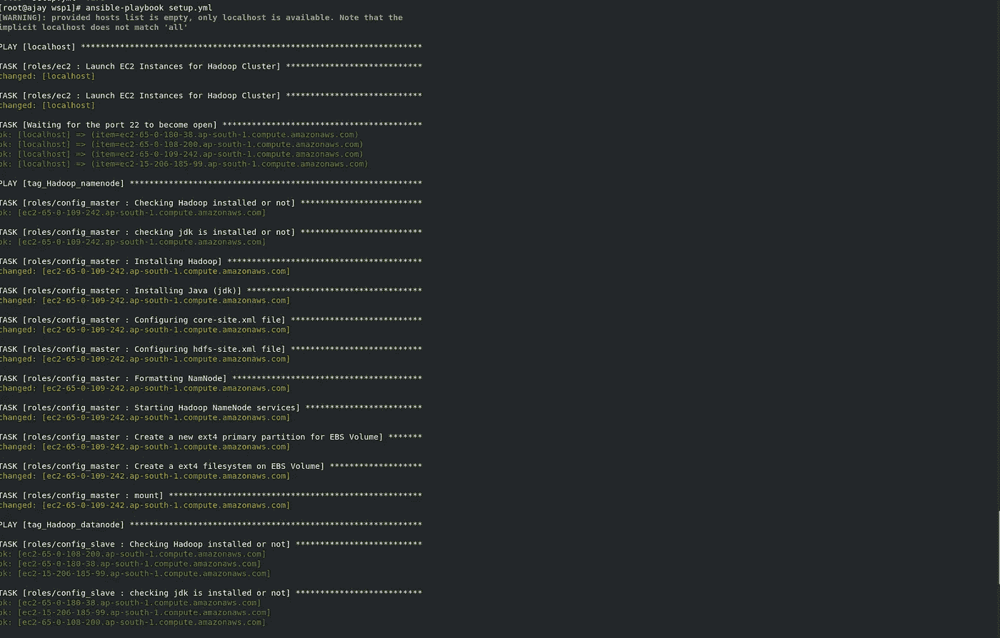
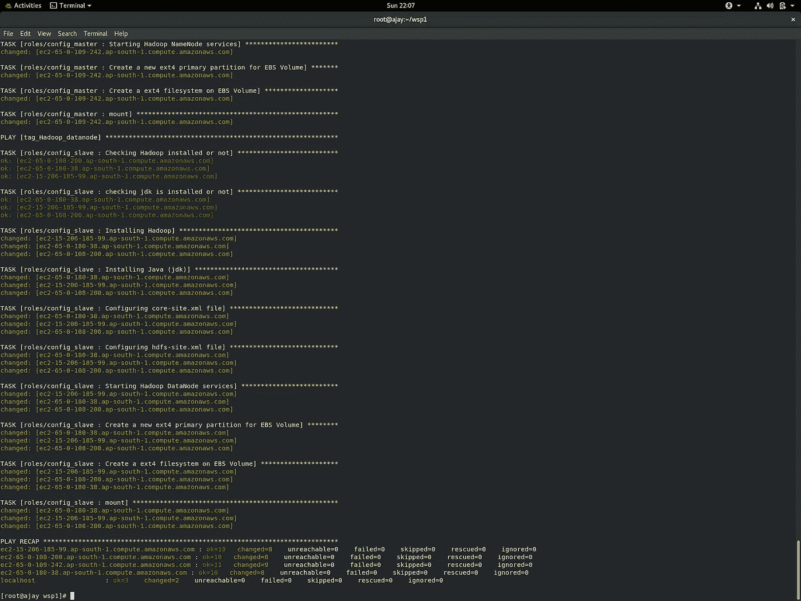

# 使用 Ansible 在 AWS 上自动化 Hadoop 集群部署

> 原文：<https://blog.devgenius.io/automate-hadoop-cluster-deployment-on-top-of-aws-using-ansible-194b623b9103?source=collection_archive---------2----------------------->

## 本教程将带您完成使用 Ansible 在 AWS 上部署 Hadoop 集群的过程



嘿大家好，

在本文中，我将向您展示一个有趣的**自动化**，其中我们将**在 AWS Cloud (EC2)** 之上设置 Hadoop 集群(HDFS)，并且我们将使用一个名为 [**Ansible**](https://www.ansible.com/) 的工具来做所有事情，这是最好的 **DevOps** **自动化工具之一。**本文中最棒的是，我们将使用 Ansible 的**角色**和**动态库存**概念，使整个过程更加**动态。**

我希望你对 **AWS** 有些熟悉，也许你已经启动了 **EC2 实例**，或者类似的。并且也有一些关于 **Ansible** 和 **Hadoop 的基础知识。你可以很容易地在互联网上找到关于这些技术的信息，在这篇文章中，我们的主要目的是整合所有这些技术。**

**让我们了解一下我们实际上要做些什么来设置这种自动化。**

一个一个**根大！！！**

在现实世界中，我们通常处理 **BigData** 并且这个 BigData 的大小在 **Peta 或 EB 或更多。**为了处理这些大数据，我们使用了像 **Hadoop 这样的技术。**但是为了存储如此庞大的数据，我们需要越来越多的存储设备或资源**这将增加我们的成本**。但是我们可以使用云存储来存储这些大数据，因为云提供商提供几乎无限的存储，如 **AWS S3、GCP 存储**，从维护、可用性、可靠性等方面来看，这将是一个更便宜、更好的选择。

因此，我们将启动 **EC2** 实例来设置我们的 Hadoop 集群，即 **NameNode** 和**datanode。**然后，我们将创建 EBS 卷并将其与 DataNodes 连接起来，以存储 HDFS 集群处理的大数据。为了设置所有这些东西，我们将使用 **Ansible** 来自动化我们的工作。

那么让我们动手实践吧！

[要了解 Ansible 的安装请参考我之前的文章](https://www.linkedin.com/pulse/cicd-pipeline-deploying-webserver-docker-using-ansible-ajay-pathak/)

# 设置 AWS 可行的动态库存

现在，首先我们必须使用 Ansible 启动 EC2 实例。但在此之前，我们必须在 ansible 中设置更多的东西，以便我们能够使用 Ansible 在 AWS 上进行**供应。**

首先，我们必须设置一个可响应的**动态清单**，这样它就能够获取所有 EC2 实例，然后能够配置这些实例。

*Dynamic inventory 是一个 ansible 插件，它对 AWS 进行 API 调用，以在运行时获取实例信息。它为您提供了动态的 ec2 实例细节来管理 AWS 基础设施。*

要在 ansible 中设置动态清单，最常用的方法是使用预先创建的 EC2 python 文件。但是代替它，我们将使用一个 ansible 动态清单插件，即 **aws_ec2。**

> 因此 **aws_ec2 插件**是管理 AWS EC2 Linux 实例的好方法，而不必维护标准的本地清单。作为 AWS EC2 实例的代码，这将允许更容易的 Linux 自动化、配置管理和基础设施。

为了使用 Ansible for AWS，我们必须安装 **boto、boto3、**和 **botocore** Python 库

```
pip3 install boto boto3
```

要启用 **aws_ec2** 插件，我们必须将以下语句添加到 **ansible.cfg** 文件中:

```
enable_plugins = aws_ec2
```

所以我们的 ansible.cfg 文件看起来像这样



ansible.cfg 文件示例

在上图中，你可以看到我的目录路径是 **ansible_plugins，**所以这是一种管理所有 ansible 插件的便捷方式，就像如果我们有多个 AWS 帐户或不同的云帐户，那么我们可以将所有相关的插件放在一个目录中。

现在，在这之后，我们必须为 aws_ec2 插件创建一个**配置文件，**这里我已经创建了 **aws_ec2.yaml** 文件，如下所示

```
---
plugin: aws_ec2
aws_access_key: <YOUR-AWS-ACCESS-KEY-HERE>
aws_secret_key: <YOUR-AWS-SECRET-KEY-HERE>regions:
  - ap-south-1strict: False
keyed_groups:
  - key: tags
    prefix: tag
  - key: placement.region
    prefix: aws_region
```

这是一个简单的配置文件，您可以根据需要修改它。所以在上面的文件中，注意 **keyed_groups** 关键字，在它下面我们基本上写了我们想要如何根据标签、区域、实例类型等对实例进行分组。这里我使用了**标签**来对我的 HDFS 集群 NameNode 和 DataNodes 实例进行分组。

通过如下列出所有 EC2 实例来测试动态清单

```
ansible-inventory --list
```

# 创建可变角色

> 在 Ansible 中，**角色**基本上是一种将我们写在剧本中的所有东西分组的方法，或者说它是将剧本分成多个文件的主要机制。所以角色是变量、任务、文件、模板和模块的集合。这简化了复杂行动手册的编写，并且使它们更容易重用。

在 ansible 中创建一个角色目录结构，我们可以这样使用 **ansible-galaxy** 命令

```
ansible-galaxy init <role name>
```

或者，如果我们的组有限，我们也可以手动创建此结构。

现在，我们将创建 3 个角色，分别是:

*   用于启动 EC2 实例来设置 HDFS 集群
*   将实例配置为 Hadoop Master (NameNode)
*   将实例配置为 Hadoop 从节点(DataNodes)

# 创建角色以启动 EC2 实例

在这个角色中，我们将创建一个**任务**文件和一个**变量**文件。

下面是任务文件，其中包含 Ansible 将要执行的所有任务



在上面的文件中，你可以看到我使用了变量和一些用户定义的变量，比如实例和标签的数量，我们将使用这些变量来启动具有单个角色的 namenode 和 datanodes 实例。请注意，我使用了一个名为 **meta** 的模块，它会在我们启动某个实例时自动刷新我们的动态清单。

**该角色的变量文件**

```
---
region: "ap-south-1"
ami_id: "ami-0a9d27a9f4f5c0efc"
instance_type: "t2.micro"
subnet_id: "subnet-2e8ee562"
sg_id: "sg-007e984dff1d14721"
key: "taskoskey"
```

我附加到所有实例的安全组只允许 SSH 和 HDFS 服务在 9001 端口上运行。

# 创建角色以配置 HDFS 集群

*要使用 ansible 配置 HDFS 集群，您需要具备一些基本知识，如* ***如何手动设置 HDFS 集群*** *。但是如果你是 Hadoop 新手，不知道如何设置 HDFS，那么你可以看看我的* [*这篇文章，它是在本地设置 HDFS 的分步指南。*](https://www.linkedin.com/pulse/setting-up-hadoop-cluster-hdfs-locally-ajay-pathak)

让我们看看如何用 Ansible 设置 HDFS

## 正在为 NameNode 创建角色

在这个角色中，我们主要有 3 个目录，即**任务、模板、**和**var。**

这里是**任务**文件，它包含了我们希望 Ansible 执行的所有任务，以便配置 NameNode，它通常会执行这些任务

*   安装 Hadoop 和 java
*   将实例配置为 NameNode 并启动其服务
*   安装 EBS 卷及其 NameNode 数据目录

现在在 **templates** 目录下有两个 Hadoop 文件，即 **hdfs-site.xml** 和 **core-site.xml** ，ansible 会将它们复制到 NameNode 的 **/etc/hadoop** 目录下，并用它们的值替换一些变量。而这些文件也被称为 **jinja 模板。**所以这些文件中的内容是

**hdfs-site.xml 文件**

```
<?xml version="1.0"?>
<?xml-stylesheet type="text/xsl" href="configuration.xsl"?><!-- Put site-specific property overrides in this file. --><configuration><property>
<name>dfs.{{val}}.dir</name>
<value>{{hdfs_dir}}</value>
</property></configuration>
```

**core-site.xml 文件**

```
<?xml version="1.0"?>
<?xml-stylesheet type="text/xsl" href="configuration.xsl"?><!-- Put site-specific property overrides in this file. --><configuration><property>
<name>fs.default.name</name>
<value>hdfs://{{master_ip}}:{{hdfs_port}}</value>
</property></configuration>
```

这是这个角色的变量

```
master_ip: "0.0.0.0"
val: "name"
hdfs_dir: "/master_hdfs"
hadoop_dir: "/etc/hadoop"
hdfs_port: 9001
```

## 为 DataNodes 创建角色

*配置 DataNode 的角色结构与 NameNode 角色相同，在任务文件和变量文件中有一些小的变化。*

由于在 Hadoop 中我们不格式化 DataNode，因此我们必须删除执行格式化的任务，并且我们使用不同的命令来启动 DataNode 服务，因此我们也必须删除此任务。因此，通常我们只需从 NameNode 任务文件中删除 2 个任务，只添加下面的任务，其他任务保持不变。

```
- name: Starting Hadoop DataNode services
  command: "hadoop-daemon.sh start datanode"
  ignore_errors: true
```

这个角色的变量文件是

```
master_ip: "{{ groups.tag_Hadoop_namenode[0] }}"
val: "data"
hdfs_dir: "/slave_hdfs"
hadoop_dir: "/etc/hadoop"
hdfs_port: 9001
```

现在已经创建了所有需要的角色，动态清单也准备好了。现在，我们只需创建一个最终的可行剧本，运行所有这些角色，并在 AWS 上设置我们的 HDFS 集群。

这是剧本

现在我们只需要像这样运行这个剧本

```
ansible-playbook setup.yml
```

仅仅这一条命令就可以为我们做一切事情，从启动 EC2 实例到将它们配置为 NameNode 和 DataNodes。

**该命令的输出**



产出 1



产出 2

现在我们的 HDFS 集群已经准备好了，但是最好交叉检查所有的 DataNodes 是否都与 NameNode 连接。为此，我们必须对任何 DataNode 或 NameNode 执行 SSH，然后运行这个命令

```
hadoop dfsadmin -report
```


**在上图中，您可以看到所有 3 个 DataNodes 都成功连接到 NameNode，并将其存储贡献给与它们连接的 EBS 卷所在的群集。**

现在，我们的 Hadoop 集群已经成功部署在 AWS 上，我们现在可以使用它来处理和存储大数据，并且我们的所有数据都存储在安全且灵活的 AWS EBS 卷上。ansible 帮助我们实现这种自动化，并设置完整的 HDFS 集群及其高级功能，即动态库存和角色，使整个流程保持动态。

> 但是，在这方面，我们还有一些工作要做，就像你注意到的那样，我们已经使用 Ansible 为集群提供 EC2 实例，但是现在我们使用不同的工具在云上提供资源，例如 Terraform，虽然我们可以使用 Ansible 进行提供，但是 Ansible 实际上是用于配置管理的，Terraform 是比它更好的选择。
> 
> **因此，在本文的第 2 部分，我将向您展示如何集成 Terraform 和 Ansible 来完成相同的任务，并使 Ansible 剧本更加动态。**

我已经在我的 [GitHub repo](https://github.com/Ajaypathak372/ansible-hadoop-aws.git) 上上传了所有的文件和剧本。

要了解 Ansible 的安装，点击 [**这里**](https://www.linkedin.com/pulse/cicd-pipeline-deploying-webserver-docker-using-ansible-ajay-pathak/)

要知道如何一步一步手动设置 HDFS，点击 [**这里**](https://www.linkedin.com/pulse/setting-up-hadoop-cluster-hdfs-locally-ajay-pathak)

**感谢阅读！！！**

如果你喜欢我的作品，请继续关注我的作品。

在 [LinkedIn](http://www.linkedin.com/in/ajay-pathak372) 上与我联系。