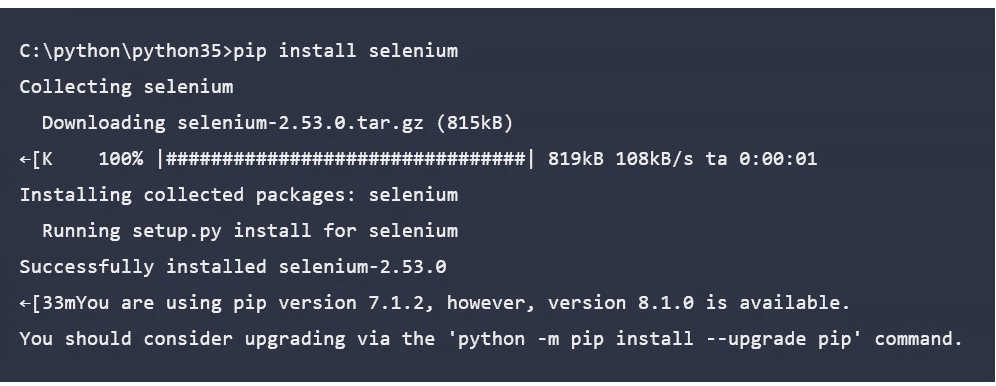

# 使用 Python 和 Selenium 自动化 Instagram。

> 原文：<https://blog.devgenius.io/automate-instagram-using-python-and-selenium-363e3850062c?source=collection_archive---------9----------------------->

## 权威指南

自动脚本是程序员最感兴趣和最迷人的事情之一，在代码的帮助下控制浏览器。

卢克·范·济尔在 [Unsplash](https://unsplash.com?utm_source=medium&utm_medium=referral) 上的照片

在这篇特别的文章中，我们将看到如何使用 Python 和 **selenium** 的强大功能**登录**insta gram 账户。让我们先了解什么是硒，它的优点和特点。

## 硒是什么？

Selenium 自动化并控制浏览器及其活动。在 selenium 的帮助下，我们可以用自己的方式编码来控制浏览器任务。首先，它是为了自动化 web 应用程序的测试目的。枯燥的基于网络的管理任务也可以自动化。随着你了解的越来越多，看到事情自动发生并在一次又一次做无用的任务中节省时间是如此有趣。

简而言之，它是用于自动化 Web 应用任务而无需人工干预的最佳框架之一。

# 先决条件:

1.  安装 Selenium Webdriver Python 包

a.首先转到 Python 的安装目录。

b.使用<pip>工具安装 Selenium Webdriver 包。</pip>

2.您想要使用的浏览器的网络驱动程序。下面列出了一些，其他的可以通过他们的开发者网站在线找到

> **注:**下载驱动程序之前，请检查您的浏览器版本(设置)，因为您需要下载与浏览器版本完全相同的驱动程序版本。

**a .谷歌 Chrome 驱动**

 [## 下载-Chrome driver-Chrome 的 WebDriver

### Chrome 的网络驱动

Chromechromedriver.chromium.org 的 web 驱动程序](https://chromedriver.chromium.org/downloads) 

**b .微软 Edge 驱动**

 [## 网络驱动

### 进入设置>更新和安全>开发者，然后选择“开发者模式”。对于 Microsoft Edge 传统版本…

developer.microsoft.com](https://developer.microsoft.com/en-us/microsoft-edge/tools/webdriver/) 

## 让我们进入今天文章的代码部分→

# 解释:

1.  首先，我们导入上面代码中导入的所需模块，如 selenium，time →暂停脚本运行几秒钟，因为如果我们输入太快，浏览器会尝试检测自动化内容和其他所需的基本模块。
2.  在第 15 到 18 行，我们使用了驱动选项设置，这样浏览器就可以全屏启动，不会出现错误，所以我们禁用了任何扩展。
3.  在第 19 行中，根据保存在计算机中的驱动程序的位置输入可执行路径。
4.  在第 20 行输入我们希望自动化的网站的 URL
5.  然后我们使用休眠模块，这样脚本就有时间定位路径。简单来说，它就像一个暂停按钮。
6.  然后，我们定义一个函数，并使用 Find element 发送数据和输入，这是在(find_element_by_name 和 find_element_by_xpath)的帮助下完成的

7.在第 34 行中，您可以输入您希望到达的 URL，或者您可以使用与上面相同的 URL 并运行代码。

类似地，你也可以自动化许多其他事情，比如 twitter 登录、发推、脸书等等。

# 结论:

在这篇文章中，我们已经学会了通过 python 和 selenium 来自动化我们的 Instagram 帐户。我们可以用 Selenium automation 自动化许多东西。

> **如果对代码有任何疑问或问题，您可以随时通过** [**网站**](https://pythonmanin.wordpress.com) **中的联系部分联系我，或者在下面的评论部分让我知道您是否希望我写更多关于自动化和 python 的文章。**

## [https://pythonmanin.wordpress.com](https://pythonmanin.wordpress.com)