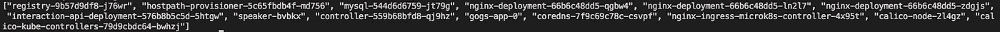
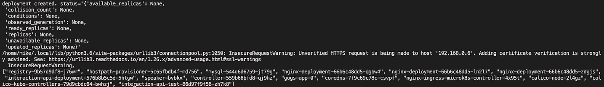

# 用 Python 自动化 Kubernetes

> 原文：<https://blog.devgenius.io/automate-kubernetes-with-python-2150c290afe7?source=collection_archive---------2----------------------->

摆脱手动运行命令的简单方法…


[附身摄影](https://unsplash.com/@possessedphotography?utm_source=medium&utm_medium=referral)在 [Unsplash](https://unsplash.com?utm_source=medium&utm_medium=referral) 上拍照

手动配置资源并将其部署到 Kubernetes 集群会消耗大量宝贵的时间。为了减轻这种痛苦并帮助自动化这一过程，您可以使用舵图甚至 CI/CD 解决方案。但是，信不信由你，你也可以用 Python！Python [Kubernetes](https://github.com/kubernetes-client/python) 模块是一个客户端库，它与 Kubernetes REST API 交互，帮助您管理集群上的资源。让我们来看看它能做什么！

# 设置和安装

默认情况下，Kubernetes 模块不是 Python 标准库的一部分。因此，我们需要使用 pip 来安装它。

```
pip3 install Kubernetes
```

显然，我们需要的下一个项目是 Kubernetes 集群，我不会在这里详细介绍如何实现，但是您可以查看这篇文章[来帮助您开始使用 MicroK8s。我推荐使用 MicroK8s，因为它可以在几乎任何计算机上使用(甚至是树莓 Pi)。](https://medium.com/codex/quitting-kubernetes-kubeadm-and-switching-to-microk8s-b487e2abd482)

一旦运行并配置了集群，设置列表上的最后一项是获取一个允许我们从 Python 客户端访问集群的承载令牌。

> 免责声明:使用令牌时，您会收到一个关于未经验证的 HTTPS 请求的警告。出于测试目的，可以忽略这一点。但是，对于生产环境，建议添加证书验证。

这是一个相对简单的任务，可以通过运行下面的命令来完成。本质上，这将创建一个请求令牌的新秘密。

```
microk8s kubectl apply -f - <<EOF
apiVersion: v1
kind: Secret
metadata:
  name: default-token
  annotations:
    kubernetes.io/service-account.name: default
type: kubernetes.io/service-account-token
EOF
```

之后，运行以下命令来获取您的不记名令牌。

```
microk8s kubectl describe secret default-token | grep -E '^token' | cut -f2 -d':' | tr -d " "
```

# 编码时间

现在一切都设置好了，我们终于可以写一些代码了。首先要做的是创建一个名为*kubernetes _ interaction . py*的新文件。该文件的目的是保存一个类对象，该对象包含与 Kubernetes 模块交互所需的所有必要函数。创建了该文件后，将以下代码添加到新文件中。

```
import json
from kubernetes import client, config, utilsclass kubernetes_interaction:
     def __init__(self):
          pass
```

接下来，我们需要修改类构造函数，以便传递我们的承载令牌并创建一个允许我们连接到 REST API 的配置。请记住，对于主机，您需要使用节点的 IP 地址。

```
def __init__(self, token):
     config = client.Configuration()
     config.host = "https://<NODE_IP_ADDRESS>:16443"
     config.verify_ssl = False
     config.api_key = {"authorization": "Bearer " + token} self.apiClient = client.ApiClient(config)
```

如果您碰巧在本地机器上运行集群，那么您不需要在构造函数中创建手动配置。相反，您可以在您的类函数中使用这个函数，它将在。kube 目录。

```
config.load_kube_config()
```

## 查看集群资源

既然我们现在有了一个连接到 API 的方法，让我们编写一个函数来列出集群上的所有 pod。

分解这个函数做什么，我们创建一个 *CoreV1Api* 类的新实例，然后用来调用*list _ pod _ for _ all _ namespaces*方法。该方法返回与集群上运行的 pod 相关的所有信息。为了简单起见，我们使用指令来获取 pod 的名称，并将它们作为 JSON 列表返回。

## 部署新资源

加入新的资源，做一些更令人兴奋的事情！Kubernetes 模块有几种不同的方式来部署不同的资源。我们今天要采取的方法将适用于任何 YAML 文件，不管它们是什么样的资源。

这里需要注意的一点是，执行这个操作不需要其他类实例。您所要做的就是传入一个文件(当然是正确的路径)并从构造函数传入配置。我们也让 verbose 开着，这样我们可以看到它运行时发生了什么。

## 测试代码

写完所有的类代码后，我们终于可以测试所有的代码并看到它的运行了。创建另一个名为 *test.py* 的文件，导入*时间*模块*和 kubernetes_interaction.py* 文件。

```
import time
from kubernetes_interaction import *
```

接下来，声明一个名为 token 的变量，并将之前创建的不记名令牌分配给它。然后，为 *kubernetes_interaction* 类创建一个新的实例，传递这个令牌变量。

```
token = "<YOUR_TOKEN>"interaction = kubernetes_interaction(token)
```

之后，声明一个名为 *podsList* 的新变量，并将 *list_pods* 函数赋给它并打印结果。

```
podsList = interaction.list_pods()
print(podsList)
```

至此，我们已经准备好运行测试文件了。



集群上的单元列表。

如果您没有得到任何错误，那么您可以继续测试的下一部分，部署新的资源。对于这一步，您显然需要部署某种应用程序。我使用了一个我自己编写的程序，但是更改了它的名称，这样它就不会干扰我的集群上运行的原始程序。在 YAML 的文件中，我在名字后面加了一个“-test”以便容易识别。

一旦有了要部署的东西，在调用 *list_pods* 函数之前，回到测试文件并添加以下代码。

```
file = "application.yaml"interaction.apply_resource(file)time.sleep(5)
```

我们告诉脚本等待五秒钟的原因是集群需要几秒钟来应用资源。如果不等待，列出 pod 将不会捕捉到新 pod 的添加。如果您得到类似于下面的输出，那么拍拍自己的背，因为您成功了。



将创建一个新部署。

# 最后的想法

Kubernetes Python 模块是一个非常强大的客户端，允许您轻松地自动化与 Kubernetes 集群的交互。我们刚刚讨论的只是它的皮毛。简而言之，该模块具有一些功能，可以用来显示关于集群上不同资源的更多信息，并且能够创建、更新和删除资源。此外，还有大量的[端点可供](https://github.com/kubernetes-client/python/blob/master/kubernetes/README.md)使用。如果你真的想知道这个模块还能做什么，一个好的起点是查看这个模块的 Github 库中的[示例目录](https://github.com/kubernetes-client/python/tree/master/examples)。请在下面的评论中分享你是如何利用这个令人敬畏的模块的，我很乐意听到。下次见，干杯！

***用我的*** [***每周简讯***](https://crafty-leader-2062.ck.page/8f8bcfb181) ***免费阅读我的所有文章，谢谢！***

***想阅读介质上的所有文章？成为中等*** [***成员***](https://miketechgame.medium.com/membership) ***今天！***

查看我最近的一些文章

[](https://medium.com/codex/so-you-want-to-be-a-programmer-7152c7aa891e) [## 所以你想成为一名程序员？

### 关于如何开始软件开发之旅的提示和技巧

medium.com](https://medium.com/codex/so-you-want-to-be-a-programmer-7152c7aa891e) [](https://medium.com/codex/host-your-own-git-server-on-kubernetes-742b71ee31b6) [## 在 Kubernetes 上托管自己的 Git 服务器

### 在 10 分钟或更短时间内启动并提交！

medium.com](https://medium.com/codex/host-your-own-git-server-on-kubernetes-742b71ee31b6) [](https://python.plainenglish.io/build-your-own-docker-registry-ui-with-pythons-flask-e06a8f51c541) [## 用 Pythons Flask 构建你自己的 Docker 注册界面

### 查看 Docker 图像的更简单、更好的方法

python .平原英语. io](https://python.plainenglish.io/build-your-own-docker-registry-ui-with-pythons-flask-e06a8f51c541) [](https://medium.com/codex/how-to-deploy-asp-net-core-apis-to-kubernetes-cf4520d1ca7b) [## 如何部署 ASP？到 Kubernetes 的. NET 核心 API

### 它仍然和使用 Python APIs 一样快速和简单吗？

medium.com](https://medium.com/codex/how-to-deploy-asp-net-core-apis-to-kubernetes-cf4520d1ca7b) [](https://python.plainenglish.io/5-really-cool-apis-to-use-in-2022-a9ff0dabdb3) [## 将在 2022 年使用的 5 个非常酷的 API

### 从美国宇航局到加密货币等等…

python .平原英语. io](https://python.plainenglish.io/5-really-cool-apis-to-use-in-2022-a9ff0dabdb3)