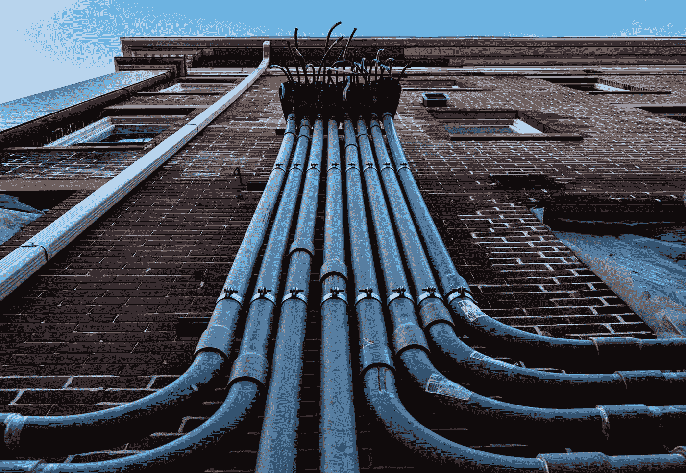
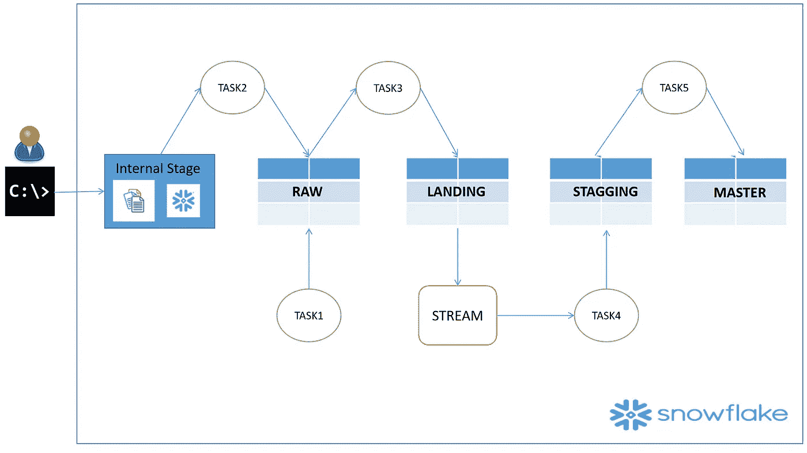

# 使用流和任务在雪花中自动化类型 2 渐变维度

> 原文：<https://blog.devgenius.io/automate-type-2-slowly-changing-dimension-in-snowflake-using-streams-and-tasks-dbe3801a7d73?source=collection_archive---------2----------------------->

照片由[EJ·斯特拉特](https://unsplash.com/@xoforoct?utm_source=medium&utm_medium=referral)在 [Unsplash](https://unsplash.com?utm_source=medium&utm_medium=referral) 上拍摄

在这篇博客中，我们将在**上讨论如何为 2 型渐变维度建立端到端的管道。**本博客分为两部分。

1.  手动一步一步走过。
2.  自动化步骤 1

那么，让我们开始并理解案例研究的基本设置和流程。因此，我们的案例研究如下:

1.  Supplier_Raw 表是临时表，总是从头开始重新加载。
2.  Supplier_Raw 表，使用内部阶段原始数据文件填充。
3.  基于 delta 数据的特定逻辑，从 Supplier_Raw 填充 Supplier_Landing。
4.  Supplier_Landing 上有一个流，用于跟踪 Supplier_Landing 和 Supplier_Staging 之间的差值。
5.  Supplier_Staging 是保存每个条目当前和历史数据的历史表。
6.  Supplier_Master 是最终用户用于报告的最终表格，仅包含当前供应商数据。

在此设置中，我们将使用以下 4 个供应商表。

跟踪 CDC 的 Supplier_Landing 表上的流。

我们将创建一个文件格式和内部阶段，使用 COPY INTO 命令为从内部阶段获取原始数据建立一个管道。这将帮助我们填充 Supplier_Raw 表。

我们将使用 Merge 语句编写一个业务逻辑，它将决定哪些数据需要从 Supplier_Raw 流向 Supplier_Landing，后者将填充流。

然后，我们将使用 Merge 语句编写另一个业务逻辑，它将根据标识的增量决定哪些数据需要从流表流向 Supplier_Staging。

最后，我们将使用 Current_Flag=Y 从 Supplier_Staging 表中提取当前供应商数据，并覆盖 Supplier_Master 表进行报告。

让我们在下面的演示中涵盖上述所有步骤:

现在，我们已经看到了如何设置数据管道和流来维护雪花中的 SCD 类型 2 数据，但是在数据用于日常生活的情况下，将需要太多的手动设置来维护。

如果我们可以建立端到端的数据管道，让数据流从原始表流向主表，同时保持类型 2 的渐变维度，这样如何？为此，我们必须遵循以下步骤:

下面是我们在 ETL 过程中必须完成的任务:

1。每次加载前截断供应商原始表
2。将数据从原始文件(在内部阶段)加载到供应商原始表，并在成功加载后从内部阶段移除文件
3。用最新的供应商原始表格数据更新供应商登陆数据
4。根据流程与供应商登陆
5 中确定的差异，将供应商登陆转换为供应商暂存。从供应商暂存更新供应商主数据，仅处理当前 Flag=Y 记录。

为了实现上述各个步骤的自动化，我们必须为上述每 5 个步骤创建 5 个任务。所有任务都依赖于父任务，并在给定的层次结构上执行。我们最终的自动化数据流图如下所示:

Supplier_Staging 表中的类型 2 SCD 数据如下所示。

最后，Supplier_Master 表将获得更新的数据，如下所示:

在下面的演示中，让我们看看上面用于维护 2 型 SCD 的端到端数据管道自动化:

**主要优势:**

1.  使用复制到、流和任务手工定制数据管道设置，以满足您对任何现代 ETL/ELT 工具的需求。
2.  无需为外部工具支付巨额许可费用。
3.  来自雪花的原生支持意味着更多的性能。
4.  有利于监管，因为数据不会离开雪花&你的区域。
5.  更少的数据移动意味着更少的存储意味着更低的成本。

希望这篇博客和 YouTube 视频有助于您深入了解**如何使用 Stream &任务来自动化 2 型渐变维度**的端到端数据管道。如果你有兴趣了解更多关于 [**雪花数据加载**](https://rajivgupta780184.medium.com/snowflake-bulk-data-loading-hands-on-a2b5985d8c93)**[**表流**](https://rajivgupta780184.medium.com/table-stream-in-snowflake-48c050b38e10) **&任务**的细节，可以参考我的博客。如果你对此有任何疑问，欢迎在评论区提问。如果你喜欢这个博客，请鼓掌。保持联系，看到更多这样的酷东西。谢谢你的支持。**

****你可以找我:****

****跟我上媒:**https://rajivgupta780184.medium.com/**

****在推特上关注我:**[https://twitter.com/RAJIVGUPTA780](https://twitter.com/RAJIVGUPTA780)**

****在 LinkedIn 跟我连线:**[https://www.linkedin.com/in/rajiv-gupta-618b0228/](https://www.linkedin.com/in/rajiv-gupta-618b0228/)**

****订阅我的 YouTube 频道:**https://www.youtube.com/c/RajivGuptaEverydayLearning T2**

****

**#坚持学习#坚持分享#日常学习。**

# **参考资料:-**

*   **【https://www.snowflake.com/ **