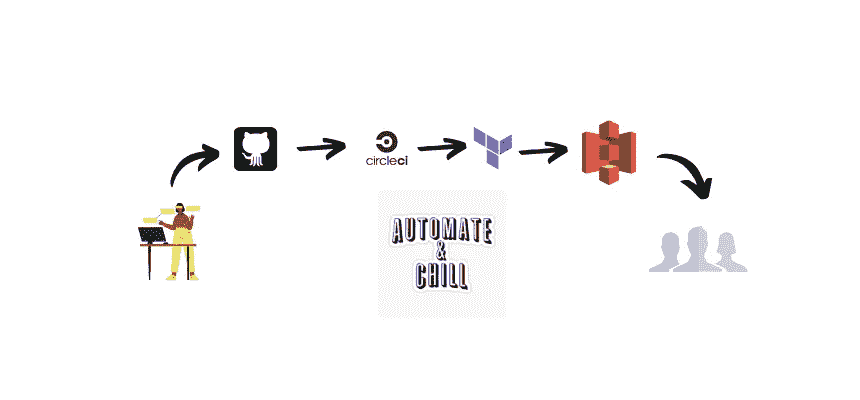
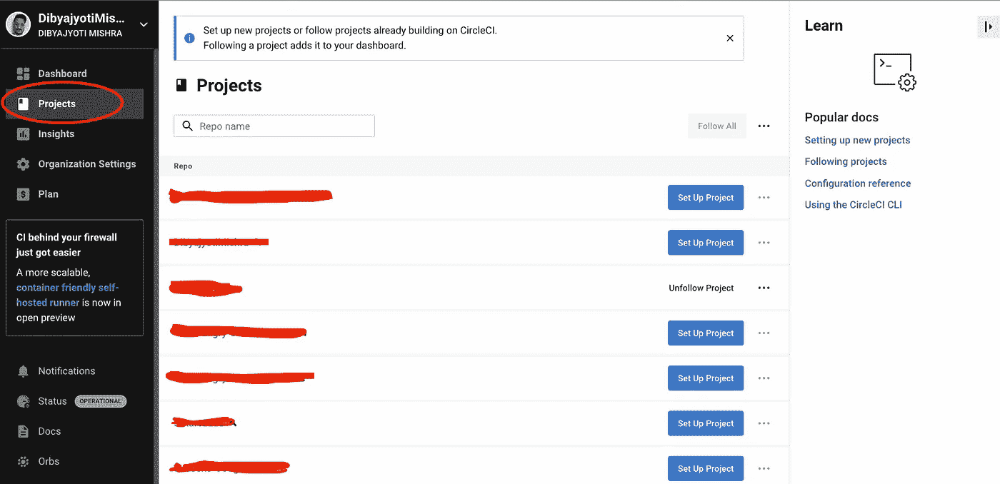
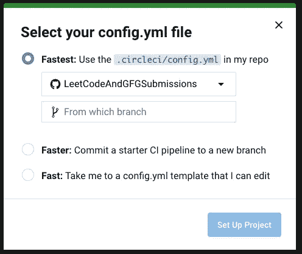
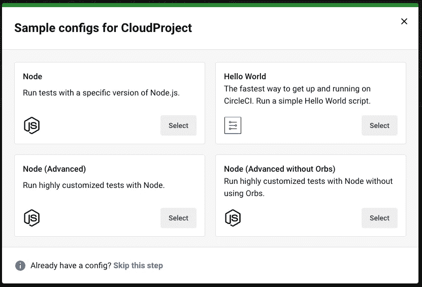

# 使用 CircleCI 和 Terraform 自动完成 AWS 部署。

> 原文：<https://blog.devgenius.io/automate-your-aws-deployments-with-circleci-and-terraform-975c9131f2d5?source=collection_archive---------6----------------------->

你好，欢迎来到另一篇博文。谢谢你的出现。今天，我们将了解一个非常棒的工具，它将在部署过程中节省我们大量的时间。

是的，我说的是哈希公司的 Terraform。

那么什么是 Terraform 呢？

Terraform 是一个基础设施代码工具，允许您在可读的配置文件中定义云和本地资源，您可以对这些文件进行版本控制、重用和共享。然后，您可以使用一致的工作流在整个生命周期中调配和管理您的所有基础架构。您可以轻松地将其与 CircleCI 或 Jenkins 等 CI 工具连接起来。或者甚至通过下载在你的机器上使用它。

从上面介绍中的图片，你应该已经猜到了工作流程。所以，我认为我们不应该再浪费时间去描述它了。让我们从安装 Terraform 开始，并将其与 CircleCI 连接起来，以实现整个流程的自动化。

说够了！开始编码吧。

和往常一样，我假设你已经准备好了你那令人敬畏的 react 项目。所以，是时候向世界展示了。

这里有一些先决条件。

*   关于[**AWS**](https://aws.amazon.com/)[**circle ci**](https://circleci.com/)[**Slack**](https://slack.com/)**。**

**(附注:**如果您没有一个或多个帐户，请创建一个。)

*   关于**反应**的一些基础知识。

就这些了，没有其他要求了。

让我们从建立 CircleCI 管道开始。

*   前往[https://app.circleci.com](https://app.circleci.com)，点击侧边栏中的项目选项卡。

*   确保您的项目在 Github 存储库中(私有或公共)。
*   当您在项目部分找到您的存储库时，单击标有“设置项目”的蓝色按钮。
*   从给定选项中选择**快速**并点击“设置项目”。

*   选择“跳过这一步”,因为我们将从头开始设置我们的管道。

*   现在只需点击“Commit and Run”按钮，我们就可以获得 circleci 配置文件并应用我们的管道。
*   如果你现在在 Github 上检查你的库，你会看到一个新的分支被创建，命名为“ [circleci-project-setup](https://github.com/DibyajyotiMishra/CloudProject/tree/circleci-project-setup) ”。切换到该分支并导航到。circleci/config.yml。
*   现在添加以下代码:

现在 CircleCI 已经设置好了，让我们也为我们的基础设施设置 Terraform。

*   创建一个名为 infrastructure 或任何你喜欢的名字的文件夹。
*   创建一个文件 main.tf 并添加以下几行。

*   现在创建一个文件 variables.tf .并添加以下代码行。

*   创建一个文件 s3.tf 来存储 s3 bucket 的配置。

*   创建一个名为 cloudfront.tf 的文件，它将作为在 AWS 上安装 cloudfront 的配置文件。

*   最后，创建一个名为 outputs.tf 的文件，并添加以下几行:

你都准备好了。现在提交您的代码来触发 CircleCI 构建过程，每次提交到您的分支时，您就可以部署您的网站了。

我希望你喜欢这个教程，它在某种程度上帮助了你。如果你有任何疑问，给我发短信。

祝你愉快。💜