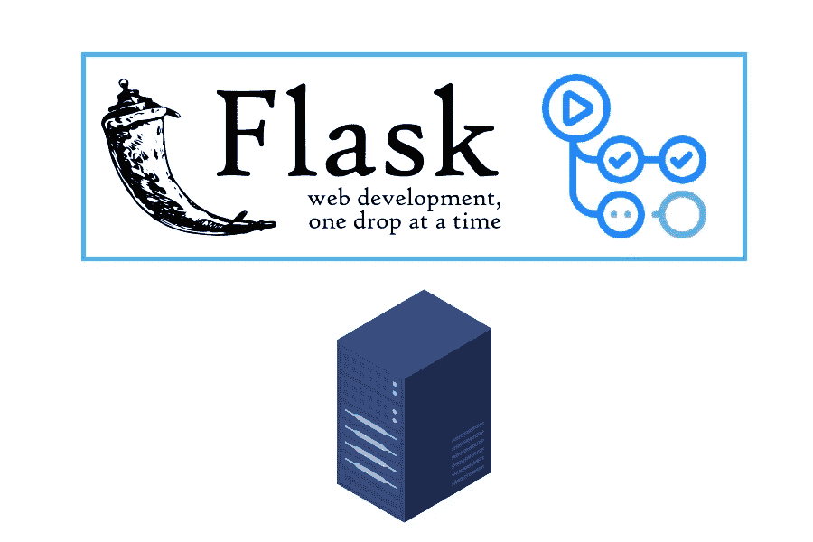

# 使用 Github 动作自动将 Flask 部署到 VPS

> 原文：<https://blog.devgenius.io/automate-your-flask-deployment-to-vps-using-github-actions-37e0a4364313?source=collection_archive---------8----------------------->


照片由[约书亚·索蒂诺](https://unsplash.com/@sortino?utm_source=unsplash&utm_medium=referral&utm_content=creditCopyText)在 [Unsplash](https://unsplash.com/s/photos/automation?utm_source=unsplash&utm_medium=referral&utm_content=creditCopyText) 拍摄

在我在[上一篇文章](https://medium.com/@adyaksa.w/what-i-learn-from-trying-selenium-on-vps-45f1e79f89a2)中提到的项目 [lnprice](https://lnprice.com/) 中，后端部署是这样手动完成的:

1.  将代码推送到 Github
2.  在 VPS 中提取代码
3.  重新部署应用程序

经过几十次部署，**我够了**。我决定学习如何自动化这一点。对于某些上下文，我已经有了使用 Github 动作来自动化我的部署的经验。我没有在这个项目中这样做的原因是我从来没有在 Flask 环境中这样做过。我只想在任何自动化之前优先考虑应用程序。因此，在本文中，我将描述我在 VPS 上自动部署后端的步骤。所有代码都可以在我的 [Github 库](https://github.com/adyaksaw/tutorial/tree/master/1-flask-deployment)中访问



# **1。设置 Pipenv &依赖关系**

为了更容易地自动化部署，我们需要一个简单的依赖管理系统。所以我们需要在我们的项目中安装 Pipenv 来处理我们的依赖，然后安装我们的依赖。我们可以这样做:

```
pip install pipenv
pipenv install flask
pipenv shell
```

通过运行`pipenv shell`，我们在这个项目中启动了一个具有 Flask 框架的虚拟环境。

# 2.**创建烧瓶应用程序**

下一步是创建一个简单的 Flask 应用程序。我们可以在 Flask 主页上使用示例。但是在我的例子中，我对它做了一点修改，使用了一个不同的端口，这样我们就不会意外地使用一个已经使用过的端口。

现在运行`flask run`并转到`localhost:5001`，在那个页面上应该有一个‘Hello World’。

# 3.创建 Docker 文件

在我看来，部署我们的应用程序最简单、最容易的方法是使用 Docker。我们肯定不能使用它，但仍然能够自动化我们的部署。但是因为不使用 Docker 可能会有很多痛苦，所以我真的建议使用它。

现在，在接触 Docker 之前，我们需要讨论如何将 Flask 部署到生产中。像 Django 一样，Flask 需要一个 WSGI 服务器来部署应用程序。有两种常见的 WSGI 服务器:UWSGI 和 Gunicorn。我就不细说它们有什么区别了。本文将使用 Gunicorn 作为 WSGI 服务器。

现在，有人已经为 [Gunicorn-Flask](https://github.com/tiangolo/meinheld-gunicorn-flask-docker) 组合创建了一个 docker 图像。但是在本教程的上下文中，该图像需要修改，所以我们最好从头开始创建它。这是创建的 Dockerfile 文件。

为什么我们用`requirements.txt`而不是直接用 Pipfile？在这里，我只想把 Pipenv 当作某种“依赖组织者”。我不想用 Pipenv 作为虚拟环境工具。您应该能够直接使用 Pipfile 中的依赖项，并使用 Pipenv 通过修改代码来访问依赖项。

创建 Dockerfile 后，我们可以通过运行以下命令来构建和运行 Dockerfile:

```
docker build -t 1-flask-deployment .
docker run -dp 5001:5001 1-flask-deployment
```

试着运行`docker container ls`，集装箱的`1-flask-deployment`应该启动并运行，可以从`localhost:5001`进入。

# 4.设置 Github Runner

在创建 Github Actions 文件之前，我们需要配置我们自己的 Github Runner。我们需要将 Runner 放在与我们想要放置产品代码的服务器相同的服务器上。对于这一步，我们只需遵循官方 [Github Runner 文档](https://github.com/adyaksaw/tutorial/settings/actions/runners/new?arch=x64&os=linux)中概述的步骤

# 5.创建 Github 动作

是时候偿还创建 Dockerfile 文件的困难部分了！因为我们已经知道了运行容器的步骤，现在我们只需要在 Github 动作中重复这一步。

在这段代码中，我配置了 Github 动作，这样它将只在代码被推送到 master(第 3–6 行)并在我自己的虚拟机上运行(第 10 行)时运行。

按下`deploy.yml`后，尝试从 VPS 内部调用`curl localhost:5001`。“Hello World”文本应该像我们在本地系统中调用它时那样出现。这意味着 Github Runner 正在工作，部署自动化正在工作！

*大家好，我是 Adyaksa，我写的是软件开发和我的语言学习经历。我计划每周发布一篇博客，内容是我在做兼职项目时发现的一些有趣的事情。如果你感兴趣，你可以关注我来了解它的最新情况！*

参考资料:

*   Pipenv 基本:[https://pipenv.pypa.io/en/latest/basics/](https://pipenv.pypa.io/en/latest/basics/)
*   烧瓶快速启动:【https://flask.palletsprojects.com/en/2.0.x/quickstart/ 
*   https://pythonspeed.com/articles/pipenv-docker/[码头工人](https://pythonspeed.com/articles/pipenv-docker/)
*   guni corn Flask:[https://www . digital ocean . com/community/tutorials/how-to-serve-Flask-applications-with-guni corn-and-nginx-on-Ubuntu-18-04](https://www.digitalocean.com/community/tutorials/how-to-serve-flask-applications-with-gunicorn-and-nginx-on-ubuntu-18-04)