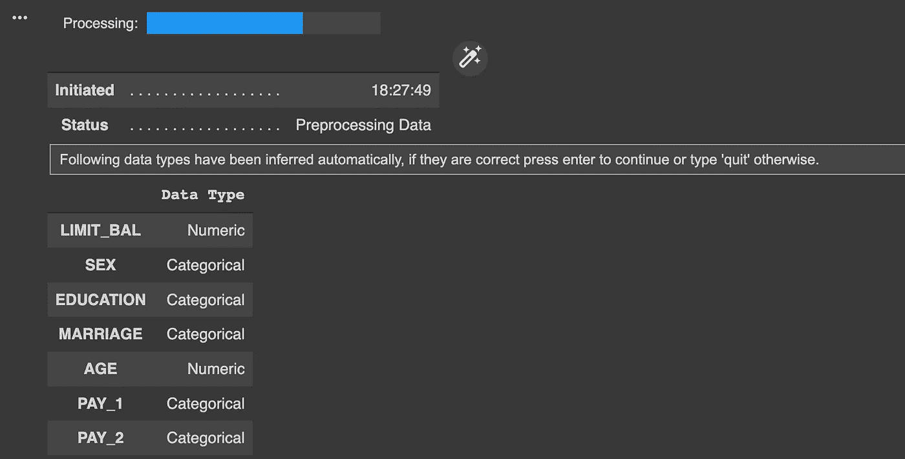
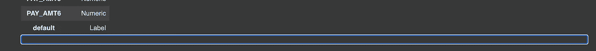
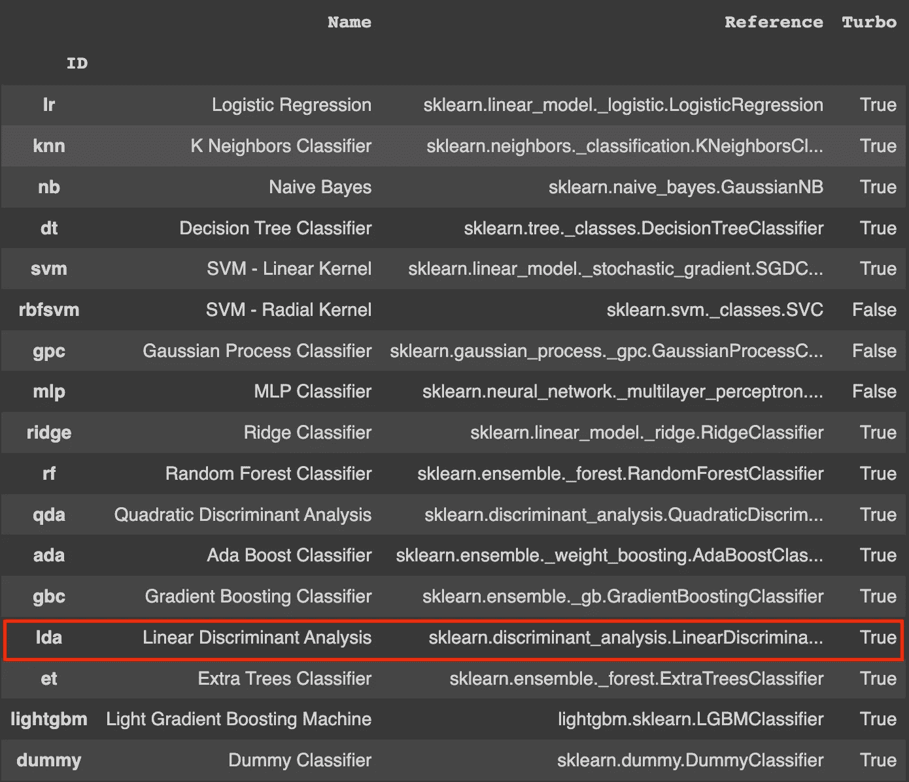
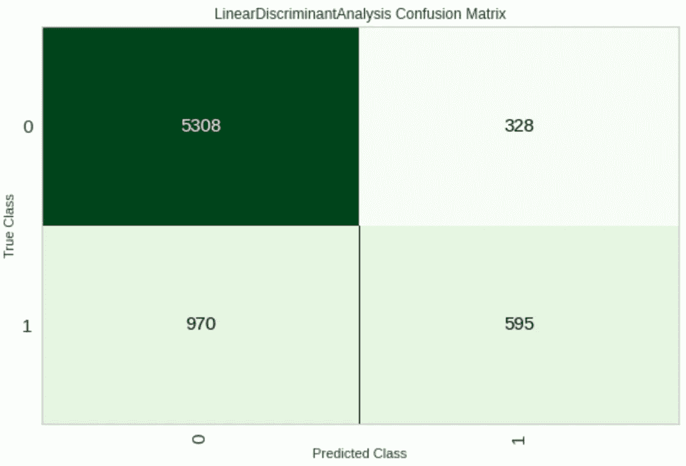
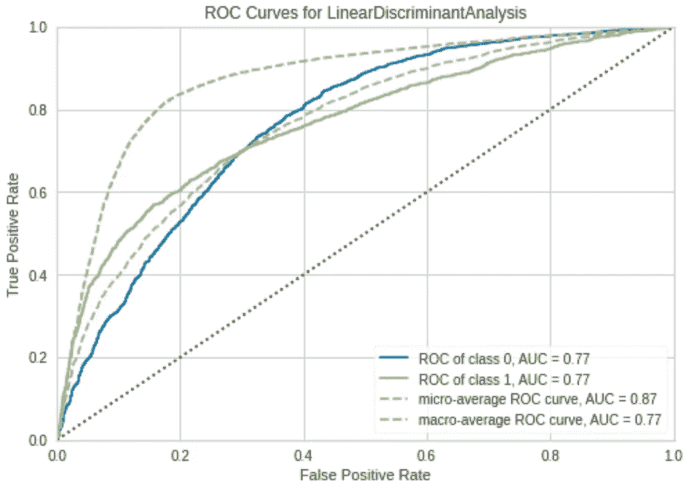
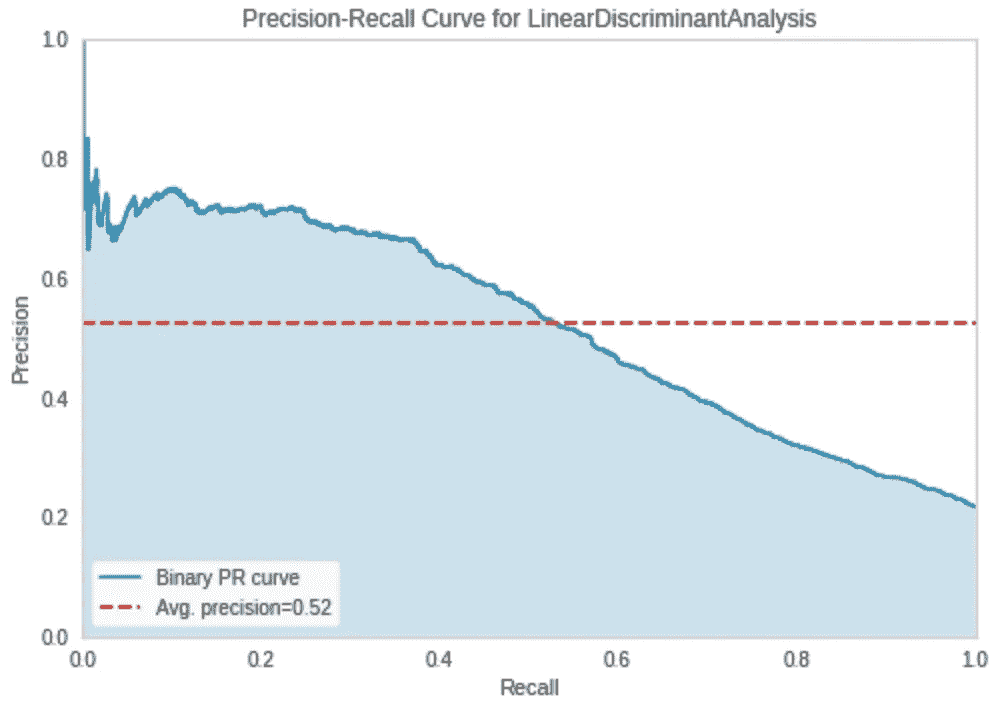
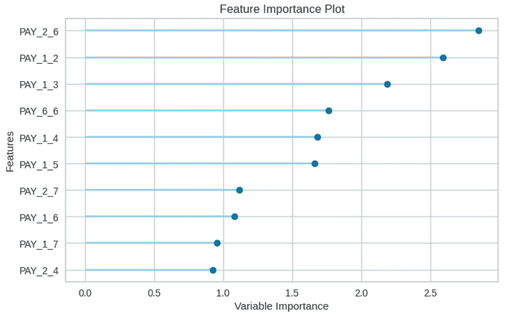
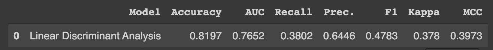
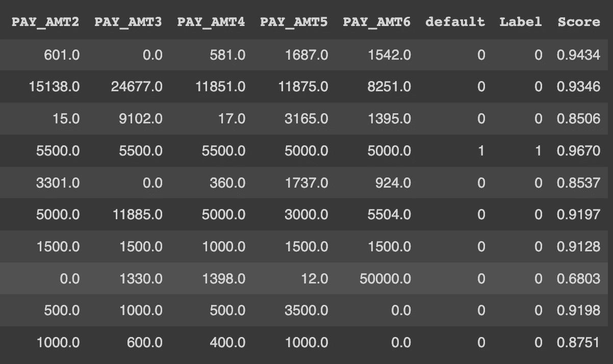

# 使用 PyCaret 自动化您的机器学习开发管道

> 原文：<https://blog.devgenius.io/automate-your-machine-learning-development-pipeline-with-pycaret-8cd94cb20a04?source=collection_archive---------7----------------------->


资料来源:PyCaret.org

数据科学不容易，我们都知道。即使编程也需要大量的周期才能完全上手。不要误解我的意思，在某种程度上，我喜欢做一名开发人员，但是很难。你可以阅读和观看大量关于编程是多么容易的视频，但是就像生活中的所有事情一样，如果你没有激情，你可能会在前进的道路上发现一些障碍。

我明白了，你可能在想，*“这是一个不错的发帖方式！我不再是“T1”了，但是，让我告诉你，尽管成为一名数据科学家是一项挑战，但随着我们变得越来越以数据为中心的****数据感知型*** 和 ***数据依赖型*** ，你需要解决这些问题以成为一名专家，这是旅程的一部分。**

*您可能知道，数据清理和数据准备平均要花费 75%-90%的时间进行数据分析。此外，如果你正在开发一个机器学习模型，你必须花时间审查不同的算法，它们的准确性，精确度，召回率和错误率，以及其他关键变量。*

*现在，如果您有一个库可以帮助您自动化这个过程，并为您提供训练您的模型的最佳替代方案，会怎么样呢？这就是 [**PyCaret**](https://pycaret.org/) 的全部内容。*

*我认为自己是一个数据科学爱好者。我喜欢开发机器学习和深度学习项目，在数据中寻找模式，并创建令人惊叹的可视化效果。但是说实话，有一些重复的任务我很想自动化。
PyCaret，据他们的开发者说， ***“是一个用 Python 编写的开源、低代码的机器学习库，可以自动化机器学习工作流。”*** 很酷吧？*

*好吧，我引起你的注意了，对吧？这对从数据科学起步的终端用户意味着什么？现在，您可以抓取数据，使用低代码工具，并完全自动化机器学习开发项目，而不必担心编写数百行代码。你可能在想，“这是作弊吧？”实际上，在处理现实生活中的项目时，你需要优化你花在重复任务上的时间，即使整合机器学习模型的基础是一件**必须做的事情**如果你对数据科学感兴趣，你需要利用任何可用的工具来缩短*“上市时间”*，并让你专注于那些为项目增加价值的步骤。*

*PyCaret 被认为是一个低代码的解决方案。PyCaret 鼓励非程序员用户通过减少构建项目所需的代码行、库和任务的数量来打破他们在开发第一个机器学习模型时面临的入门障碍。*

*让我们看看 PyCaret 如何将您的开发过程提升到一个新的水平。出于这个例子的目的，我将使用 Google Colab，但是您也可以使用您选择的笔记本或开发设置。*

# *设置您的项目*

*首先，打开你的笔记本并安装 PyCaret。*

*<hello my="" friend="" class="ae ky" href="https://colab.research.google.com/" rel="noopener ugc nofollow" target="_blank">Colab ！></hello>*

*现在，让我们安装 PyCaret。*

```
*!pip install pycaret*
```

*如果您正在使用 Google Colab，在安装 pycaret 后，在笔记本顶部运行以下代码以显示交互式视觉效果。这在其他设置中是不需要的。*

```
*from pycaret.utils import enable_colab
enable_colab()*
```

*笔记本引擎将安装 **Pycaret** 及其所有依赖项。就是这样。您的环境已经设置好了👌*

# *什么是二进制分类？*

*在我们继续之前，我们假设学习者对基本的分类算法有一些经验，然而，让我们刷新你的记忆。*

*二元分类是一种**监督机器学习**技术，用于预测离散且无序的分类标签，如通过/失败、肯定/否定、是/否、默认/非默认等。*

*下面列出了一些分类的真实使用案例:*

*   *根据客户的行为开展有针对性的营销活动。*
*   *确定患者是否患有某种疾病的医学测试——分类属性是疾病的存在。*
*   *工厂中的“通过或失败”测试方法或质量控制，即决定是否符合规格——通过/不通过分类。*

# *资料组*

*使用 [**PyCaret**](https://github.com/pycaret/pycaret/blob/master/tutorials/Binary%20Classification%20Tutorial%20Level%20Beginner%20-%20%20CLF101.ipynb) 文档，对于本教程，我们将使用**信用卡客户数据集的默认设置**。此数据集包含从 2005 年 4 月到 2005 年 9 月台湾信用卡客户的违约付款、人口统计因素、信用数据、付款历史和账单等信息。有 24，000 个样本和 25 个特征。*

*每列的简短描述如下:*

*   ***ID:** 每个客户端的 ID*
*   ***LIMIT_BAL:** 以新台币为单位的给定额度(包括个人和家庭/补充额度)*
*   ***性别:**性别(1 =男性，2 =女性)*
*   ***学历:**(1 =研究生院，2 =大学，3 =高中，4 =其他，5 =未知，6 =未知)*
*   ***婚姻:**婚姻状况(1 =已婚，2 =单身，3 =其他)*
*   ***年龄:**以年为单位的年龄*
*   ***PAY_0 至 PAY _ 6:**n 个月前的还款状态(PAY_0 =上月… PAY_6 = 6 个月前)(标签:-1 =按时还款，1 =延迟一个月还款，2 =延迟两个月还款，…8 =延迟八个月还款，9 =延迟九个月及以上还款)*
*   ***BILL_AMT1 至 BILL _ AMT 6:**n 个月前的对账单金额(BILL_AMT1 = last_month..BILL_AMT6 = 6 个月前)*
*   ***PAY _ am t1 to PAY _ AMT 6:**n 个月前的付款金额(BILL_AMT1 = last_month..BILL_AMT6 = 6 个月前)*
*   ***违约:**违约付款(1 =是，0 =否)`Target Column`*

*现在我们了解了我们的来源，让我们下载数据。*

```
***from** pycaret.datasets **import** get_data
dataset **=** get_data('credit')*
```

*为了在看不见的数据上演示`predict_model()`函数，从用于预测的原始数据集中保留了 1200 条记录的样本。请记住，这不是一个测试数据集，这个看不见的数据是一个子集，将在项目结束时利用它来运行我们的预测。另一种思考方式是，在训练机器学习模型时，这些记录是不可用的。*

```
*data **=** dataset**.**sample(frac**=**0.95, random_state**=**786)
data_unseen **=** dataset**.**drop(data**.**index)
data**.**reset_index(inplace**=True**, drop**=True**)
data_unseen**.**reset_index(inplace**=True**, drop**=True**)
print('Data for Modeling: ' **+** str(data**.**shape))
print('Unseen Data For Predictions: ' **+** str(data_unseen**.**shape))*
```

# *在 PyCaret 中设置环境*

*`setup()`函数在 pycaret 中初始化环境，并创建转换管道，为建模和部署准备数据。在 pycaret 中执行任何其他函数之前，必须调用`setup()`。*

*它有两个强制参数:一个 pandas dataframe ( *我可能稍后会在*上创建一个关于 pandas 的帖子)和目标列的名称。*

*当执行`setup()`时，PyCaret 的推理算法将根据某些属性自动推断出所有特征的数据类型。如果所有数据类型都被正确识别，可按下`enter`继续，或按下`quit`结束实验。确保数据类型正确在 PyCaret 中至关重要，因为它会自动执行一些预处理任务，这些任务对于任何机器学习实验都是必不可少的。对于每种数据类型，这些任务以不同的方式执行，这意味着正确配置它们非常重要。*

```
***from** pycaret.classification **import** ***** exp_clf101 **=** **setup**(data **=** dataset, target **=** 'default', session_id**=**123)*
```

**

*现在，滚动到底部，在突出显示的框中按`enter`或键入`quit`继续。*

**

*成功执行设置后，它会打印包含几条重要信息的信息网格。*

*   ***session_id:** 在所有函数中作为种子分发的伪随机数，用于以后的可再现性。如果没有通过`session_id`，则自动生成一个随机数，分配给所有函数。在本实验中，为了以后的再现性，将`session_id`设置为`123`。*
*   ***目标类型:**二进制或多类。自动检测并显示目标类型。二元或多类问题的实验方式没有区别。所有功能都是相同的。*
*   ***标签编码:**当目标变量为字符串类型(即‘是’或‘否’)而不是 1 或 0 时，自动将标签编码为 1 和 0，并显示映射(0:否，1:是)以供参考。在这个实验中，不需要标签编码，因为目标变量是 numeric 类型。*
*   ***原始数据:**显示数据集的原始形状。这个实验(22800，24)意味着包括目标列在内的 22800 个样本和 24 个特征。*
*   ***缺失值:**当原始数据中存在缺失值时，将显示为真。对于这个实验，数据集中没有缺失值。*
*   ***数字特征:**推断为数字的特征数量。在该数据集中，24 个要素中有 14 个被推断为数字。*
*   ***分类特征:**被推断为分类的特征的数量。在该数据集中，24 个特征中有 9 个被推断为分类特征。*
*   ***变换后的训练集:**显示变换后的训练集的形状。*
*   ***转换后的测试集:**显示转换后的测试/保持集的形状。*

# *比较不同的模型*

*现在设置已经完成，让我们比较不同的模型，挑选出最适合分析目的的模型。*

```
*best_model **=** compare_models()*
```

**

*两个简单的代码字 ***(甚至不是一行)*** 已经在 15 个模型上使用交叉验证进行了训练和评估。🦾*

*上面打印的评分网格突出显示了最高绩效指标，仅供比较之用。默认情况下，网格按照'**精度**'排序(从高到低)。*

*默认情况下，`compare_models`根据默认的排序顺序返回性能最好的模型，但是也可以通过使用`n_select`参数返回前 **N** 个模型的列表。*

*让我们打印最好的模型。*

```
*print(best_model)*
```

*对于这个用例，我们得到了以下结果:*

```
***LinearDiscriminantAnalysis**(n_components=None, priors=None, shrinkage=None,solver='svd', store_covariance=False, tol=0.0001)*
```

***线性判别分析**是我们的最佳候选，现在让我们创建我们的模型。*

# *创建和调整您的模型*

*现在您已经有了项目的候选对象，让我们创建一个模型并相应地调整它。*

*首先，我们需要识别模型的 id。*

```
*models()*
```

**

*让我们创建我们的模型，好吗？*

```
*lda = create_model('lda')*
```

*就这样，你有了你的模型。但是 <yeap always="" a="" class="kb jd">*但是* >和任何机器学习项目一样，你需要调优你的模型。好消息是只需要一行代码就可以运行。</yeap>*

```
*tuned_lda = tune_model(lda)*
```

*该功能使用`Random Grid Search`预定义的搜索空间自动调整模型的超参数。输出打印一个得分网格，显示最佳模型的准确度、AUC、召回率、精确度、F1、Kappa 和 MCC。*

**

*我们可以打印调节模型结果*

```
*print(tuned_lda)*
```

*根据调优过程，我们得到了以下输出。*

```
***LinearDiscriminantAnalysis**(n_components=None, priors=None, **shrinkage='auto'**,**solver='lsqr'**, store_covariance=False, tol=0.0001)*
```

*这是未经调整的原始模型。你可以发现不同之处。*

```
***LinearDiscriminantAnalysis**(n_components=None, priors=None, **shrinkage=None**,**solver='svd'**, store_covariance=False, tol=0.0001)*
```

# *绘制模型*

*在图上看到结果会很好，对吗？哦，等等！我们可以用一行简单的代码做到这一点！*

*让我们打印混淆矩阵。但是，混淆矩阵是什么？这是一个包含预测值和实际值的 4 种不同组合的表格。我们用它来衡量回忆，精度，特异性，准确性，最重要的是 AUC-ROC 曲线。*

```
*plot_model(tuned_lda, plot = 'confusion_matrix')* 
```

**

*现在我们已经了解了真阳性、真阴性、假阳性和假阴性，让我们绘制 ROC 曲线。*

```
*plot_model(tuned_lda, plot = 'auc')*
```

**

*如果这是您第一次看到这个图，ROC 曲线可以让您直观地看到您的模型对于**真阳性**情况是否表现良好。根据您的用例，您会希望曲线尽可能超过 0.5 线，但不要太多，以免过度拟合模型。我们将在以后的文章中讨论这个问题。让我们保持这样的想法，只要在 0.5 线以上，就能真正识别出阳性病例。*

*PyCaret 提供了 15 个不同的图来作为分析的一部分。您可以参考`plot_model()`文档，了解更多关于图的信息。*

*另一个有趣的情节是精确的。*

```
*plot_model(tuned_lda, plot = 'pr')*
```

**

*或者，您甚至可以可视化特性重要性的等级。*

```
*plot_model(tuned_lda, plot='feature')*
```

**

# *根据测试/保留样本进行预测*

*建议通过预测测试/坚持集和审查指标来执行最终检查。*

*现在，使用我们存储在`tuned_lda`变量中的最终训练模型，我们将在数据准备阶段对拒不接受的样本进行预测，并评估指标，以查看它们是否与 CV 结果有实质性差异。*

```
*predict_model(tuned_lda)*
```

**

*与在`tuned_lda`结果上获得的`**0.8292**`相比，测试集上的精度为`**0.8197**`。考虑到它们之间的巨大差距会发现**过度拟合模型，这不是一个显著的差异。**我们机器学习项目的一个非欲望行为。*

***包装您的模型***

*在这个阶段，在设置和调优您的模型之后，最后一步是最终确定它。*

*为了实现这一点，你猜怎么着？只需要一行代码。很酷，对吧？*

```
*final_rf **=** finalize_model(tuned_rf)*
```

*我们现在可以使用我们的模型根据我们的**data _ unvisible**数据集来预测数据。*

```
*unseen_predictions = predict_model(**final_lda**, **data=data_unseen**)unseen_predictions.head(10)*
```

*这个命令的输出结果有许多不同的列，但是让我们把重点放在最后三列。默认值、标签和分数。您可以在数据标签和预测得分旁边看到预测值。一眼看去，我们的模型表现不错。*

**

# *保存您的模型*

*在我们离开之前，我们需要保存我们的模型，要么继续测试，要么将其部署到生产中。*

```
*save_model(final_lda,'Final LDA Model 11Feb2022')*
```

*仅此而已。我们已经创建了一个机器学习模型，只需几个步骤就可以用于生产。*

***PyCaret** 可以加快您的开发过程，同时您可以专注于其他任务，例如优化您的模型。正如我在开始时所说，数据科学并不容易，但随着我们发展成为以数据为中心的生态系统，我们依赖专家和工具来帮助公司根据信息及时做出决策。*

*希望这篇文章对你有所帮助。请随意分享，我们希望尽可能地接触更多的人，因为知识必须共享，对吗？*

*更多参考资料，可以访问 [**PyCaret 文档**](https://pycaret.gitbook.io/docs/)*

*如果你到了这一步，谢谢！*