# 自动化您的网站部署|绝对的初学者指南

> 原文：<https://blog.devgenius.io/automate-your-website-deployment-an-absolute-beginners-guide-cb322002336f?source=collection_archive---------4----------------------->


学习如何自动化您的网站部署将节省您大量的时间，并减少出错的机会。自动化 web 部署无疑是我成为软件开发人员以来学到的最酷的事情之一。通过学习这个速成指南，了解如何设置 Azure DevOps 管道。有很多选择，其中一个更受欢迎的是[章鱼部署](https://octopus.com/)。一旦你掌握了一个系统的窍门，通常只需要学习另一个系统的语法和接口。

*披露:这篇文章可能包含附属链接，这意味着如果你决定通过我的链接购买，我会得到一笔佣金，而不需要你支付任何费用。请* [*阅读我的免责声明了解更多信息*](https://northstarcode.com/blog/index.php/disclaimer/) *。*

在我的上一篇博客[部署你的第一个网站|绝对初学者指南](https://northstarcode.com/blog/deploying-your-first-website-an-absolute-beginners-guide/)中，我介绍了将一个超级简单的 html 文件部署到 [HostGator 共享托管环境](https://partners.hostgator.com/rnWkky)的必要步骤。今天，我们将采取我们在博客中所做的，用一些 DevOps 类固醇给它打气。所以，让我们开始吧！


> 假设
> 
> 在这篇博客中，我假设了一些事情，我不会详细介绍完成这项任务所需的一些额外的基础设施。主要是，版本控制的话题。有一天我可能会写一篇关于版本控制的文章，但是现在我会把它放在一个大头针里。我将简要介绍如何做到这一切，你当然不需要成为 Git 专家来完成本教程。

# 步骤 1)设置 Azure DevOps 帐户

如果你还没有帐户[，你可以通过点击这个链接](https://azure.microsoft.com/en-us/services/devops/)获得一个 Azure 开发者帐户。

当您首次创建 DevOps 帐户时，它会要求您创建您的第一个组织。你爱叫什么名字就叫什么名字，目前它并不十分重要。我会把我的命名为 NorthStarCode。之后，选择一个项目名称，并选择您希望存储库是公共的还是私有的。我通常将我的代码设置为 private，除非我打算将我的代码提供给其他人看。之后，只需点击`+ Create Project`按钮，我们就可以开始比赛了！

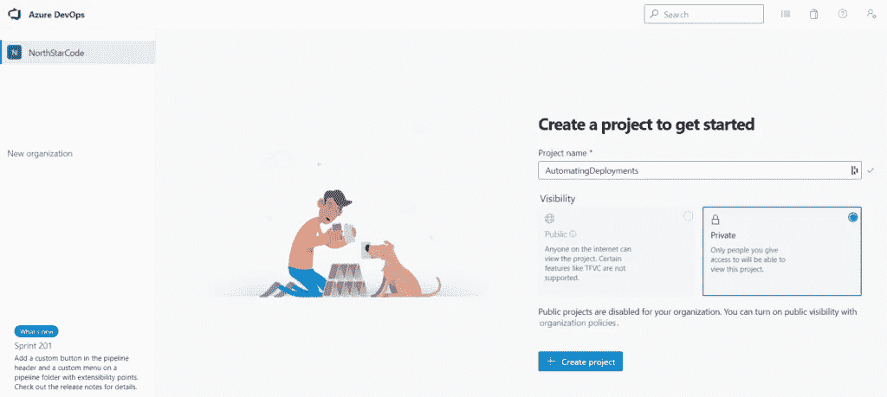

# 步骤 2)创建新的回购协议

一旦你的项目设置好了，你应该会看到如下所示的屏幕:

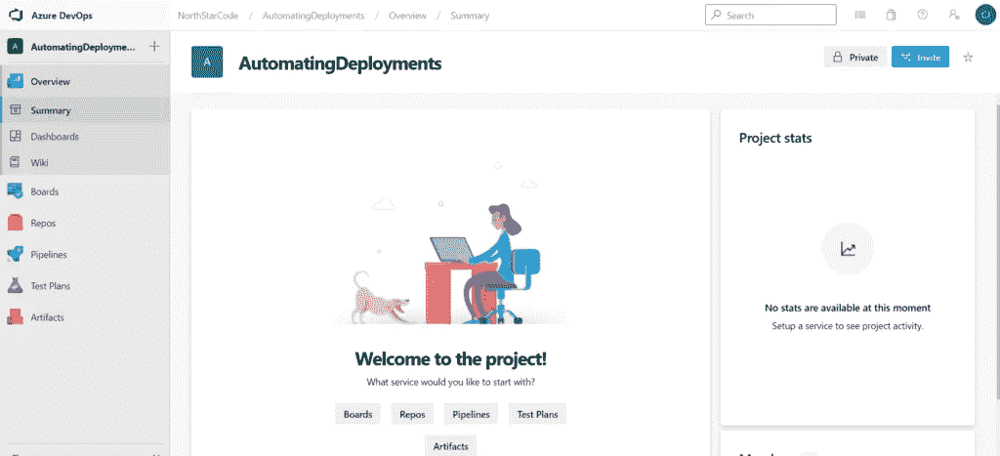

这是 Azure DevOps 仪表板的摘要页面。一旦我们进入这个页面，我们的第一步是建立一个新的 Git repo，然后向它添加一个简单的`index.html`文件。单击仪表板左侧的“Repos”选项卡将其打开。

当你第一次打开“回购”标签时，页面可能会有点让人不知所措。不要担心页面顶部的大部分内容。我们将添加我们的新文件，一旦我们得到我们的新回购设置和配置。滚动到页面底部，查找下一部分。

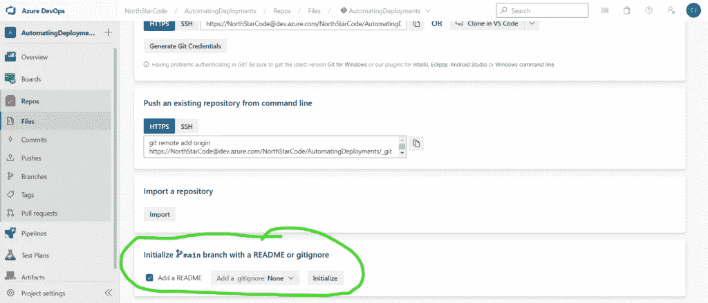

应该有一个部分写着“用 README 或 gitignore 初始化主分支”继续并保留所有默认设置，然后单击`Initialize`按钮生成一个自述文件。如果你在之前从未看过自述文件，这里有[一个很好的链接。](https://www.makeareadme.com/)

# 步骤 3)在新的回购中创建您的 index.html 文件

此时，我们已经完成了大部分初始配置，可以添加我们的文件并准备好部署到[我们的 HostGator 共享托管环境](https://partners.hostgator.com/rnWkky)。在最后一步中，您应该已经成功创建了一个自述文件，现在可以将您的`index.html`文件添加到您的 repo 中了。在你的分行名称旁边点击三个点，查看更多选项。单击添加新文件夹，如下图所示。

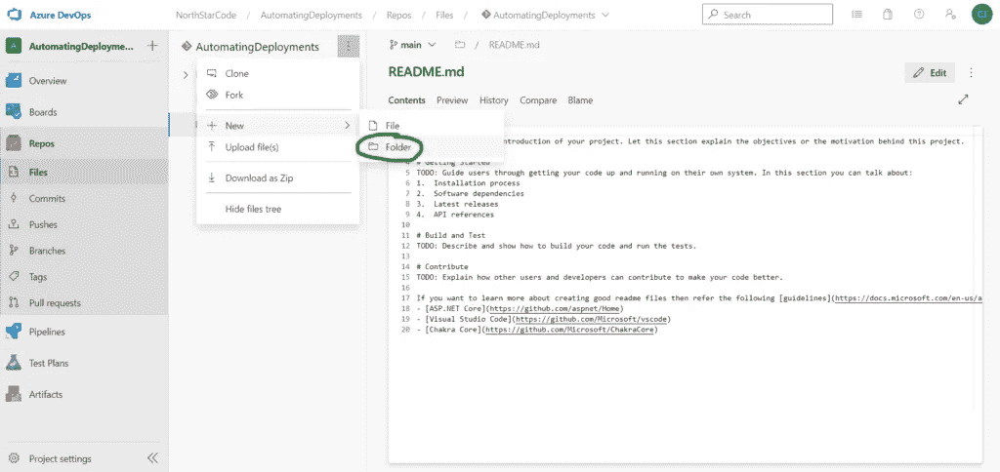

这将显示另一个对话框，要求您指定文件夹名和新文件名。输入`public_html`作为你的文件夹名，然后输入`index.html`作为你的文件名，点击“创建”为您的`index.html`文件创建一个文件夹对于后面我们实际配置 FTP 上传很重要。

我将使用我在上一篇博客中使用的相同代码，但是对它进行了微小的更新，这样我们就可以知道部署实际上是有效的。下面是我的`index.html`文件代码:

复制

```
<!DOCTYPE html>
<html>
<head>
    <title>My Automatically Deployed Website!</title>
    <meta charset="utf-8" />
    <meta http-equiv="Content-type" content="text/html; charset=utf-8" />
    <meta name="viewport" content="width=device-width, initial-scale=1" />
    <style type="text/css">
        #main {
            background: green;
            color: black;
        }
    </style>
</head>
<body>
    <div>
        <h1 id="main">Hello world!</h1>
        <p>This is my first automated deployment!</p>
    </div>
</body>
</html>
```

点击添加文件按钮后，你应该会看到一个可编辑的窗口出现。将您想要的代码粘贴到您的文件中。保持简单，这样我们可以确保部署工作。在你让它开始工作后，一定要开始破坏东西！那是最好的学习方法。

任何人，一旦你粘贴了你的代码，点击“提交”按钮保存文件并将其添加到你的 repo 中。

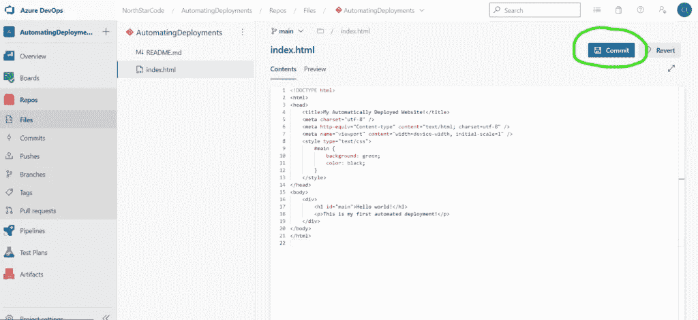

点击“提交”后，会弹出另一个侧菜单，指示您添加评论。把你想要的放进去，这样你就可以更容易地回顾过去的变化。输入注释后点击“Commit ”,然后保持分支名称和工作项框不变。

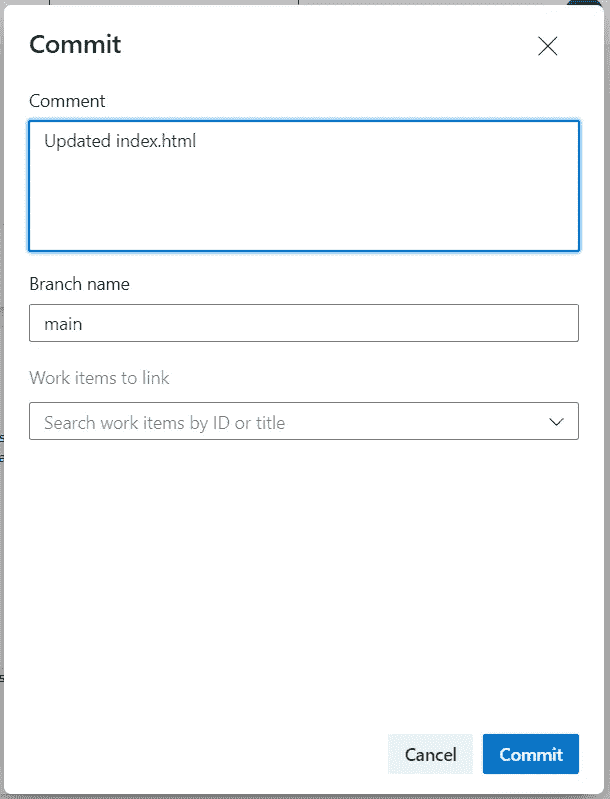

# 步骤 4)用初始设置配置您的管道

随着所有分支设置的完成，我们终于可以配置我们的第一个管道了。这是整个操作的核心，也是这些工具真正发挥作用的地方。现在你已经完成了对`index.html`文件的设置，点击仪表板左侧的“Pipelines”选项卡。

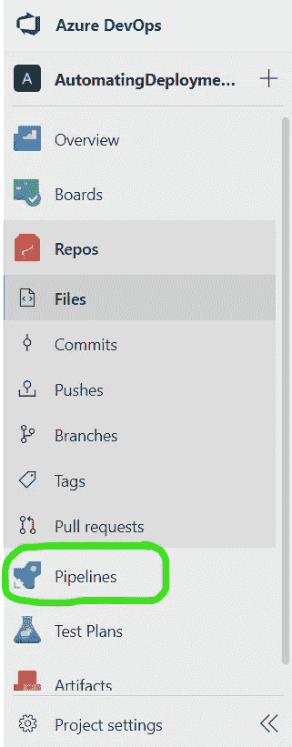

一旦你打开默认的管道窗口，你应该会看到一个漂亮的小图形和一些措辞。点击页面上的“创建管道”按钮。

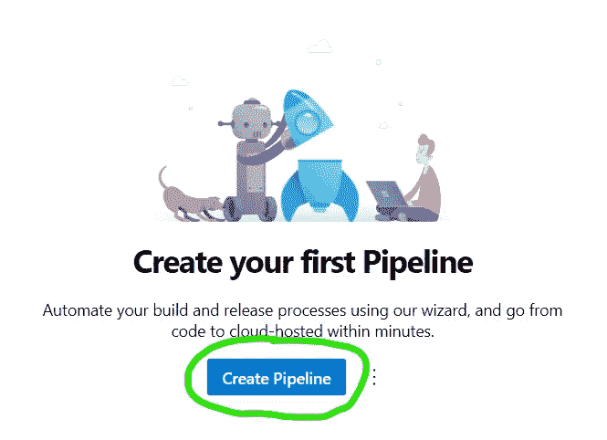

在接下来的步骤之前，我想说从这里开始可能会有点让人不知所措。但是，不要担心，因为我会带你走过所有的步骤。只要你从头到尾都跟着做，你就会成功。这些工具非常强大。你可以用整个职业生涯的大部分时间来学习如何使用其中的一半。

好了，废话少说…在你点击“创建管道”按钮后，你应该会看到类似下图的东西。第一个问题是“你的代码在哪里？”这很重要，但是我们已经知道答案了，因为你刚刚做了。幸运的是，它在 Azure DevOps 中，因此与我们的管道联系起来非常容易。点击这里的“Azure Repos Git”选项。

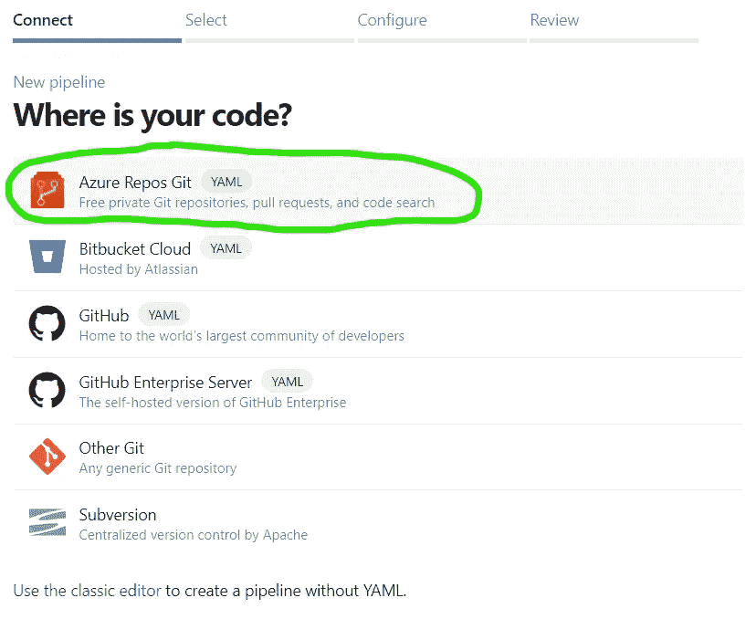

点击“Azure Repos Git”后，你会看到“选择存储库菜单”这将在您的 DevOps 控制面板中列出所有可用的回购。如果这是全新的，你应该只看到你的新鲜铸造回购。对我来说，它被命名为“自动化部署”点击您的回购名称，进入下一步。

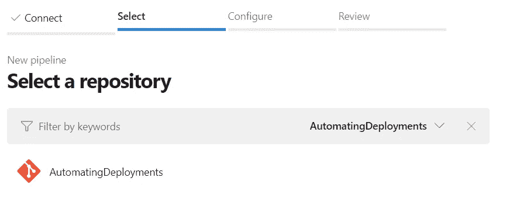

继续本节中的步骤应该会将您带到“配置”页面。在此菜单中，您需要选择“Starter Pipeline”选项。我们希望第一个管道非常简单，这样您就可以熟悉自动化部署。一旦你第一次运行正常，你就可以试着做一些事情，调整你的管道。

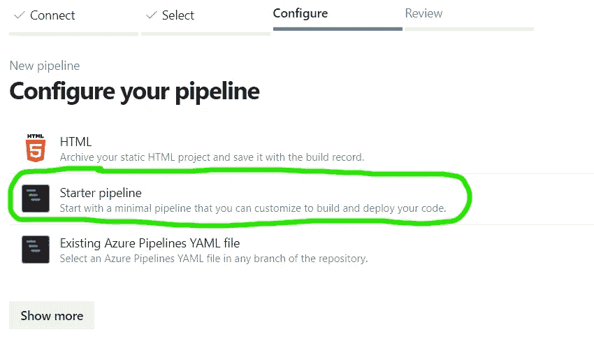

接下来将会出现“审查”步骤，对我来说，这可能看起来像一些疯狂的胡言乱语。不要太在意这一部分，因为现在理解它并不重要。我也绝不是 YAML 档案的专家；我只是知道它们为什么有用，并在我的项目中使用它们。长话短说一个`*.yml*`文件(发音为 yam-el)是一种将您的管道编写成基于文本的步骤的方式，以便使您的管道可移植并保存在版本控制中。这允许您轻松地移植一个项目，并在另一个环境中以相同的设置设置和运行它。此外，通过将`.yml`文件添加到版本控制中，您可以跟踪文件随时间的变化，并在您使用管道时回滚。

好了，故事时间结束了，在最后的“回顾”步骤中，不要担心任何事情。只需点击“保存”按钮。默认情况下，它可能会说“保存并运行”，但点击向下箭头选择保存。我们马上就要运行管道了。

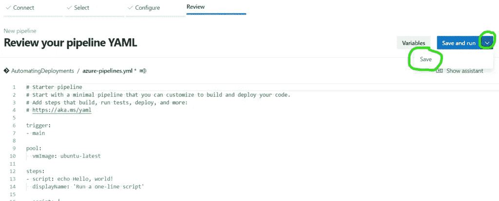

您会很快注意到，每当您进行更改并保存时，通常会显示侧边菜单来添加提交消息。这很重要，这样我们在项目中所做的一切都可以被“变更跟踪”当在团队中工作时，如果你想责怪别人弄坏了东西，这非常有帮助…好吧，对不起，我跑题了，也许这不是主要目的。但是，跟踪项目的变更非常重要，这样您就可以轻松地“回滚”版本。您还可以快速查明引入的 bug。

您可以选择是否输入提交消息，现在这并不重要。选择单选按钮“直接提交到主分支”，然后点击“保存”

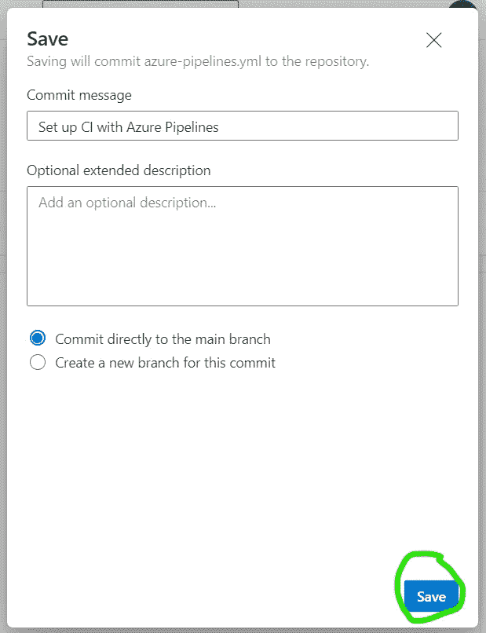

# 步骤 5)完成新管道的配置

下一步，我们将完成新管道的配置，并实际创建通过 FTP 连接到您的远程主机的步骤。这是有趣的部分，我保证！

保存新的 YAML 文件后，该网站会将您带回到 pipeline 页面。从那里点击右上角的“编辑”按钮。

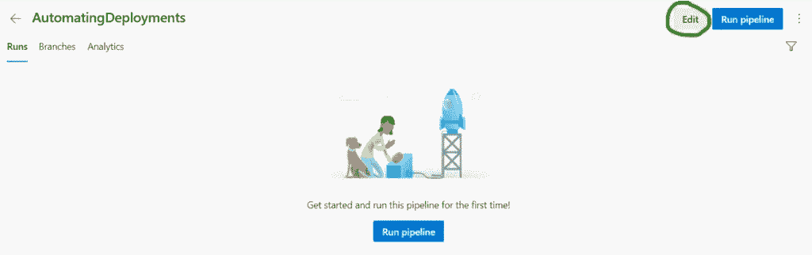

一旦进入这个菜单，你会看到你的`*.yml`文件挂在你的任务选项旁边，忽略它，不要担心它是否令人困惑。我们将坚持点击按钮，让事情尽可能简单。

接下来，在右边你会看到一个“任务”菜单。在搜索栏中输入“FTP ”,你应该会看到“FTP 上传”任务出现。单击它，将其添加到您的管道步骤中。

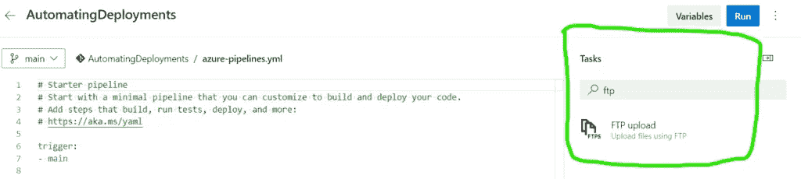

点击 FTP 上传任务后，它会显示您需要填写的字段，以配置您的 FTP 连接。如果你读了我的上一篇博客，[部署你的第一个网站|绝对初学者指南](https://northstarcode.com/blog/deploying-your-first-website-an-absolute-beginners-guide/)，你应该已经有了这些信息。只需在此表单中输入 FTP 详细信息。如果第一个字段中的“身份验证方法”显示“FTP 服务连接”，请单击下拉箭头并选择“输入凭据”。在本教程中，我不会进入服务连接步骤，因为我想保持简单。然而，我可能会在将来再发一篇关于它的帖子。

使用 FileZilla 手动上传文件时使用的相同 FTP 连接详细信息填充剩余字段。确保在您的 FTP URL 前添加“ftp://”作为前缀，然后添加“:21”作为端口。因此，您的 FTP URL 应该如下所示:

ftp://ftp.mydomainname.com:21

输入后，您需要输入“根文件夹”信息，并检查“文件模式”字段，以确保它设置为从您的回购中获取所有内容并上传到远程主机。根文件夹应该是`public_html`。这就是为什么我们从上面特别在一个文件夹中创建了`index.html`文件。只上传你需要的文件是很重要的，而且指定它所在的文件夹更容易。(请参见下图了解详情)

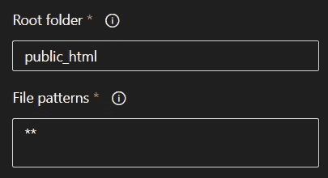

“文件模式”字段应该显示“**”。如果没有，那么简单地覆盖它，让它这样做。这是一个 regex 模式，告诉它包括本地 repo 中的每个文件和每个子目录及其文件等等。

“远程目录”文件夹步骤是一个非常重要的细节。根据您使用的主机，您可能需要对此进行一些调整。最终，在摆弄了一会儿之后，我输入了一个正斜杠“/”作为远程目录，成功地将我的文件上传到了我的共享托管环境中的根`public_html`文件夹。

决赛*。yml 文件和我新添加的 FTP 任务看起来有点像下图。

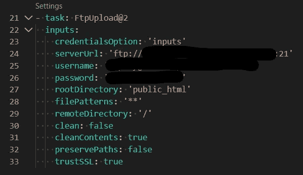

只需再走几步，我向你保证，这份工作和阅读都是值得的！在完成添加 FTP 上传步骤之前，点击“高级”选项下拉菜单。在高级选项中，选中“清除远程目录内容”选项以及“信任服务器证书”选项。如果你关注过我的另一篇博客，你可能还记得第一次尝试连接远程 FTP 服务器 FileZilla 时，它显示了一条关于它的证书的警告消息。

检查信任服务器证书将确保构建管道接受此步骤，并且不会因此而爆炸。清除远程目录内容的步骤相当直观，因为它会在上传新文件之前删除远程文件夹中的所有内容。这可以确保您每次部署时都可以获得新的文件。(注意:根据你的主机公司给你多少权限,“清除目录内容”选项可能有效，也可能无效。试一试，看看是否有效。)

好了，接下来只需点击 FTP 表单底部的“添加”按钮，我们就可以开始尝试了！

> 潜在呃逆警告
> 
> 因此，如果您在最后一步结束时点击 Save，并注意到在生成的 YAML 文件中有一条红色的曲线，请确保在该文件的最底部输入了新添加的步骤。我不确定为什么这有时会有问题，但我知道它会发生。只要把它剪下来，贴在底部，你就可以开始了。
> 
> 完成 FTP 步骤后，点击窗口右上角的“保存”按钮。仔细检查你的 YAML 文件中没有红色的错误。它将提示您再次输入一条消息，只需保留默认值并再次点击 Save。单击左上方的返回箭头，返回到我们的管道。

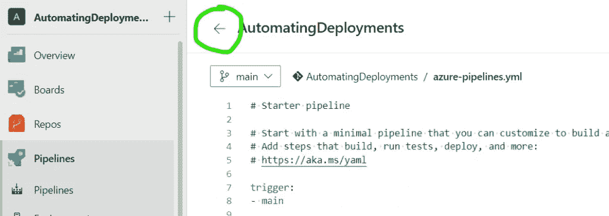

# 第 6 步)部署你的网站。自动！

如果您在上一步中单击了 back 按钮，您应该会被带到我们一直在配置的管道的 Pipeline 页面。从那里只需点击右上角的“运行管道”按钮。另一个侧菜单应该显示一些额外的选项。只需保持默认设置，点击右下角的“运行”。

(在下面的图片中，你会注意到我的 DevOps 处于黑暗模式。我被蒙蔽了，所以我改变了它。)

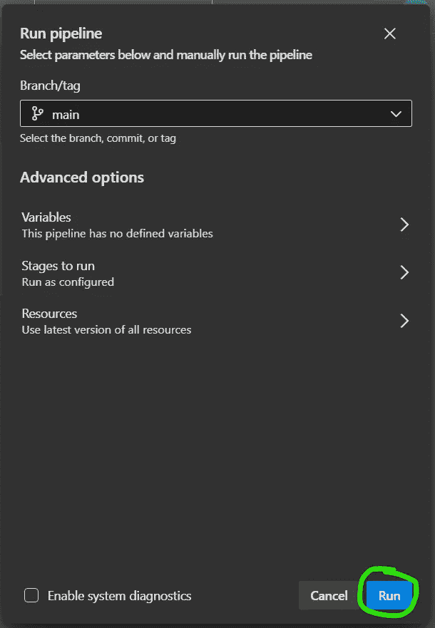

点击运行后，您将被带到构建结果页面。该页面包含大量信息，但在我们进行部署时，我们最感兴趣的内容位于“Jobs”部分的最底部。单击单词“Job ”,它将打开我们的构建状态页面。从那里，我们可以实际观察部署的发生，并检查错误(如果发生的话)。


> 打嗝警告
> 
> 当我尝试运行我的新管道时，我得到了作为错误返回的以下消息:
> 
> # #[错误]尚未购买或授予任何托管并行度。如需申请免费并行授权，请填写以下表格【aka.ms/azpipelines-parallelism-request T2
> 
> 至少可以说，这是一个非常令人讨厌的错误。[经过一些研究，我发现 DevOps 团队和微软不得不这么做，因为人们设置这些工具来做各种邪恶的事情](https://stackoverflow.com/questions/68405027/how-to-resolve-no-hosted-parallelism-has-been-purchased-or-granted-in-free-tie)，所以他们毁了所有人。只需进入他们告诉你要去的链接，填写表格，几天后你就可以顺利地运行你的管道了。这真的很愚蠢，我讨厌人们破坏别人的事情。这就是为什么我们不能拥有美好的事物。

# 享受成为部署大师的荣耀

如果一切都按照上面的步骤制定了计划，那么您应该会在部署状态页面中看到一大串绿色的复选标记。如果你看到所有的绿色复选标记，给自己一个大大的鼓励，因为你不仅成功地自动化了你的网站部署，而且你还因为不必手动部署项目而浪费了很多时间！

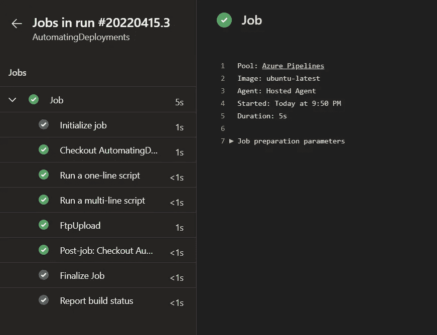

如果你在这里没有看到所有的绿色复选标记，请花些时间分析错误，做些谷歌搜索，如果有任何事情，请随时对这篇文章发表评论，我会非常乐意帮助你。但是，如果你确实看到绿色的勾号，请仔细检查你的共享托管 cPanel，以验证你的新文件是否出现在你的根`public_html`文件夹中，然后访问你的网站，点击`Ctrl + F5`以完全刷新页面。如果你看到你的新文件出现，你做到了！您现在已经了解了如何使用 Azure DevOps 工具自动部署网站！

通过[访问 http://howtodeployawebsite.com](http://howtodeployawebsite.com/)并查看我更新的`index.html`文件，您可以看到*我的*新创建的页面，这是我使用部署管道部署的。

# 摘要

好吧，如果你到现在还没弄明白，我对这东西很着迷，非常着迷。我的部署学习之旅看起来有点像这样:

1.  我开始直接通过共享托管工具部署我的 web 项目。(男人这是可怕的)
2.  我学会了通过 FTP 使用 FileZilla 部署网站
3.  我学会了使用 Beyond Compare 来部署网站(这让我对文件变化有了更多的了解，并且能够更容易地比较文件)
4.  最后，我学会了使用 Azure DevOps 部署工具来自动化部署的魔力，并且我从未回头！

老实说，这些类型的工具的可能性是无限的:您可以使用它们将网站部署到本地网络设备，运行 PowerShell 脚本来自动完成无聊的任务，或者让一个愚蠢的电子邮件发送者提醒自己将垃圾拿出来。我是认真的，这些工具有无限的可能性。现在你已经对如何使用 DevOps 工具部署网站有了基本的了解，你作为开发人员的生活将会完全不同。

我仍然记得我第一次成功地用这种方式部署一个网站时，我意识到我可以多快地做出改变、构建和发布它们。所有这一切都不需要花费数小时来部署东西，也不需要冒潜在的人为错误风险，最终导致花费更多的时间来部署。我现在点击两个按钮，一个释放我的前端应用程序，另一个释放我的 API，然后我离开。计算机替我做了这项工作。我把时间看得比什么都重要，这给了我很多时间。

作为一名专业开发人员，学习和理解这些工具也是一件非常有价值的事情，并且肯定会帮助您在未来推进您的职业生涯。出于多种原因，许多公司都加入了 DevOps 的行列。开发人员喜欢这一点，以及随后他们为之工作的公司的一个主要原因是因为它减少了人的因素。人类不是为重复任务而生的，计算机才是。在复杂的部署过程中，我们很容易犯错误，这是事实。所以，当你坐下来啜饮第二杯咖啡时，让电脑按照指定的操作顺序来做吧。

发布摘要，摘要

如果你喜欢这篇文章，或者你有问题或意见，我很乐意听到你的意见。一定要喜欢，或者以某种方式反应。注册订阅我的时事通讯，获取我最新文章的更新。如果你真的有雄心壮志，并且喜欢从我这里学到的东西，如果你给我买杯咖啡，我当然不会不高兴！任何形式的支持都有助于我继续为您制作内容，并与您分享我作为软件开发人员的旅程。

> 警告！

在这篇文章中，我确实对你负有义务，我觉得有必要披露这一点。我在这篇文章中展示的是 FTP 协议。该协议不安全，不应用于传输任何敏感材料。如果您正在传输包含密码信息或任何敏感材料的文件，您必须确保通过加密连接进行传输。根据我的经验，大多数共享主机提供商不提供安全的 FTP 选项。因此，使用 FTP 上传到共享主机的风险由你自己承担，请注意你在管理敏感数据时的道德责任。

由[泰勒维克](https://unsplash.com/@tvick?utm_source=unsplash&utm_medium=referral&utm_content=creditCopyText)在 [Unsplash](https://unsplash.com/s/photos/servers?utm_source=unsplash&utm_medium=referral&utm_content=creditCopyText) 上拍摄的照片

天蓝色标志由[标志酒](https://www.logo.wine/logo/Microsoft_Azure)提供

*** 截图取自 Azure DevOps。其中的所有图像和版权材料都是微软的财产。我展示这些材料仅仅是为了教育目的，并不声称这些截图中的任何创造性内容是我自己的。感谢微软和辛勤工作的设计师们，是他们创造了这些内容。我看到你，我欣赏你。