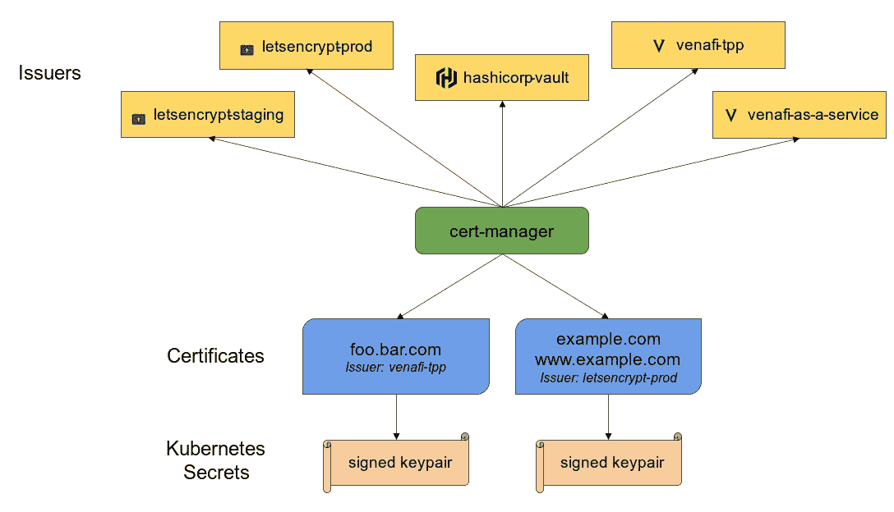

# Kubernetes 上带有外部 DNS 和 LetsEncrypt 的自动化 DNS/TLS

> 原文：<https://blog.devgenius.io/automated-dns-tls-with-external-dns-letsencrypt-on-kubernetes-6f4f41827df9?source=collection_archive---------8----------------------->


西蒙·卡杜拉在 [Unsplash](https://unsplash.com?utm_source=medium&utm_medium=referral) 上的照片

Kubernetes 已经成为维护和部署容器的事实方式。然而，我们的应用程序仍然有一些部分是手工管理的。我注意到的两个是维护 DNS 记录和 TLS 证书。

难道我们不应该能够定义我们想要的 DNS 和 TLS 以及我们的应用程序清单吗？事实上我们可以！

两个开源的 Kubernetes 插件实现了这一点。我们有外部 dns，允许在您的清单中进行 DNS 管理，还有 cert-manager 处理证书管理。

这篇博文将指导您完成这两个插件的安装和配置。

这里有一个你需要的快速概述。

*   云提供商:对于本指南，我将使用 [Vultr](https://www.vultr.com) 。
*   Kubernetes 集群:我将使用 VKE ( [Vultr Kubernetes 引擎](https://www.vultr.com/kubernetes/))。
*   域:这个域应该预先配置为查看您的云提供商的名称服务器。
*   APIKey:这个 API key 将被提供给某些资源，以便他们能够代表 Kubernetes 与您的云提供商进行通信。

根据您使用的云提供商，您可能需要添加您的域条目。

因为我使用 Vultr，所以我将使用 vultr-cli 来创建和验证我的域。

Cert-manager 是一个定制的 Kubernetes 资源，允许在 Kubernetes 中进行本地证书管理。下面是来自 [https://cert-manager.io](https://cert-manager.io) 登陆页面的更全面的解释。

> *Cert-manager 将证书和证书颁发者作为资源类型添加到 Kubernetes 集群中，并简化了获取、更新和使用这些证书的过程。它可以从各种受支持的来源颁发证书，包括 Let's Encrypt、HashiCorp Vault 和 Venafi 以及私有 PKI。它将确保证书是有效的和最新的，并尝试在到期前的配置时间续订证书。*



有了 Cert-manager，云提供商可以提供定制的 webhooks，这样用户就可以轻松地以 yaml 清单的形式发布证书。在本指南的具体用例中，我们将使用 [Vultrs cert-manager-webhook 插件](https://github.com/vultr/cert-manager-webhook-vultr)，它将处理我们域的 TLS 证书。

**注意:根据您使用的云提供商，您可能需要参考特定提供商的说明**

# 基本证书管理器安装

要安装基础证书管理器，我们可以运行他们的文档中提供的 kubectl apply 命令。[https://cert-manager.io/docs/](https://cert-manager.io/docs/)。在本指南发布时，安装命令如下

您应该能够检查`cert-manager`名称空间中所有相关的 cert-manager 资源。

# Vultr 证书管理器安装

现在我们必须安装 Vultr 特有的`cert-manager-webhook`。要做到这一点，你需要从[https://github.com/vultr/cert-manager-webhook-vultr](https://github.com/vultr/cert-manager-webhook-vultr)下载代码

要开始安装 Vultr cert-manager webhook，我们必须创建一个`secret`。这将包含您的 Vultr API 密钥，证书管理器将使用它来创建验证所需的 DNS 条目。

随着秘密的部署，我们可以安装 vultr 证书管理器。

与基本 cert-manager 安装相同，您可以通过检查`cert-manager`名称空间来验证 vultr webhook 是否正在运行。

# 颁发 TLS 证书

部署了 cert-manager 之后，让我们看看我们的 yaml 定义在发布证书时会是什么样子。

我们将从部署 ClusterIssuer 开始。这将代表用于创建签名证书的证书颁发机构(CA)。在下面的 yaml 中，我们正在创建我们的`ClusterIssuer` to LetsEncrypt 登台环境。对于生产使用，您需要将其更改为`[https://acme-v02.api.letsencrypt.org/directory](https://acme-v02.api.letsencrypt.org/directory.)` [。](https://acme-v02.api.letsencrypt.org/directory.)

我们还需要授予服务帐户获取秘密的权限

部署了 ClusterIssuer 和 RBAC。对于 Vultr 上托管的域，我们将无法从 LetsEncrypt 请求 TLS 证书。

# 申请证书

证书资源表示证书请求的人类可读定义，该定义将由发行者兑现并保持最新。

在你应用它之前，让我们回顾一下我们在这里定义的东西

*   commonName:这是您的基本域。
*   dnsNames:这些是我正在请求的证书。对于通配符(*)证书，您必须将它们用“”括起来
*   issuerRef:它引用 clusterIssuer 的名称。如果您有一个用于生产 LetEncrypt 的 ClusterIssuer，您将希望在此处匹配这些名称。
*   sercretName:这是您将存储 TLS 证书的机密的名称。

一旦创建了`Certificate`类，就会创建一些资源。它们如下:

*   certificate requests:cert-manager 中用于向颁发者请求 X.509 证书的命名空间资源。
*   订单:ACME 发行者使用资源来管理 ACME“订单”的生命周期，以获得已签名的 TLS 证书。
*   质询:ACME 发行者使用资源来管理 ACME“质询”的生命周期，必须完成该“质询”才能完成对单个 DNS 名称/标识符的“授权”。

关于这些资源的更多信息可以在这里找到:[https://cert-manager.io/docs/concepts/](https://cert-manager.io/docs/concepts/)

这可能需要几分钟时间，但您可以检查您的证书资源并查看“就绪”状态。

证书请求的验证可能需要几分钟时间。您可以通过查看证书的`Ready`状态来检查状态。

完成所有这些之后，您现在将拥有一个来自 LetsEncrypt 的有效 TLS 证书，它将存储在证书 yaml 中定义的秘密名称中。

请记住，创建我们的 ClusterIssuer 是为了指向 LetsEncrypt 登台环境。生产使用请使用`[https://acme-v02.api.letsencrypt.org/directory](https://acme-v02.api.letsencrypt.org/directory.)` [。](https://acme-v02.api.letsencrypt.org/directory.)

在 Kubernetes 上，你已经为你的域名实现了自动 TLS！

# **外部 DNS**

让我们转到 DNS。无论你是使用 Kubernetes 中的`ingress`还是`loadbalancer`服务，你都不希望手动配置 IP 地址。这是我们将使用 ExternalDNS 的地方，它将自动为我们的域创建 DNS 条目，并将其与服务 IP 相关联。

ExternalDNS 的安装非常简单。如果您使用的是 vultr 以外的云提供商，请查看该提供商的特定安装说明[。](https://github.com/kubernetes-sigs/external-dns#deploying-to-a-cluster)

对于 Vultr，我们可以用下面的 yaml 清单安装 ExternalDNS。

在应用这个 yaml 之前，让我们看一下部署规范参数部分中的一些字段。

*   —来源:我们会用`ingress`。但是，您也可以将外部 DNS 与类型为`loadbalancer`的常规服务配对
*   — domain-filter:此定义将外部 DNS 限制为仅过滤所提供的域。
*   —提供商:如果您使用 vultr 以外的提供商，请相应更新。
*   — registry:我们在这里使用`txt`,因此外部 dns 创建的每个记录都伴随着 TXT 记录。
*   — txt-owner-id:一个惟一的值，在集群的生命周期内不会改变。

一旦应用了外部 dns yaml，就可以通过检查 pod 来确保它正确运行。

随着 ExternalDNS 的运行，我们现在将能够为 DNS 条目向我们的服务清单添加注释。

# **绑在一起**

## 部署和服务

现在，外部 dns 正在运行，证书管理器负责确保我们始终拥有有效的 TLS 证书。让我们部署一个简单的应用程序，并在 HTTPS 的公共互联网上公开它。

我们将部署 nginx 的一个副本部署，以及一个将路由到该部署的 cluserIP 服务。

## 进入

为了向互联网公开这一点，我们将使用 Kubernetes ingress-nginx。您也可以使用服务类型`loadbalancer`来代替入口。如果您决定使用`loadbalancer`，请确保在您的外部 dns yaml 中将类型从`ingress`更改为 `service`。

为了开始使用 Kubernetes nginx ingress，我们将应用他们在[快速入门指南](https://kubernetes.github.io/ingress-nginx/deploy/#quick-start)上发布的准备好的清单。

```
 kubectl apply -f [https://raw.githubusercontent.com/kubernetes/ingress-nginx/controller-v1.1.1/deploy/static/provider/cloud/deploy.yaml](https://raw.githubusercontent.com/kubernetes/ingress-nginx/controller-v1.1.1/deploy/static/provider/cloud/deploy.yaml)
```

这将创建一个名为`ingress-nginx`的新名称空间，入口的所有资源都将驻留在其中。

让我们通过入口来展示我们的 nginx 应用程序。

这个注释`external-dns.alpha.kubernetes.io/hostname: www.devbytes.sh`定义了外部 dns 应该创建什么条目。在这种情况下，它将为 www 创建一个 A 记录，指向入口部署的负载平衡器。

tls.hosts 部分定义了 IP 地址应该将哪个域视为 HTTPS。secretName 是拥有我们在`issuing a TLS certificate`期间创建的 TLS 证书的秘密。

rules.host 部分定义了应该将哪个 URL 路由到哪个服务。所以在上面定义的 yaml 中`www.devbytes.sh/`应该转到我们的 nginx 服务/部署。

部署后，您可以通过运行以下命令来检查这个入口。

给 Kubernetes/DNS 几分钟的时间来传播所有的请求和域名记录，但几分钟之内，你应该有一个 HTTPS 支持的域名。

# 包扎

我们已经到了结尾，让我们回顾一下。现在，您可以使用 cert-manager 为您的应用程序创建 TLS 证书。创建 DNS 条目和更新这些记录是应用程序清单的一部分，不需要手动调整记录。最后，为了公开这些应用程序，我们可以创建一个入口资源，将它们联系在一起。有了这三个工具，现在只需用 yaml 清单就可以定义应用程序的整个状态，剩下的就交给 Kubernetes 处理了。

有用的链接。

*   [https://kubernetes.github.io/ingress-nginx/](https://kubernetes.github.io/ingress-nginx/)
*   【https://github.com/kubernetes-sigs/external-dns 号
*   【https://cert-manager.io/ 
*   [https://github.com/vultr/cert-manager-webhook-vultr](https://github.com/vultr/cert-manager-webhook-vultr)
*   [https://github.com/vultr/vultr-cli/](https://github.com/vultr/vultr-cli/)
*   [https://www.vultr.com/kubernetes/](https://www.vultr.com/kubernetes/)