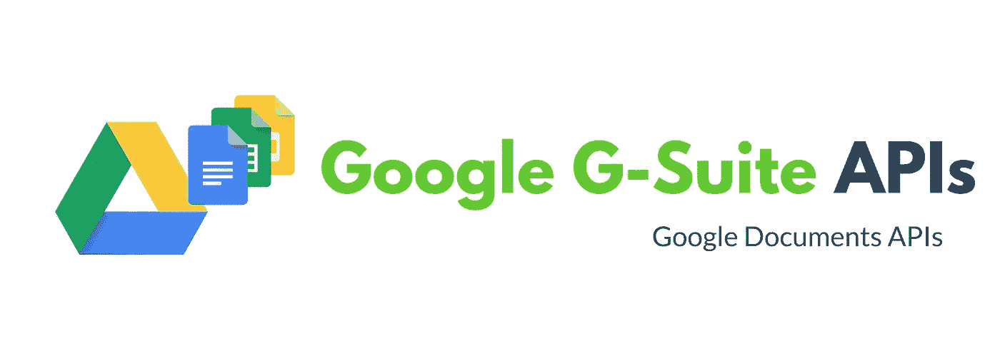

# 自动化文档——Google Docs API

> 原文：<https://blog.devgenius.io/automated-documents-google-docs-api-97df5602660e?source=collection_archive---------1----------------------->



您是否为您的业务创建了大量的发票/账单/报表？您需要将物联网传感器数据捕获到电子表格中吗？您想自动化数据捕获并与团队协作吗？你想删除文档中的维基百科或类似的网页内容吗？等等…

如果这些想法出现在你的脑海中，与你的项目或业务有关？是时候自动化并专注于你的业务核心竞争力了。查看[谷歌 G 套件开发者 API](https://developers.google.com/gsuite/products)。Google 有各种产品的开发者 API，但是本文主要关注**Google Docs API**。

这非常简单，特别是使用 **Python** 时，本文试图带您更进一步。

Google 文档保存在 Google Drive 中，因此在这个练习中，您需要访问“Google-Drive”和“Google-Docs”的服务。这也意味着，无论你在 Google Drive 和 Document UI 上做什么，你都可以用 API 做同样的事情。

# 要求:

1.  支持在继续，世界也在前进。)和`pip`一起安装 python 包。
2.  一个谷歌账户。
3.  请浏览文档结构。这款[传呼机](https://developers.google.com/docs/api/concepts/structure#start_and_end_index)非常优秀。

# 安装:

非常详细的步骤可以在[这里](https://developers.google.com/docs/api/quickstart/python)找到。请启用 API，以便您可以开始使用云服务。

## 第一步:

按照上面的链接进入**启用对谷歌文档 API 的访问**。将`credentials.json`下载到您的工作区，在那里您将创建您的 google 客户端项目。

## 第二步:

安装谷歌的用于云 API 的 python 客户端。

```
pip3 install --upgrade google-api-python-client google-auth-httplib2 google-auth-oauthlib
```

## 第三步:(可选)

我们正在废弃维基百科的内容，因此我们需要这个 python 包，否则它是可选的。

```
pip3 install wikipedia-api
```

# 代码遍历

正如我们之前讨论的，文档保存在驱动器中，因此**认证和访问**控制需要通过驱动器 API 来控制。在用户认证期间，我们还需要授予访问权限，这在以下链接'[范围](https://developers.google.com/drive/api/v2/about-auth)中定义:

对于这个例子，我给出了以下两个范围:

```
[https://www.googleapis.com/auth/drive](https://www.googleapis.com/auth/drive'), [https://www.googleapis.com/auth/documents](https://www.googleapis.com/auth/documents)
```

这些作用域提供了对应用程序的驱动器和文件的完全访问，但是当您启用这种访问时请非常小心，并且**不要共享以下两个文件**。

```
1\. credentials.json
2\. token.pickle
```

如你所见，我也没有在项目中共享这两个文件，你需要为你的项目创建`credentials.json`。`token.pickle`在第一次运行后生成，以避免任何后续应用程序运行的身份验证。

我在这个例子中使用的模板可以在[这里](https://docs.google.com/document/d/1a0C3AQ290uc0yFcVhLD36sj12mQdmv_VnSjh4WhnNvQ/edit#)找到。您可以添加自己的模板，请确保代码与模板同步。在当前代码中，我只考虑了一个模板。

在代码中，选择模板后，复制并编辑它。我们将执行以下操作:

1.  用值替换文档标签中的标签。
2.  搜索文本并获取其开始和结束索引。
3.  在特定位置插入文本。
4.  在文档中插入图像。
5.  在文档中插入超链接。
6.  在特定位置格式化文本。

完整的代码可以在我的 github 资源库中找到。

[](https://github.com/milinddeore/google-docs-example/blob/master/google-docs-example.py) [## milinddeore/Google-docs-示例

### 使用 google docs APIs，填充维基百科内容。-milinddeore/Google-docs-示例

github.com](https://github.com/milinddeore/google-docs-example/blob/master/google-docs-example.py) 

下面的命令生成文件，生成的文件看起来像下面的[这个](https://docs.google.com/document/d/1FiBzajfevDYyRVIbyDZnu_tCQh2T3bWMy6ayupKuLBs/edit)。

```
python google-docs-example.py
```

希望这有助于开始使用 docs API。下一步是用电子表格构建应用程序，并将它们集成在一起。

**你可以在|**[**LinkedIn**](https://www.linkedin.com/in/mdeore/)**|**[**网站**](https://tomdeore.wixsite.com/epoch)**|**[**Github**](https://github.com/milinddeore)**|**