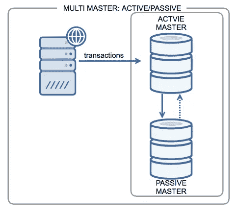
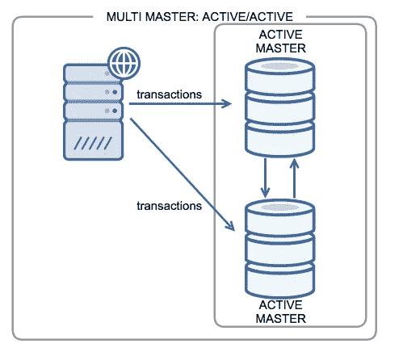

# 使用 Docker 实现自动化 MariaDB 复制

> 原文：<https://blog.devgenius.io/automated-mariadb-replication-using-docker-a585defcc047?source=collection_archive---------4----------------------->

实现主-主或主-从 MariaDB 复制总是一个挑战。我使用 docker 容器自动化了这个过程。

让我们回顾一下什么是 MariaDB 复制，以及拥有主-主或主-从复制的重要性，然后解释我们如何使用 docker 容器来自动化它。

首先，你可以在我的 [**GitHub**](https://github.com/hosein-yousefii/MariaDB-replication-docker-stack) 资源库中找到下面的代码和解释，还有另一个与使用 Docker 的 [**MySQL 复制相关的资源库，类似于具有不同代码的 MariaDB。**](https://github.com/hosein-yousefii/MYSQL-replication-docker-stack)

其次，你可以为这个项目做贡献，增加更多的功能。

# 什么是 MariaDB？！

MariaDB 数据库服务是一个完全托管的数据库服务，用于部署云原生应用程序。是 MySQL 的一个分支。

# 什么是复制？

术语*主*和*从*在历史上曾用于复制，但术语*主*和*副本*现在更受欢迎。虽然 [MariaDB 10.5](https://mariadb.com/kb/en/what-is-mariadb-105/) 已经开始了重命名的过程，但是在整个文档和 MariaDB 命令中都使用了旧的术语。

复制是一种功能，允许将一台或多台服务器(称为主服务器)的内容镜像到一台或多台服务器(称为从服务器)上。

您可以控制要复制的数据。所有数据库、一个或多个数据库或数据库中的表都可以有选择地进行复制。

复制在许多常见场景中使用。用途包括:

**可伸缩性**:通过拥有一个或多个从服务器，读取可以分散到多个服务器上，减少主服务器的负载。

**数据分析**:分析数据可能会对主服务器产生太大的影响，这同样可以在从服务器上处理。

**备份帮助:** [如果服务器没有主动更改数据，备份](https://mariadb.com/kb/en/backing-up-and-restoring/)可以更容易地运行。常见的情况是将数据复制到从设备，然后从设备与主设备断开连接，数据处于稳定状态。

**数据分发:**不需要连接到远程主机，可以在本地复制数据，并根据这些数据进行工作。

# 常见复制设置

**主从:**

MariaDB 复制是将存储在 MariaDB 数据库中的单个数据集实时复制到第二台服务器的过程。这种配置称为“主-从”复制，是一种典型的设置。



**主-主:**

MariaDB 主-主复制允许将数据从一台服务器复制到另一台服务器。这一细微但重要的区别允许我们从任一服务器执行 MariaDB 读取或写入。在处理数据访问时，这种配置增加了冗余并提高了效率。



# docker-compose 入门:

我们需要为我们的场景部署 2 个容器，所以让我们创建一个名为[docker-compose-Maria db . YAML](https://github.com/hosein-yousefii/MariaDB-replication-docker-stack/blob/main/docker-compose-mariadb.yaml)的文件，并将这些代码放入其中:

```
version: '3'services:
  mariadb-master:
    container_name: $FIRST_DB_NAME
    image: mariadb:latest
    restart: unless-stopped
    volumes:
      - 'db_master_data:/var/lib/mysql'
      - './first-host.cnf:/etc/mysql/conf.d/mysql.cnf'
    environment:
      MARIADB_ROOT_PASSWORD: $FIRST_ROOT_PASSWORD
    ports:
      - "$IP_ADDR:3306:3306"
    networks:
      - db-stack
    mem_limit: 2G
    labels:
      app.docker.created: "Hossein Yousefi"
      app.docker.env: "production"
      app.docker.service: "database"mariadb-slave:
    container_name: $SECOND_DB_NAME
    image: mariadb:latest
    restart: unless-stopped
    volumes:
      - 'db_slave_data:/var/lib/mysql'
      - './second-host.cnf:/etc/mysql/conf.d/mysql.cnf'
    environment:
      MARIADB_ROOT_PASSWORD: $SECOND_ROOT_PASSWORD
    ports:
      - "$IP_ADDR:3307:3306"
    networks:
      - db-stack
    mem_limit: 2G
    labels:
      app.docker.created: "Hossein Yousefi"
      app.docker.env: "production"
      app.docker.service: "database"volumes:
  db_master_data:
    name: db_master_data
    driver: local
  db_slave_data:
    name: db_slave_data
    driver: localnetworks:
  db-stack:
    name: db-stack
    driver: bridge
```

我们使用不同的变量来促进我们的工作。最重要的是主端口公布在 3306 上，从端口在 3307 上。

我们需要为它们中的每一个创建两个配置文件。对于 master，我们创建一个名为 [first-host.cnf](https://github.com/hosein-yousefii/MariaDB-replication-docker-stack/blob/main/first-host.cnf) 的文件:

```
[mysqld]
default_authentication_plugin= mysql_native_password# these configs are mandatory, Don't change them.
# able to add other configs at the end of this file.
bind-address = 0.0.0.0
log-bin         = master-bin
binlog_format   = mixed
server-id       = 1
```

我们的第二个文件是 second-host.cnf:

```
[mysqld]
default_authentication_plugin= mysql_native_password# these configs are mandatory, Don't change them.
# able to add other configs at the end of this file.bind-address = 0.0.0.0
log_bin         = slave-bin
server-id       = 2
```

这些 docker-compose 应该只由它的脚本来实现，否则它不会工作，因为有几个变量应该被指定。

部署脚本名为 mariadb-deployment.sh:

```
#!/bin/bash
# written by Hosein Yousefi <[yousefi.hosein.o@gmail.com](mailto:yousefi.hosein.o@gmail.com)>
# GITHUB [https://github.com/hosein-yousefii](https://github.com/hosein-yousefii)# Automated script to replicate 2 instances of MariaDB
# Default method is master-slave You are able to change
# the method by specifying it on the command line or
# with REPLICATION_METHOD variable.
# FORINSTANCE:
# export REPLICATION_METHOD=master-mastermaster-slave() {echo
 echo starting deploying...
 echoexport FIRST_DB_NAME=${MARIADB_FIRST_DB_NAME:-'db-master'}
 export SECOND_DB_NAME=${MARIADB_SECOND_DB_NAME:-'db-slave'}export FIRST_REPL_USER=${MARIADB_FIRST_REPLICATION_USER:-'repl'}export FIRST_REPL_PASSWORD=${MARIADB_FIRST_REPLICATION_PASSWORD:-'qazwsx'}export FIRST_ROOT_PASSWORD=${MARIADB_FIRST_ROOT_PASS:-'qazwsx'}
 export SECOND_ROOT_PASSWORD=${MARIADB_SECOND_ROOT_PASS:-'qazwsx'}

 export FIRST_HOST=${MARIADB_FIRST_HOST:-'db-master'}
 export SECOND_HOST=${MARIADB_SECOND_HOST:-'db-slave'}

 export IP_ADDR=${DOCKER0_IP:-$(ip a show dev docker0 |grep inet|awk '{print $2}'|awk -F\/ '{print $1}'|grep -v ::)}docker-compose -f docker-compose-mariadb.yaml up -decho
 echo waiting 30s for containers to be up and running...
 echo Implementing mariadb master slave replication...
 sleep 30
 echo# Create user on master database.
 docker exec $FIRST_HOST \
   mysql -u root --password=$FIRST_ROOT_PASSWORD \
   --execute="create user '$FIRST_REPL_USER'@'%' identified by '$FIRST_REPL_PASSWORD';\
   grant replication slave on *.* to '$FIRST_REPL_USER'@'%';\
   flush privileges;"# Get the log position and name.
 result=$(docker exec $FIRST_HOST mysql -u root --password=$FIRST_ROOT_PASSWORD --execute="show master status;")
 log=$(echo $result|awk '{print $5}')
 position=$(echo $result|awk '{print $6}')# Connect slave to master.
 docker exec $SECOND_HOST \
   mysql -u root --password=$SECOND_ROOT_PASSWORD \
   --execute="stop slave;\
   reset slave;\
   CHANGE MASTER TO MASTER_HOST='$FIRST_HOST', MASTER_USER='$FIRST_REPL_USER', \
   MASTER_PASSWORD='$FIRST_REPL_PASSWORD', MASTER_LOG_FILE='$log', MASTER_LOG_POS=$position;\
   start slave;\
   SHOW SLAVE STATUS\G;"echo
 echo in case of any errors, check if your containers up and running, then rerun this script.
 echo
 echo The master is running on $IP_ADDR:3306,  
 echo The slave is running on $IP_ADDR:3307.
 echo
}master-master() {echo
        echo starting deploying...
 echoexport FIRST_DB_NAME=${MARIADB_FIRST_DB_NAME:-'db-master1'}
        export SECOND_DB_NAME=${MARIADB_SECOND_DB_NAME:-'db-master2'}export SECOND_REPL_USER=${MARIADB_SECOND_REPLICATION_USER:-'repl-master2'}
        export FIRST_REPL_USER=${MARIADB_FIRST_REPLICATION_USER:-'repl-master1'}export FIRST_REPL_PASSWORD=${MARIADB_FIRST_REPLICATION_PASSWORD:-'qazwsx'}
        export SECOND_REPL_PASSWORD=${MARIADB_SECOND_REPLICATION_PASSWORD:-'qazwsx'}export FIRST_ROOT_PASSWORD=${MARIADB_FIRST_ROOT_PASS:-'qazwsx'}
        export SECOND_ROOT_PASSWORD=${MARIADB_SECOND_ROOT_PASS:-'qazwsx'}export FIRST_HOST=${MARIADB_FIRST_HOST:-'db-master1'}
        export SECOND_HOST=${MARIADB_SECOND_HOST:-'db-master2'}export IP_ADDR=${DOCKER0_IP:-$(ip a show dev docker0 |grep inet|awk '{print $2}'|awk -F\/ '{print $1}'|grep -v ::)}docker-compose -f docker-compose-mariadb.yaml up -decho
        echo waiting 30s for containers to be up and running...
 echo Implementing mariadb master master replication...
        sleep 30
        echo# Create user on master database.
        docker exec $FIRST_HOST \
                        mysql -u root --password=$FIRST_ROOT_PASSWORD \
                        --execute="create user '$FIRST_REPL_USER'@'%' identified by '$FIRST_REPL_PASSWORD';\
                        grant replication slave on *.* to '$FIRST_REPL_USER'@'%';\
                        flush privileges;"docker exec $SECOND_HOST \
                        mysql -u root --password=$SECOND_ROOT_PASSWORD \
                        --execute="create user '$SECOND_REPL_USER'@'%' identified by '$SECOND_REPL_PASSWORD';\
                        grant replication slave on *.* to '$SECOND_REPL_USER'@'%';\
                        flush privileges;"# Get the log position and name.
        master1_result=$(docker exec $FIRST_HOST mysql -u root --password=$FIRST_ROOT_PASSWORD --execute="show master status;")
        master1_log=$(echo $master1_result|awk '{print $5}')
        master1_position=$(echo $master1_result|awk '{print $6}')master2_result=$(docker exec $SECOND_HOST mysql -u root --password=$SECOND_ROOT_PASSWORD --execute="show master status;")
        master2_log=$(echo $master2_result|awk '{print $5}')
        master2_position=$(echo $master2_result|awk '{print $6}')# Connect slave to master.
        docker exec $SECOND_HOST \
                        mysql -u root --password=$SECOND_ROOT_PASSWORD \
                        --execute="stop slave;\
                        reset slave;\
                        CHANGE MASTER TO MASTER_HOST='$FIRST_HOST', MASTER_USER='$FIRST_REPL_USER', \
                        MASTER_PASSWORD='$FIRST_REPL_PASSWORD', MASTER_LOG_FILE='$master1_log', MASTER_LOG_POS=$master1_position;\
                        start slave;\
                        SHOW SLAVE STATUS\G;"docker exec $FIRST_HOST \
                        mysql -u root --password=$FIRST_ROOT_PASSWORD \
                        --execute="stop slave;\
                        reset slave;\
                        CHANGE MASTER TO MASTER_HOST='$SECOND_HOST', MASTER_USER='$SECOND_REPL_USER', \
                        MASTER_PASSWORD='$SECOND_REPL_PASSWORD', MASTER_LOG_FILE='$master2_log', MASTER_LOG_POS=$master2_position;\
                        start slave;\
                        SHOW SLAVE STATUS\G;"sleep 2
 echo
 echo ################### SECOND statusdocker exec $SECOND_HOST \
                        mysql -u root --password=$SECOND_ROOT_PASSWORD \
                        --execute="SHOW SLAVE STATUS\G;"sleep2
 echo
 echo ################### FIRST statusdocker exec $FIRST_HOST \
                        mysql -u root --password=$FIRST_ROOT_PASSWORD \
                        --execute="SHOW SLAVE STATUS\G;"sleep 2
        echo
        echo in case of any errors, check if your containers up and running, then rerun this script.
        echo
        echo The master1 is running on $IP_ADDR:3306,
        echo The master2 is running on $IP_ADDR:3307.
        echo}METHOD=${REPLICATION_METHOD:-'master-slave'}case ${METHOD} inmaster-master)
                master-master
        ;;master-slave)
                master-slave
        ;;*)
                echo """Automated script to replicate 2 instances of MariaDB
 Default method is master-slave You are able to change
 the method by specifying it on the command line or
 with REPLICATION_METHOD variable.
 FORINSTANCE:
 export REPLICATION_METHOD=master-master""";;esac
```

# 让我们讨论主从配置:

有几个变量是您的复制配置，它们都有默认值，因此如果您不指定任何变量，它将正常工作，但最好更改其中一些变量，例如您的 root 密码或复制用户和密码。为此，您可以导出下面指定的变量:

(对于测试环境，没有必要设置任何变量，它使用默认值。)

```
# First DB container name.
export MARIADB_FIRST_DB_NAME='db-master'

# Second DB container name.
export MARIADB_SECOND_DB_NAME='db-slave'

# User on master container for repliation.
export MARIADB_FIRST_REPLICATION_USER='repl'

# Password for replica user on master container.
export MARIADB_FIRST_REPLICATION_PASSWORD='qazwsx'

# Root password for master DB.
export MARIADB_FIRST_ROOT_PASS='qazwsx'

# Root password for slave DB.
export MARIADB_SECOND_ROOT_PASS='qazwsx'

# Master container address (it depends on the container name #"MARIADB_FIRST_DB_NAME" and should be same. You can specify IP addr #instead "NOT RECOMMENDED").
export MARIADB_FIRST_HOST='db-master'

# Slave container address (it depends on the container name #"MARIADB_SECOND_DB_NAME" and should be same. You can specify IP #addr instead "NOT RECOMMENDED").
export MARIADB_SECOND_HOST='db-slave'

# Your docker bridge IP addr on host.
export DOCKER0_IP='172.17.0.1'
```

在设置了这些变量中的一些或者没有设置之后，您可以通过执行以下命令来部署 MariaDB 主从复制:

```
./mariadb-deployment.sh
```

# 让我们来看看主-主配置:

首先，您应该设置一个变量来受益于主-主复制“REPLICATION _ METHOD = master-master”。

```
export REPLICATION_METHOD=master-master
```

“复制方法”的默认值是主从式。

像主-从复制一样，主-主复制也有几个变量。所有这些都有默认值，因此如果您不指定任何变量，它将正常工作，但是，更改其中的一些(例如，您的 root 密码或复制用户和密码)将是一个好主意。为此，您可以导出下面指定的变量:

(对于测试环境，没有必要设置任何变量，它使用默认值。)

```
# First DB container name.
export MARIADB_FIRST_DB_NAME='db-master1'

# Second DB container name.
export MARIADB_SECOND_DB_NAME='db-master2'

# User on master1 container for repliation.
export MARIADB_FIRST_REPLICATION_USER='repl-master1'

# User on master2 container for repliation.
export MARIADB_SECOND_REPLICATION_USER='repl-master2'

# Password for replica user on master1 container.
export MARIADB_FIRST_REPLICATION_PASSWORD='qazwsx'

# Password for replica user on master2 container.
export MARIADB_SECOND_REPLICATION_PASSWORD='qazwsx'

# Root password for master1 DB.
export MARIADB_FIRST_ROOT_PASS='qazwsx'

# Root password for master2 DB.
export MARIADB_SECOND_ROOT_PASS='qazwsx'

# Master1 container address (it depends on the container name #"MARIADB_FIRST_DB_NAME" and should be same. You can specify IP addr #instead "NOT RECOMMENDED").
export MARIADB_FIRST_HOST='db-master1'

# Master2 container address (it depends on the container name #"MARIADB_SECOND_DB_NAME" and should be same. You can specify IP #addr instead "NOT RECOMMENDED").
export MARIADB_SECOND_HOST='db-master2'

# Your docker bridge IP addr on host.
export DOCKER0_IP='172.17.0.1'
```

在设置了这些变量中的一些或者没有设置之后，您可以通过执行以下命令来部署 MariaDB 主从复制:

```
./mariadb-deployment.sh
```

几分钟后，你就有了复制的 MariaDB。
这些代码都在我的 [GitHub](https://github.com/hosein-yousefii) 里，你可以克隆欣赏！

欢迎所有的贡献。如果您觉得这篇文章有用，请查看项目 GitHub 资源库。祝你好运。