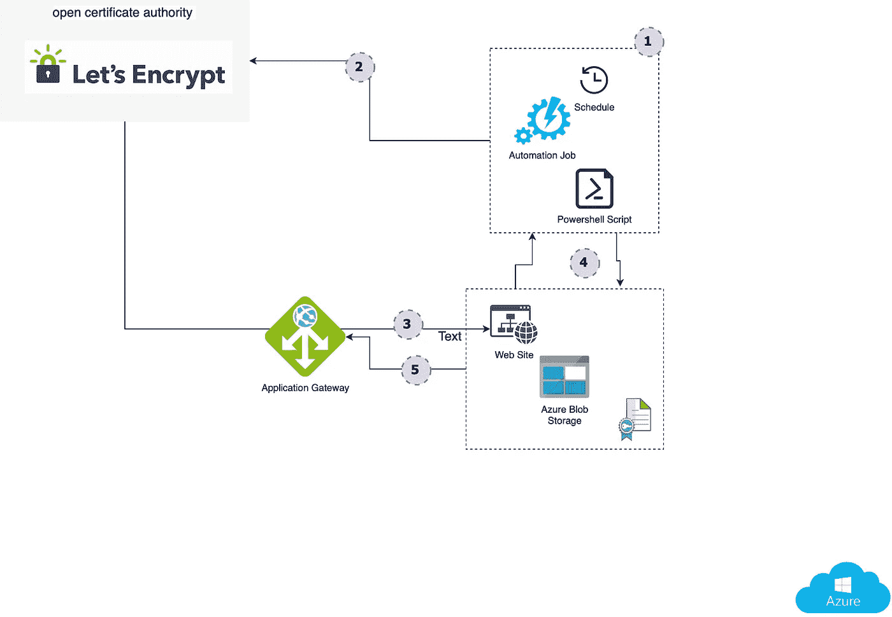
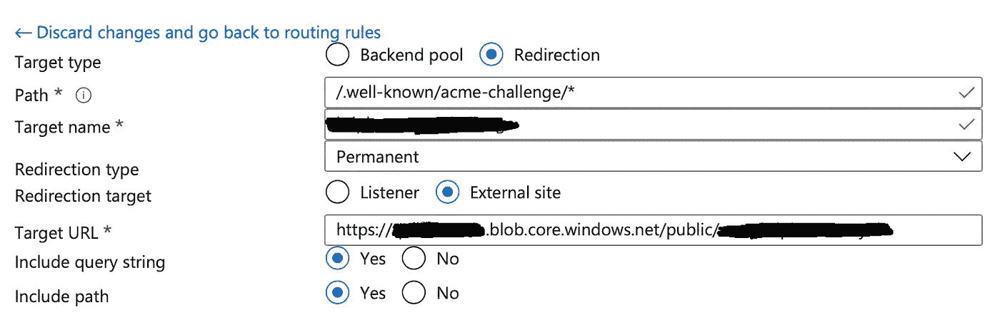

# 自动证书管理

> 原文：<https://blog.devgenius.io/automatic-certificate-management-b4ff1b95dbf1?source=collection_archive---------3----------------------->

Azure 应用程序网关&让我们加密

在你的云之旅的某个时候，你需要开始使用自动证书管理，这篇文章是关于自动颁发和更新**让我们使用 Azure 自动化功能在 **Azure 应用网关**上加密证书**。

我并不是第一个使用这种方法的人，下面将会介绍这种方法，但是我所描述的方法正在被我所采用，并且在真实的生产环境中发挥作用。所以，如果你有实际问题，请。

确保您了解的基本功能

*   [Azure 应用网关](https://docs.microsoft.com/en-us/azure/application-gateway/overview)
*   [蔚蓝自动化](https://docs.microsoft.com/en-us/azure/automation/overview)
*   [Azure blob 存储](https://docs.microsoft.com/en-us/azure/storage/blobs/storage-blobs-overview)
*   [让我们加密](https://letsencrypt.org)

图表

以下是步骤:

1.  计划一个自动化作业(每 3 个月)来启动/续订让我们加密证书
2.  该作业触发一个 PowerShell 脚本来实现这一奇迹。

3.Let's encrypt 所需的 HTTP 响应和证书存储在静态网站中，这是 Azure 存储帐户的一部分。这一切都是由 PowerShell 脚本编排的:

*   向 let's 脚本发起请求
*   保存响应
*   保存证书和密钥
*   取下钥匙
*   在 azure 应用程序网关上放置(添加/替换)证书

**Azure blob 存储**

它将物理地存储让我们加密 HTTP 响应/质询和证书。我们需要以某种方式配置公共容器:

1.  创建公共容器
2.  在该容器下，创建其他文件夹，因此完整路径如下所示:

**public / <你的站点名称> /。知名/极限挑战**

**Azure 应用网关**

1.  确保你的站点的 CNAME 指向你的 azure 应用网关的公共 ip 地址。
2.  对于**让我们加密**认证处理，我们需要一个 **HTTP** 监听器
3.  …以及一个关联的基于路径的规则，该规则执行**重定向**到外部站点:

应用程序网关规则

目标 URL 应该指向您的公共容器:

**https:// <容器名>. blob . core . windows . net/public/<你的站点名>**

**蔚蓝自动化**

1.  安装所需的模块。在尝试运行 runbook 并检查错误后，您可以回到这一步。抱歉，没有写下需要的…
2.  创建 PowerShell runbook 并添加以下脚本:

3.通过单击“链接到计划”按钮创建一个计划作业，并提供参数:

*   域:证书的 CN
*   storageName:公共容器的存储名称
*   STResourceGroupName:您的存储帐户的资源组的名称
*   AGName: azure 应用程序网关名称，您要在其中管理证书
*   AGResourceGroupName:应用程序网关的资源组的名称
*   AGOldCertName:应用程序网关证书的旧名称。如果你从零开始，只需输入你的域名。

如果您运行您的作业，在它被执行之后，您可以到您的应用程序网关并检查您的 **HTTPS** 监听器以获得可用的证书。证书的名称应该与您的 dns 条目相同。