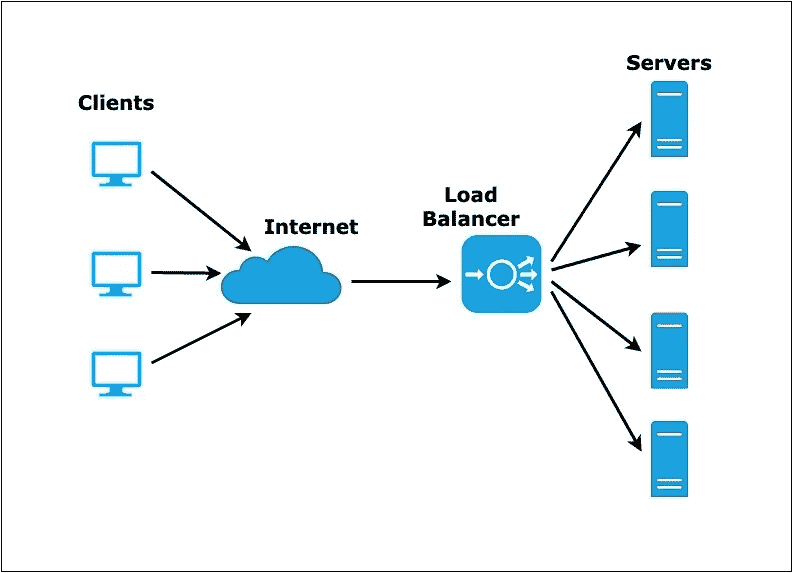

# AWS 上的自动资源分配

> 原文：<https://blog.devgenius.io/automatic-resource-allocation-on-aws-5907736724be?source=collection_archive---------8----------------------->

自动伸缩是一种以动态方式分配计算资源的云计算技术。服务器群或池中的活动服务器数量通常会随着用户需求的波动而自动变化，这取决于负载。

假设你有一个销售产品的网站，突然有一天你有成千上万的客户访问你的网站，好吧，这是个好消息！但是如果你的网站因为流量过大而瘫痪了呢？这会给你的业务带来巨大的损失，这就是为什么你需要 web 服务器的自动伸缩。

> 我们使用 Ansible 来管理 EC2 自动伸缩应用程序部署。它是完美的，因为它很容易与 CI 等当前流程集成，允许快速创建持续部署管道。

**目标:**创建一个设置，其中我们有一些初始数量的 web 服务器和一个负载平衡器，将请求重定向到这些服务器以平衡负载，以及一个自动缩放组来监控这些服务器，并在更多负载或服务器故障时启动更多服务器。



该设置的工作流程如下:

# 准备 AWS

我们将使用 EC2 classic，从为服务器创建 EC2 安全组开始，仅使用 TCP/22 打开必要的端口(对于 web 服务器，使用端口 80)。

对于对实例的 SSH 访问，创建一个新的密钥对。您可以上传现有的 SSH 公钥，或者创建一个新的私钥/公钥对。

# **设置 Ansible**

Ansible 使用 Boto 进行 AWS 交互，因此请确保您的控制主机上安装了 boto。我们还将利用 AWS CLI 工具，所以也要获得这些工具。

> pip 安装 python-boto awscli

同样安装 ansible，假设 ansible 版本为 1.9.x

> add-apt-repository PPA:ansi ble/ansi ble
> apt-get install ansi ble

您应该将 aws 服务器放在“~/”中。AWS/凭据”

> 【凭证】
> AWS _ access _ key _ id =<your _ access _ key _ here>
> AWS _ secret _ access _ key =<your _ secret _ key _ here>

# 创建启动配置

一个启动配置是一个实例配置模板，Auto
Scaling group 使用它来启动 EC2 实例，所以现在我们想要创建一个
新的启动配置来描述应该从这个 AMI 中
启动的新实例。我们将创建一个角色来处理这个问题。

```
- name: Create Launch Configuration
  ec2_lc:
    region: "ap-south-1"
    name: "webserver1"
    image_id: "{{ ami.image_id }}"
    key_name: "{{ keypair }}"
    instance_type: "t2.micro"
    security_groups: "{{ security_groups }}"
    volumes:
      - device_name: /dev/xvda
        device_type: gp2
        volume_size: 10
        delete_on_termination: true
    instance_monitoring: yes
```

镜像 id 应该是你的 web 服务器镜像 id，在这里你可以在 aws 上制作自己的 ami。

# 创建一个弹性负载平衡器

客户端将连接到一个弹性负载均衡器，该均衡器将把
传入的请求分发到我们已经启动的
即将到来的自动伸缩组中的实例中。同样，我们将创建另一个角色来处理
ELB 的管理，并从我们的剧本中应用它。

```
# roles/load-balancer/tasks/main.yml

- name: Configure Elastic Load Balancers
  ec2_elb_lb:
    region: "ap-south-1"
    name: webapp
    state: present
    zones: "{{ zone }}"
    connection_draining_timeout: 60
    listeners:
      - protocol: http
        load_balancer_port: 80
        instance_port: 80
    health_check:
      ping_protocol: http
      ping_port: 80
      ping_path: "/"
      response_timeout: 10
      interval: 30
      unhealthy_threshold: 6
      healthy_threshold: 2
  register: elb_result
```

# 创建和配置自动缩放组

我们将创建一个自动缩放组，并将其配置为使用我们之前创建的 Launch
配置。在我们定义的范围内，
AWS 将根据所有实例的当前
负载，动态地将实例发送到 ASG。同样，当负载下降时，一些实例会相应地终止
。在一个或多个扩展策略中定义了启动或
终止的实例的确切数量，这些策略也是
创建的，并与 ASG 相关联。

```
# roles/auto-scaling/tasks/main.yml

- name: Retrieve current Auto Scaling Group properties
  command: "aws --region ap-south-1 autoscaling describe-auto-scaling-groups --auto-scaling-group-names webapp"
  register: asg_properties_result

- name: Set asg_properties variable from JSON output if the Auto Scaling Group already exists
  set_fact:
    asg_properties: "{{ (asg_properties_result.stdout | from_json).AutoScalingGroups[0] }}"
  when: (asg_properties_result.stdout | from_json).AutoScalingGroups | count

- name: Configure Auto Scaling Group and perform rolling deploy
  ec2_asg:
    region: "ap-south-1"
    name: webapp
    launch_config_name: webapp
    availability_zones: "{{ zone }}"
    health_check_type: ELB
    health_check_period: 300
    desired_capacity: "{{ asg_properties.DesiredCapacity | default(2) }}"
    replace_all_instances: yes
    replace_batch_size: "{{ (asg_properties.DesiredCapacity | default(2) / 4) | round(0, 'ceil') | int }}"
    min_size: 2
    max_size: 10
    load_balancers:
      - webapp
    state: present
  register: asg_result

- name: Configure Scaling Policies
  ec2_scaling_policy:
    region: "ap-south-1"
    name: "{{ item.name }}"
    asg_name: webapp
    state: present
    adjustment_type: "{{ item.adjustment_type }}"
    min_adjustment_step: "{{ item.min_adjustment_step }}"
    scaling_adjustment: "{{ item.scaling_adjustment }}"
    cooldown: "{{ item.cooldown }}"
  with_items:
    - name: "Increase Group Size"
      adjustment_type: "ChangeInCapacity"
      scaling_adjustment: +1
      min_adjustment_step: 1
      cooldown: 180
    - name: "Decrease Group Size"
      adjustment_type: "ChangeInCapacity"
      scaling_adjustment: -1
      min_adjustment_step: 1
      cooldown: 300
  register: sp_result

- name: Determine Metric Alarm configuration
  set_fact:
    metric_alarms:
      - name: "{{ asg_name }}-ScaleUp"
        comparison: ">="
        threshold: 50.0
        alarm_actions:
          - "{{ sp_result.results[0].arn }}"
      - name: "{{ asg_name }}-ScaleDown"
        comparison: "<="
        threshold: 20.0
        alarm_actions:
          - "{{ sp_result.results[1].arn }}"
```

这里发生了更多的事情。为了完成我们的配置，我们不仅要配置我们的 ASG 和扩展规则，还要生成 CloudWatch 指标警报，以测量我们实例的负载，并将它们与适当的扩展策略相关联。

您可以根据需要在这里修改许多变量:

`replace_all_instances:`指定所有当前运行的实例都应该被新实例替换。

`replace_batch_size:`如果您一直在运行更多的实例，您可能希望增加这个值。

# 搞定了。

现在我们已经完成了处理 EC2 自动扩展部署的脚本，剩下的就是将它连接到您当前的系统，并在您需要新部署时调用它。

所有代码都可以在 [github](https://github.com/Abhay3008/Automatic-resource-allocation) 上获得。

一定要鼓掌！！