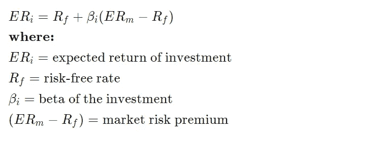

# 使用 Python 自动快速计算股票和投资组合的预期回报(CAPM)

> 原文：<https://blog.devgenius.io/automatically-and-quickly-calculate-the-expected-return-of-your-stocks-and-portfolio-capm-using-f9f189657584?source=collection_archive---------7----------------------->

## 使用 CAPM，你期望从你的股票和投资组合中获得多少回报


在 [Unsplash](https://unsplash.com/s/photos/capital-assets?utm_source=unsplash&utm_medium=referral&utm_content=creditCopyText) 上由 [Austin Distel](https://unsplash.com/@austindistel?utm_source=unsplash&utm_medium=referral&utm_content=creditCopyText) 拍摄的照片

在过去的几年里，股票市场非常不稳定。波动性可以被视为投资者的一种风险。“资本资产定价模型(CAPM)描述了系统风险或投资的一般风险与资产(尤其是股票)的预期回报之间的关系。CAPM 是作为一种度量系统风险的方法发展而来的。它在金融中被广泛用于给有风险的证券定价，并根据其风险和资本成本产生预期的资产回报”( [Investopedia](https://www.investopedia.com/terms/c/capm.asp) )

以下是自动快速计算你的股票和投资组合的预期回报(CAPM)的步骤:

1.  检查公式
2.  导入包
3.  导入投资组合
4.  计算投资组合的预期收益
5.  计算每只股票的预期收益

1.  **公式:**



来自 Investopedia 的 CAPM 公式

无风险利率:我们将使用 10 年期国库券。

市场回报率:我们将使用 10%的 S&P500 平均回报率。

贝塔系数表明股票价格相对于整个股票市场的波动程度。我们将从 yfiannce api 中提取它。

2.**导入包:**

```
# Import Libraries and packages
import yfinance as yf
import pandas as pd
import numpy as np
```

3.**导入投资组合:**

您可以在本文末尾的 github 链接中找到 excel 文件的链接，以便您添加自己的作品集:

```
# Import stock portfolio from excel
df = pd.read_excel("Stock_Portfolio.xlsx")
df
```


输出

4.**计算投资组合的预期收益:**

我们需要计算投资组合中每只股票的权重

```
# Calculate stock weight
df["stock_weight"]= round((df['Purchase_Cost']/df["Purchase_Cost"].sum())*100,2)
df
```


输出

计算每只股票的贝塔系数:

```
# Calculate beta for each individual stock
for i in range(len(df)):
    x = df.loc[i, "Stock"]
    ticker = yf.Ticker(x)
    stock_beta = ticker.info["beta"]
    df.at[i, "Beta"]= round(stock_beta,2)
df
```


输出

找出无风险利率:

我们将使用 10 年期国库券。

```
# find the risk free rate (10 year treasury bill)
treasury_yield10 = yf.Ticker("^TNX") 
risk_free_rate_prem = round(treasury_yield10.info['regularMarketPrice']/100,2)
risk_free_rate_prem
```


输出

对于市场回报，我们将使用 10%的 S&P500 平均值

```
# assume 10 percent return on the return of market ( average return of the S&P 500)
sp500_teturn = 0.10
```

现在我们用每只股票的贝塔系数乘以它的权重来计算投资组合的贝塔系数。

```
# Caclulate the portfolio beta
portfolio_beta = round(sum(df["Beta"]* df["stock_weight"]/100),2)
portfolio_beta
```


输出

现在我们计算投资组合的预期收益。

```
# Calculate the expected return of the portfolio
portfolio_exp_return = round(risk_free_rate_prem + portfolio_beta *(sp500_teturn - risk_free_rate_prem),2)
portfolio_exp_return
```


输出

我们应该期望这个投资组合每年有 9%的平均回报率。

5.计算每只股票的预期收益:

现在，让我们找出每只股票的预期收益。

```
# calulate the expected return for each individual stock using CAPM forumla
df["exp_return"]= round(risk_free_rate_prem + df["Beta"]*(sp500_teturn - risk_free_rate_prem),2)
df
```


输出

最后，所有的金融模型都有假设和问题。对于进一步的阅读，我建议阅读[Investopedia 的文章](https://www.investopedia.com/terms/c/capm.asp)。

完整的代码和 excel 文件，点击 [**这里**](https://github.com/RedaAldahan/Fiancne_Models/tree/3fdfc17b8b9e40dfde4fc5f9ea629b2e5fdaf42b/CAPM) **。**

**免责声明**:

投资证券是有风险的。投资股票、债券、交易所交易基金、共同基金和货币市场基金有亏损的风险。本金损失是可能的。证券或公司过去的投资表现并不能保证或预测未来的投资表现。