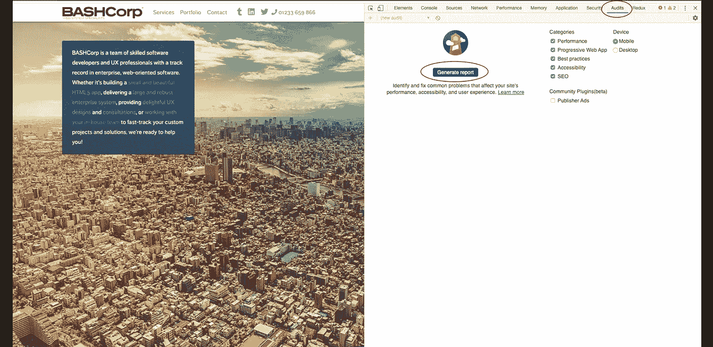
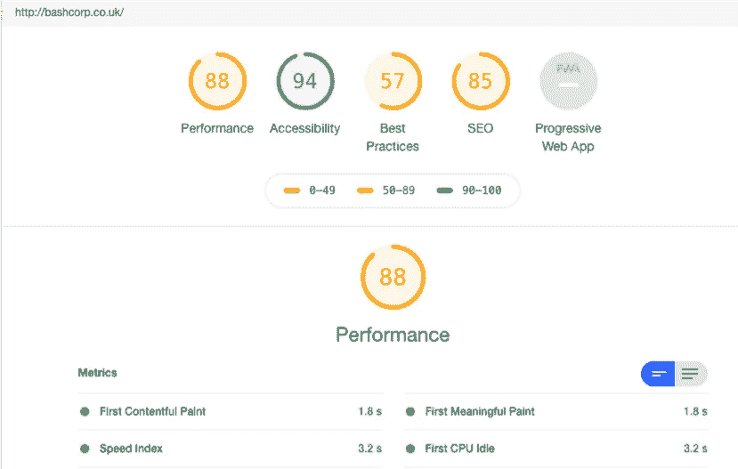

# 使用 Google Lighthouse 自动审计您的 web 应用程序的性能、可访问性和代码质量

> 原文：<https://blog.devgenius.io/automatically-audit-your-web-applications-performance-accessibility-and-code-quality-with-d44a76d6741d?source=collection_archive---------1----------------------->


本杰明·达达在 [Unsplash](https://unsplash.com?utm_source=medium&utm_medium=referral) 上拍摄的照片

近年来，许多组织受益于软件开发团队，他们使用 JavaScript 和其他流行的前端技术开发单页面应用程序，以创建令人愉快的微交互和可维护的、人类可读的代码模块。

这些应用程序中的许多还被编码为尽可能快地向用户显示有用的内容，使用[异步功能](https://developers.google.com/web/fundamentals/primers/async-functions)、[服务器端渲染](https://redux.js.org/recipes/server-rendering)、[缩小](https://developer.mozilla.org/en-US/docs/Glossary/minification)、[资源预加载/预取](https://developer.mozilla.org/en-US/docs/Web/HTML/Preloading_content)和[缓存](https://developers.google.com/web/fundamentals/performance/optimizing-content-efficiency/http-caching)，以及一系列其他性能优化技术。许多开发人员和产品所有者受益于审计工具，以跟踪他们在加快页面加载时间方面的进展，从而留住访问者并最大限度地提高转化率。

其中一个工具是谷歌的 [Lighthouse](https://developers.google.com/web/tools/lighthouse) ，它提供了一个清晰全面的报告，对网页的关键性能指标进行评级，例如

[第一次有意义的绘制](https://developers.google.com/web/tools/lighthouse/audits/first-meaningful-paint) —这表示页面开始为用户加载有意义的内容需要多长时间，例如静态文本(例如页面标题或介绍性内容，不需要动态数据获取)。虽然像加载微调器这样的间隙状态非常有助于让用户确信他们的内容即将到来，但它们不能算作有意义的描绘。只有在需要有效利用页面(例如，在线商店产品描述)时，图像等资产才会包含在此指标中。非关键内容(包括大多数图像)的显示包含在[第一个内容丰富的绘画](https://web.dev/fcp/)指标中。

[交互时间](https://developers.google.com/web/tools/lighthouse/audits/time-to-interactive) —这衡量页面完全响应用户输入所需的时间，例如按钮点击、搜索栏中的条目和折叠切换。该指标很可能会受到应用程序为提供该功能而必须消耗的资源数量以及这些资源的性能的影响。例如，显示静态数据(如联系信息)的 accordion 的交互速度可能比用户配置文件编辑表单快得多，后者要求在用户查看和更新数据之前从服务器获取数据。

除了这些有用的性能得分，Lighthouse 还提供了可访问性、搜索引擎优化和最佳实践的指标。由于 SEO 和无障碍设计最佳实践之间的[一致性](https://webaim.org/blog/web-accessibility-and-seo/)，许多开发人员可能会发现，随着可访问性的提高，搜索引擎优化得分会增加，从而为您的应用程序带来更广泛的受众。

运行临时 Lighthouse 审计既快速又简单:

1.安装并启动[谷歌 Chrome 网络浏览器](https://www.google.com/chrome/)。

2.访问您希望审计的网页。

3.打开 [Chrome 开发者工具](https://developers.google.com/web/tools/chrome-devtools/open)。

4.切换“审计”选项卡并单击“生成报告”:



然后，您的审计报告将显示在开发人员工具中:



快速、简单、信息丰富…但不是自动化的。能够在每次发布新的更改时运行审计，允许开发人员和产品所有者根据这些关键指标来监控应用程序的性能，并确定新优化的有效性。

灯塔团队提供了一个[命令行界面](https://github.com/GoogleChrome/lighthouse)，允许开发人员编写脚本来运行审计、转换和存储返回的数据。这些脚本可以手动运行，也可以集成到构建过程中。将数据保存为 JSON 或另一种常见格式，可以很容易地将这些有用的数据输入到您最喜欢的可视化工具中，如 [splunk](https://www.splunk.com/) 、 [PowerBI](https://powerbi.microsoft.com/en-us/) 或 [kibana](https://www.elastic.co/kibana) 。

CLI 的[文档非常全面，许多现成的例子已经在线发布。我也发布了一个利用 Google Lighthouse CLI 自动对你的网页进行审计的示例脚本。](https://developers.google.com/web/tools/lighthouse#cli)

如果您使用 GitHub 和 Node.js，并且有兴趣在命令行上尝试我的脚本:

```
git clone [https://github.com/cloud-quinn/automated-lighthouse-audits.git](https://github.com/cloud-quinn/automated-lighthouse-audits.git)cd automated-lighthouse-auditsnpm inpm start <urlToAudit>
```

<urltoaudit>应该是您希望审计的页面的网址，例如，要针对[http://bashcorp.co.uk](http://bashcorp.co.uk/)运行审计，命令应该是</urltoaudit>

```
npm start [http://bashcorp.co.uk](http://bashcorp.co.uk)
```

**注意:**该脚本要求 Node.js 版本 10 或以上。

该脚本的主要特点是:

1.对命令行参数中指定的任何 URL 运行审核

2.获取审计提供的关键得分，即性能、可访问性、最佳实践、SEO(搜索引擎优化)、PWA(渐进式网络应用)

3.根据`./metrics.js`中的定义，获取一组预定义指标的值。要保存一组不同的指标，只需修改从该文件返回的数组中的值。确保您定义的所有值都存在于有效指标的[列表中](https://docs.google.com/spreadsheets/d/1up5rxd4EMCoMaxH8cppcK1x76n6HLx0e7jxb0e0FXvc/edit#gid=0)。该脚本被编码为针对每个指标返回`numericValue`——这是以毫秒为单位的时间量。例如，交互度量值 2500 意味着页面需要两秒半的时间才能完全响应用户输入。

4.将这些转换后的分数和指标以 JSON 格式保存在本地文件(可以上传到任何地方)或 AWS 上的 S3 存储桶中。为了使用此选项，您需要更新。/saveOutput/s3.js 文件，以便在您的 AWS 帐户上使用您的 s3 的真实详细信息和凭据。更多详情请参考优秀的 [AWS 文档](https://docs.aws.amazon.com/cli/latest/reference/s3api/put-object.html)。

我祝您在性能和可访问性审计中好运，无论您是使用 Lighthouse 还是其他工具，在浏览器中，还是在命令行中。有了这些数据，我们可以让我们的网页每天都变得更好。