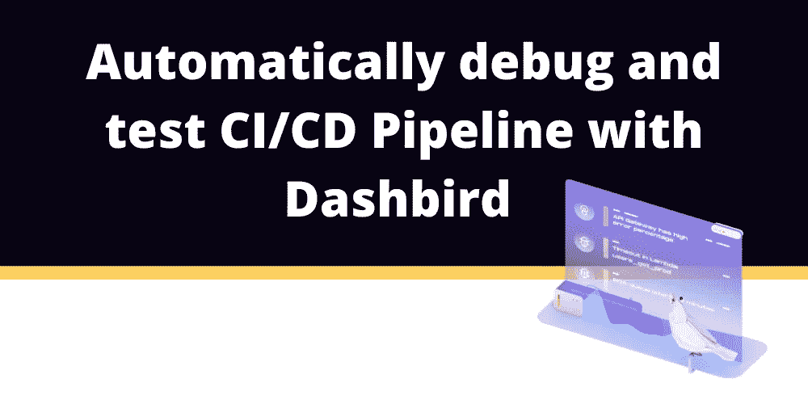
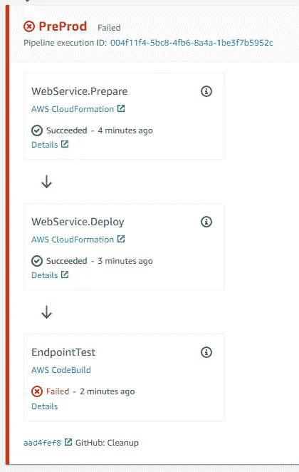
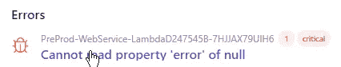
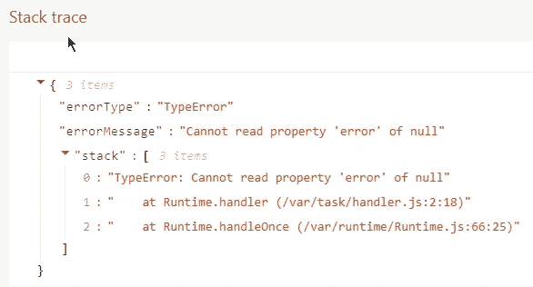

# 用 Dashbird 自动调试和测试 CI/CD 流水线

> 原文：<https://blog.devgenius.io/automatically-debug-and-test-ci-cd-pipeline-with-dashbird-b5eb0e93f338?source=collection_archive---------4----------------------->

*在本文中，我们将使用 AWS Cloud Development Kit (CDK)构建一个 CI/CD 管道，并使用 Dashbird 的 observability 工具对其进行调试和测试。*

2021 年，**持续集成和持续交付**，或者简称 CI/CD，应该是每一个**现代软件开发过程**的一部分。它帮助**更快地交付新功能和错误修复**。如果代码不必在部署前搁置几天或几周，开发人员就有更大的机会记住他们编写代码时的想法。有了好的代码质量工具，你可以在有问题的代码被部署到任何地方之前预防问题。

基于 API 的 web 或移动应用是无服务器系统的一个众所周知的例子，但是 **CI/CD 管道也可以包含无服务器技术**！AWS 提供**托管服务**到**在云端构建无服务器 CI/CD 管道**，所以你只需支付你所使用的费用。

> [在这篇速成文章中了解更多关于 CDK 的信息。](https://dashbird.io/blog/crash-course-aws-cdk-serverless/)

# 先决条件

本教程要求:

*   [大鸟账户](https://dashbird.io/register/)
*   [AWS 账户](https://portal.aws.amazon.com/billing/signup)
*   [一个 GitHub 账号](https://github.com/join)
*   [Node.js](https://nodejs.org/en/)
*   [AWS CDK](https://docs.aws.amazon.com/cdk/latest/guide/getting_started.html)

# 设置项目

GitHub 上已经有了包含所有代码的项目。你只需要**把它叉入你自己的账户**。这是 AWS 代码管道访问 GitHub 挂钩所必需的。

要分叉存储库，[在浏览器](https://github.com/kay-is/dashbird-cicd-example)中打开它，并点击右上角的“fork”按钮。

下一步是**在你的开发机器上初始化项目**。为此，您可以**简单地克隆您自己的 fork** 。

`$ git clone`

`git@github.com:<YOUR_GITHUB_USERNAME>/dashbird-cicd-example.git`

最后，你需要**更新**和`credentials.json`，这样这个项目就可以使用你自己的 fork 和 AWS 账户了。

`{`

`"github": {`

`"username":"GITHUB_USERNAME",`

`"repository": "GITHUB_REPOSITORY"`

`},`

`"aws": {`

`"account":"AWS_ACCOUNT_ID",`

`"region":"AWS_REGION"`

`}`

`}`

*   `GITHUB_USERNAME`是您将项目分发给的 GitHub 帐户的名称。
*   如果您没有更改存储库名称，`GITHUB_REPOSITORY`应该是`dashbird-cicd-example`
*   `AWS_ACCOUNT_ID`是您的 AWS 账户的 ID/号码
*   `AWS_REGION`您希望以后将此项目部署到 AWS 区域吗

您还需要一个**个人访问令牌**，以便管道可以访问您的 GitHub 存储库。

GitHub 文档解释了如何获得令牌。令牌需要`repo`和`admin:repo_hook`范围。反过来，[AWS 文档](https://docs.aws.amazon.com/secretsmanager/latest/userguide/tutorials_basic.html)解释如何将令牌作为秘密添加到 **AWS 秘密管理器**。令牌应该是一个名为`github-token`的**明文秘密**。

# 部署项目

如果一切都设置正确，那么只需两个命令就可以**部署项目。一个命令用于**引导 AWS 账户中的 CDK** ，另一个命令用于**部署项目**。**

但是让我们在部署之前检查一下这个项目，这样您就可以对将要发生的事情有个大概的了解。

简而言之，这个项目基本上是两个系统合一。一个是 **CI/CD 管道**，它监听我们的存储库变化，并在推送发生时执行管道步骤。另一个是我们要部署的**实际应用**。

## 这些文件的职责如下:

*   `bin/pipeline.js`包含 CDK 部署的入口点。它将加载管道堆栈。
*   `lib/pipeline-stack.js`包含 CI/CD 管道的基础设施代码。它将从命令行部署。
*   `lib/webservice/stage.js`包含管道和应用程序堆栈之间的粘合代码。管道将把它用于我们应用程序的一个或多个部署。
*   `lib/webservice/stack.js`包含实际应用的基础设施代码。在这种情况下，API 网关有一个执行 Lambda 函数的路由。当推送发生时，应用程序将由我们的管道部署在云中(并部署到云中)。
*   `lib/webservice/lambda/handler.js`包含 Lambda 函数的实际应用代码。在这种情况下，它包含一个错误来说明 Dashird 监控。

CDK 管道的好处是**将**改变为我们的应用程序代码、我们的应用程序基础设施，我们的管道基础设施**都由同一个管道**处理。

让我们部署项目。如果您**之前没有使用过您添加到`credentials.json`中的账户和地区组合的 CDK**；您需要使用以下命令首先**引导 CDK:**

`$ cdk bootstrap \`

`--profile account1-profile \`

`--cloudformation-execution-policies arn:aws:iam::aws:policy/AdministratorAccess \`

`aws://<AWS_ACCOUNT_ID>/<AWS_REGION>`

如果引导程序工作正常，您现在可以用这个 CDK 命令**部署项目**:

`$ cdk deploy`

这可能需要几分钟时间。

如前所述，这将**部署 CI/CD 管道**而不是应用程序。在管道启动并运行之后，它将提取存储库并部署我们的 [API 网关](https://dashbird.io/knowledge-base/api-gateway/what-is-aws-api-gateway/)和基于 Lambda 的应用程序。

如果您**打开 AWS 控制台**并导航到 CodePipeline(在类别 Developer Tools 和您选择的 AWS 区域中)，您可以看到**管道在部署**上工作。最后一步会失败！

# 用 Dashbird 调试错误

现在 CI/CD 管道已经启动并运行，我们终于可以**看看我们的应用程序是否正常工作了**。如果您**在 AWS 控制台中打开代码管道**并向下滚动到底部，您应该**看到下面的错误**。

如果您遵循了[dash bird 入门指南](https://dashbird.io/docs/)，您的所有 **Lambda 函数将被自动监控**，甚至是我们的管道新部署的函数。这意味着您可以在 Dashbird 仪表盘中找到这个错误；它应该是这样的:

如果您有**多个 Lambda 函数**，您可以通过其生成的名称找到它，该名称包括:

*   艺名`PreProd`
*   堆栈名称`WebService`
*   Lambda 函数的资源名`Lambda`
*   唯一的 ID

如果你点击这个错误，你应该**看到导致它的事件**。下面，您可以看到 Dashbird 提供的**堆栈跟踪**。

虽然文件名 handler.js、行号 2 和错误类型是正确的，**但位置不同**。它在我们的**开发机器**上的`lib/webservice/lambda`目录中，但是当**部署**时，它在 AWS 云中的 Lambda 拥有的`/var/task directory`中结束。你应该记住**给你的 Lambda 函数代码文件起一个名字，这有助于以后找到它**。

为了**修复这个错误**，我们只需**从我们的 handler.js 文件**中删除那个错误的行，提交更改并将其推送到 GitHub。这将触发我们的 **CI/CD 管道再次运行，而不会出现错误**。

# 包扎

连续交付管道对于现代软件来说至关重要，应该成为开发过程的一部分，而**无服务器技术是构建管道的良好基础**。有了 CDK，这样的管道很容易建立和维护。

因为 Dashbird 遵循[可观察性原则](https://dashbird.io/blog/monitoring-vs-observability/)，所以在创建系统时，您不必考虑明确的监控。您将获得 Dashbird 支持的每个 AWS 服务的**自动预配置洞察**和**警报**，甚至是 CI/CD 管道中的 Lambda 函数。这样，你就能及时了解系统的内部状态，并且**不会在生产**中出现任何意外。

*这个项目是基于* [*一个 AWS 自己的例子项目*](https://aws.amazon.com/blogs/developer/cdk-pipelines-continuous-delivery-for-aws-cdk-applications/) *为 AWS 博客创建的。稍微清理了一下* ***更容易复制*** *，不过主要还是一样的，如果想获得一些额外的信息可以看看 AWS 的文章。*