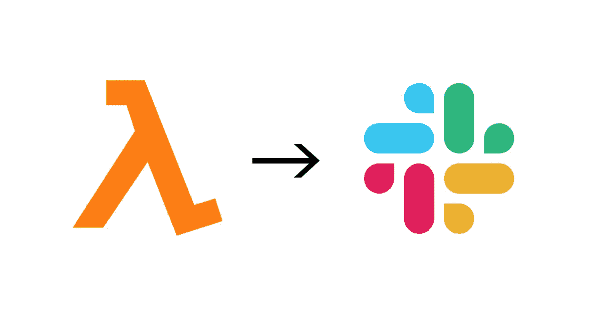
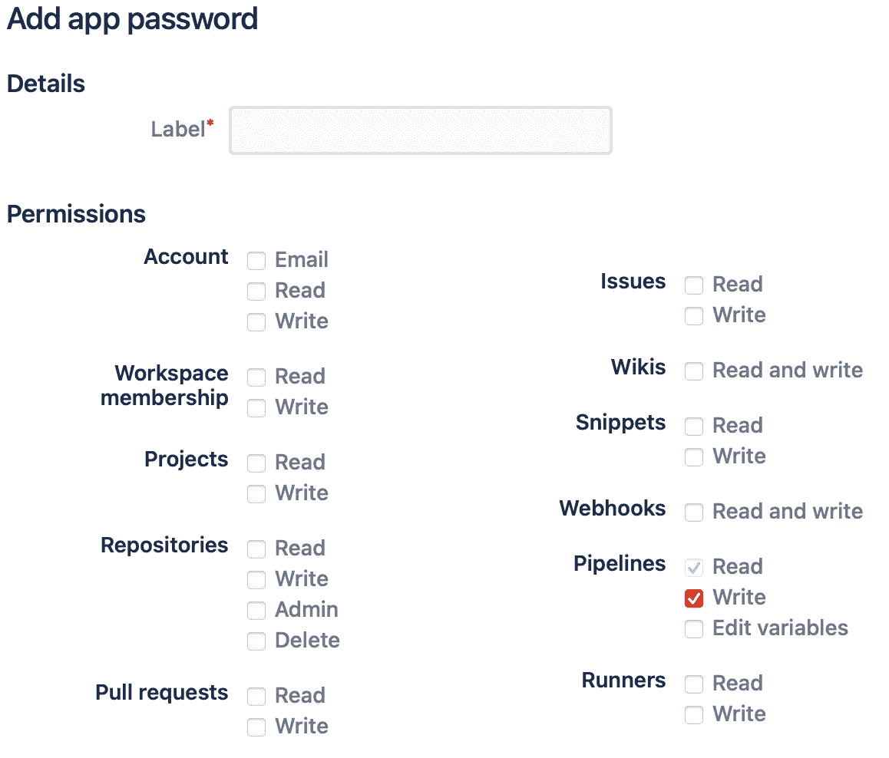
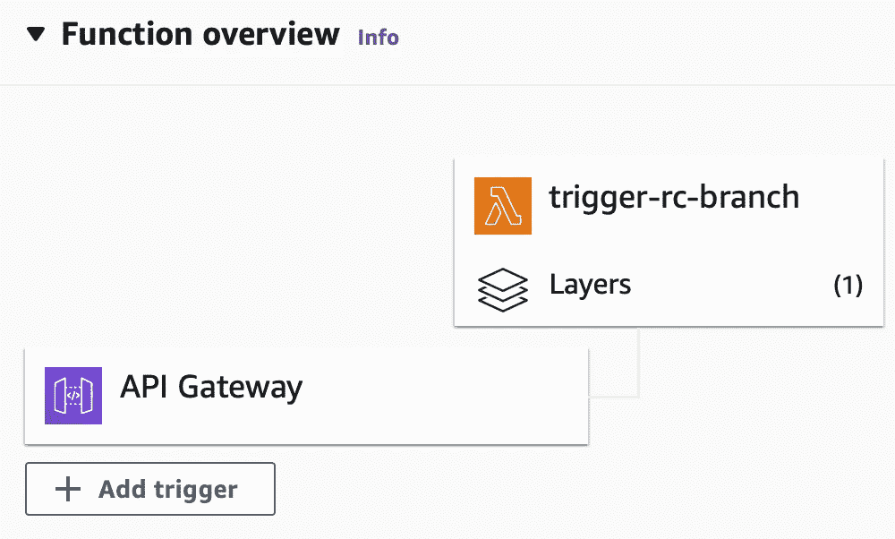

# 利用 Lambda 和 Slack 实现位桶流水线自动化

> 原文：<https://blog.devgenius.io/automating-bitbucket-pipelines-with-lambda-and-slack-3f645eab6a57?source=collection_archive---------9----------------------->



[https://ajike.github.io/lambda-to-slack/](https://ajike.github.io/lambda-to-slack/)

Bitbucket 管道功能非常丰富，您可以根据需要定制和自动化一切。但是，在某些情况下，您需要手动触发管道。在一些开发过程之后，创建一个发布候选(RC)版本就是其中之一。如果测试环境中一切正常，您可以手动触发 RC 管道。在这篇文章中，我将谈论如何在不离开你最喜欢的消息应用程序的情况下实现这一点。

**1 位桶 API**

Atlassian 提供了一个很棒的 REST API 和文档来执行您在存储库中用鼠标点击就可以完成的任何操作。但是首先，我们需要一个应用程序密码来使用这个 API。



出于安全考虑，此 app 密码只允许使用管道权限。获得密码后，我们可以使用 Bitbucket API 以编程方式触发管道(或任何其他操作)。来自 API 文档:[https://developer . atlassian . com/cloud/bit bucket/rest/API-group-pipelines/# API-repositories-workspace-repo-slug-pipelines-post](https://developer.atlassian.com/cloud/bitbucket/rest/api-group-pipelines/#api-repositories-workspace-repo-slug-pipelines-post)

```
$ curl -X POST -is -u username:password 
-H 'Content-Type: application/json' https://api.bitbucket.org/2.0/repositories/jeroendr/meat-demo2/pipelines/ 
-d '  { "target": 
{"ref_type": "branch", "type": "pipeline_ref_target",
"ref_name": "master"}}'
```

使用 Python

在 json payload 中，“pattern”是管道的**名称，“ref_name”是管道**的**源分支。**

**2-AWSλ**

我们有工作的 Python 代码来触发管道，但我们需要一个端点来在需要时执行这段代码。换句话说，我们需要一个存放代码的地方。由于这项任务不需要一台一直处于运行状态的服务器，因此无服务器解决方案是最佳选择。我会选择 AWS Lambda。

创建一个简单的 Lambda 函数非常简单。只有 3 件事值得一提:

*   外部库

在这段代码中，我们只需要 Python 的请求库。在 Lambda 函数中，管理外部依赖关系的最佳方式之一是创建层。创建一个包含请求库的层，并将它附加到我们的函数中，这样就可以工作了。

*   互联网接入

默认情况下，Lambda 函数在 VPC 内部没有公共 internet 访问。为了从我们的函数与 Bitbucket API 通信，我们需要一个。我们必须创建 VPC、公私子网、NAT 网关，并相应地配置路由表。这看起来有点复杂，但 AWS 的文档让一切变得非常简单:[https://AWS . Amazon . com/tr/premium support/knowledge-center/internet-access-lambda-function/](https://aws.amazon.com/tr/premiumsupport/knowledge-center/internet-access-lambda-function/)

*   API 网关

当我们的 Lamba 函数准备好了，我们需要一个端点从我们的 Slack Bot 调用这个函数。从函数的添加触发器部分，我们可以添加一个 API 端点。我选择了 HTTP API。



现在我们有了一个端点，每次我们发出请求时，它都会运行我们的 Lambda 函数。通过这个函数，我们触发了我们的比特桶流水线。

**3-松弛**

作为最后一步，我们需要一个 Slack bot 来调用我们的 API 网关。不赘述，这篇文章解释的很好:[https://medium . com/geek culture/trigger-pipe-via-slack-command-8990 Fe 707609](https://medium.com/geekculture/trigger-pipe-via-slack-command-8990fe707609)

唯一的区别是，我们必须提供 API 网关 URL 作为 Slack 应用程序的请求 URL。所以每次执行斜杠命令时，我们的 API 网关和 Lambda 函数都会被调用。

当您有很多项目时，每天手动触发定制管道可能会非常乏味。使用 Slack 自动化这个过程可能会非常有帮助。

**参考文献:**

*   [https://medium . com/geek culture/trigger-pipe-via-slack-command-8990 Fe 707609](https://medium.com/geekculture/trigger-pipe-via-slack-command-8990fe707609)
*   [https://AWS . Amazon . com/tr/premium support/knowledge-center/internet-access-lambda-function/](https://aws.amazon.com/tr/premiumsupport/knowledge-center/internet-access-lambda-function/)