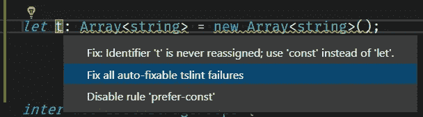
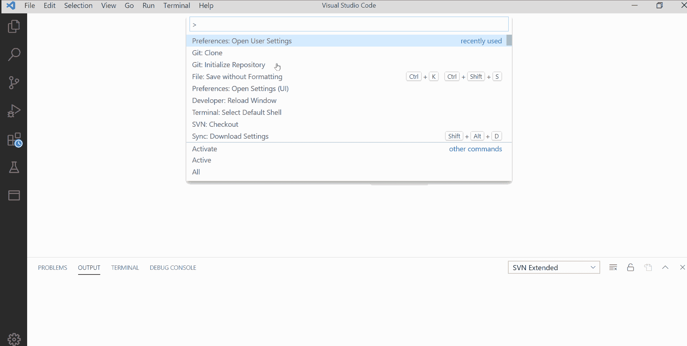
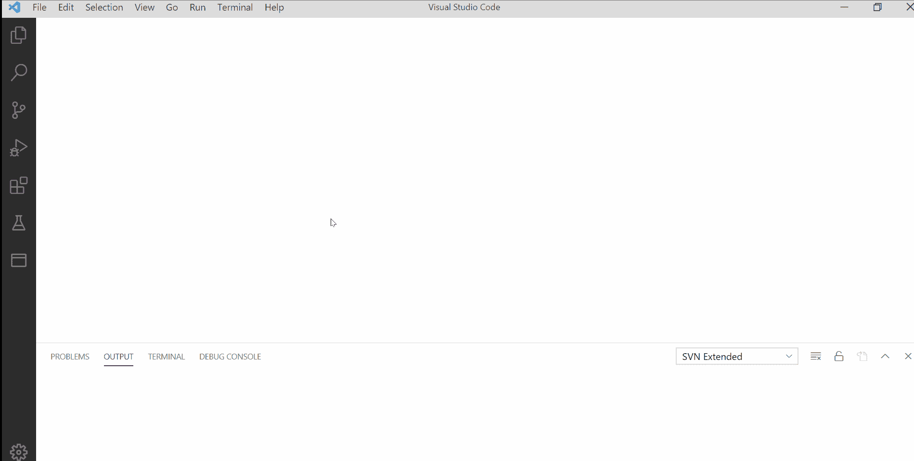
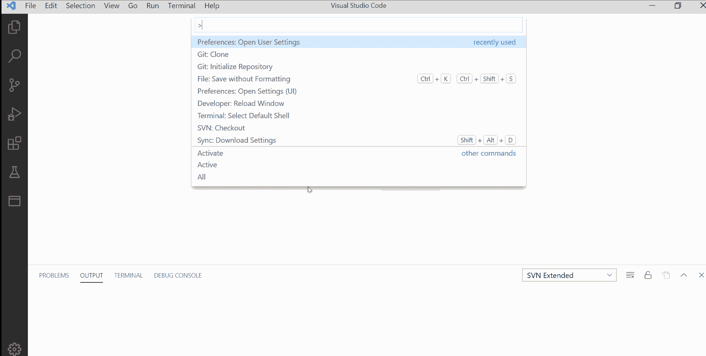

# 角度自动化编码指南(VS 代码)

> 原文：<https://blog.devgenius.io/automating-coding-guidelines-in-angular-vs-code-963e6ea20edc?source=collection_archive---------14----------------------->

> 在每个项目中，每个开发人员都要遵循一些基本准则，以保持项目的整洁和符合标准。每个角度项目都是如此。这些指导方针通常在代码审查期间被检查，不管它们是否被遵循。但是，它仍然增加了手工劳动和错过它的机会。

每个项目中的一些通用准则是:-

1.  代码不应该有任何 Lint 错误。(**例如:- TsLint**
2.  应该使用确定的格式化程序正确格式化代码。
3.  代码中不应该有任何未使用的导入。

让我们来谈谈自动化合并这些通用指南，它们是每个项目的一部分，可以通过调整 IDE 中的一些设置来实现自动化。

1.  **代码不应该有任何 Lint 错误**

每当我们在 VS 代码中安装 [TS Lint](https://marketplace.visualstudio.com/items?itemName=ms-vscode.vscode-typescript-tslint-plugin) 扩展，并在我们的项目中配置 TS Lint。而大部分林挺 VS 代码的编码向我们展示了类似下图的东西。

因此，基本上有一个快速解决大多数林挺问题的方法。

但是，为什么我们必须手动选择这些选项来修复所有这些问题呢？能自动完成吗？

答案是肯定的，这些问题可以快速解决。我们可以配置我们的编辑器，以便在我们编辑和保存代码时自动应用这些快速修复。

以下是实现这一目标可以遵循的步骤。

a.按下 **F1** 并搜索打开用户设置

b.点击打开用户设置并在用户设置中搜索 **Lint** 。

c.点击 Ts Lint

d.启用保存时的**修复**选项。

2.**应使用确定的格式化程序**正确格式化代码。

> 所以通常每次我们保存代码时，我们都必须使用格式化程序来格式化它，以保持一个干净的代码库。这也可以在 IDE 中自动调整格式设置。

以下是实现这一目标可以遵循的步骤。

a.按下 **F1** 并搜索打开用户设置。

b.点击打开用户设置并在上输入**格式。**

c.启用保存时的**格式**选项。

现在，无论何时进行任何更改并保存文件，您都有了正确格式化的代码。

3.代码中不应该有任何未使用的导入。

我们将在这里借助一个惊人的扩展，即[打字英雄](https://marketplace.visualstudio.com/items?itemName=rbbit.typescript-hero)。这个扩展有助于在我们输入时自动导入类，也有助于对导入进行排序并删除未使用的导入。

但是为了在我们保存代码时自动执行未使用的导入，我们需要调整它的设置。

以下是实现这一目标可以遵循的步骤。

a.按下 **F1** 并搜索打开用户设置。

b.点击打开用户设置，输入**打字稿英雄**。

c.启用**保存时组织导入**选项。

在这里，您已经在项目的每个变更中正确地组织了导入。

> 现在我们为一个 IDE 用户配置了这些设置。但是我们想让所有签出我们项目的开发人员默认使用这些设置。这也是可以做到的。
> 
> 到目前为止，我们在用户设置中做所有的设置。同一设置页面上还有另一个选项卡，即工作区设置。如果我们在工作区设置上做同样的改变。它将在我们的项目中创建一个包含 settings.json 文件的. vscode 文件夹。我们可以这样做。项目存储库中的 vscode 文件夹。之后，每一个签出我们的项目并使用相同的 IDE 和扩展的开发人员都将启用这些设置。

通过自动合并这些指南。我们可以确保一些指导方针成为我们开发的一部分，而不需要任何额外的努力。