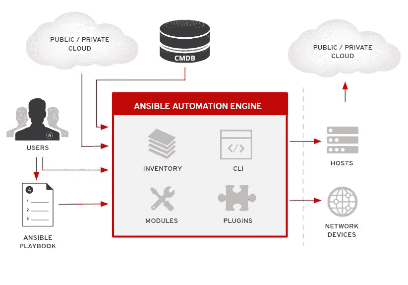

# 用 Ansible 自动化 Kubernetes 环境

> 原文：<https://blog.devgenius.io/automating-kubernetes-environments-with-ansible-ffe7e5780dfc?source=collection_archive---------6----------------------->

Ansible 是一个强大的基础设施自动化工具。 [Kubernetes](http://entradasoft.com/blogs/automating-kubernetes-environments-with-ansible) 是一个强大的应用部署平台。我们将了解如何使用这些工具来自动化大规模可扩展、高度可用的基础设施。

Ansible 是一个灵活的开源自动化工具，它提供了一套完整的功能，可以同时在多个系统上执行各种[配置管理任务](http://entradasoft.com/blogs/automating-kubernetes-environments-with-ansible)。

最基本的可回答的特征由模块表示。模块是专门的插件，只做一件事，比如执行系统命令或者在文件中添加一行或多行。它们还通过管理操作系统服务的状态、安装和卸载软件存储库等，以一种与发行版无关的方式隐藏了高级任务的复杂性。

**全文:**[http://entradasoft . com/blogs/automating-kubernetes-environments-with-ansi ble](http://entradasoft.com/blogs/automating-kubernetes-environments-with-ansible)

**Docker 和 kubernetes 中的一个可能角色**

Docker 容器在 Kubernetes 的控制下有效运行。但是，当 Docker、Kubernetes 或它们所依赖的任何组件需要更新、重启或维护时，会发生什么呢？

虽然这些活动可以手动执行，但这些过程既耗时又容易出错。在 DevOps 和 IT 中，这是自动化工具发挥作用并显示其真正价值的地方。Ansible 是这一领域的领先工具，因为它的安装和运行非常简单。Ansible 没有需要预先安装在主机上的代理；相反，它使用 SSH 连接到主机，并且它的运行手册是用 YAML 语编写的——当使用简单的文本编辑器和版本控制软件如 Git 时，这是一种容易使用的格式。

# 集群管理

Kubernetes 星团不是凭空出现的。根据您使用的集群类型，它们需要管理升级和集成。集群管理可能会变得非常困难，尤其是像大多数组织一样，您正在管理多个集群。

如果您在私有云中运行，或者在裸机服务器上运行，您将需要一种方法来安装 Kubernetes 并管理集群中的各个服务器。Ansible 在编排多服务器应用程序方面有着良好的记录，而 Kubernetes 本身就是一个多服务器应用程序，它恰好通过容器化来管理一个或数千个其他多服务器应用程序。

即使您不需要多云功能，Ansible 也提供了有用的抽象，如使用 CloudFormation 模块管理 AWS 上的 cloudformation 模板部署，或使用 Terraform 模块管理 terraform 部署。

# 应用程序生命周期

Ansible 在管理 Kubernetes 内部的应用程序方面显示了巨大的潜力。通过 Operator SDK 使用 [Ansible 构建 operators](http://entradasoft.com/blogs/automating-kubernetes-environments-with-ansible) ，你可以对你的应用的所有生命周期管理(部署、升级、备份等)进行编码。)放在任何 Kubernetes 集群中，即使您不使用 Ansible 来管理该集群中的任何其他内容。

你可以用 YAML 和 Ansible 来构建它，而不是强迫开发人员和操作团队学习 Go 或另一种专门的语言来维护一个操作符。

# 基础设施自动化

作为一个自动化工具，Ansible 用于创建[行动手册](http://entradasoft.com/blogs/automating-kubernetes-environments-with-ansible)，以解决环境中发生的常见事件和事故，从重启应用程序和服务到添加额外的集群节点。从运营到开发，随叫随到的员工都在使用这种自动化技术来缩短确认和恢复(MTTA/MTTR)的平均时间，并提供更好的整体服务。

**了解更多:**[http://entradasoft . com/blogs/automating-kubernetes-environments-with-ansi ble](http://entradasoft.com/blogs/automating-kubernetes-environments-with-ansible)