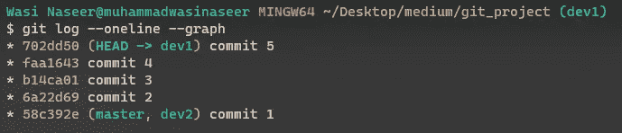
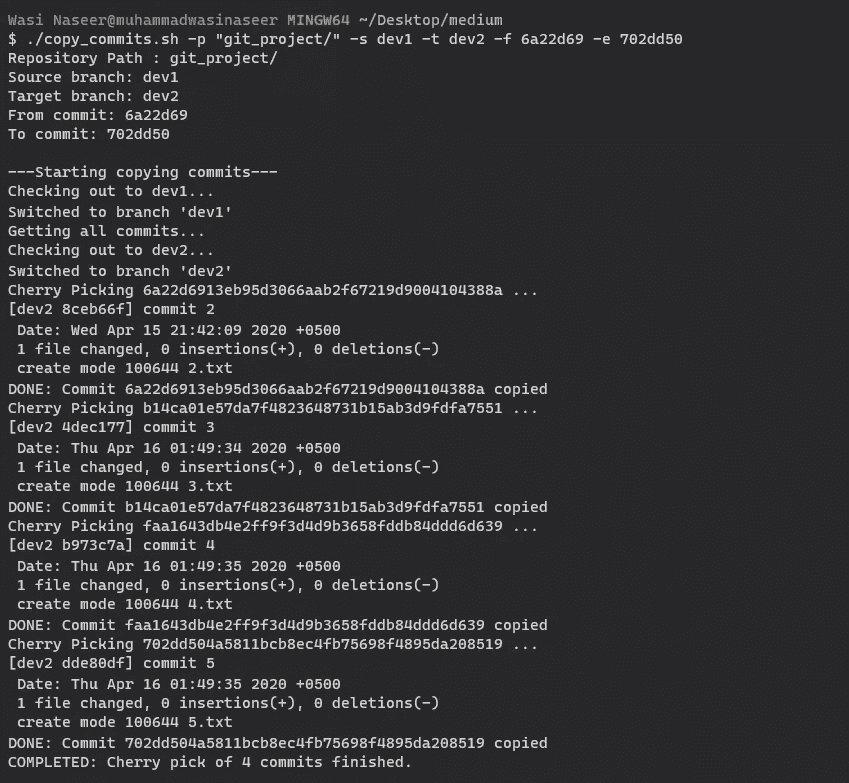

# 自动将一组提交从一个分支复制到另一个分支

> 原文：<https://blog.devgenius.io/automating-to-copy-a-set-of-commits-from-one-branch-to-another-11db4a98715c?source=collection_archive---------10----------------------->

本文将描述如何将一组连续的提交从存储库中的一个分支复制到另一个分支


照片由[扬西·敏](https://unsplash.com/@yancymin?utm_source=medium&utm_medium=referral)在 [Unsplash](https://unsplash.com?utm_source=medium&utm_medium=referral) 上拍摄

# 最终剧本

[代码链接](https://gist.github.com/Muhammadwasi/05fa262f3afd92163896fbe8295b9b16)

我们 bash 脚本`copy_commits`的最终版本应该是这样的

```
copy_commits.sh -p <project_path> -s <source-branch> -t <target-branch> -f <commit-start> -e <commit-end>
```

让我们假设我们有两个分支 **dev1** 和 **dev2** ，我们想要将一组连续的提交从 **dev1** 移动到 **dev2**

**dev1** 分支有 5 次提交，而 **dev2** 分支有 1 次提交。并且，我们希望通过指定开始提交和结束提交，将 **dev1** 的 4 个额外提交复制到 **dev2** 分支。

# 步伐

我们将执行以下步骤来自动化该任务。

1.  首先，我们将解析脚本执行时传递的参数。这些值将存储在以下五个变量中:

*   `$PROJECT_PATH`
*   `$SOURCE_BRANCH`
*   `$TARGET_BRANCH`
*   `$FROM_COMMIT`
*   `$TO_COMMIT`

1.  我们将首先检查到 **dev1** 分支(源分支),并获取一个数组中开始和结束提交之间的所有提交。
2.  然后我们将检查到 **dev2** 分支，我们将从数组中取出每个提交，并在 **dev2** (目标分支)上挑选提交

## 步骤 1:解析参数并将参数存储到变量中

```
while getopts ":p:s:t:f:e:" o; do
    case "${o}" in
    p)
            PROJECT_PATH="${OPTARG}"
            ;;
        s)
            SOURCE_BRANCH="${OPTARG}"
            ;;
        t)
            TARGET_BRANCH="${OPTARG}"
            ;;
        f)
            FROM_COMMIT="${OPTARG}"
            ;;
        e)
            TO_COMMIT="${OPTARG}"
            ;;
        *)
            abnormal_exit
            ;;
    esac
done
```

以下是`abnormal_exit()`功能的代码

```
# Prints usage
usage() {                                      
  echo "Usage: $0 -p <project_path> -s <source-branch> -t <target-branch> -f <commit-start> -e <commit-target>  " 1>&2 
}# Prints usage and exit
abnormal_exit() {                              
  usage
  exit 1
}
```

## 步骤 2:从源分支获取提交散列，并将其存储到一个数组中

```
commits=($(git rev-list "$FROM_COMMIT^..$TO_COMMIT"))
```

*   `git rev-list`用于按时间倒序列出 git 提交。因此，最新的提交将在数组的开始处。
*   `<start_commit_hash>..<end_commit_hash>`是表示从 **start_commit_hash** (不包含)到 **end_commit_hash** (包含)开始的符号。如果我们想在结果中得到 **start_commit_hash** ，那么我们必须指定开始提交的父级。可以在提交散列的末尾使用插入符号`^`来指定开始提交的父提交。这就是为什么在开始提交的末尾使用了一个脱字符号。
*   `$FROM_COMMIT^`:表示从`$FROM_COMMIT`之父开始。脱字符号(^)用于指定提交的父级，否则`$FROM_COMMIT`将不会包含在最终结果中。
*   `$(some_command_here)`:当我们想要运行某个命令，但是想要将命令的输出存储到一个变量中时，使用这个符号。因此，我们可以将它的输出赋给左边的一个变量。
*   `($(some_command_here))`:如果我们将一些文本封装到括号中，那么 bash 会根据 IFS(内部字段分隔符)将它们转换成一个数组。默认情况下，它是空白。因此`$(some_command_here)`的输出将被转换成一个数组。

## 步骤 3:通过从提交数组中挑选提交，在目标分支上应用提交

我们已经将所有的提交放入了`commits`数组。现在，我们必须检查目标分支。

```
git checkout $TARGET_BRANCHif ! [[ $? -eq 0 ]]
then
    echo $'\u274c' "ERROR: Failed to checkout to $TARGET_BRANCH"
    exit 2
fi
```

我们必须逐个选择每个提交并运行`cherry-pick`命令。但是，请记住，我们必须以相反的顺序选择提交，因为最近的提交是在数组的开始。这就是为什么我们将开始从提交数组的`length-1`索引中挑选提交。

```
# For each commit
for ((i=$((${#commits[@]}-1));i>=0;i--))
do
    echo "Cherry Picking ${commits[i]} ..."
    git cherry-pick "${commits[i]}"
    # If the above command fails, then exit with proper message
    if ! [[ $? -eq 0 ]]
    then
        echo "ERROR: Cherry pick commit with ${commits[i]} failed, exiting..."
        exit 2
    fi
    # Show success message for the copied commit
    echo "DONE: Commit ${commits[i]} copied"
done
```

*   `#`用于查找数组的长度。
*   循环从长度-1 开始，我们将递减`i`直到它小于 0。
*   `$?`用于获取最近执行的命令的退出状态代码。

## 最终脚本截图



Git 项目提交日志



脚本执行时的屏幕截图