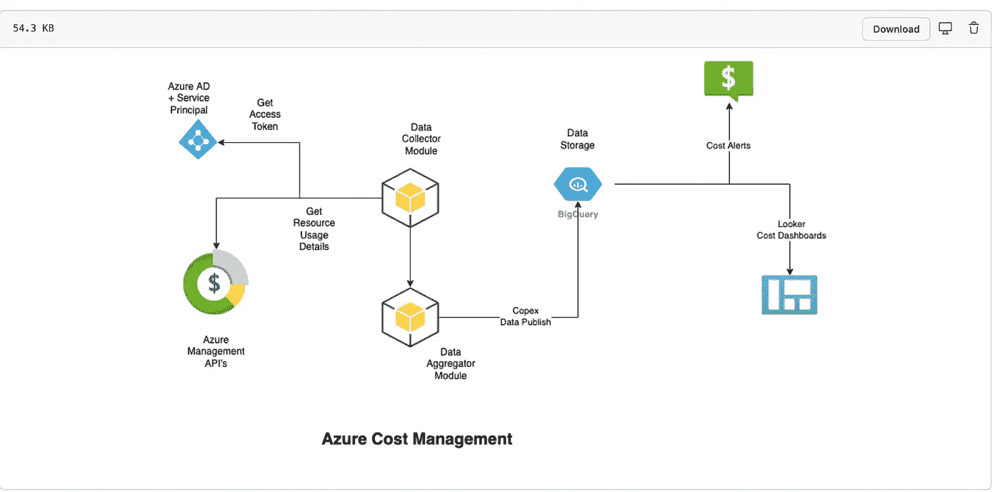
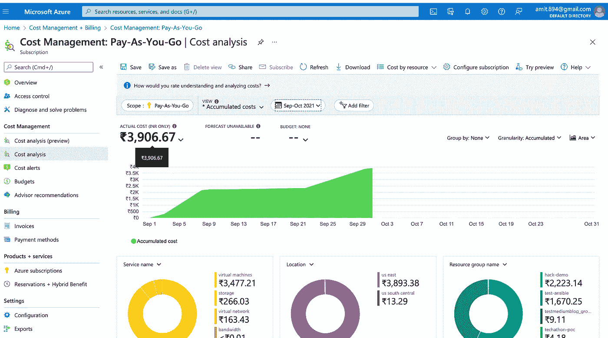

# 自动化您的每月 Azure 云成本报告

> 原文：<https://blog.devgenius.io/automating-your-monthly-azure-cloud-cost-spends-a51257a6564f?source=collection_archive---------9----------------------->

这篇博客是我们从零开始讨论**云**概念的系列文章的一部分，面向的是入门知识有限的读者。这篇文章属于*中级*系列，因为它涉及到理解 [**Azure 成本管理**](https://docs.microsoft.com/en-us/azure/cost-management-billing/cost-management-billing-overview) 的工作以及自动化月度支出报告。

云系列中的一些早期博客如下。

[**GCP 大查询第一 Python 连接器**](/gcp-big-query-writing-my-first-python-connector-1140b022b88a)[**AWS-安全-自动化**](https://medium.com/r?url=https%3A%2F%2Fblog.devgenius.io%2Fcustom-docker-bridge-networks-how-to-run-containers-b8d40c51bab2)[**自定义 Docker 桥接网络**](/custom-docker-bridge-networks-how-to-run-containers-b8d40c51bab2)

# 成本管理—概述

随着空间与业务需求成比例增加，云部署不断增长的一个关键因素是优化云资源利用率的需求。未跟踪的每月 Azure 云部署订阅对长期预算计划和组织范围的卓越运营都是潜在的风险。因此，使用*成本警报*和 *Copex 仪表板*来跟踪每月支出是至关重要的，以便通过自动化管道 *Azure 默认仪表板*或*定制聚合仪表板*来跟踪基于资源利用率的异常值，从而获得长期收益。

# 关键成本指标

*   **总预算-** 给定时间段内给定项目的总预算云成本。
*   **总消耗-** 给定项目在给定年份的总消耗云成本。
*   **成本利用率-** 给定年度实际支出与预算值的比率。小于< 1 的比率被认为是健康的。
*   **超支概率-** 对于给定项目是否会超出其给定年度的云支出，回答是或否。如果*(到目前为止的总消耗+上个完成月的消耗率*剩余月数>总预算)*，该值将为真

# 创建一个简单的 Azure 成本模块

Azure 提供了不同的自动化 SDK，可以用来在我们选择的编程语言中创建模块。对于成本管理自动化，这两种方法都可以使用-

我)**蔚蓝 Cli-**https://docs.microsoft.com/en-us/cli/azure/costmanagement?[view = Azure-CLI-最新](https://docs.microsoft.com/en-us/cli/azure/costmanagement?view=azure-cli-latest)
ii) **成本管理模块-**[https://pypi.org/project/azure-mgmt-costmanagement/](https://pypi.org/project/azure-mgmt-costmanagement/)
iii)**Azure Management Rest API—**[https://docs.microsoft.com/en-us/rest/api/cost-management/](https://docs.microsoft.com/en-us/rest/api/cost-management/)

出于这个博客的目的，我们将使用上面的第三个选项。

## 用 Python 创建 Rest 客户端

这个类构建在 python 请求模块之上，提供了简单的静态方法，可以根据功能对 Azure 管理 API 进行 **GET** 或 **POST** 调用。

**Rest 客户端类**

## 一个简单的认证模块。

要调用任何 Azure 管理 API，必须将令牌作为授权承载请求头传递给实际的 API。为此，必须对以下 URL 发出一个 **GET** 调用，请求体如下所示-[*https://log in . Microsoft online . com/8f12c 261–6 DBF-47c 3–918 f-1d 15198 a3b3b/oauth 2/token*](https://login.microsoftonline.com/8f12c261-6dbf-47c3-918f-1d15198a3b3b/oauth2/token)

要在 Azure AD 中创建客户端，可以使用以下步骤—[https://docs . Microsoft . com/en-us/Azure/active-directory/develop/how to-create-service-principal-portal](https://docs.microsoft.com/en-us/azure/active-directory/develop/howto-create-service-principal-portal)

**代码片段**

**为 Azure AD 令牌生成请求正文**

**生成不记名令牌的样本代码**

## 配置使用模块

Azure 提供的 [**查询用法**](https://docs.microsoft.com/en-us/rest/api/cost-management/query/usage) API 是一个 POST 调用，允许查询不同范围的资源，根据客户需求，可以是*资源组/资源，也可以是订阅级别*。主体后的有效载荷主要包括定义成本数据粒度的细节、资源的聚合/分组，以便为报告的成本数据提供更好的维度。

**代码片段**

# 默认 Azure 成本仪表板

对于没有上述定制需求的团队，可以使用默认的 Azure 成本仪表板。要访问默认仪表盘，请访问链接[https://portal . Azure . com/# blade/Microsoft _ Azure _ GTM/modernbilling menu blade/billing accounts](https://portal.azure.com/#blade/Microsoft_Azure_GTM/ModernBillingMenuBlade/BillingAccounts)，点击左侧导航上的**成本管理选项**，并选择**成本分析**选项。

**默认 Azure 计费仪表板**

# 额外资源

 [## GitHub-Amit 894/copex-Dashboards:跟踪 AWS/Azure/GCP 成本的仪表板

### 此时您不能执行该操作。您已使用另一个标签页或窗口登录。您已在另一个选项卡中注销，或者…

github.com](https://github.com/amit894/copex-dashboards) 

*如需反馈，请留言至****Amit[dot]894[at]Gmail[dot]com****或联系*[*https://about.me/amit_raj*](https://about.me/amit_raj)*的任何链接。*