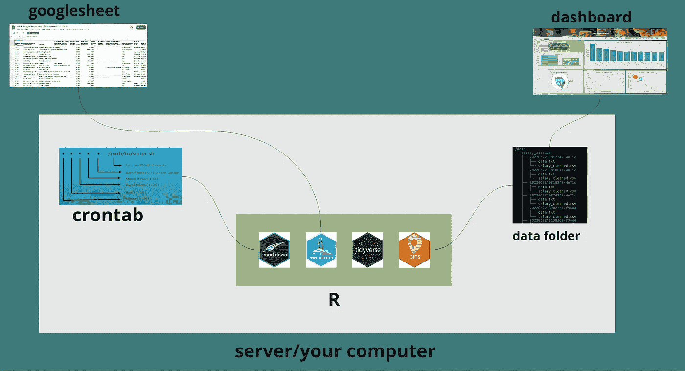
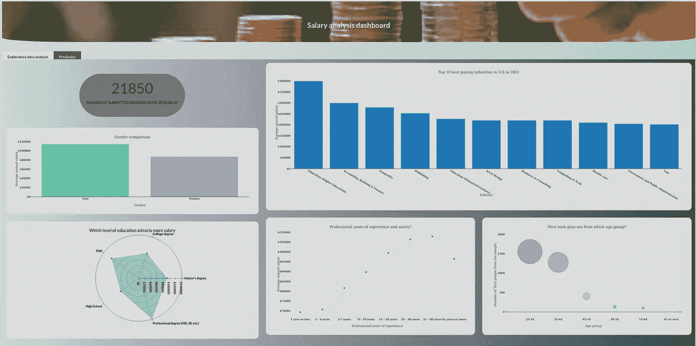

# 自动化您的 R -E.T.L 工作流程:场景 1

> 原文：<https://blog.devgenius.io/automating-your-r-e-t-l-workflow-scenario-1-6c5cfc788878?source=collection_archive---------5----------------------->



你的 ETL 管道看起来有不同的方式，这很大程度上取决于你如何访问你的数据，处理它和使用它。在本文中，我将处理一个场景，从 googlesheet 中获取数据，在 rmarkdown 脚本中处理，并在闪亮的仪表板上使用。

在这种情况下，数据预处理脚本和闪亮的应用程序脚本都可以访问数据文件夹。因此，markdown 脚本对数据进行预处理，并将整齐的数据输出到数据文件夹中，另一端闪亮的应用程序接收整齐的数据。

我一直在研究这些数据，并撰写了相关文章。这是一项正在进行的薪资调查，数据被收集到谷歌工作表中，提交是自发完成的。考虑一下我之前关于数据的文章。
在讨论数据和开发用于分析的仪表板后，我想到了一种用最新提交的数据更新仪表板的方法，而不必手动运行 rmarkdown 脚本。

## 输入 cron 作业！

cron 作业是一个 unix(linux/mac)系统实用程序，可用于自动执行重复性作业。我假设你对此有想法，如果没有，我想你可能需要考虑从[这篇](https://linuxhandbook.com/crontab/)文章中学习一些基础知识。

***注意:这在 linux/mac 设置下有效，为 windows 考虑任务调度器。***

鉴于数据提交是自发完成的，我们可以设置一个 cron 作业，根据您的用例每小时、每天、每周、每月等运行 rmarkdown 脚本。
使用情形因环境而异，例如，我们可能会遇到数据以分钟/秒、每天甚至每月的速度流入的情况。因此，您将编写一个 cron 作业，根据数据提交的频率更新您的数据。

***注意:有 R 个包用于调度 cron 作业***[***cronR***](https://github.com/bnosac/cronR)***对于 Unix 和***[***task scheduler***](https://github.com/bnosac/taskscheduleR)***对于 windows，如果你希望它简单的话:)也就是说，至于我，我选择做脚本。***

## 调度 Cron 作业

运行以下命令打开一个 crontab

```
$ crontab -e
```

将会打开一个脚本，然后在脚本中输入下面一行并保存。

```
* * * * * Rscript -e "rmarkdown::render('~/path/to/your/script.Rmd')"
```

*注意:一定要记得相应地编辑 rmarkdown 脚本的路径。*

上面的 cron 作业将每分钟运行一次，您可以对其进行编辑，以便按照您希望脚本执行的方式运行。

## 从 googlesheets4 访问数据

使用 [googlesheets4](https://github.com/tidyverse/googlesheets4) 包，我们可以使用 url 从 googlesheets 获取数据。
您将需要使用 gs4_deauth()函数停用认证，这样我们就不会在每次脚本获取数据时被提示输入访问令牌。
请记住，我们的目的是自动化整个数据导入流程，从争论到可视化/存储，因此无需认证。

```
gs4_deauth() # this deactivates authentication. We won't be prompted to login using credentials.salary_data <- read_sheet("[https://docs.google.com/spreadsheets/d/1IPS5dBSGtwYVbjsfbaMCYIWnOuRmJcbequohNxCyGVw/edit?resourcekey#gid=1625408792](https://docs.google.com/spreadsheets/d/1IPS5dBSGtwYVbjsfbaMCYIWnOuRmJcbequohNxCyGVw/edit?resourcekey#gid=1625408792)")
salary_data <- data.table::setDT(salary_data)
```

## 数据争论

此时，我们已经有了 R 中的数据，现在我们可以根据需要对其进行讨论。
这个库在这个时候会派上用场。有了它，我们可以根据需要访问用于清理和转换数据的功能，这样我们就可以有一个整洁的数据作为输出，例如可以导入到一个闪亮的应用程序中或用于建模。
数据清洗。回购协议上的 Rmd 文件有所有的清理和转换步骤。

```
# change the columns name - observe the naming syntax for headers/columns
 names(salary_data) <- c("Timestamp","age","industry","job_title","job_title_context","annual_salary",
                         "Other_monetary_comp","currency","currency_other",
                         "income_context","country","state","city","professional_experience_years","field_experience_years",
                         "highest_edu_level","gender","race")

# College degree and Some college kinda means the same. Let us just categorize them into one (College degree). 
salary_data$highest_edu_level <- gsub("Some college","College degree",salary_data$highest_edu_level)# replace the variants of United states with one name.  
salary_data$country <- stri_replace_all_regex(salary_data$country,
                                  pattern=c('US', 'USA', 'usa',"U.S.","us","Usa","United States of America","united states",
                                            "U.S>","U.S.A","U.S.A.","united states of america","Us","The United States",
                                            "United State of America","United Stated","u.s.","UNITED STATES","united States","USA-- Virgin Islands",
                                            "United Statws","U.S","Unites States","U. S.","United Sates","United States of American","Uniited States",
                                            "Worldwide (based in US but short term trips aroudn the world)","United Sates of America",
                                            "Unted States","United Statesp","United Stattes","United Statea","United Statees","UNited States","Uniyed states",
                                            "Uniyes States","United States of Americas","US of A","United States of america","U.SA","United Status","U.s.",
                                            "U.s.a.","USS","Uniteed States","United Stares","Unites states","Unite States","The US","United states of America",
                                            "For the United States government, but posted overseas","UnitedStates","United statew","United Statues",
                                            "Untied States","USA (company is based in a US territory, I work remote)","Unitied States","Unitied States",
                                            "USAB","United Sttes","united stated","United States Of America","Uniter Statez","U. S","USA tomorrow",
                                            "United Stateds","US govt employee overseas, country withheld","Unitef Stated","United STates","USaa",
                                            "uSA","america","United y","uS","USD","United Statss","UsA","United  States","United States is America",
                                            "United states of United States","United StatesD","United States- Puerto Rico","United Statesaa","United Statest",
                                            "United States govt employee overseas, country withheld","United StatesA tomorrow","United StatesAB",
                                            "United StatesA (company is based in a United States territory, I work remote)","United StatesS",
                                            "United Statesa.","RUnited Statessia","United States of A","United StatesA-- Virgin Islands","United StatesA.",
                                            "United State","United states","United StatesA","United Statess","United StatessA","United States",
                                            "United Statessmerica","United StatUnited Statess","Canada and United StatessA","United States"),
                                  replacement="United States",
                                  vectorize=FALSE)

# use gsub to remove the A from states. 
salary_data$country <- gsub("United StatesA","United States",salary_data$country)# do the grouping and count the records by the country column 
percentage.count <- salary_data[,.(totalcount=.N,country)][,.(count=.N,totalcount,country),by=.(country)][,.(percentage=round(count/totalcount*100)),by=.(count,country)] %>% unique()salary_data_US <- salary_data[country %like% "United States",]# for column currency replace other with USD where currency_other == USD
# data.table approach to replacing values in a column based on a condition in another column.salary_data_US <- salary_data_US[currency_other %in% c("USD","American Dollars","US Dollar"), currency := "USD"]# There are alternative approaches to this, like using case_when with mutate or if_else with mutate. 
# You could explore such options just to have the knowledge of the alternatives.salary_data_US <- salary_data_US[currency == "USD",]# if you wanna check if the currency is USD only you could do uncomment and run the following lines of code.  
#unique(salary_data_US$currency)# convert annual_salary to numerical data type. 
salary_data_US$annual_salary <- gsub(",","",salary_data_US$annual_salary)
salary_data_US$annual_salary <- as.numeric(salary_data_US$annual_salary)# we have some values which are null. we drop them  
salary_data_US <- salary_data_US[ highest_edu_level !="",]# remove the NA
salary_data_US <- salary_data_US[!is.na(annual_salary),]# for the gender variable, let us only pick the male and female groupings 
salary_data_US <- salary_data_US[gender %in% c("Man","Woman")]
salary_data_US$gender <- as.factor(salary_data_US$gender)# subset the dataset 
salary_data_US <- salary_data_US[,c("age","annual_salary","professional_experience_years","highest_edu_level","gender","industry","job_title")]
```

## 数据存储/版本控制

一旦我们有了整齐的数据格式，我们就可以使用[引脚](https://pins.rstudio.com/)包来存储和版本化它。
您可能想知道我们为什么要对数据进行版本控制，想象一下这样一个场景，您想要回滚到数据的某个状态，那么 pins 包将是您的首选，因为有了它，您可以对数据进行版本控制，因此您可以根据情况选择获取特定的版本。但是默认情况下，最新的版本是获取的版本。

```
# create a board
board <- board_folder("./data",versioned = TRUE)board %>% pin_write(salary_data_US,"salary_cleaned", type="csv")
```

## 使用数据

干净的数据可以通过闪亮的仪表板获取，存储在数据库中以备将来使用，甚至进一步用于建模。
对于这种情况，我们有一个访问数据的仪表板。



薪金分析仪表板

如果您想体验一下工作流程，可以点击[此处](https://github.com/oyogo/ETL_pipeline)访问回购。

## 下一篇！

我正在处理 R — ETL 管道的场景 2，在这个场景中，我们有一个数据提交平台(R Shiny app ),当数据提交到服务器时，它触发一个 bash 脚本，该脚本反过来运行管道，然后分析仪表板使用 tidy 数据。

参考资料:

1.  [自动调查报告](https://www.rstudio.com/blog/automated-survey-reporting/)