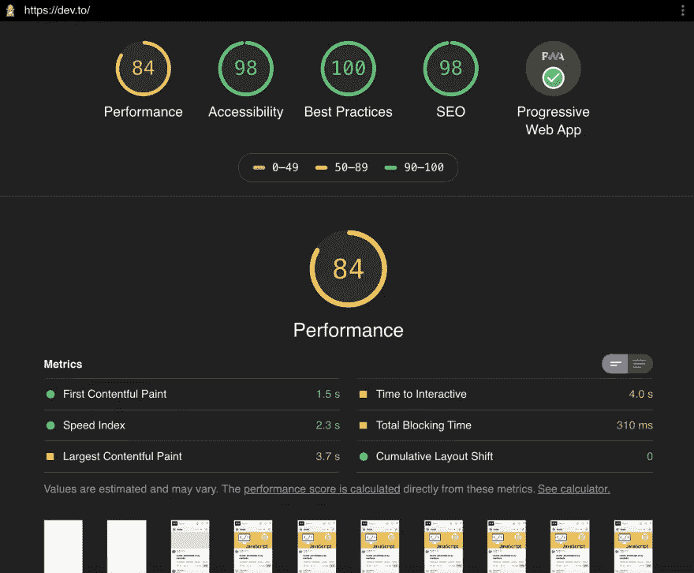

# Web 性能自动化—各种风格灯塔

> 原文：<https://blog.devgenius.io/automation-for-web-performance-all-flavours-lighthouse-3d90eabfdafa?source=collection_archive---------25----------------------->


Google Lighthouse 是一个令人惊叹的工具，它改变了我们看待网络性能的方式，现在指引我们努力改进它。让我们展示一下自动化审计和收集多种格式的数据是多么容易！

# Web 性能一瞥🚄

在过去的四到五年里，**网络性能**已经成为整个互联网行业讨论和创新的一个巨大话题。对于任何人来说，能够简单地定义聚集在这个术语下的组件都是非常方便的，但事实并非如此。

在一个非常高的层次上，我们可以列出几个**已经明确的**面向网络的:

*   作为主机平台的浏览器内部工作方式
*   数据有效载荷
*   用户界面/用户体验

我脑海中很容易出现的三个项目，是值得大量信息、细节和技术爱好的主题。不过好的一面是，我们不需要消化所有的信息来在我们自己的项目环境中改进它们。

# 灯塔

仅仅一撮理解就足够了，这里就是[灯塔](https://developers.google.com/web/tools/lighthouse)出现的地方。


Lighthouse 是一款帮助技术专家审计、监控和提高网页整体质量的工具，在 Google Chrome 旗下开源。如果你还不知道，它已经包含在你的 Chrome 和 Edge 浏览器中了。如果你还不知道如何运行它的一些细节。
*灯塔标签在* [*镀铬*](https://developers.google.com/web/tools/lighthouse#devtools) *，灯塔标签在* [*边缘*](https://docs.microsoft.com/en-us/microsoft-edge/devtools-guide-chromium/whats-new/2020/03/devtools#the-audits-panel-is-now-the-lighthouse-panel) *。*

**【总体】**对于软件专家来说，听起来可能有些厚脸皮和软弱。令他们惊讶的是，至少在我看来,《灯塔计划》是一个已经、正在并将继续改善网络质量的项目，因为我们在许多方面都体验到了它。默认情况下，它包括以下建议:

*   表演
*   渐进式网络应用
*   最佳实践
*   易接近
*   搜索引擎优化

来自整个技术社区的许多人的巨大工程努力，使这个工具成为一个发电站，并且无可争议地成为性能监控的“首选”。

> 如果我是你，我会马上探索这些类别和功能，投资回报是巨大的！

当你从工具的神奇中恢复过来后…🤯

让我告诉您，Lighthouse 生成的整个报告，以及粒度性能指标和更多数据，可以使用一个命令自动检索，或者在更复杂的情况下，只需几行 JavaScript 代码。

**现在就行动！**

# 灯塔单线🛤

如果您希望运行 Lighthouse 的特定页面或页面集对所有**的**有效，请遵循以下标准:

-可公开访问
-不区分已知和匿名用户
-不需要以前的应用程序状态

然后你可以只使用 [lighthouse-cli](https://github.com/GoogleChrome/lighthouse#using-the-node-cli) 或者使用[Google page speed Insights](https://developers.google.com/speed/pagespeed/insights/?hl=en)(*在内部使用 light house*)，你不需要任何额外的东西。

您可以遵循一个简单的设置，从一个裸 Node.js 项目开始，使用命令行界面提供一个单独的位置来运行和存储您的 Lighthouse 报告。

在您的命令行中，让我们为手头的任务构建一个新项目:

```
mkdir auto-lighthouse
cd auto-lighthouse
npm init -y
```

搭建好项目之后，接下来是安装所需的库:

```
npm install lighthouse
```

只有安装了 Lighthouse npm 模块，您现在才能运行:

```
npx lighthouse [https://dev.to](https://dev.to)
```

现在发生的是，你会看到一个谷歌 Chrome 实例在你的机器上启动，自动导航到提供的 URL，做一些魔法🧙‍♂️，最后在项目文件夹中生成一个文件。生成的文件是一个 HTML 文件，其名称结构如下:
**【SUPPLIED _ URL } { DATE }**

在你选择的浏览器中打开这个文件。在那里，你有一份惊人的报告要在你的团队中分发，以揭示他们的*无能*🤣



*特别提示:如果您想保存文件，但又想在浏览器中自动打开报告，您可以使用* `*--view*` *选项运行 cli 命令。*

***如果你想知道为什么你的报告显示设备字段为“仿真 Moto G4”，你不是唯一一个感到困惑的人。监控兔子洞* [*这里*](https://github.com/GoogleChrome/lighthouse/issues?q=is%3Aissue+mobile+emulation) 🐰

# 为您量身定制的更进一步👔

既然你走到了这一步，你要么对我们的精彩内容感兴趣，要么你想让你的灯塔报告自动化的情况有点复杂，例如…

*   用户需要通过身份验证才能看到目标页面
*   必须有一些浏览器/应用程序状态被初始化

*嗯…*
*我们无法使用 lighthouse cli 在浏览器中预烤状态…*
*我们无法在不进行登录操作的情况下安全地认证用户至少…*

**那么我们将如何应对这些情况呢？🤔**

当然，我们可以使用我们最喜欢的 Node.js 浏览器自动化库，**木偶师或剧作家**。使用这些库，我们将能够编排达到正确的应用程序状态所需的步骤，然后运行 Lighthouse。

# 现在是代码👨‍💻

* *我相信你渴望进入代码，这就是我们要做的。但是随着我们的进展，我会尽我所能来解释在试图完成这个过程时看起来不清楚的地方(至少对我来说)。*

首先，你应该继续安装额外的 npm 包，我们将需要使这个工作。出于演示的目的，我们将安装[木偶操纵者](https://www.thehomeofwebautomation.com/getting-started-puppeteer/)。

```
npm install puppeteer
```

接下来，使用以下上下文创建一个名为 *index.js* 的新文件:

```
const puppeteer = require("puppeteer");
const lighthouse = require("lighthouse");(async function(){
  const url = "https://dev.to"; /* Random */
  const PORT = 9222; /* Not arbitrary, the default Lighthouse would look for if not specified in options */ const browser = await puppeteer.launch({
    args: [`--remote-debugging-port=${PORT}`], /* Expose this so we can use it below */
  }); const lighthouseOpts = {
    port: PORT,
    disableStorageReset: true /* For the custom steps we will show later */
    logLevel: 'info', /* To observe the good stuff */
  }; /* Run Lighthouse, using the options specified */
  const lighthouseResult = await lighthouse(url, lighthouseOpts);
  console.log(lighthouseResult.lhr) /* Inspect the "lhr" (lighthouse report) property in the console */ /* Kill the browser 🔪 */
  await browser.close()
})();
```

> *可能你想到的第一个问题是:* ***我们为什么要用这个*远程调试端口*的东西？***

Lighthouse 的编程能力之一是，它可以通过使用浏览器正在使用的端口将[连接到现有的浏览器实例。](https://github.com/GoogleChrome/lighthouse/blob/master/lighthouse-core/gather/connections/cri.js#L24)

如果您现在运行该脚本，它将具有与 CLI 版本完全相同的行为，但是它不会在您的目录中产生新的 HTML 报告，相反，它只会记录控制台上的 *lhr* 属性。

# 添加自定义步骤🔧

正如你可能已经怀疑的那样，有一个地方可以放入额外的逻辑，以便将应用程序驱动到你需要的状态。

```
const browser = await puppeteer.launch({/*...*/});/*
 * Additional Web Automation logic
 * await authenticate(browser, ...args);
 * await fillEphemeralStorage(browser, ...args);
 * ...
 */const lighthouseOpts = { /*...*/ };
```

您将使用的函数示例:

```
async function authenticate(browser, signinUrl){
  const page = await browser.newPage();
  await page.goto(signinUrl); const emailInput = await page.$("input[type=email]");
  await emailInput.type("admin@admin.com");
  await page.click("button[id=go]");
  await page.waitForNavigation(); await page.close();
}
```

诸如此类的函数将导致特定于您的应用程序需求的状态，但请记住，它可能与以下内容有关:

-浏览器存储的凭证(*cookie*)🍪
-本地浏览器状态(*索引数据库、本地存储等*)🏦
-短命 app 特定条件👻

完成设置功能后，可以调用 Lighthouse 在目标 URL 上运行。

# 一个重要的灯塔参数🚦

由于 Lighthouse 的内部工作方式、要收集的指标和收集的启发式方法，每次请求审计时，都会打开一个新页面，但会清理掉**浏览器存储的**，除非另有说明。为了从一张*干净的“石板”*开始，这是可以理解的。你可以在这里看到这个过程[的代码。](https://github.com/GoogleChrome/lighthouse/blob/91b4461c214c0e05d318ec96f6585dcca52a51cc/lighthouse-core/gather/driver.js#L1457)

为了确保我们的设置不会被 Lighthouse 重置，我们传递了参数

```
disableStorageReset: true
```

现在我们的设置是安全的！

# 处理报告📈

目前，我们在报告中所做的唯一处理是在控制台中将其注销。**没那么得心应手！**

对我们有利的是，Lighthouse API 公开了一种方法，通过提供收集的数据和我们希望生成报告的格式，我们可以生成一个完整的报告。

```
/* ... */
const { generateReport } = require("lighthouse/lighthouse-core/report/report-generator");
const fs = require("fs");
/* ... */
const { lhr } = await lighthouse(url, lighthouseOpts);
fs.writeFileSync("./report.json", generateReport(lhr, "json") );
```

我们在这里所做的是演示如何使用`generateReport`函数创建一个 *JSON* 格式的新报告，并将其放入当前目录中一个名为 *report.json* 的新文件中。

** generate report 函数可以用来输出****JSON****，****CSV****和****HTML****格式。*

如果你打开这个文件，你可以看到所有的网络质量指标。您很有可能不知道 Lighthouse 收集和报告了多少信息🎉

**安排脚本在您管理的所有网站上运行，一切就绪！**

# 关闭🎗

谢谢你又看了一遍食谱。我希望你有更多的弹药来说服你的项目领导，自动化灯塔审计可以给你带来更多的好处。我的建议是请一天假，看看并研究所有报告的指标。时间花得值！

在您的团队/组织内传播报告和专业见解，以推动更好的变化，使最终用户受益。在不久的将来，我们将会看到更多关于 web 自动化和性能监控的东西。到时候见！

*转贴自*[*Web 自动化之家*](https://www.thehomeofwebautomation.com/foot-in-the-door/)