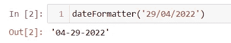
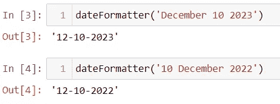
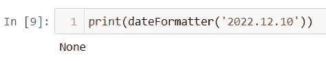
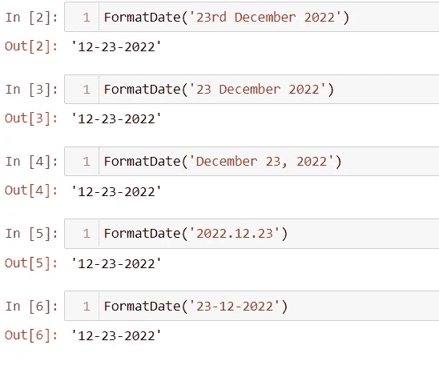

# 自动化很容易——使用 python dateutil 包:AIE3 将自由文本转换为日期格式

> 原文：<https://blog.devgenius.io/automation-is-easy-convert-free-text-to-date-format-using-python-dateutil-package-aie3-8cf199814580?source=collection_archive---------10----------------------->

T 他的是**自动化易**系列的**第三**篇。本系列旨在作为您探索各种工具/技术来自动化枯燥的日常业务活动的第一点。

[*点击此处查看本系列*](https://nagarajsvaidya.medium.com/) 往期文章。

在自动化过程中，您是否遇到过这样的情况:您有一条与**日期**相关的数据，它更像是一个**自由文本**，您必须在输入到另一个应用程序之前将其转换成标准格式？在清理将**自由文本作为日期列**的数据时，您肯定会遇到这样的用例！
让我们了解如何使用 **python** 以各种方式将其转换成任何标准日期格式，以及使用 python 的 **dateutil** 包实现这一点的有效方式。

# 📖介绍

假设您已经从 PDF 表单或发票中提取了字段值，如我们在[之前的文章](/automation-is-easy-how-to-use-pypdf2-package-in-python-9133bb3ab42a)中所讨论的，其中一个提取的数据片段与**日期**相关，这更像是一个自由文本字段，即用户输入日期的方式因 PDF 表单或发票而异。例如
29–04–2022
04/29/2022
2022 . 04 . 29
2022 年 4 月 29 日
或者可以是任何格式，用任何符号作为以任何顺序输入的日、月和年之间的分隔符。我们如何使用 python 清理并转换成特定的格式呢？让我们一起探索吧！

# 📙传统方式—方法 1

在传统的方法中，我们可以通过定义输入可能的日期格式的所有可能组合来处理这一点，循环遍历这些格式中的每一种，以识别正确的匹配格式，然后将其从匹配格式转换为所需的格式。所有这些都可以使用 python 的基本 **datetime** 包来完成。让我们用代码来理解这种方法—

在上面的代码片段中，我们用一个输入参数定义了一个名为`**dateFromatter**` 的函数。

**第 3 行** —导入 python 的 datetime 包。*为了理解本文中的功能，我们将包导入到函数中。但是强烈建议在模块或脚本级别导入包*。
**第 6 行—** 我们在一个列表中定义输入日期格式的所有可能组合。让我们以 2022 年 4 月 29 日为日期来理解这一行中提到的各种解释。
➡ **%B** 表示月份为**四月。** ➡ **%b** 指月份为 **Apr** 。
➡ **%d** 表示日，即 29
➡ **%m** 表示月为 04。
➡ **%y** 指的是 22 年。
➡ **%Y** 指的是 2022 年
还有其他代码以各种方式解释日期、时间。如果你想学习日期&时间解释的其他代码，这里是[备忘单](https://strftime.org/)。
**第 7 行—** 我们在这些格式中循环查找与我们的输入相匹配的格式。
**第 10 行—** 函数`**strptime(string,format)**` 将**输入的字符串转换为日期对象。**该功能在`**datetime**`类中可用。
**第 11 行—** 函数`**strftime(format)**` 按照定义的格式对日期对象进行格式化。在本例中，我们尝试将输出格式化为 **MM-DD-YYYY** ，即本文上下文中的 04–29–2022。
**第 14 行** —通过尝试列表中所有已定义的格式来保持循环。

让我们通过传递`**29/04/2022**` 作为输入来调用这个函数。预期产量是`**04–29–2022**`

上述 **dateFormatter** 函数的输出

现在，让我们尝试几种不同的输入日期格式。输出格式应该是 **MM-DD-YYYY。**

上述 **dateFormatter** 函数的输出

现在，让我们将输入作为 **2022.12.10 传递。**我们从上面定义的`**dateFormatter()**` 函数中得到什么响应？

输入 2022.12.10 的上述**数据格式器**函数的输出

为什么我们没有得到预期的结果？为什么函数返回 **None？**这是因为，上面代码片段的**行 6** 中的 **POSSIBLE_DATE_FORMATS** 没有与输入匹配的格式。在这里，我们无法感知输入的日期格式。
我们可以通过将`**'%Y.%m.%d'**` 添加到第**行第 6** 行的列表中来解决这个问题，以获得预期的输出。

但在现实中，这是一个可行的方法吗？如果用户输入的输入日期格式是像`**23rd February 2022**` 这种自由文本的**开箱即用的**怎么办？我们如何处理这种情况？
使用 python 的 **dateutil** 包有一个更有效的方法来处理这个问题。现在让我们来理解这种方法。

# 📗使用 dateutil 包—方法 2

**dateutil** 模块为标准 datetime 模块提供了强大的扩展，在 **Python** 中可用。

## 装置

这个包可以使用 pip 从 PyPI 安装。运行此命令-

在上面的代码片段中，我们用一个输入参数定义了一个名为`**FormatDate**` 的函数。
**第 3 行—** 从 **dateutil** 包中导入**解析器**模块。*这个模块提供了一个通用的日期/时间字符串解析器，它能够解析* ***最常见的格式*** *来表示日期和/或时间。我们不需要像在第一种方法中那样指定可能的日期格式列表。*
**第 5 行—** 解析输入字符串创建日期时间对象。
**第 7 行** —将日期时间对象格式化为所需格式。在这段代码中，我们将日期格式化为 **MM-DD-YYYY** ，就像我们在第一种方法中所做的那样。

让我们通过传递不同格式的数据来检查这个函数，包括那些在第一种方法中无法获取输出的数据。我们期望得到 **MM-DD-YYYY** 格式的输出。

上述 **FormatDate()** 函数的输出

因此通过使用 **dateutil** 包的**解析器**模块帮助我们-
1。减少了逻辑实现的时间。
2。消除了明确提及输入日期格式的需要。

# 👢包扎

我们**讨论了两种将自由文本日期格式转换成标准格式的方法**。

在**传统方法**中，我们通过定义输入可能的日期格式列表来实现这一点，但更容易实时出错，因为如果没有找到合适的匹配，就需要不断更新格式列表。

在**第二种方法**中，我们看到更有效的方法是使用 python 的 **dateutil** 包，它为 Python 中可用的标准 **datetime** 模块提供了强大的扩展。使用这个包的**解析器**模块，我们可以将任何更像自由文本格式的数据转换成需要的格式**，而不需要事先猜测**输入的格式。

# 感谢阅读❤️继续分享📚

> ***# automationis easy***