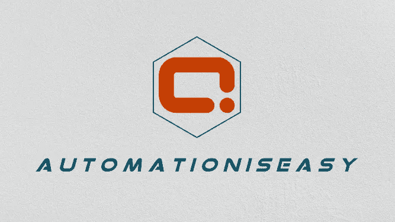

# 自动化很容易——如何在 Python 中使用 PyPDF2 包

> 原文：<https://blog.devgenius.io/automation-is-easy-how-to-use-pypdf2-package-in-python-9133bb3ab42a?source=collection_archive---------7----------------------->



自动化变得容易了

T 这是**自动化易**系列的**第一篇**文章。本系列旨在帮助指导那些想要自动化日常业务活动的人，这些日常业务活动是枯燥的，是您探索各种工具/技术的第一点。

在这里我们要了解如何在 windows 操作系统中使用 Python 的 PyPDF2 包来自动化 PDF 的基本活动。

## 📖介绍

在 1990 年的 *中，Adobe 定义了一个****P****or table****D****document****F****format(PDF)的结构，其目的是为参与通信过程的双方——创作者、作者或发送者——传输看起来完全相同的数据/文档如今，PDF 文档是最常用的数据格式之一。*

*为了处理 PDF，python 中有很多库，****pyPdf F2****就是这样一个库，它是一个纯 python 的 PDF 工具包，源于 Mathiew Fenniak 编写的****pyPdf****项目，于 2005 年发布。这是 python 的旧库之一，任何人都可以轻松开始他们的 PDF 自动化之旅。*

*PyPDF2 有以下类:*

*   *PdfFileReader 类*
*   *PdfFileWriter 类*
*   *PdfFileMerger 类*
*   *页面对象类*
*   *文档信息类*
*   *xmpin information 类*
*   *目的地类别*
*   *矩形对象类*
*   *字段类*

*在本文中，我们将了解上述列表中的前三个类，即 PdfReader、PdfWriter、PdfMerger 类，因为这三个类可以处理大多数 PDF 活动。*

## 🔖安装 PyPDF2

*要开始在 python 中自动化 PDF，第一步是通过在 windows 命令提示符下运行以下命令来安装 python 的 PyPDF2 包——假设您有 pip。*

```
**python -m pip install pypdf2**
```

## 📙**了解 PdfFileReader 类**

*PdfFileReader 类主要用于读取 PDF，有很多方法，这里只解释几个常用的方法-*

*在上面的代码片段中，*

***第 1 行*** *—第一步是* ***从 PyPDF2 包中导入****PdfFileReader 类。*

***第 3 行*** *—变量* ***【文件】*** *用 pdf 文件定义路径。绝对文件路径也可以像****r ' c:\ Users \ Automation Anywhere \ invoice 01 . pdf '一样使用。***

***第 5 行*** *—在****read-binary****模式下打开 pdf 文件。*

***第 6 行*** *—创建* `***PdfFileReader()***` *对象。*

***第 8–9 行*** *—* `***decrypt(pwd)***` *方法以密码为参数，如果* `***isEncrypted***` *方法的布尔输出为真，则对 PDF 进行解密。*

***第 13 -14 行*** *—* `**getNumPages()**` *方法打印 pdf 的总页数。*

***第 17 -18 行*** *—* `**getDocumentInfo()**` *方法检索 PDF 文件的文档信息字典，如果它存在的话。通过此方法可以访问的常见属性有
作者
制作者
创建者
创建日期—可以通过* `**documentInfo[‘/CreationDate’]**` *访问修改日期—可以通过* `**documentInfo[‘/ModifiedDate’]**`访问

***第 22 行*** *—* `**getPage(pageNumber)**` *方法按页码检索一页。*

***第 23 行****—*`**extractText()**`****page object 类*** *的方法用于从 pdf 页面中提取文本。**

## *📙了解 PdfFileWriter 类*

**PdfFileWriter 类主要用于创建/修改 PDF。在这个类的众多可用方法中，我们将看看常用的 addPage()和 write()方法。**

**下面的代码片段解释了基于页码的* ***分割****PDF。同样也可以服务于* ***从现有的 PDF 中复制*** *某个特定的文件/页面并另存为* ***新的*** *一个！**

****注****:python 中的索引从 0 开始。这意味着，第 1 页的索引为 0。**

**简单来说，分割 PDF 的流程如下-
🅐加载现有的 PDF 文件。
🅑正在从这个 PDF 文件中获取特定的一页。
🅒将此页面添加到 PDF writer 对象。
🅓在此 PDF writer 中创建新的 pdf 文件(加密或未加密)。**

**在上面的代码片段中，**

****第 1 行*** *—第一步是* ***从 PyPDF2 包中导入****PdfFileReader 类和 PdfFileWriter 类。**

****第 3 行****——****变量【文件】*** *用 pdf 文件定义路径。绝对文件路径也可以像****r ' c:\ Users \ Automation Is Easy \ invoice 01 . pdf '一样使用。****

****第 6 行& 9*** *—创建 PdfReader 和 PdfWriter 对象。**

****第 12 行****—*`**addPage(Page Obj)**`*PdfFileWriter 类的方法将特定页面添加到 Writer 对象中。除非创建新的 PdfFileWriter 对象，否则添加另一个页面将会覆盖以前添加的页面。如果您需要添加多个页面，请循环查看页码列表，并使用*`**addPage(Page Obj)**`**方法。***

*****第 15 行&第 16 行*** *—使用* `**encrypt(pwd)**` *方法用密码加密输出文件。如果不想加密输出文件，请跳过这两行。***

*****第 19 行*** *—在****write-binary****模式下打开一个名为‘new _ file . PDF’的新 PDF 文件。***

*****第 20 行****—*`**write(stream)**`**将添加到此对象的页面集合以 PDF 文件的形式输出。****

## **📙合并多个 pdf**

***在了解了 PdfFileReader 和 PdfFileWriter 类之后，让我们了解一下如何组合使用它们来合并多个文件。
注意:这段代码类似于我们在上面* ***理解 PdfFileWriter 类*** *主题中看到的代码。***

***在上面的代码片段中，***

*****第 4 行*** *—定义需要合并的 PDF 文件列表。***

*****第 9-14 行*** *—循环遍历上述列表中的每个文件，将每个 PDF 加载到* `***PdfFileReader***` *对象，通过*`***getPage(PageNumber)***`**方法将每个页面添加到***对象。*****

*****第 17 行*******-18****—将添加到 PdfWriter 对象的页面集合作为新的 PDF 文件写出，文件名为“Merged_file.pdf”。****

## **📗合并多个 pdf—***pdf 文件合并类*****

***PyPDF2 有* ***PdfFileMerger 类*** *，这使得合并动作比上面的方法更简单。这个类本身就足以合并 pdf，无需使用其他两个类— PdfFileReader 和 PdfFileWriter。现在让我们来看看这种方法——***

***在上面的代码片段中，*`**append(file obj)**`*****PdfFileMerger 类*** *的方法用于在输出文件的末尾追加每个文件。*****

***同样，也可以使用* ***PdfFileMerger 类*** *的* `**merge(position, fileObject)**` *方法，将给定文件中的页面合并到指定页码的输出文件中。***

***至此，我们看到了如何使用 Python 的* ***PyPDF2*** *包来自动化基本的 PDF 操作。还有其他的方法，比如*`**insertBlankPage(page,index)**`**`**rotateClockwise(angle)**`**`**rotateCounterClockwise(angle)**`**，一旦你理解了上面解释的方法，就很容易探索了！********

# ********谢谢❤️的快乐分享📚********

> ******#自动维护简单******