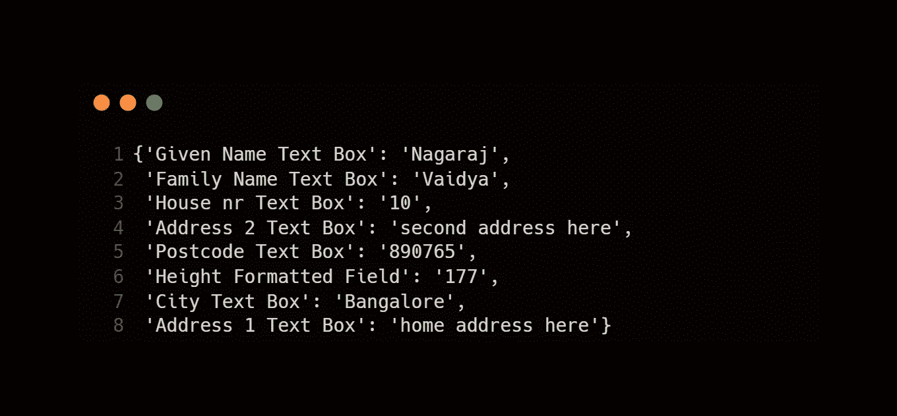
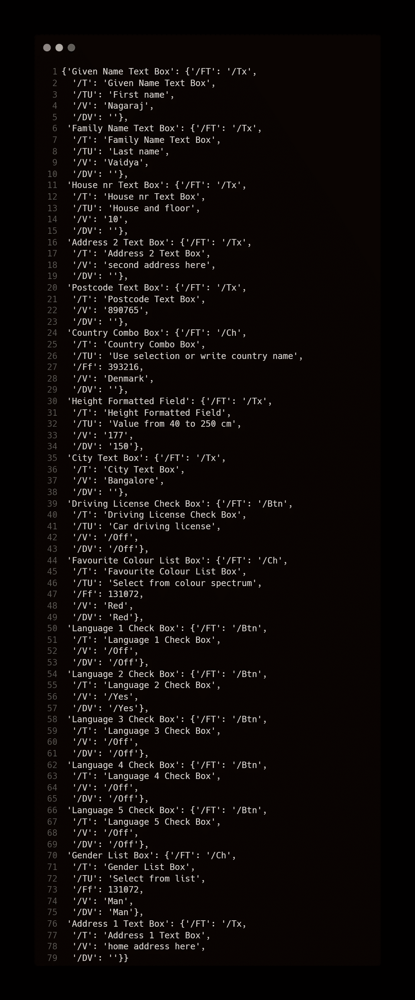

# 自动化很容易—使用 PyPDF2 : AIE2 阅读交互式 PDF

> 原文：<https://blog.devgenius.io/automation-is-easy-reading-interactive-pdf-using-pypdf2-aie2-e26f462e9429?source=collection_archive---------3----------------------->

T *他的是第* ***第二*** *条的* ***自动化很容易*** *系列。本系列旨在帮助/指导那些想要将日常业务活动自动化的人，这些日常业务活动是枯燥乏味的，是您探索各种工具/技术的第一步。*

在我们之前的 [**文章**](/automation-is-easy-how-to-use-pypdf2-package-in-python-9133bb3ab42a) 中，我们探讨了 python 的 PyPDF2 包的各种方法和类。在本文中，让我们了解如何从交互式 PDF 表单中提取数据([下载此处](https://www.slideshare.net/NagarajVaidya2/oopdfformexamplepdf))以及它与`**PyPDF2**`的`**extractText()**`方法有何不同。

本文中使用的带有表单域的 PDF

## 📖介绍

PyPDF2 包的`**extractText()**`方法足以删除 PDF 并提取文本。但是如果 [pdf](https://www.slideshare.net/NagarajVaidya2/oopdfformexamplepdf) 有交互表单域，如果没有表单域的特定锚点，如何从下图所示的`**extractText()**`方法的输出中区分 pdf 数据和表单域数据？(关于如何使用`**extractText()**`方法，请参考[上一篇文章](/automation-is-easy-how-to-use-pypdf2-package-in-python-9133bb3ab42a))

extractText()方法的 pdf 输出

为了解决这个问题，PyPDF2 包的`**PdfFileReader**`类有两个方法

*`***getFormTextFields()***`*→给出带有表单输入字段的输出字典。* `***getFields()***`*→给出带有表单输入、下拉菜单、复选框数据的字典。**

*让我们详细了解一下这两种方法。*

## *📙了解 getFormTextFields()方法*

*在上面的代码片段中，我们在第 1 行**从 PyPDF2 包中导入**类。*

*★改变**线 3** 的 PDF 路径。你也可以使用绝对路径，如**r ' c:\ Users \ Automation is Easy \ your pdf . pdf***

*★ **第 6–8 行** —通过创建`**PdfFileReader**` 类的对象读取 PDF，调用该类的`**getFormTextFields()**` 方法得到作为字典的输出。*

*★在打印如**第 9 行所示的输出时，**输出将如下所示*

**

*给定 pdf 的 getFormTextFields()输出*

*可以解析这个字典，通过传递适当的键值来获取特定的输入字段值，比如—
`***print(pdf_form_fields[‘Family Name Text Box’])***`*

*其输出为—*

**

*`***print(pdf_form_fields[‘Family Name Text Box’])***`的产量*

****🔥注意:*** `***getFormTextFields()***` ***方法只会获取文本输入字段，不会获取下拉框或复选框。****

## *📙了解 getFields()方法*

*在上面的代码片段中，我们在第 1 行**从 PyPDF2 包中导入**类。*

*★变更**线 3** 的 PDF 路径。你也可以使用绝对路径，比如—**r ' c:\ Users \ Automation is Easy \ your pdf . pdf***

*★ **第 6–8 行** —通过创建`**PdfFileReader**` 类对象并调用`**getFields()**` 方法读取 PDF，得到作为字典的输出。*

*★在**线 9** 的输出看起来像这样—*

**

*给定 pdf 的 getFields()输出*

*在这个输出中，我们可以看到与文本字段、下拉框、复选框相关的数据被存储为一个**字典，其属性在一个嵌套字典**中。为 PDF 中每个字段选择或填充的值存储在标签 **'/V '中。***

*为了获取 pdf 中“最喜欢的颜色”字段的值，我们可以通过传递键'**最喜欢的颜色列表框**和 **'/V'** 来解析这个嵌套的字典，以这种方式-
`***print(pdf_form_fields[“Favourite Colour List Box”][‘/V’])***`*

*这将获取如下所示的输出—*

**

*— `***print(pdf_form_fields[“Favourite Colour List Box”][‘/V’])***`的输出*

## *👢包扎*

*因此，除了我们在这里讨论的[和](/automation-is-easy-how-to-use-pypdf2-package-in-python-9133bb3ab42a)专门处理交互式 PDF 的方法之外，我们了解了 PyPDF2 包中的另外两种方法。此外，我们理解了为什么这些方法比`**extractText()**` 方法更好地获取 PDF 表单字段。*

# *感谢阅读❤️继续分享📚*

> ***# automation easy***

**