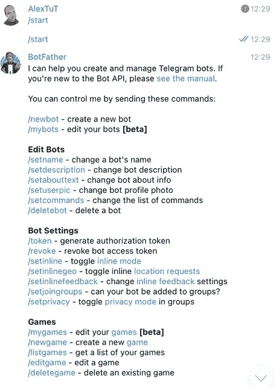
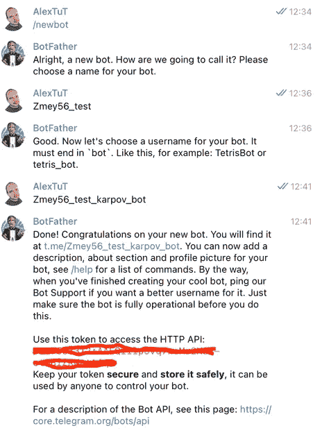
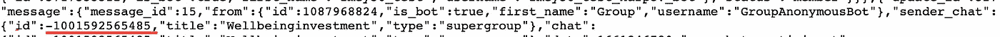
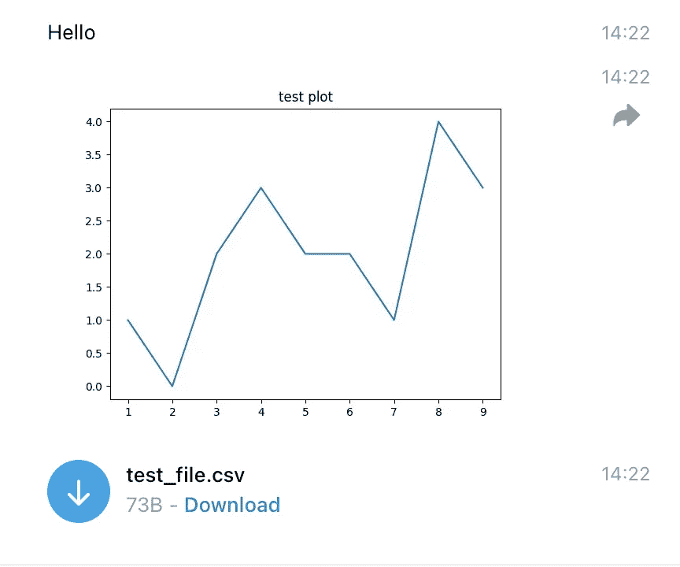
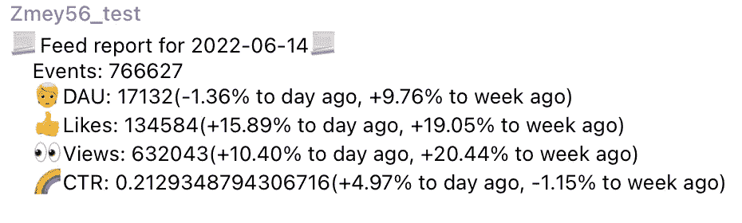
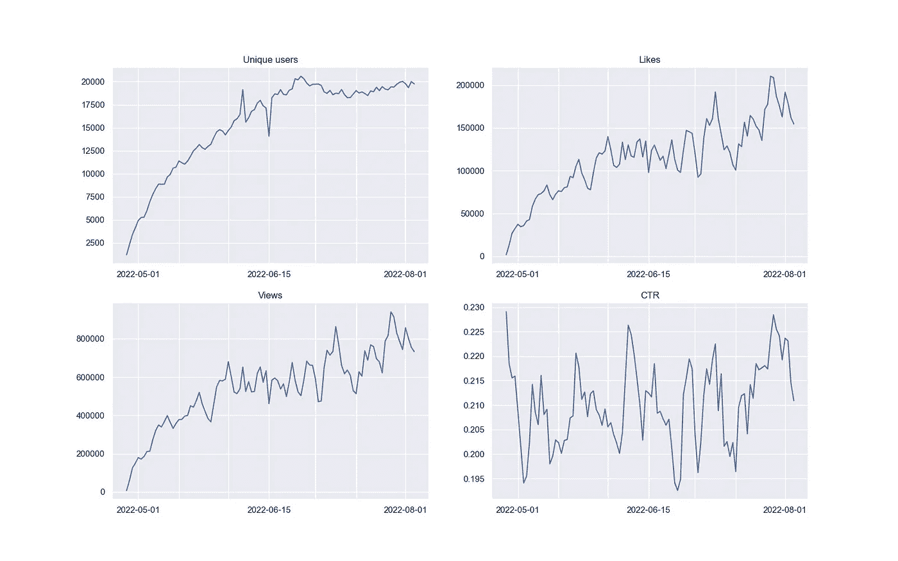
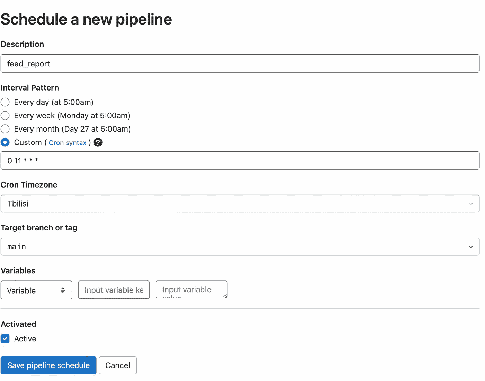

# 报告自动化第 1 部分

> 原文：<https://blog.devgenius.io/automation-of-reporting-2abe7f101801?source=collection_archive---------7----------------------->

我继续发表关于分析的文章:

*   [商业中的数据分析——BI 系统和可视化](/@alex.gladkikh/a-data-analysis-in-business-part-1-7f92c6e919e2)
*   [产品指标分析](/@alex.gladkikh/analyses-of-product-metrics-dd4ec2df8590)
*   [а/B 测试—第 1/3 部分(AA 测试)](/@alex.gladkikh/а-b-tests-part-1-3-aa-test-d4eb7b8b1221)
*   [а/B-试验—第 2/3 部分(AB-试验)](/@alex.gladkikh/а-b-tests-part-2-3-aa-test-9728beaaa709)
*   [A/B 测试—第 3/3 部分(关系指标)](/@alex.gladkikh/a-b-tests-part-3-3-relationship-metrics-882afe43f130)
*   [构建 ETL 管道(气流)](https://medium.com/@alex.gladkikh/building-an-etl-pipeline-airflow-2fd098cd61ae)

在这一系列文章中，我们将讨论基本报告的自动化。我们将在电报中设置报告的自动发送。

如何创建机器人:

1.  首先，让我们使用 [@BotFather 创建自己的电报机器人。](https://t.me/BotFather)
2.  点击开始并发送命令 */newbot。*
3.  接下来，我们将输入未来 bot 的名称(我的 neme — Zmey56_test)。该名称可能不是唯一的，可以更改。
4.  然后输入机器人的昵称。昵称必须以单词“bot”结尾，并且是唯一的。这是无法改变的。

现在，我们需要找到机器人将向其发送信息的 chat_id。需要注意的是，telegram 的配置使得 chat_id 对于个人聊天为正值，对于群组为负值。开始与机器人对话，允许他写私人信息。为此，请遵循链接 t.me / <nickname of="" the="" bot="">并启动 bot。要允许机器人写入聊天/频道，首先在那里添加机器人，并在频道设置中给它发送消息的权限。要获取 chat_id，请使用链接:*https://api.telegram.org/bot<your _ bot token>/get updates。*因此，您将收到以下回复，您可以在其中找到必要的 chat_id:</nickname>

现在让我们开始通过 python 管理 bot。为此，你需要安装**电报**和 **python-telegram-bot** 库。

之后，我们将检查我们的机器人如何工作。

获得访问机器人的权限

发送短信

发送图像

发送文件

值得注意的是，我从提供给我们的数据库中提取数据以形成文件。您可以从其他来源生成数据。

我的小组中的结果:

现在我们直接进入任务。它包括设置每天早上自动发送电报报告。该报告应包含:

*   包含前一天关键指标值(DAU、浏览量、点赞数、点击率)信息的文本
*   包含前 7 天指标值的图表

让我们编写收集报告的主要函数:

执行完这段代码后，我们的小组收到了以下报告:

现在让我们为我们的报告制作图表:

接下来，我将在 feed_report 函数的末尾添加以下代码:

在对我的代码进行测试检查之后，我在我的组中得到下面的图表:

我们将四个图形合并成一个，以便为每个图形排除单独的消息，并且不打扰用户。

对于自动化，这次我们将使用 GitLab CI/CD。最好在官方文档中了解如何使用这个系统。你还需要知道什么是[码头工人](https://www.educative.io/blog/beginners-guide-to-docker)。

为了使我们的机器人的令牌在公共领域不可见，最好隐藏它。

要隐藏 bot 令牌，您需要根据以下算法进行操作:

*   在 GitLab 中，进入设置-> CI/CD ->变量
*   通过指定名称和值来添加秘密变量
*   在代码中，导入 os 库并用字符串 OS . environ . get(" REPORT _ BOT _ TOKEN ")替换 secret 变量的值

之后，将文件上传到我们的存储库，并转到 CI/CD -> Editor，在这里我们按下 Configure pipeline 键。之后，我们将提供一个模板。我们将清理它并创造我们自己的。

我使用课程中的 docker 图像，阶段将是 *init* 和 *run* 。我们把这个作业叫做 *feed_report_job:*

接下来，转到时间表并创建发送报告的时间表。我选择了第比利斯(格鲁吉亚)时间上午 11 点。

之后，您可以通过单击播放(三角形)按钮强制开始，并在您的小组中查看报告。

本文到此结束，在下一部分我们将继续讨论报告的自动化。

我提醒你，我所有的作品你都可以看我的网站:[https://alex.gladkikh.org](https://alex.gladkikh.org)。