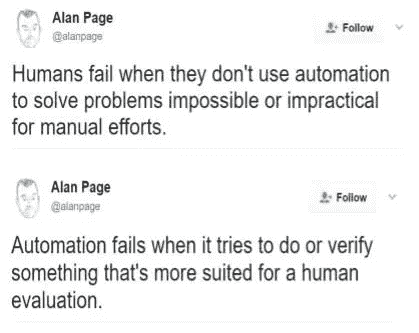

# 自动化与手动测试

> 原文：<https://blog.devgenius.io/automation-vs-manual-testing-8b353001d2b2?source=collection_archive---------3----------------------->

根据作者和顾问 James Bach 的说法，自动化测试不同于“自动手动测试”。它不是一台没有人脑帮助而执行同样任务的计算机。相反，Bach 将测试自动化定义为使用任何工具来辅助测试。

最好避免比较自动化和手工测试，好像它们是互相排斥的。两者都是用来测试软件的。测试人员设计各种自动化测试，用于根据他们想要检查的内容来自动化工作流。根据他们的编程能力，测试人员甚至可以编写他们自己的“内部”自动化代码。

要点是，测试是一个需要人工干预的过程。Bas Dijkstra，一位经验丰富的测试自动化顾问，描述了即使是术语“测试自动化”也是有缺陷的，除非你理解什么是自动化的，什么不是。根据 Dijkstra 的说法，人工执行的测试中实际的“学习、探索和实验”是无法自动化的。他写道:

“我不认为使用‘测试自动化’标签本身是错误的，只要人们意识到什么是自动化的(检查)，什么不是(测试)。测试和检查之间的差异也提供了一个论点，为什么手工测试作为一种活动不会停止存在，至少在可预见的将来不会停止:测试活动不能自动化！”

Alan Page 是一位拥有 20 多年软件测试经验的作者，大部分时间在微软担任各种角色。他从另一个角度阐述了区分自动化测试和手工测试的重要性。在“The A Word”，一本关于自动化的博客文章的电子书汇编中，Page 提到他关于自动化的大部分评论集中在软件测试和开发中自动化的“滥用和误用”上。他对用测试自动化取代手工测试活动持怀疑态度，你可以从他的 Twitter feed 中看到:

# 什么是手工测试？

手动测试是由 QA 分析师手动执行的软件测试。执行它是为了发现正在开发的软件中的错误。

在手动测试中，测试人员检查给定应用程序或软件的所有基本特性。在这个过程中，软件测试人员在没有任何自动化软件测试工具的帮助下执行测试用例并生成测试报告。

这是所有测试类型的经典方法，有助于发现软件系统中的错误。它通常由有经验的测试人员来完成软件测试过程。

# 什么是自动化测试？

在自动化软件测试中，测试人员编写代码/测试脚本来自动化测试执行。测试人员使用适当的自动化工具来开发测试脚本并验证软件。目标是在更短的时间内完成测试执行。

自动化测试完全依赖于预先脚本化的测试，该测试自动运行以将实际结果与预期结果进行比较。这有助于测试人员确定应用程序是否按预期执行。

# 手动测试的利弊

**手工测试的优点:**

*   获得快速准确的视觉反馈
*   它不太贵，因为您不需要在自动化工具和流程上花费预算
*   人类的判断和直觉总是有利于手工元素
*   当测试一个小的变化时，自动化测试将需要编码，这可能是耗时的。虽然您可以即时手动测试。

**手工测试的缺点:**

*   不太可靠的测试方法，因为它是由人进行的。因此，它总是容易出错。
*   手动测试过程不能被记录，所以不能重用手动测试。
*   在这种测试方法中，某些任务难以手动执行，这可能需要软件测试阶段的额外时间。

# 自动化测试的利与弊

**自动化测试的优点:**

*   与人工测试相比，自动化测试可以帮助你发现更多的错误
*   因为测试过程的大部分是自动化的，所以你可以有一个快速有效的过程
*   自动化过程可以被记录。这允许您重用和执行相同类型的测试操作
*   自动化测试是使用软件工具进行的，所以它不像人工测试那样累人和疲劳
*   它可以很容易地提高生产力，因为它提供快速和准确的测试结果
*   自动化测试支持各种应用
*   由于自动化测试工具，测试覆盖率可以增加，即使是最小的单元也不要忘记检查

自动化测试的缺点:

*   没有人的因素，很难洞察 UI 的视觉方面，如颜色、字体、大小、对比度或按钮大小。
*   运行自动化测试的工具可能很昂贵，这可能会增加测试项目的成本。
*   自动化测试工具还不是绝对可靠的。每个自动化工具都有其局限性，这会缩小自动化的范围。
*   调试测试脚本是自动化测试中的另一个主要问题。测试维护成本很高。

# 什么时候我应该使用手工测试还是自动化测试？

**简而言之，手动测试最适合以下领域/场景:**

*   **探索性测试:**这种类型的测试需要测试人员的知识、经验、分析/逻辑技能、创造力和直觉。这个测试的特点是写得很差的规范文档，和/或执行时间很短。在这个场景中，我们需要人类技能来执行测试过程。
*   可用性测试:这是一个你需要衡量软件或产品对最终用户的用户友好性、高效性或便利性的领域。在这里，人的观察是最重要的因素，所以手动方法更可取。
*   **特别测试:**在这个场景中，没有特定的方法。这是一种完全没有计划的测试方法，测试人员的理解和洞察力是唯一重要的因素。

**在以下领域/场景中，自动化测试是首选:**

*   **回归测试:**这里，由于频繁的代码变更和及时运行回归的能力，自动化测试是合适的。
*   **负载测试:**对于负载测试来说，自动化测试也是高效完成测试的最佳方式。通过我们的最佳实践指南了解更多关于负载测试的信息。
*   **重复执行:**需要重复执行任务的测试最好是自动化的。
*   **性能测试:**类似地，需要模拟成千上万并发用户的测试也需要自动化。

对于刚刚推出新网站或新应用程序的公司，我们为您提供了优惠。如果您不确定您的网站/移动应用程序是否安全无故障，我们可以为您提供免费的基础设施测试审计。

所以你可以知道你的应用程序是否让你的潜在客户感到沮丧。要申请免费审计，请发邮件到 stackedqa@gmail.com 给我们，并注明你的主题为“免费测试审计”

在社交媒体上关注我们:

[脸书](https://www.facebook.com/StackedQA)，[推特](https://twitter.com/stackedqa)， [Instagram](https://instagram.com/stackedqa) ，& [Linkedin](https://www.linkedin.com/company/stackedqa)