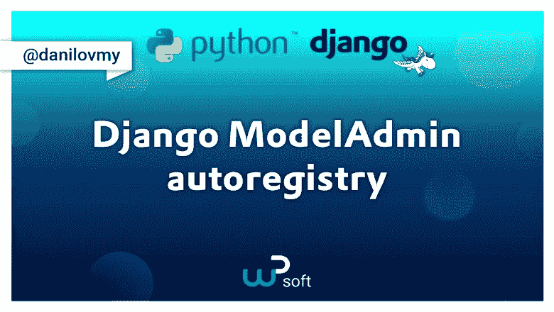
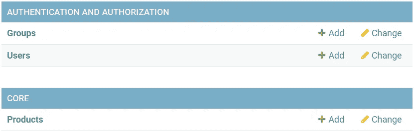

# 自动注册 Django 模型管理员

> 原文：<https://blog.devgenius.io/autoregister-django-modeladmins-7d7ac9a57e44?source=collection_archive---------4----------------------->



自动注册 Django 模型管理员

前一段时间我发现 Django 有自动注册`ModelAdmins`的能力。因为这不是常识，而且有很多好处，所以我决定写一篇文章来引起 Django 社区的注意。

首先，我们来复习一下如何正常注册`ModelAdmin`的基础知识。

# 标准`ModelAdmin`注册

为了注册`ModelAdmin`，我们首先创建一个模型:

Django 模型创建

接下来，您需要创建一个`ModelAdmin`，并将其注册到`SiteAdmin`上的模型中。

模型管理员创建

现在让我们运行我们的开发服务器，看看它是否工作。



有事发生了

但是这些是什么？一些额外的`ModelAdmins`被注册，但是我们从来没有定义它们。这意味着 Django 正在某个地方自动注册这些标准`ModelAdmins`。

# Django `ModelAdmins`集成自动注册。

经过对`django.contrib.admin.apps`的一番挖掘，我发现这些`ModelAdmins`都注册在`AdminConfig`类的`ready`方法中。

```
class AdminConfig(SimpleAdminConfig):
    """The default AppConfig for admin which does autodiscovery."""

    default = True

    def ready(self):
        super().ready()
        self.module.autodiscover()
```

如果我们不仅为自动注册标准 Django 模型，而且为我们自己的模型包装这个方法，我们可以利用这个事实。

我们可以这样做:

模型管理自动注册

我们检查了项目中的所有`AppConfigs`，并从`AppConfigs`获取了管理模块。当然，如果管理模块存在，情况就是这样。
然后，我们将浏览此`AppConfig`中的所有模型。
在那里，我们检查该型号是否已经在`SiteAdmin`注册。

如果没有，我们在管理模块中搜索名为' *model_name*ModelAdmin '的`ModelAdmin`类。如果没有定义这样的类，我们使用`None`。

最后，我们使用在`SiteAdmin`上找到的`ModelAdmin`来注册模型。

如果没有定义`ModelAdmin`，默认情况下`register`方法会将模型注册到`ModelAdmin`类。

但是你为什么要这样做呢？

# 利益

# 1.较短的代码

使用这种注册`ModelAdmins`的方法，您可以在一个 10 行的解决方案中注册多行代码。

您可以告别空的`ModelAdmin`类来注册模型，如果您以前做过的话。任何`ModelAdmin`上不再有`@admin.register(model)`包装纸。
最重要的是，在模块管理中不再有冗长的模型导入列表。

根据你有多少型号和多少`ModelAdmins`需要注册，你可以节省很多行代码。

# 2.更容易开发

继续上一点的想法，你不再需要担心在开发过程中注册`ModelAdmin`，因为当服务器启动时，一切都会自动发生。

# 3.循环进口

在当前的系统中，管理模块中有大量的导入列表，获得循环导入并找到解决方法并不困难。有了这个解决方案，这些导入列表就没有了，您再也不用担心模型和循环导入。

# 变化

有时你不想在当前的`SiteAdmin`上注册你所有的型号，那么你会怎么做？

当然你可以随意修改上面的解决方案，但是在这里我想给你一些解决最常见问题的思路。

# 仅注册特定型号

如果我们想用`ModelAdmins`只注册需要的模型，我们可以在管理模块中只定义需要的`ModelAdmins`，并执行以下操作:

特殊车型的自动注册

在这个解决方案中，您需要为每个所需的模型添加管理模块`**ModelName**ModelAdmin`类。

或者，如果模型应该自动注册，您可以向它添加一个标志。

Django 模型中的特殊标志“autoregister_model”

# 移除标准注册模型

也许您不需要在您的项目中注册标准的 Django 模型。您可以通过在 ready 方法中添加一行简单的代码来删除它们。

默认情况下，删除已注册的模型。

这些只是使用 Django 自动注册的一些选项。我相信您可以想出其他聪明的方法来使用它，我希望这篇文章是有用的。

我感谢 Martin Achenrainer，他是我公司的学徒，他翻译并协助了这篇英文文章。这个想法于 2021 年 9 月在 PyCon RU 首次提出

**马丁·阿肯赖纳的一些话。**

> 我要感谢马克西姆·达尼洛夫和他的 wP soft 公司给了我在工作场所学习和提高编程技能的机会。