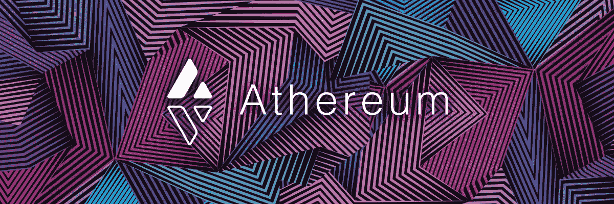
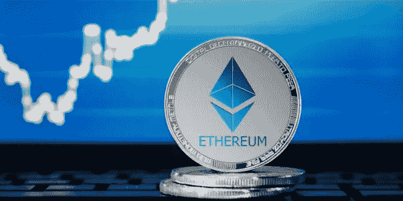
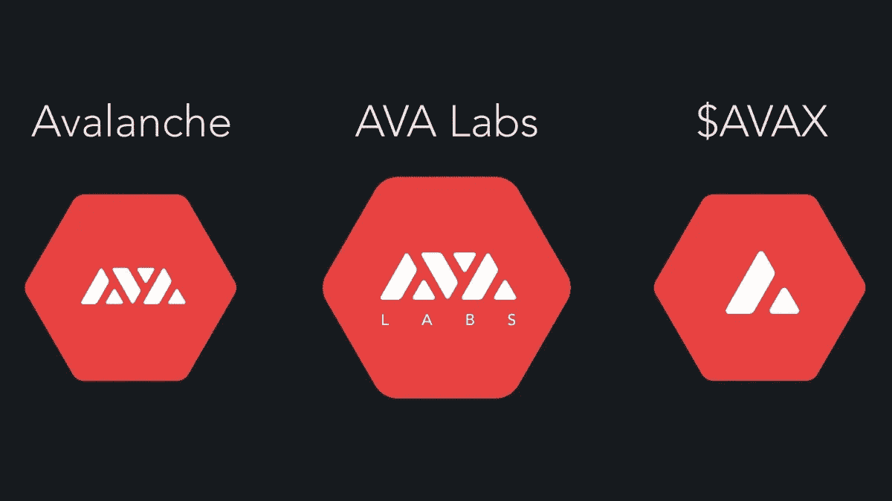

# 雪崩大战以太坊:分散巨人之战

> 原文：<https://blog.devgenius.io/avalanche-vs-ethereum-battle-of-the-decentralized-giants-80edd046bb8c?source=collection_archive---------0----------------------->

***分权巨头之战。***

自从这两个平台推出以来，它们以不同的方式极大地改变了人们的生活。在这里，我们将讨论这些巨头如何相互比较。

## 不同的平台，对投资人和用户不同的承诺

**以太坊**

当布特林找不到机会在比特币区块链上实现他的解决方案时，以太坊正在开发中。相反，他创建了这个网络，并在 2015 年发布了一份白皮书。在他的白皮书中，他承诺了一种具有巨大生态系统的环境友好算法。结果，越来越多的人开始在这个平台上用他们的产品来改变整个世界。这些人在金融、供应链、贸易、游戏领域工作并创造产品，甚至创造了他们自己的加密货币。以太坊在金融领域变得如此出名，去中心化的金融，去中心化的市场，去中心化的交易所凭空出现。

然而，在 2016 年，一名黑客在 DAO 中发现了一个错误代码，并开始了攻击。因为这是在智能合同中定义的，黑客可以利用并把人们的存款据为己有。但是，当开发者意识到发生了什么，他们已经团结起来反击恶意的个人，并设法挽救人们的资金。即使投资资金被追回，一些人认为黑客应该带着钱逃走，以太坊经典是由站在黑客一边的人用硬叉子创造出来的。

结果，博弈论模型被引入，开发者开发了各种标准。这些标准包括代码审查和实施前的严格测试。这将增强对平台的信心。

**雪崩(AVAX)**

Avalanche 是由不同的人开发的，包括 Emin Gün Sirer 是最杰出的一个。他的主张是解决区块链的三难困境，而不是依靠计算能力或赌注来集中权力。相反，他的解决方案是实现一个连续的时间过程，不牺牲区块链的三个支柱中的任何一个。所有的测试都证明了雪崩网络的这一点。

在 Avalanche 白皮书中，Emin Gün Sirer 承诺，通过应用具有连续时间过程的灵活软件，可以防止大多数会削弱区块链的攻击。他其余的承诺将会发展成创造完全去中心化的安全系统，而不需要计算能力或在特定的硬币上有股份。

*如何看待雪崩和以太坊？当他们发生冲突时，哪个平台会更好？在下面的评论区分享你的想法和知识。*