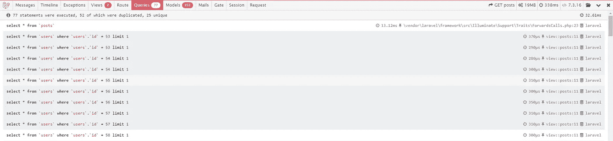
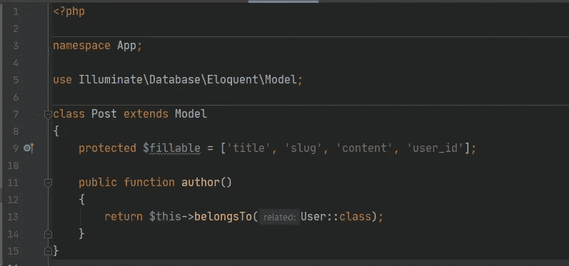
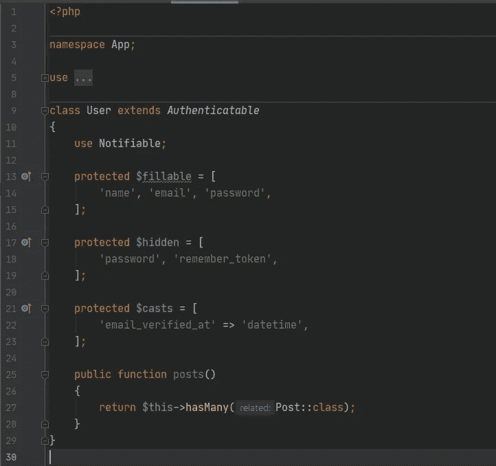
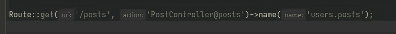
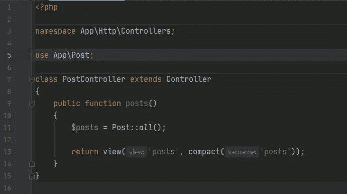
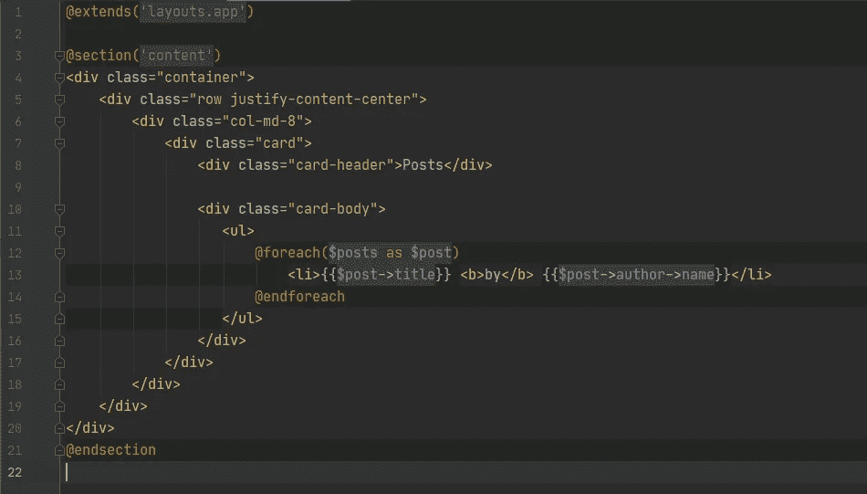
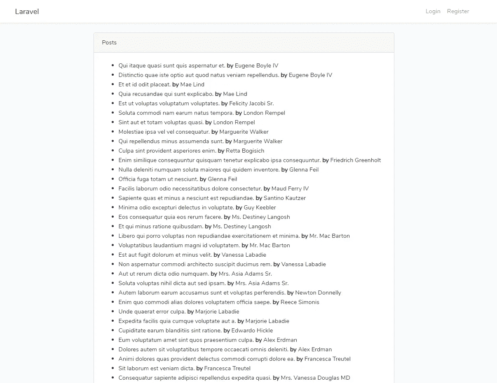
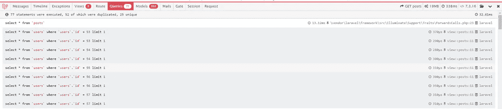
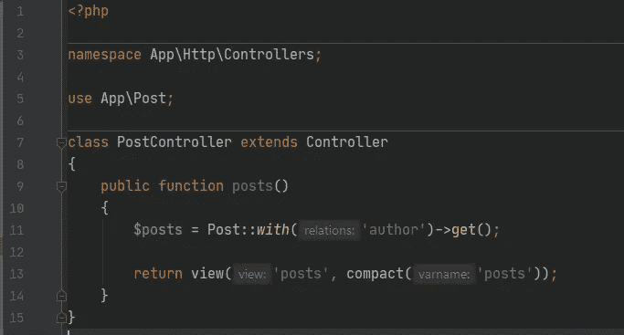
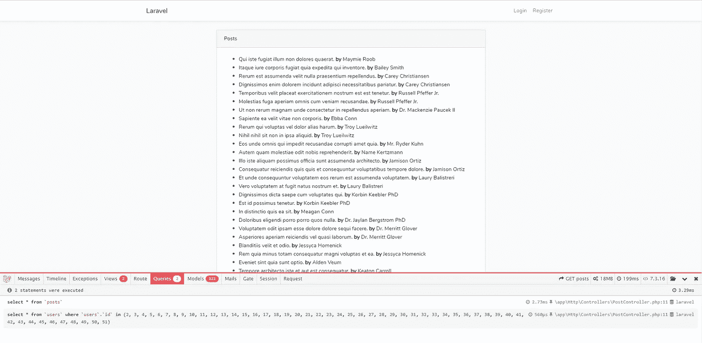

# 使用雄辩的 ORM 避免 N+1 问题

> 原文：<https://blog.devgenius.io/avoid-n-1-problem-using-eloquent-orm-e74d27e7946d?source=collection_archive---------0----------------------->

请求帖子及其作者时的 N+1 问题

正如你可能在你所有的 **Laravel** 项目中使用过**口才**一样，你会感受到口才给你的生活带来的安慰。

雄辩术节省了开发者大量的时间，但是如果你不注意查询，它可能会遇到问题。可能发生的问题之一被称为 N+1 问题。

## N+1 问题是什么？

我们用实践来解释一下:

假设你有两个模型叫做`User`和`Post`。

发布模型

用户模型

如你所见，一个用户可以有很多帖子，一个帖子是由一个用户(作者)写的。

现在，我们将有一个所有帖子的列表，其作者的名字就在旁边。

1.  我们应该有一个路径来查看页面:

routes/web.php 文件

2.在控制器中，我们必须从数据库中检索所有帖子:

PostController.php 文件

3.最后，我们将展示帖子及其作者:

resources/views/post . blade . PHP

这就是结果:

看起来一切都很好:)

**不，这里有问题。**

如您所见，这里有太多的 SQL 查询。**这就是所谓的 N+1 问题。**

## N+1 问题的解法是什么？

口才有**急切加载功能**在这种情况下很有用。

让我们看看如何实现急切加载:

PostController.php 文件

在 PostController.php 的文件中，我们将得到将`with('author')`添加到查询中的帖子。`author`实际上是在`Post`模型中使用的关系方法的名称。

因此，使用这种方法，我们可以在一个查询中获得所有相关的用户，而不是 N 个查询(N =从 DB 中检索的帖子数)。

这就是结果:

查询时间从 **32.61 ms** 得到了 **3.29 ms** 简直是疯了。😎

**简而言之，要解决 N+1 问题，你应该使用急切加载。**