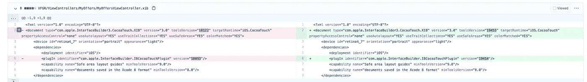

# 避免在 iOS 中使用笔尖和故事板

> 原文：<https://blog.devgenius.io/avoid-nib-and-storyboards-in-ios-2b75dc764b26?source=collection_archive---------2----------------------->

Xcode 中的界面构建器编辑器使设计完整的用户界面变得简单，无需编写任何代码。我记得我经常使用它，直到我意识到一些严重的问题。


让战斗开始吧！

> 感谢我的同事、朋友和叔叔[阿提诺多罗斯·法富提斯](https://medium.com/u/cdb35114bfdf?source=post_page-----2b75dc764b26--------------------------------)，他让我相信通过编程创建 UI 可以增加开发人员的经验🙏

## 为什么要避免界面构建器？

*   **解决 git 冲突既困难又不可能。😐** 如果你特别和你的同事一起编辑同样的东西。xib，存在降低生产率的风险，因为您必须解决冲突。
*   **公关策划难懂。**
    🕵️‍♀️很难理解什么改变了/增加了/删除了。



的示例。xib

*   **打开锡伯时 Xcode 冻结/滞后💤**
    就像看电影或玩游戏一样，我们不希望它落后。
    有时 XCode 的滞后会让我失去编程的流程和注意力。
*   **增加洁净身材🔺** 这会让配置项更慢，并产生新的 git 签出。因此，生产率下降，CI 令人伤心😢。

## 是的，但是我想要视觉反馈..

事实上，对 UIView 所代表的东西进行视觉反馈是很棒的，因为你可以更快地理解它。

那么，这是否意味着以编程方式编写用户界面有缺点呢？

乍一看是的，看起来像是一个缺点，但是我们都知道在编程中一切皆有可能。🔥

[](https://github.com/pointfreeco/swift-snapshot-testing) [## git hub-point freeco/swift-快照-测试:📸令人愉快的 Swift 快照测试。

### 令人愉快的 Swift 快照测试。安装后，不需要额外的配置。您可以导入…

github.com](https://github.com/pointfreeco/swift-snapshot-testing) 

通过为 UIViews 编写快照测试，您不仅可以解决问题，还可以:

*   代码变更中 UI 一致性(提高产品质量)✅
*   每个 UIView 状态的可视化表示。🎉

> 这意味着，如果我想看看 UIView 是什么样子，我必须去 _ _ snapshots _ _ 文件夹看一看。


快照测试的真实例子，

但是如果你想在视觉上更深入，你应该用夏洛克。
这是我最近写的一篇关于它的文章。

[](/ios-simulator-superpowers-with-sherlock-406ca8317304) [## iOS 模拟器拥有夏洛克的超能力

### 您是否大量使用用户界面，或者试图理解用户界面视图是如何构建的？这篇文章一定会救你…

blog.devgenius.io](/ios-simulator-superpowers-with-sherlock-406ca8317304) 

## 以编程方式创建用户界面的简短指南

以下是以编程方式创建用户界面时要记住的一些事情。

1.  创建用户界面元素并对其进行配置
2.  记住将您的视图添加到层次结构中。
    `**view.addSubview**(yourView)`
3.  在此之后添加您的布局约束
    `yourView.translatesAutoresizingMaskIntoConstraints = false` ‼️

```
NSLayoutConstraint.activate([
    scoreLabel.topAnchor.constraint(equalTo: view.topAnchor),
    // more constraints to be added here!
])
```

记住为了让自动布局愉快😄您必须为它提供必要的约束，以便它可以从这些约束中推断出以下内容:

*   x 位置
*   y 位置
*   宽度
*   高度

此外，如果你提供更多的约束，它需要它会打破一个自动。最终，所有的活动约束都需要得到满足。

> 提示:UILabel 不需要高度，因为它是根据内容计算的。这就是所谓的内在大小。

## 结论

界面构建器不是邪恶的东西，有案例可以使用。我认为苹果在 XCode 中创建它是为了给 iOS 开发者从构建器中创建 UI 的感觉。这真的很好，尤其是对初级 iOS 开发者来说，因为感觉更直观。至少现在有了 swiftUI 这些都解决了！

如果你喜欢这篇文章，别忘了留下👏并在评论中分享你的看法！