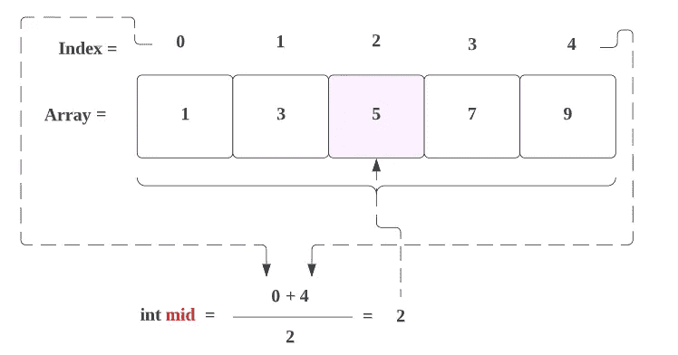
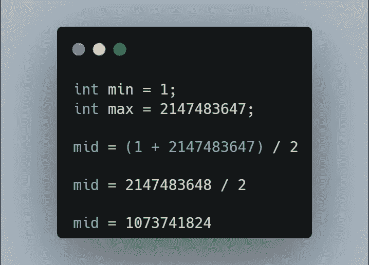
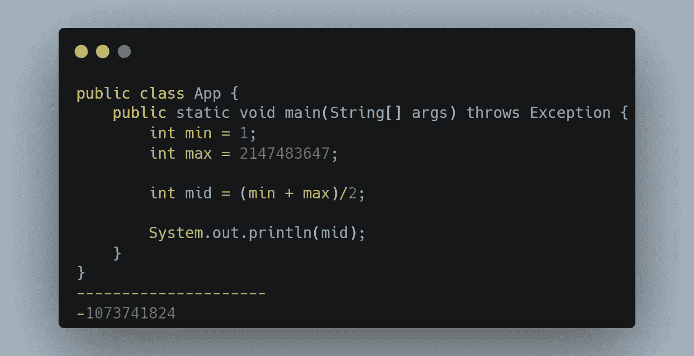
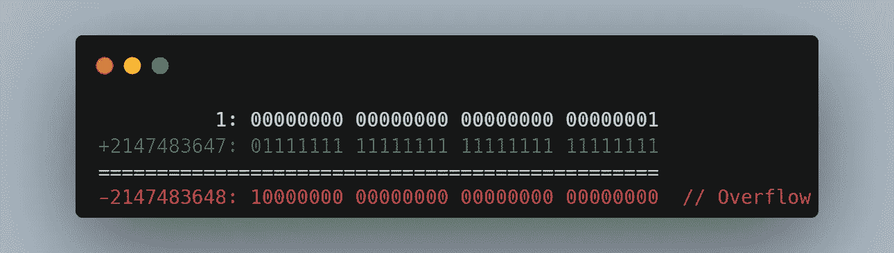
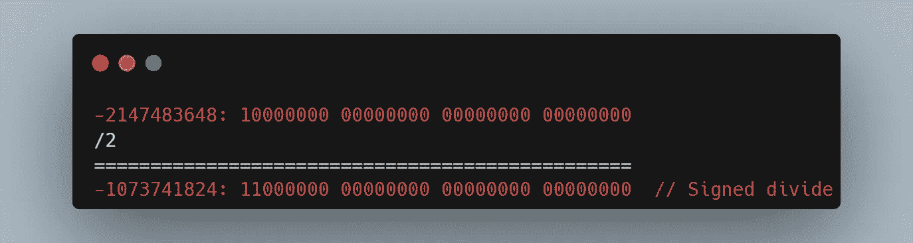
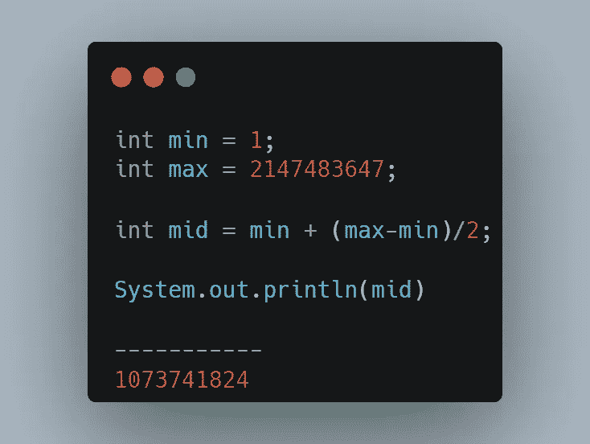
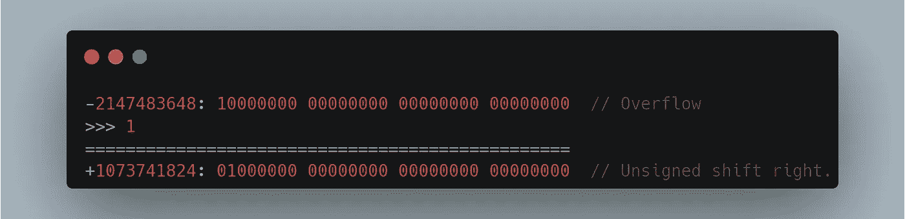

# 在数据结构中计算中间值时避免这种情况。

> 原文：<https://blog.devgenius.io/avoid-this-thing-while-calculating-mid-value-in-data-structures-73d834ed5fb8?source=collection_archive---------10----------------------->

在数据结构中，我们经常需要使用**二分搜索法**，因为我们需要找到给定排序数组的 **mid** 值。

我们可以很容易地通过以下方式找到 **mid** 值:

> ***第一次接近→ mid =(开始+结束)/2***

但是如果**大数** : →

但是在 **Java** 中，输出会有所不同:

在这里，要理解为什么这个**输出变得不同**，我们就理解为 Java 中的**二进制加法**。

结果是否定的，这是因为， **int** 数据类型是一个 **32 位有符号二进制补码整数**。

其最小值为**-2147483648(0x 8000000)**

**最大值 2147483647(0x 7 fffffff)**(含)

所以当你给一个**整数的最大值**加 1 时:

**→2147483647+1 =-2147483648**

所以，**除以 2** ，也是负数。

所以，你可以看到，实际结果应该是`1073741824`，但是我们得到的是- `1073741824.`

这个问题叫做**整数溢出**。

为了克服这个问题，我们需要使用**不同的方法**来获得**的中间值**。

> ***第二种方法→ mid = min + (max-min)/2***

使用这种方法，我们可以得到适当的结果，如下所示:

*很明显* **(max-min)/2** 小于 ***max*** ，对于*开始*和*结束*的大值，该公式不会导致**整数溢出**。

虽然，第二种方法很好，但让我们看看更快的方法，**第三种方法**寻找中间值。

> ***第三种方法→((min+max)>>>1)***

> > >(无符号右移)

**什么是无符号右移运算符？**

*   右移运算符将数字的位向右**移动**指定的位置。
*   用 0 填充的符号位
*   该运算符的符号是> > >。
*   写 **x > > > n** 时，意思是将 **x** 的位向右 **n 指定的**位置移动。

我们先做加法， ***(min + max)***

**→ min = 1** ，
→**max =****2147483647**

现在我们在做**无符号右移运算。**

所以，你可以看到，我们得到了实际的结果`1073741824.`

因此，总之，我们应该避免第一种方法来寻找中间值，因为它会造成**整数溢出**，而是应该使用第二种或第三种方法。

感谢你阅读这篇文章，❤

如果这篇文章对你有帮助，请鼓掌👏这篇文章。

请在[媒体](https://medium.com/@alexmurphyas8)上关注我，我会像上面一样发布有用的信息。

如果我做错了什么？让我在评论中。我很想进步。