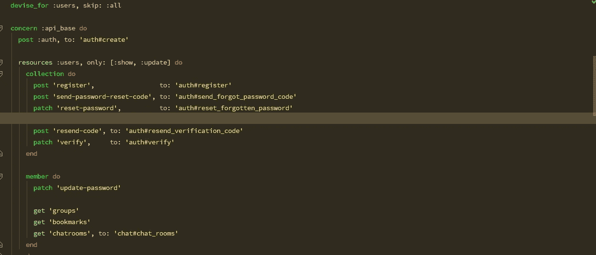

# 避免 Rails 中的 N+1 查询问题

> 原文：<https://blog.devgenius.io/avoiding-the-n-1-query-problem-in-rails-2f571f9e57e5?source=collection_archive---------1----------------------->

## 一个非常常见的查询优化案例，它的解决方案也很好看



n+1 查询问题是最常见的可伸缩性瓶颈之一。它包括从数据库中获取资源列表，其中包含其他相关资源。这意味着我们可能必须单独查询相关的资源。因此，如果您有一个 n 个父对象的列表，*将不得不执行另外 n 个查询来获取相关的资源*。让我们试着摆脱这个 O(n)难题。

如果你熟悉 Rails、[主动模型序列化器](https://github.com/rails-api/active_model_serializers)，并且已经对我们的问题有了很好的想法，那么也许你可以在这里直接进入代码[。](https://gist.github.com/UsamaAshraf/95b0c8d0d64ee193148342a931c0a423)

## 具体的例子

假设您正在 GET 端点获取一个由 **Post** 对象组成的数组。您还希望加载帖子的各自作者，在每个帖子对象中嵌入一个 **author** 对象。这里有一个简单的方法:

对于正在呈现的 n 个 **Post** 对象中的每一个，将运行一个查询来获取相应的**用户**对象。因此，我们将总共运行 n+1 个查询。这是灾难性的。下面是如何通过急切加载**用户**对象来解决这个问题:

## 当简单连接不可能时

到目前为止，对于有经验的人来说没有什么新鲜的。

但是让我们把这个复杂化。*让我们假设网站的用户没有和帖子存储在同一个 RDMS。相反，用户是存储在 MongoDB 中的文档(不管出于什么原因)。*我们如何修改我们的 **Post** 序列化程序来获取用户的信息？这将回到起点:

我们的用户现在驻留在 Mongo 数据库中的困境可以用调用第三方 HTTP 服务来获取用户或将用户存储在完全不同的 RDMS 中来代替。我们的基本问题仍然是没有办法将用户数据存储与 posts 表“连接”起来，并在单个查询中获得我们想要的响应。

当然，我们可以做得更好。我们可以通过两个查询获取完整的响应:

*   获取所有没有**作者**属性的文章(1 个 SQL 查询)。
*   通过运行一个 where-in 查询来获取所有相应的作者，其中用户 id 是从帖子数组中提取的(1 个 Mongo 查询，带有一个 in 子句)。

## 输入批处理加载器

所以我们原来的优化问题已经简化为“我们如何使这个代码可读和可维护”。宇宙[的人们已经想出了一个漂亮的宝石。Batch Loader](https://www.universe.com/about) 对我的帮助非常大。

`gem 'batch-loader'`

`bundle install`

如果你熟悉 JavaScript 承诺，可以把`get_author_lazily`方法看作是返回一个稍后被评估的承诺。我认为这是一个很好的类比，因为`BatchLoader` 使用了[惰性 Ruby 对象](https://ruby-doc.org/core-2.4.1/Enumerable.html#method-i-lazy)。默认情况下，`BatchLoader`缓存加载的值，因此为了保持响应是最新的，您应该将它添加到您的`config/application.rb`:

```
config.middleware.use BatchLoader::Middleware
```

就是这样！我们已经解决了 n+1 查询问题的高级版本，同时保持了代码的整洁，并以正确的方式使用了主动模型序列化器。

## 对嵌套资源使用 AMS

但有一个问题。如果你有一个**用户**序列化器(主动模型序列化器也可以和 Mongoid 一起工作)，那么*不会被延迟加载的**作者**对象调用，不像以前那样。为了解决这个问题，我们可以使用一个 Ruby 块并在将**作者**对象“分配”到帖子之前序列化它们。*

这是全部代码。尽情享受吧！

# 资源

[https://github.com/rails-api/active_model_serializers](https://github.com/rails-api/active_model_serializers)

[https://gist . github . com/UsamaAshraf/95 b 0 c 8d 0d 64 ee 193148342 a 931 c0a 423](https://gist.github.com/UsamaAshraf/95b0c8d0d64ee193148342a931c0a423)

[https://www.universe.com/about](https://www.universe.com/about)

[https://github.com/exAspArk/batch-loader](https://github.com/exAspArk/batch-loader)