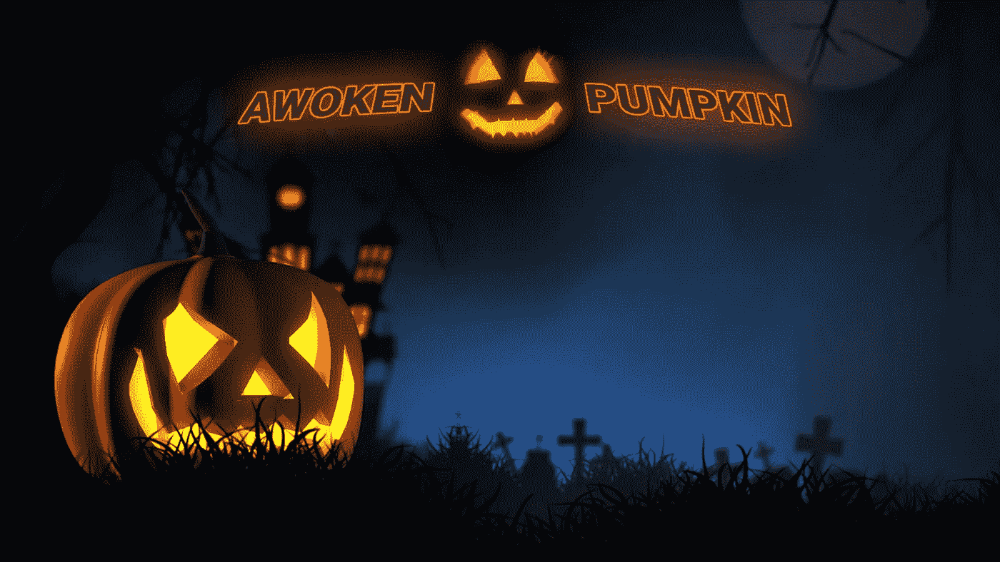
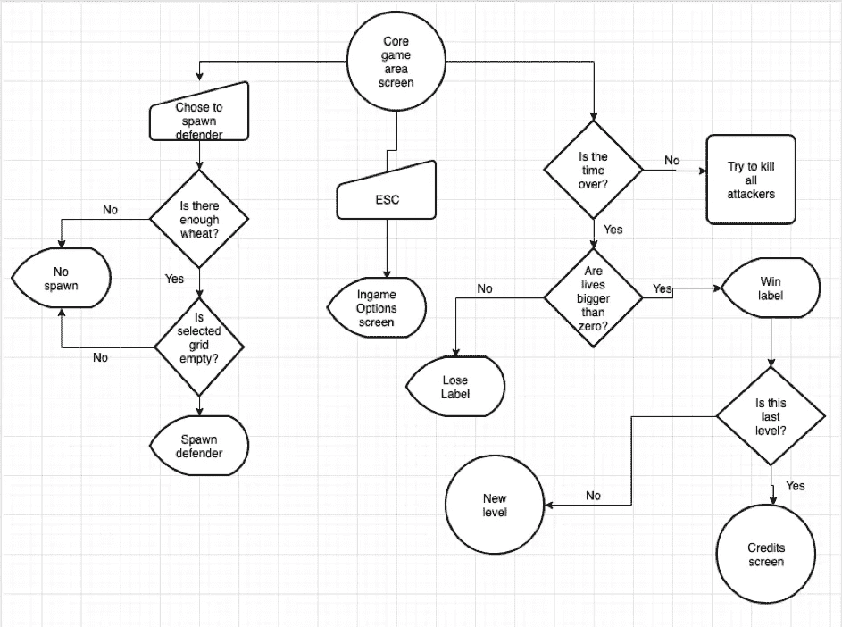
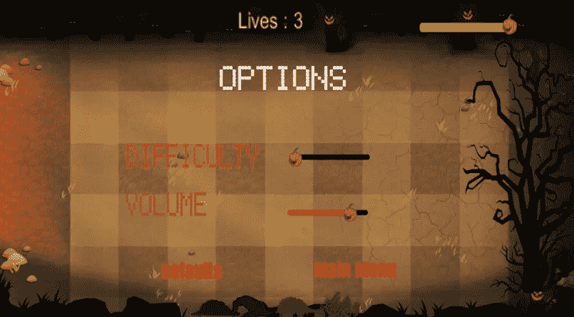
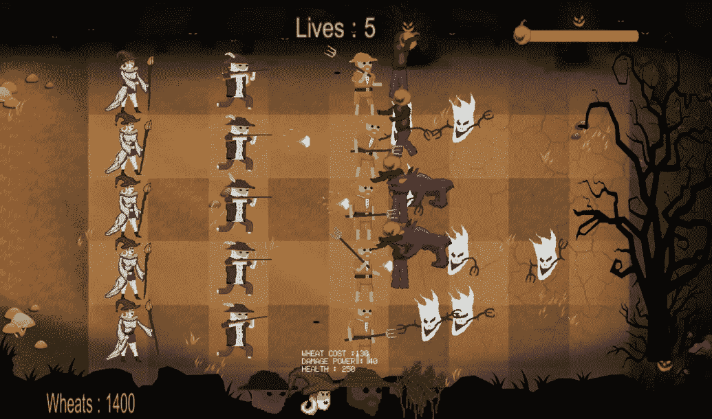

# 醒来的南瓜

> 原文：<https://blog.devgenius.io/awoken-pumpkin-a07b6df80853?source=collection_archive---------44----------------------->

我们的项目是一款经典、简单但有效的视频游戏，基于名为“塔防”的视频游戏类型，游戏的主要目标是在等待的时候消磨时间，例如在公共交通工具上等待，在某个地方等待与某人见面等。虽然我们保持游戏的简单，以便它可以用来在短时间内玩来消磨时间和放松，但我们在其中添加了一点竞争性，以便与朋友一起玩，并相互竞争。尽管在大型游戏中玩这款游戏很有竞争力，但在小型游戏中玩会更有趣。我们知道有许多其他视频游戏与我们创造的类似，但我们也知道像这样的类型最好有更多的变化，因为游戏的垄断意味着启示。我们的游戏实际上是 2D，但我们设计了它，所以它看起来像是一个 3D 游戏。这个游戏有 5 个关卡，由传统的关卡系统组成，所以每过一关都会变得更难。我们的目标是让所有年龄段的人都可以玩这个游戏，包括少数民族，所以它不包含任何不合适的或 NSFW 的东西，比如血腥、流血或裸体，在暴力方面，我们尽可能让它不那么暴力。我们的游戏与游戏“植物大战僵尸”有相似之处，但我们的游戏有一个非常不同的主题。主题是农民保卫他们的土地对抗万圣节的怪物和鬼魂。类似的主题在 Terraria 游戏中的南瓜月亮事件中使用过，但在塔防游戏中从未出现过。

*虽然我们确实从 Terraria 的南瓜月亮事件和植物大战僵尸中获得了灵感，但我们通过为游戏创建我们自己的图形来保持我们的原创性。游戏对每一关都有时间限制，当时间限制结束时，攻击者停止攻击。这个游戏有一种叫做“小麦”的货币，只有有足够的小麦，才能产生防御者。如果所有攻击者在生命值为 0 之前被杀死，玩家进入下一关。如果在攻击者被杀死之前生命值为 0，则该等级消失。如果防御者死亡，生命值不会减少，但是当攻击者越过防御者到达农场时，生命值会减少，从而使目标只专注于保护农场。比赛中有 3 名进攻队员和 3 名防守队员。玩家可以繁殖 3 个防御者和小麦，当小麦被繁殖后，它会生长一段时间，然后可以被收割以战略性地增加玩家的小麦货币。攻击者在随机的时间随机的地点出现，使得游戏变得更加困难和不可预料。*

*流程图*

***项目中使用的方法:***

在创建这个软件时，我们使用了 Unity 游戏开发工具包和 C#语言，并使用 Adobe Photoshop 制作图形(精灵、模型和动画),我们还使用 Unity 将模型转化为动画。我们使用 C#方法 IEnumerator 来延迟攻击者的繁殖。脚本是统一完成的。通用的面向对象技术已经在应用程序中大量使用，代码中大约有 20 个类。Unity 生命周期也被使用。项目详情

***1-)主菜单:***

它有 3 个按钮:开始游戏，选项，退出。开始游戏只是从第一关开始游戏。选项按钮打开选项菜单，退出游戏关闭应用程序。菜单也可以从暂停菜单或在完成游戏后的学分屏幕上访问。

***2-)主选项:***

*主要选项*

*只能从主菜单进入，它让玩家设置游戏的音量和难度。每个都有一个小节。它有一个返回主菜单的按钮。难度设定攻击者繁殖的数量和频率。默认值按钮将所有设置设为默认值。*

***3—***游戏

比赛

摘要部分提到的游戏有 5 关，每一关都比前一关难。从第一级开始所有的防御者和小麦都是可用的，但是在第一级只有三分之二的攻击者可用。等级 2 之后，所有类型的攻击者都开始攻击。3 种类型的防御者是农民法师，近战农民和火枪手农民。法师和火枪手做远程攻击，而近战农夫只有 1 范围。法师创造并向攻击者投掷火球。火枪手，顾名思义，有一支火枪，他用火枪向攻击者开火。近战农夫有一把干草叉，他用它在近距离攻击攻击者。所有防御者的健康状况都不一样。近战农夫 100，火枪手 200，法师 250。它们也造成不同程度的伤害；近战农民造成 20 点伤害，火枪手农民造成 30 点伤害，农民法师造成最多 40 点伤害，因此我们根据它来计算农民的小麦成本。玩家也可以以 70 小麦的价格放置小麦，并在每次收获时间到来时收获 40 小麦。这对于小麦来说具有重要的战略意义，这也是获得比关卡开始时更多小麦的唯一方法。袭击者是 Ghosty(一个有手臂的漂浮幽灵)、Zombkin(一个行走的僵尸)和 Hound(一只奔跑的地狱猎犬)。幽灵和僵尸从 1 级开始攻击，但是猎犬只能在 2 级以后使用。这是这样决定的，因为猎犬的速度比幽灵和僵尸快得多，因为它在跑。在每一关之后，给予玩家的小麦数量会增加，敌人产卵的数量和频率也会增加，这使得战斗更加公平但更具挑战性。但仍然在所有的水平，攻击者产卵的频率是完全随机的，使游戏总是保持不可预料的。僵尸和幽灵用他们的手臂攻击，而猎犬用撕咬动画攻击。从下面的游戏截图可以看出，时间条在右上角，农场生命值在中上方，小麦数量在左下方，防御者/小麦种子标签在中下方。当小麦数量为 0 时，玩家不能产生任何防御者或可收割的小麦。当农场健康为 0 时，游戏失败。当计时器到期时，攻击者停止产卵，但是为了赢得关卡，其余的攻击者需要被消灭。可以看出，游戏的背景以及树木、南瓜、开裂的暗黄色地面等所有细节都与万圣节有关，让万圣节的感觉充分注入到游戏的氛围中。

***4-*ESC 暂停选项菜单**

游戏全部 5 关完成后可用，最后一关完成后自动弹出。它有一个返回主菜单的按钮。

感谢你的阅读，如果你想看完整的项目，你可以从这里进入我的 github 账户: [AwokenPumpkin](https://github.com/bllhlskr/School-Project-Awoken-Pumpkin)