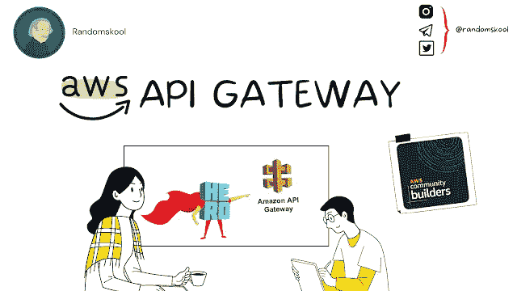
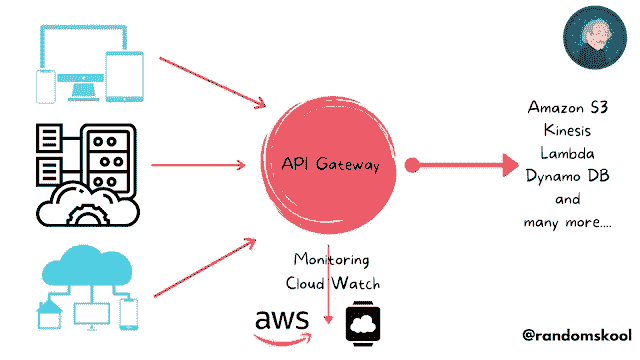
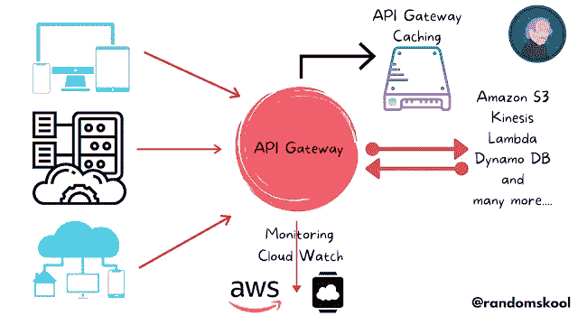

# AWS API 网关|简介|实践|认证技巧| AWS 社区构建者

> 原文：<https://blog.devgenius.io/aws-api-gateway-introduction-hands-on-certification-tips-aws-community-builders-d3e01a3bebd5?source=collection_archive---------4----------------------->

作为 AWS 社区构建者的一员，从现在开始，我将分享我从 AWS 社区生态系统中获得的知识和经验。

*我还试图提供丰富的高质量内容——最后有几个问题和答案，这将有助于准备认证考试。*

***请在评论中提供您的宝贵反馈。***

*让我们开始探索* [*AWS API 网关*](https://www.randomskool.com/2021/06/aws-api-gateway-introduction-hands-on.html) *-*

*API 代表一个* ***应用编程接口。***

API 是一组用于构建和集成应用软件的定义和协议。

API 被用作一个平台，以这样一种方式组织信息，即可以通过 HTTP 请求来访问它。

*意味着某人可以查询一个 API(通过一个叫做 API 端点的东西)并获得有用的信息。*

# 什么是 API 网关？

*   *A*[*mazon API Gateway 是一个完全托管的服务*](https://www.randomskool.com/2021/06/aws-api-gateway-introduction-hands-on.html) *，它使开发人员可以轻松创建、发布、维护、监控和保护任何规模的 API。*
*   [*API 充当应用程序从后端服务访问数据*](https://www.randomskool.com/2021/06/aws-api-gateway-introduction-hands-on.html) *、业务逻辑或功能的“前门”。*
*   *使用 API Gateway，* [*你可以创建 RESTful APIs 和 web socket API*](https://www.randomskool.com/2021/06/aws-api-gateway-introduction-hands-on.html)*实现实时双向通信应用。*
*   *API 网关* [*支持容器化和无服务器的工作负载*](https://www.randomskool.com/2021/06/aws-api-gateway-introduction-hands-on.html) *以及 web 应用。*

# 不同类型的 API 网关？

*   [*RESTful API(使用 HTTP APIs 构建针对无服务器工作负载和 HTTP 后端优化的 RESTful API。)*](https://www.randomskool.com/2021/06/aws-api-gateway-introduction-hands-on.html)
*   [*web socket API(用 web socket API 构建实时双向通信应用，如聊天应用、流媒体仪表盘等。)*](https://www.randomskool.com/2021/06/aws-api-gateway-introduction-hands-on.html)

# API 网关的优势

*   *高效的 API 开发*
*   *任何规模下的性能*
*   *大规模成本节约*
*   *轻松监控*
*   *灵活的安全控制*
*   *RESTful API 选项*

# 随机字节—

# AWS 免费层每月免费接收 100 万个 API 调用，持续 12 个月。

# API 网关的功能

*   *支持 RESTful APIs 和 web socket API*
*   *与* [*AWS ELB & AWS 云图*](https://www.randomskool.com/2021/06/aws-api-gateway-introduction-hands-on.html) 的私有集成
*   *弹性*
*   *轻松创建和部署 API*
*   *API 操作监控*
*   *AWS 授权*
*   *面向第三方开发者的 API 密钥*
*   *SDK 生成*
*   *API 生命周期管理*

# ***定价***

【https://aws.amazon.com/api-gateway/pricing/】定价请参考 AWS 官方文档—

****产品定价术语表****

*   ****HTTP API:****[*专为无服务器工作负载优化的 RESTful API。只为收到的 API 调用付费。*](https://www.randomskool.com/2021/06/aws-api-gateway-introduction-hands-on.html)**
*   *****REST API:****一种 RESTful API，在单一解决方案中提供 API 代理功能和管理特性。* [*只为收到的 API 调用付费。*](https://www.randomskool.com/2021/06/aws-api-gateway-introduction-hands-on.html)**
*   *****web socket API:****在连接的客户端之间保持一个持久的连接，实现实时消息通信。* [*为传输的消息和连接分钟数付费。*](https://www.randomskool.com/2021/06/aws-api-gateway-introduction-hands-on.html)**

****

# **API Gateway 中有哪些阶段？它如何对 API 网关部署有用？**

***阶段是指不同的环境，如“开发/质量保证/生产/测试”。***

**API 网关中的*有不同的阶段—* [*，在这些阶段中执行 API 的部署和测试。*](https://www.randomskool.com/2021/06/aws-api-gateway-introduction-hands-on.html)**

***每个 API 都被* [*隔离到不同的阶段。*](https://www.randomskool.com/2021/06/aws-api-gateway-introduction-hands-on.html)**

***要设置阶段，请参考官方 AWS 文档-***

**[***https://docs . AWS . Amazon . com/API gateway/latest/developer guide/stages . html***](https://docs.aws.amazon.com/apigateway/latest/developerguide/stages.html)**

# **什么是 API 缓存？**

*   ****借助 API 网关，** [**我们可以缓存端点的响应。**](https://www.randomskool.com/2021/06/aws-api-gateway-introduction-hands-on.html)**
*   ****It** [**改善了对您的 API 的请求的延迟，因为大多数响应都被缓存**](https://www.randomskool.com/2021/06/aws-api-gateway-introduction-hands-on.html) **，并减少了对端点的调用次数。****
*   ****A** [**PI 网关在指定的生存时间内缓存来自您的端点**](https://www.randomskool.com/2021/06/aws-api-gateway-introduction-hands-on.html) **的响应。****

****

# **创建 API 的简单步骤**

1.  ***打开 AWS 控制台***
2.  ***在服务选项卡中搜索 API 网关***
3.  ***选择创建 API***
4.  ***在 HTTP API 下，选择构建***
5.  ***选择添加积分***
6.  ***输入姓名。***
7.  ***选择审核并创建***
8.  ***选择创建***
9.  **现在你的 API 已经准备好调用了。您可以通过在浏览器中输入调用 URL 或者使用 Curl 来测试您的 API。**

# **API 网关用例–**

***如果您每天都收到关于您组织中当前使用的任何工具的用户创建请求。***

**[*为了避免这种手动干预任务*](https://www.randomskool.com/2021/06/aws-api-gateway-introduction-hands-on.html) *，我们可以使用* [*API 网关轻松地自动化这种请求，其中它只是从一个工具向另一个功能交换信息。*](https://www.randomskool.com/2021/06/aws-api-gateway-introduction-hands-on.html)**

***假设您在贵公司担任吉拉管理员，每天都会收到很多请求。那么，您应该如何避免这些手动操作呢？***

**[***简单的方法—***](https://www.randomskool.com/2021/06/aws-api-gateway-introduction-hands-on.html) *在吉拉建立一个 webhook，它向 API gateway 发送 post 请求，其中包含新用户的所有必需细节，API Gateway 简单地调用 lambda 函数来创建用户。***

*****在这个场景中使用 API 网关的好处—*****

*   **由于不会发生不必要的呼叫，节省了成本。**
*   **Lambda 也节省了成本——它只会在新用户请求访问吉拉的时候运行。**
*   ***高效***

# **认证 QnA -**

*****问:*** *你目前有一组嵌入了业务逻辑的 Lambda 函数。您希望客户能够通过 HTTPS 调用这些功能。如何实现这一点？***

*****A .使用 API 网关并提供与 AWS Lambda 功能的集成。*****

***B .在 AWS Lambda 函数上启用 HTTP 访问。***

***C .添加安装了 API 服务器的 EC2 实例。将服务器与 AWSLambda 函数集成。***

***D .使用 S3 网站调用 Lambda 函数***

*****问*** *一家公司想要在 AWS 云上构建一个全新的应用。他们希望确保该应用程序遵循微服务架构。以下哪些服务可用于构建这种架构？从下面给出的选项中选择 3 个答案。***

*****a . AWSλ*****

*****B. AWS ECS*****

*****C. AWS API 网关*****

***D. AWS 配置***

*****问:*** *一家公司拥有一个 API，目前每秒钟收到 1000 个请求。该公司希望使用 AWS 以经济高效的方式进行托管。以下哪种解决方案最适合这种情况？***

***A .将 API Gateway 与后端服务一起使用。***

*****B .使用 API 网关和 AWS Lambda*****

***C .使用 CloudFront 和 API 后端服务。***

***D .将 ElastiCache 与 API 后端服务一起使用。***

*****请在评论区留下您的宝贵反馈。*****

*****> >跟着我们上***[***instagram.com/randomskool***](https://www.blogger.com/u/1/blog/post/edit/6036099677294927268/8967975326220628707#)**

****> >加入我们的电报频道和群组:)****

***电报组:*[*https://t.me/randomskoolQnA*](https://www.blogger.com/u/1/blog/post/edit/6036099677294927268/8967975326220628707#) *电报通道:*[【https://t.me/randomskool】T42](https://www.blogger.com/u/1/blog/post/edit/6036099677294927268/8967975326220628707#)**

# **直到那时快乐编码。**

***最初发表于*[*https://www.randomskool.com*](https://www.randomskool.com/2021/06/aws-api-gateway-introduction-hands-on.html)*。***