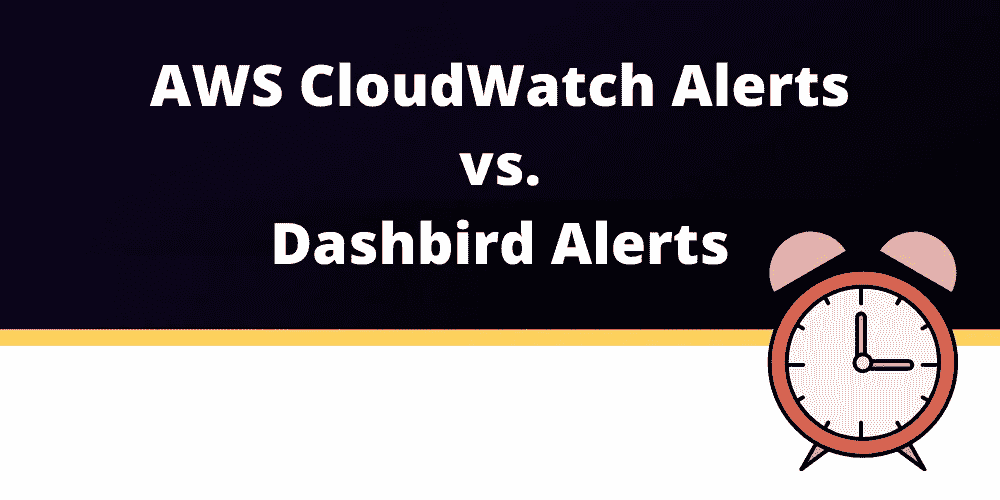

# AWS CloudWatch 警报与 Dashbird 警报

> 原文：<https://blog.devgenius.io/aws-cloudwatch-alerts-vs-dashbird-alerts-6910f07d5cfa?source=collection_archive---------6----------------------->

本文最初发布于:[https://dash bird . io/blog/AWS-cloud watch-alerts-vs-dash bird-alerts/](https://dashbird.io/blog/aws-cloudwatch-alerts-vs-dashbird-alerts/)

在 21 世纪，操纵机器和电脑相当容易。我们担心的不再是某件事是否可行，而是某件事是否可以完善。因此，我们主要是寻找新的想法和方法，使我们的工作无懈可击。例如，如果你正在使用一个特定的软件，并且你意识到这个软件很优秀，但是它在某些方面可以做得更好，可以让你工作得更快，你会探索替代方案。有各种各样的可以选择，你会搜索最适合自己需求的。他们每个人都有自己的一些额外津贴，在其他人身上，你会注意到一些缺点。

在本文中，我们将做一个简单的介绍，我们还将讨论 CloudWatch 警报与 Dashbird 警报的区别。哪个更好，为什么？

# AWS CloudWatch 是用来做什么的？

[AWS CloudWatch](https://aws.amazon.com/cloudwatch/) 专为系统操作员、现场可靠性工程师(SRE)、IT 经理和开发人员打造。CloudWatch 允许您通过它提供的数据访问和洞察来监控您的应用程序。它还可以识别、理解和响应整个系统中发生的所有变化。

CloudWatch 还通过指标、事件和日志收集监控和运营数据，这进一步为您提供了关于 AWS 资源、服务和运行在 AWS 上的应用程序以及本地化服务器的独特视图。CloudWatch 使您能够设置警报(或警告)，对问题进行故障排除，并发现应用程序优化的洞察力，这将确保应用程序平稳运行。

# 云观察警报解释说

CloudWatch 警报(也称为警报)可以监视单个 CloudWatch 指标，甚至可以监视 CloudWatch 指标中的数学表达式的结果。警报将基于度量或表达式的值执行单个或多个操作，该值与多个时间段内的阈值相关。将警报添加到 CloudWatch dashboard 已启用，这样您就可以直观地监控它们。有三种报警状态:

*   **OK** —表示在已经定义的阈值内找到表达式或度量；
*   **警报** —暗示表达式或度量位于指定阈值之外；
*   **undefficient _ DATA**—当警报已经开始，但指标不可用，或者指标没有足够的数据来识别警报处于哪个状态时，显示该警报。

创建警报时，您可以指定三个设置，这三个设置将允许 CloudWatch 评估何时更改警报状态:

*   **周期** —将使您能够评估指标或表达式的时间长度，以便为警报创建单独的数据点；
*   **评估周期** —是您需要评估以确定报警状态的最近数据点的数量；
*   **警报数据点** —是评估期间必须突破的数据点数量，因此它导致警报进入警报状态。这些突破数据点必须都在等于评估周期的最后数据点数量内。

有许多功能适用于所有 AWS CloudWatch 警报，我们将介绍其中的一些功能。例如，警报的评估周期数乘以每个评估周期的长度不能超过一天的限制。另一个值得一提的特性是警报命名中必须包含 ASCII 字符。您还可以为每个 AWS 帐户在每个地区创建 5，000 个警报。

# 韵律学

CloudWatch 收集基本指标，这进一步允许您[监控](https://dashbird.io/blog/monitoring-vs-observability/)整个系统的表现。为 Lambda 函数收集的指标是**延迟、调用、错误和并发**。由于在出现问题的同时精确检查指标的可能性非常小，所以提前配置警报是明智的(下面将详细介绍这一点和最佳实践)。这样做是为了防止意外事件满足某个条件或阈值，以便警报可以及时通知您。

# 如何设置度量警报？

您应该首先[配置一个 CloudWatch 指标警报来触发 SNS 主题](https://docs.aws.amazon.com/AmazonCloudWatch/latest/monitoring/US_SetupSNS.html)，但前提是完全满足预定义的条件。SNS 触发器然后将调用 Lambda 函数来采取行动。此操作将发送通知，以便您可以进一步调查该问题。

# 设置度量预警(最佳实践)

您能识别出[配置度量警报](https://dashbird.io/blog/metric-based-alerting-for-aws-lambda/)的最佳时间吗？答案取决于您是否希望仅在需要您立即关注的**情况下收到提醒**。即使你设置他们经常提醒你，回应每一个提醒也是不可行的。这意味着用不了多久你就会错过一个重要的警报，这种情况肯定会发生，要么是因为噪音，要么是因为你开始完全忽略警报。

试着这样理解这一切:

*   如果 1%的请求因为一个函数而失败，你认为这样可以吗？
*   **所有请求的时间不超过 1 秒**这一点至关重要吗？

在这些情况下，您可能想知道您的 Lambda 是否达到了一个[并发限制](https://dashbird.io/blog/exploring-lambda-limitations/)(帐户范围)。所有这些设置对每个应用程序来说都是完全独立的，通常需要一些时间和反复才能达到可接受的水平。

你应该考虑的另一件事是**配置自然预防警报**。即使还没有发生任何故障，也会触发这些警报，但这可能很快就会发生。**一个很好的例子**是如果 Lambda 函数接近超时或者甚至接近填满其内存容量——请记住，CloudWatch 在默认情况下会获取调用计数、延迟、内存使用和失败的指标。

# 高分辨率度量警报

如果您将警报设置为高分辨率指标，则允许您在特定时间组(10 秒或 30 秒)中指定高分辨率警报。此外，您可以多次设置标准的 60 秒闹钟。同样重要的是，要知道高分辨率警报的收费更高，因此如果这可能是一个潜在的问题，请务必进行成本分析。

# 标准 CloudWatch 警报功能

CloudWatch 警报有许多功能，下面列出的是常见的，适用于所有警报:

*   每个 AWS 帐户可以为每个地区创建多达 5，000 个警报。如果您希望更新现有警报或创建新警报，您应该使用 CloudWatch 控制台。在 AWS CLI 中使用 put-metric-alarm 命令，或者利用一个也可用的名为 PutMetricAlarm 的 API 操作。
*   报警名称字段中只允许 ASCII 字符。
*   您可以登记当前配置的部分甚至全部警报。您还可以通过使用 CW 控制台查找 API 操作描述警报来列出特定状态下的任何警报。或者，在 [AWS CLI](https://docs.aws.amazon.com/AmazonCloudWatch/latest/monitoring/Lambda-Insights-Getting-Started-cli.html) 中查找命令描述-报警。
*   您还可以通过 CloudWatch 控制台启用或禁用警报。为此，您需要查找 API 操作 EnableAlarmActions 和 DisableAlarmActions。或者，您可以在 AWS CLI 中查找以下命令:enable-alarm-actions 和 disable-alarm-actions。
*   通过使用 API action: SetAlarmState 或 AWS CLI 中的命令 set-alarm-state，将警报设置为任何状态以进行测试。请记住，当下一次报警比较发生时，这种暂时的状态变化将会结束。
*   甚至在制定这个特定的自定义指标之前，也可以创建一个自定义指标警报。您必须在警报定义中包含所有自定义指标的维度以及指标名称和指标命名空间，以使其有效。您可以通过 AWS CLI 中的一个命令:put-metric-alarm 或通过 API 操作:PutMetricAlarm 来完成此操作。
*   通过 CloudWatch 控制台可以查看警报的历史记录，因为它可以保存 14 天的警报历史记录。您可以在 AWS CLI 中使用命令:describe-alarm-history，也可以在控制台中使用 API 操作:DescribeAlarmHistory。你应该知道每个状态转换都有一个时间戳形式的唯一标记。请注意，对于单个状态更改，您的历史记录可能会显示不止一个通知。然而，那是相当罕见的。此外，您可以确认所有唯一的状态更改，因为时间戳允许您这样做。
*   每个警报的评估期数量乘以每个评估期的长度不能超过 24 小时。

# Dashbird 警报和通知说明

如果**你的应用程序**的任何部分出现任何问题，Dashbird 的即时警报系统会通知你。诸如崩溃、[、冷启动](https://dashbird.io/blog/can-we-solve-serverless-cold-starts/)、运行时错误、超时、配置错误和提前退出等问题。它的系统提供信息和**真实的日志**，人类可以轻松阅读和理解，这**为你和你的公司节省了有意义的调试时间**。Dashbird 监控您的应用程序，并能够检测各种运行时环境中的各种错误。

Events 页面做了一个可观察性工具应该做的一切— **显示系统中发生的所有错误**。使用 Dashbird，您可以自定义要跟踪的事件以及您希望获得通知的方式。上面提到的一切都适用于 AWS Lambda 支持的编程语言，包括 Node.js、Python、Java 和 C#。

**成功完成故障排除事件和解决任何应用程序问题所需的所有数据完全由您支配**。一个人性化的界面将向您展示任何以前的事件、堆栈跟踪等。每个错误或问题的日志和趋势也是可用的。你可以对你遇到的每一个错误使用一个“更多信息”按钮，这样，你会看到一个错误页面，上面有调试当前问题所需的所有信息。

# 使用 Dashbird 配置警报策略(警报)

要配置警报策略，只需从左侧导航菜单访问事件，然后单击事件面板上的设置选项卡。从这里，点击报警，然后点击+添加:

Dashbird 让您可以完全控制警报，因为它允许您选择应该接收哪些错误报告。您需要设置和配置警报规则。这样，您就向列表中添加了一个新的策略，并且从那里，您可以开始配置您想要的警报通知方式。

> 为任何“错误整体功能”定义警报是可能的，但是您也可以设置系统在某个特定的微服务或功能遇到调用超时时向您发出警报。

# 设置通知

主动提醒是 Dashbird 的另一项功能。你可以建立一个电子邮件通知系统，或者将它与 Slack 无缝集成。我们也支持 SNS 和 webhooks。

所有策略都要求至少有一个**警报条件**和一个**通知通道**。警报状态由**不同的功能和错误条件**组成，而通知通道可以是**电子邮件地址，甚至是 Slack** 。

# 处理警报的最佳方式

**将报警视为一个持续的过程**。因此，我们 Dashbird 建议您测试不同的政策。以下是出现警报时如何处理的一些基本原则和建议:

1.  你应该在需要的时候添加新的闹铃，但是你也应该静音或者删除不必要的闹铃，这样你就会**避免闹铃疲劳**。
2.  **即使您认为生产 Lambdas 永远不会失败**，您也应该为它们设置警报，因为意外情况往往会不时发生。
3.  如果您已经在代码中修复了警报，也总是强制解决它们。通过这样做，**如果同样的问题再次发生，你会收到新的通知**。

# 结论

CloudWatch 和 Dashbird 都有各自的优缺点，我们将在提到几个优点后总结一下。

虽然对于已经在 AWS 生态系统中的用户来说，Cloudwatch 是一个很好的选择，但对于那些没有加入的用户来说，它并不那么好，他们应该找到一个更简单的解决方案。CloudWatch 的警报选项不是无限的，因为它们可以通过第三方服务获得。

此外，CloudWatch 不提供预先配置的警报。

最好是您自己创建自定义提醒，这意味着您必须非常熟悉一切是如何工作的，以便正确地创建它们。另一方面，Dashbird 的警报通知系统是自动和即时的，如果您的应用程序中发生了什么事情，这无疑会让您感到舒适和轻松。

在过去的三年里，我们在新的 Dashbird 应用程序界面和构建我们平台的下一阶段进行了大量投资。我们已经扩展了我们的服务，现在它包括 API Gateway、Step-Functions、DynamoDB、Kinesis、ECS 和 SQS 等服务，以及即将推出的更多服务。

看看如何通过注册来设置自己的闹钟。