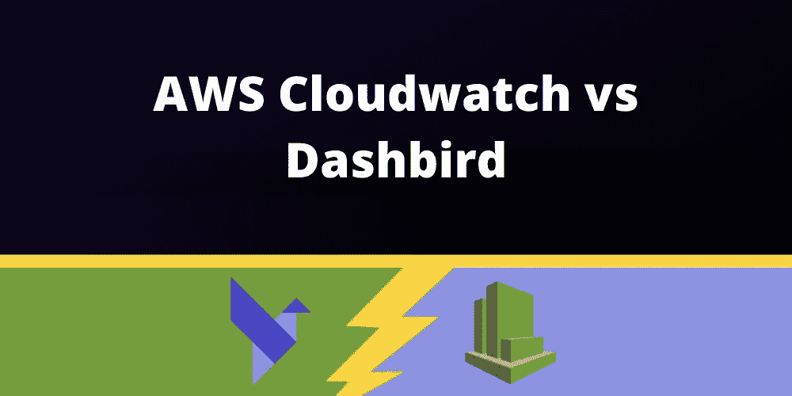
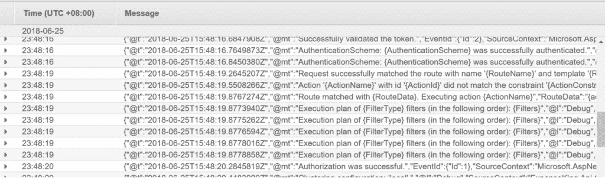
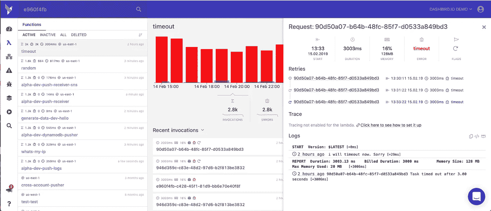
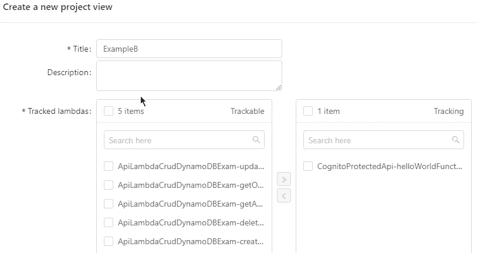
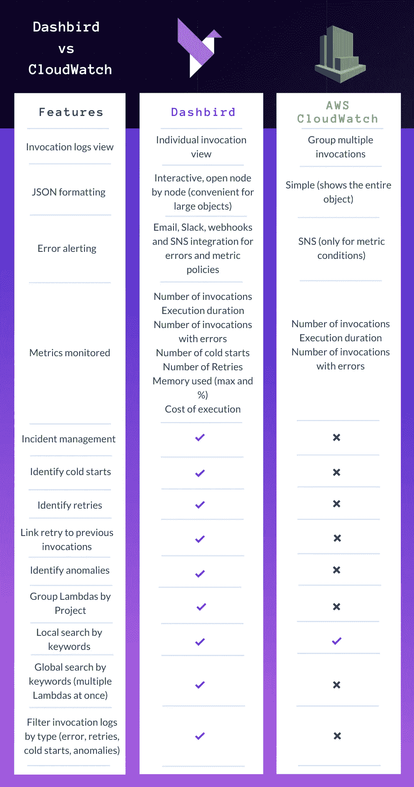

# AWS Cloudwatch vs Dashbird

> 原文：<https://blog.devgenius.io/aws-cloudwatch-vs-dashbird-65524c2bc83d?source=collection_archive---------4----------------------->

原文发表在这里:[https://dashbird.io/observability/cloudwatch-vs-dashbird/](https://dashbird.io/observability/cloudwatch-vs-dashbird/)

此时此刻，数十亿人正涌向互联网工作、娱乐、购物——一切，真的。我们开发了这个虚拟世界，并且不管外面发生了什么，我们都能让灯一直亮着，这真是太好了。

另一方面，**云系统和开发者正面临压力**以满足**空前的需求**。在 [Dashbird](https://dashbird.io/) ，我们一直认为开发人员应该拥有**最高效的工具**来**在几秒钟内发现并解决问题**，以保持云应用的平稳运行。

对于运行在 AWS 上的应用程序，CloudWatch 可能已经足够了。然而，在我们的研究中，我们发现仅依赖 CloudWatch 的团队**往往在问题**发现和解决时间**上落后于**。****

**我们编辑了 AWS Cloudwatch 与 Dashbird 之间的**功能比较**列表，以帮助您决定最有效的工具来满足您的特定需求。**

# **AWS 云监控**

**不要误会我的意思，Cloudwatch 无论如何都不是一个坏工具。事实上，如果你花时间去理解它的复杂性，那么跟踪**你的 AWS 栈**中正在发生的事情是相当不错的。它是 AWS 中监控云资源的首选工具，并允许您一起跟踪所有资源。**

****

**Cloudwatch 最好的特性之一是能够**设置高级提醒**，在我看来，这是相当高级的。例如，你可以设置它，这样当一个特定的函数使用 x 数量的内存或者运行时间超过 x 秒时，你就会得到提醒。每当提醒被触发时，提醒将被发送到您的电子邮件中。**

**我对 AWS Cloudwatch 的主要问题可能是它显示信息的方式。在云中运行一个实际的应用程序会使**导航日志**变得非常困难(我怎么强调都不为过)，尤其是当你有**多个资源**的时候。由于**日志都分组在一起**，即使信息都在里面，**也要花费大量的时间和精力来找出问题的根源**。甚至读取日志本身也很棘手，因为它只是一个长的无格式 JSON 字符串。**

# **Dashbird 无服务器可观测性**

**另一方面，Dashbird 并没有重新发明轮子。它只是让开发者更容易调试基于 Lambda 的应用程序，而没有过于复杂的 UI 和拥挤的屏幕信息。**

****

**查看调用日志视图。有了 **Cloudwatch** ，你通常会在一个屏幕上看到**你所有的调用。为了调试应用程序，你必须**手动筛选**所有日志来找到你正在寻找的特定调用。现在想象你有 10，50，100 个函数。它会很快失控！****

**切换回**仪表板**。**所有的函数都整齐地列在 Lambda 视图下**，点击函数**会列出该函数的调用**，从最近的开始。您也可以按以下方式轻松排序:**

*   **最高吞吐量**
*   **大多数错误**
*   **照字母顺序排列地**
*   **最慢响应时间**
*   **最耗时**
*   **或者通过我们的全球搜索功能按关键字搜索**

**当应用程序崩溃时，你需要一种方法来**快速调试问题**，你真的不能花 15 分钟的时间试图弄清楚你在看什么。**

**Dashbird 上 AWS Lambda 的聚合数据**

**日志本身是**格式的**，所以信息是**交互式的**，这对于**大型对象**来说非常方便，但是如果这不是你的风格，你可以随时切换回“**原始日志**”，并让它以类似于 Cloudwatch 显示日志的方式显示。**

**除此之外， [Dashbird](https://dashbird.io/) 有一个很酷的**事件管理平台**，它允许你**为警报创建自定义策略**。然后**可以选择一个渠道**来获取警报，可以是电子邮件、Slack、webhooks 或 SNS。您将**永远不会错过警告、错误，或者仅仅是关于对您真正重要的信息**！**

**Dashbird 的另一个很酷的功能是[项目视图](https://dashbird.io/blog/group-aws-lambda-functions-dashbird-project/)，它允许你**将项目中的某些功能**分组，**将这些功能作为一个组而不是单个功能**进行监控。这对运行在 AWS Lambda 上的**微服务非常有帮助。****

****

**在 Lambdas 上搜索关键词也很受欢迎，还有过滤器，允许你调出**冷启动**、**重试**、**超时**等等。**

**我可以继续下去，但我想我已经表达了我的观点，但万一你仍然不相信，请查看下面 Cloudwatch 和 Dashbird 之间的比较表，其中列出了每种服务必须提供的主要功能。**

# **AWS Cloudwatch vs Dashbird**

****

# **包扎**

**我是否谈到了这两款出色产品的每一个细节？肯定不是。我的比较是不是有点偏了？也许吧。值得自己花时间去尝试吗？绝对绝对。**

**想在无服务器监控中升级游戏吗？然后查看 [Dashbird app](https://dashbird.io/failure-detection/) 。它是**永远免费的**用于更小的基础设施(每月多达 1 百万次调用)或者[选择你自己的包](https://dashbird.io/pricing/)用于更多的每月调用。**