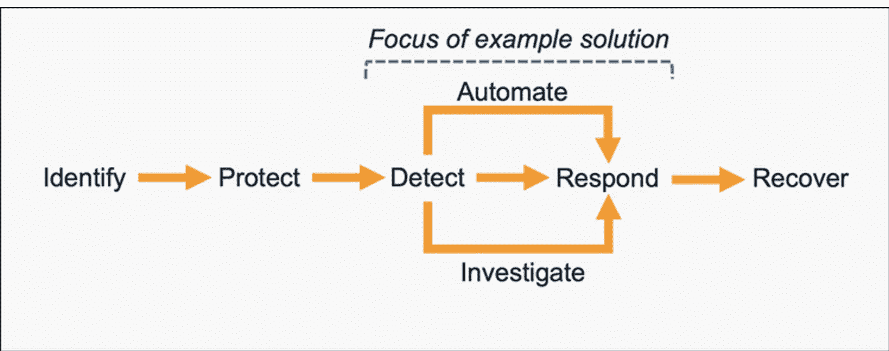
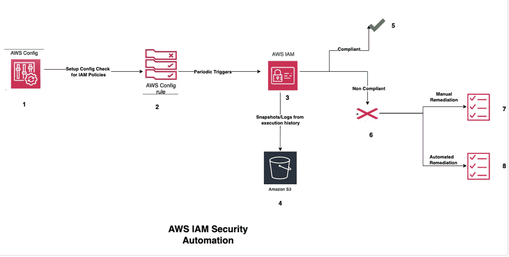
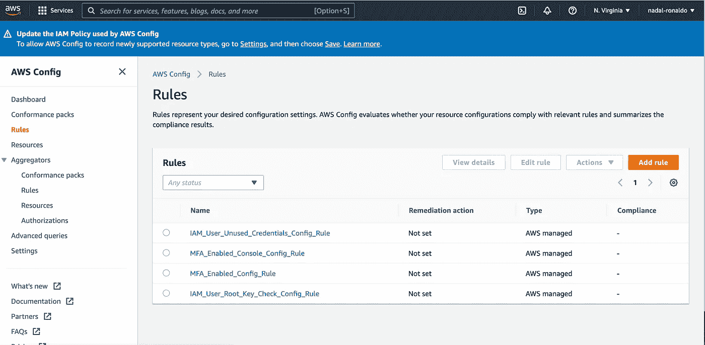

# AWS 配置- IAM 合规性

> 原文：<https://blog.devgenius.io/aws-config-iam-compliance-85220763bee5?source=collection_archive---------13----------------------->



这篇博客是我们从零开始讨论 **DevOps** 概念的系列文章的一部分，面向的是入门知识有限的读者。这篇文章属于*专家级*系列，因为它涉及到理解[A**WS Config**云服务的工作原理，以确保安全合规](https://aws.amazon.com/config/#:~:text=AWS%20Config%20is%20a%20service,recorded%20configurations%20against%20desired%20configurations.)[AWS IAM。](https://aws.amazon.com/iam/#:~:text=AWS%20Identity%20and%20Access%20Management%20(IAM)%20provides%20fine%2Dgrained,control%20across%20all%20of%20AWS.&text=IAM%20is%20a%20feature%20of,to%20the%20AWS%20Management%20Console.)

云系列中的一些早期博客如下。

[**tweet Bot**](https://awstip.com/aws-lambda-simple-tweetbot-2f2f83fbe161)[**Azure 功能-GitHub 动作**](https://towardsdev.com/deploying-on-azure-functions-github-actions-a8f2a98acc0f)[**事件 Bot**](/incident-bot-on-azure-functions-ed20da8af478)

## 什么是 AWS IAM？

IAM 代表身份和访问管理服务，它是使用一组正确的*角色、身份、组和策略*访问 AWS 帐户的基础。这些身份是多种多样的——控制台/cli 的人工访问，通过 [**AWS SDK**](https://aws.amazon.com/tools/) 用于自动化的服务帐户，附加到 AWS 服务的角色，用于访问业务用例的其他 AWS 服务。鉴于暴露密码风险的性质，应用一揽子访问策略——围绕 AWS IAM 的安全自动化对于小型初创公司和跨国公司都非常关键。

## 什么是 AWS 配置？

AWS 配置用于通过一些预定义的( **AWS 提供的)**或自定义策略( **AWS Lambda 执行**)来审计、访问和配置给定 AWS 帐户中的选定资源。除了审计之外，还可以使用手动/自动管道来定义资源补救规则。Config 减少了手动监视的需要，并且相同的规则可以跨多个 AWS 服务/帐户/业务域扩展。

## IAM 合规性使用案例

在这篇博客中，我们将使用 Terraform 自动化一些最常见的 IAM 合规性用例

i) **根用户密钥检查-** 该策略检查是否为**根用户生成了任何访问密钥。**根用户是 AWS 帐户上的超级管理员，对帐户中的所有服务拥有管理权限，易受攻击的风险最高。

ii) **启用 MFA 的帐户-** 此策略检查 AWS 帐户中的所有用户是否通过辅助设备进行多因素身份验证，而不是在其帐户上启用密码。

iii) **为策略 3 的控制台-** 子集启用 MFA，仅适用于启用了控制台密码的用户。

iv) **未使用的 IAM 凭证-** 此策略检查是否有在策略中定义的 X 天(默认为 90 天)内未使用的访问密钥

## AWS 配置自动化概述



## **图例**

**1–2**通过***AWS _ providers****在[***hashi corp***](https://www.hashicorp.com/)**社区使用 Terraform 模块设置 AWS 配置策略。
**2–3**每小时定期触发一次，检查 IAM 资源上的配置更改。
**3–4**从 ***AWS S3 桶*** 中的执行历史中捕获日志、快照。
**3–5**符合上述政策的 AWS IAM 资源标记为合规。
**3–6**符合上述策略的 AWS IAM 资源被标记为不合规。
**6–7**标记为 ***手动修复*** 的不符合资源。 **6–8**标记为 ***自动修复*的不符合资源。*****

*****注意** —由于使用其他自动化工具对 Terraform 的一些限制，我们将在另一篇博客中讨论 6–8***

## ***AWS 配置平台自动化***

## *****安装地形*****

***使用给定博客中的步骤—[https://blog . dev genius . io/public-cloud-first-static-website-7 d6f 7 c6f 794](/public-cloud-first-static-website-7d6f7c6f794)***

## *****创建模块*****

***使用下面的 ***main.tf*** 配置***

## *****运行模块*****

```
*****Initialising Modules**terraform init**Planning Modules**terraform plan**Applying Modules**terraform apply***
```

## *****配置规则的验证*****

***登录 AWS 控制台以验证以下内容***

*****AWS 配置规则设置*****

******

*****AWS S3 交付渠道设置*****

******

## ***额外资源***

***[](https://github.com/amit894/aws-config-terraform) [## GitHub-Amit 894/aws-Config-terraform:用于保护 AWS 资源的 AWS 配置

### 此时您不能执行该操作。您已使用另一个标签页或窗口登录。您已在另一个选项卡中注销，或者…

github.com](https://github.com/amit894/aws-config-terraform) 

*如需反馈，请留言至****Amit[dot]894【at】Gmail[dot]com****或联系*[*【https://about.me/amit_raj】*](https://about.me/amit_raj)*的任何链接。****