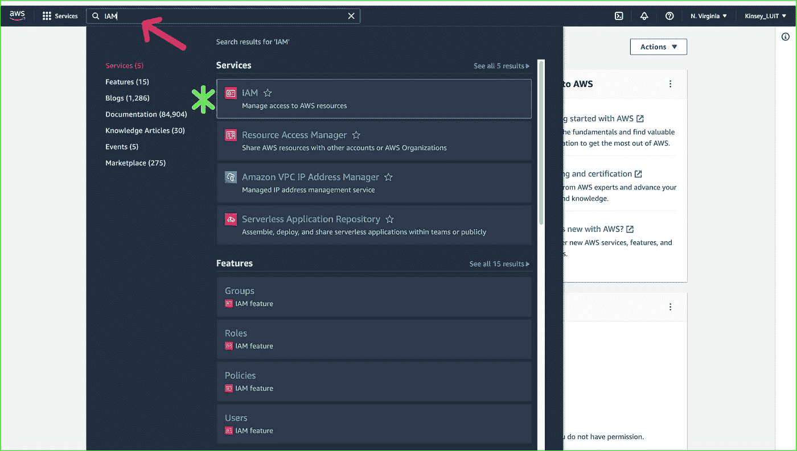
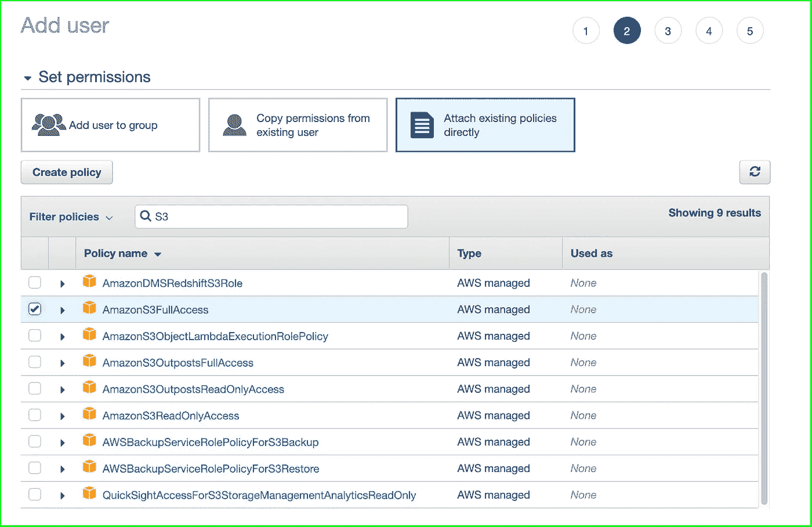
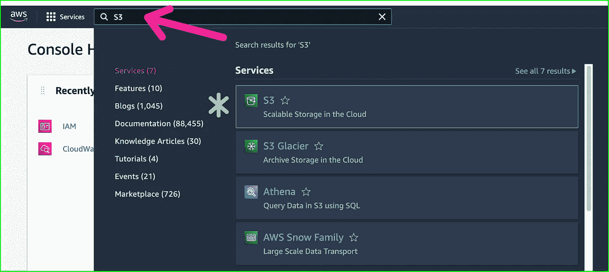

# AWS:使用新用户帐户创建一个 Amazon 简单存储服务(S3)存储桶

> 原文：<https://blog.devgenius.io/aws-creating-an-amazon-simple-storage-service-s3-bucket-with-a-new-user-account-53ad56b71df2?source=collection_archive---------12----------------------->

在这个分步教程中，我们将介绍 Amazon Web Services IAM ( *身份和访问管理*)控制台的基本特性。本教程的目标是从 root 创建一个新的用户配置文件，并使用该配置文件创建一个具有完全访问权限的 S3 存储桶。*让我们开始吧:*

# 步骤 1:创建新的用户帐户

登录到您的 AWS root 帐户后，您将开始创建一个名为“test-user”的新用户帐户。首先，在 AWS 仪表板搜索栏中搜索“IAM”。

点击“IAM —管理对 AWS 资源的访问*”*链接:

接下来，导航到控制面板的左侧，单击“访问管理”选项卡下的“用户”——选择“添加用户”以开始添加您的测试用户信息的设置。

在这里，您将设置新用户的详细信息:

*   **创建用户名**
*   **选择 AWS 凭证类型**
*   **设置控制台密码** —可选择让您的新用户在下次登录时被提示创建新密码。

做出选择后，单击页面右下角的蓝色“权限”按钮。

我们将一起导航到权限部分——

对于我们的新测试用户，我们希望授予他们 S3 的完全访问权限。为此，单击“直接附加现有策略”框，在搜索栏中搜索“S3”，然后选择标记为“ **AmazonS3FullAccess** 的策略点击右下角的【下一页:标签】按钮继续。

为您的测试用户设置权限，直到您完成第 5 步—成功页面！在这个页面上，您需要下载。csv 文件供将来使用。如下图所示，该文件包含:用户名、密码、访问密钥 ID、秘密访问密钥和控制台登录链接。

**为了安全起见，我模糊了测试用户的信息，但是我想向你展示这个页面的一般格式。*

我们将关闭这个页面，并开始为我们的新测试用户创建一个 S3 存储桶。

# 步骤 2:创建 S3 存储桶

为了上传您的数据(照片、视频、文档等)。)要访问亚马逊 S3，您必须首先在其中一个 AWS 区域创建一个 S3 时段。

*什么是 S3 铲斗？*桶是存放在亚马逊 S3 的物品的容器。您可以在一个存储桶中存储任意数量的对象，并且您的帐户中最多可以有 100 个存储桶。

***让我们创造我们的 S3 斗:***

的。上一步中的 csv 文件将为您提供一个控制台登录链接—您可以使用它作为测试用户登录。

一旦你作为测试用户登录，你将在搜索栏中搜索“S3 ”,然后点击 S3 链接，如下所示:

接下来，您将通过选择“创建存储桶”来创建您的存储桶

从这里开始，系统会提示您命名存储桶。Amazon 已经制定了 bucket 命名规则，在命名 bucket 之前通读文档是一个好主意。

亚马逊 S3 存储桶名称是全球唯一的，这意味着在创建存储桶后，该存储桶的名称不能被任何 AWS 地区的其他 AWS 帐户使用，直到该存储桶被删除。明智地命名你的桶；)

一旦您创建了您唯一的 S3 存储桶，它将自动添加到存储桶列表中，您将收到以下通知:
***成功创建存储桶" my-testuser-content-2022 "***

祝贺你的努力！您刚刚为您的测试用户创建了一个拥有完全权限的 S3 存储桶！

