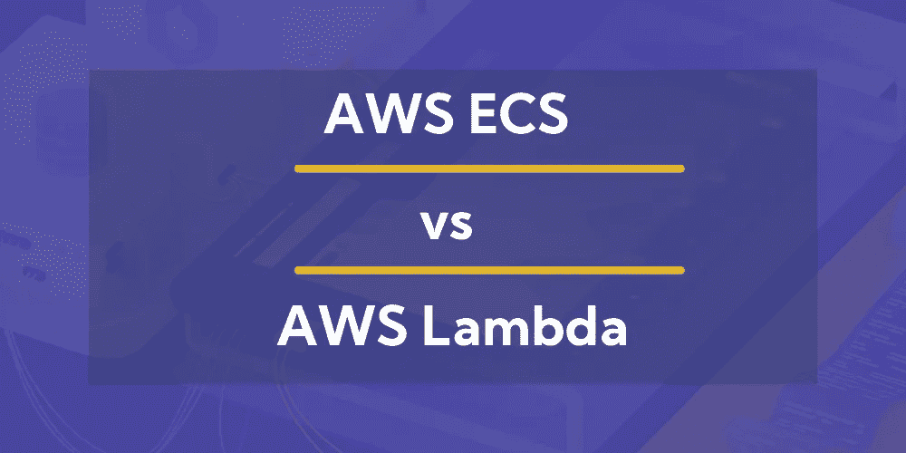

# AWS ECS 与 AWS Lambda

> 原文：<https://blog.devgenius.io/aws-ecs-vs-aws-lambda-785b7bca2d32?source=collection_archive---------14----------------------->

亚马逊 ECS 和 AWS Lambda 同时推出。它们都是服务，都是由亚马逊提供的。一个更通用的术语是“云服务”。那么这两者有什么区别呢？这两种服务的目的是一样的:提供一个可以运行应用程序的环境——确切地说是一个计算环境。在这个环境中，您可以访问服务和一些微服务，这些服务可以帮助您比在公司的服务器上更快地开发和部署应用程序。

# 亚马逊弹性容器服务(ECS)

我们先从亚马逊 ECS 说起。该服务提供了在 AWS 服务器上运行 Docker 容器的可能性。好处是，这些 Docker 容器可以运行一个应用程序，而不管它是用什么编程语言编写的。Amazon EC2 实例可以由用户根据自己的需要手动配置。这些 Amazon EC2 实例运行在一个服务器集群中，可以在 AWS 工具的帮助下进行配置。这些实例中的每一个都可以配置为在特定的时间运行，具有特定的大小，并处理特定数量的资源。然而，您开发和运行的代码取决于所述 Docker 容器。

# 自动气象站λ

相比之下，亚马逊 AWS Lambda 使用 [lambda 函数](https://dashbird.io/blog/what-is-a-lambda-function/)，这些函数是专门为 Lambda 编写的代码。服务器管理部分由 AWS 以自动方式处理，云中的服务器执行代码的方式不由用户决定。Lambda 函数的功能是有限的，它们必须保持简单。AWS Lambda 活动跟踪可以通过一组工具来完成，您可以从中进行选择。简而言之，Amazon ECS 的集群服务器是由用户设置的，而对于 AWS Lambda，底层结构是由系统处理的。AWS Lambda 还支持一些编程语言，相比之下，Amazon ECS 可以在其容器中运行任何代码。如果你熟悉 Linux 环境和它可以运行的编程语言，那么 AWS Lambda 可能是你需要的东西。您可以查看在线论坛或邮件列表中的 AWS Lambda c#示例，了解相同的代码如何在 Linux 和 AWS Lambda 环境中运行。AWS Lambda 的优点是伸缩是自动的，不需要像 Amazon ECS 那样配置环境。如果您是 Python 或 JAVA 开发人员，这可能是您快速部署应用程序所需要的。

# 亚马逊 ECS vs 亚马逊 Lambda

*剧透！没有赢家！*

好吧，这不是真正的比赛。你选择 Lambda 而不是 ECS 的原因有很多，反之亦然，这取决于你对这两种环境的理解，并在适当的时候做出正确的决定。

如果您选择的编程语言不在 Amazon AWS Lambda 列表中，那么您可能希望使用 Docker 容器并使用 Amazon ECS。如果能看到 Amazon AWS Lambda 中的透明性和易用性，以及在容器环境中运行应用程序的能力，那就太好了。对于想要速度和大量选项的开发人员来说，这将是天作之合。Lambda 函数简单且易于编写，但 Docker 容器可以扩展到运行几乎任何数量的代码。人们可以在家用计算机上开发这样的代码，然后通过使用预先配置的容器来上传和管理编译过程。

需要注意的是， [Amazon Lambda 定价](https://dashbird.io/lambda-cost-calculator/)可能会达到一定的水平，这取决于代码的执行时间。人们可能会认为在 Amazon EC 环境中 Docker 容器是一个更好的选择，但事实是 Amazon AWS 由于易用性以及大多数人使用 Python、Java 和其他编程或脚本语言(Amazon marketing department 认为这些语言是他们的客户所必需的)的事实而越来越受欢迎。AWS Lambda 限制似乎被绝大多数客户忽略了，所以亚马逊必须在这种服务上做一些正确的事情。当好处是快速配置和高效的编程环境时，缺乏透明性可能不会困扰许多人。

AWS 无服务器架构已经存在了几年，中小型公司发现使用亚马逊服务器集群比让他们自己的公司服务器承担处理时间更容易，处理时间比几美元可以买到的慢几十倍甚至几百倍。功能即服务故障排除也是一个必须考虑的因素，因为使用快速云服务比依靠自己的服务器管理员进行故障排除更容易。让我们不要忘记，基于日志的[无服务器监控](https://dashbird.io/serverless-observability/)是一种监视您的流程或在发生变化或发生事情时通过电子邮件发出警报的简单方法。这些只是无服务器架构的一些[优势，人们已经抓住它们一段时间了。](https://dashbird.io/knowledge-base/basic-concepts/serverless-advantages-and-use-cases/)

*更多内容尽在*[*blog . devgenius . io*](http://blog.devgenius.io)*。*