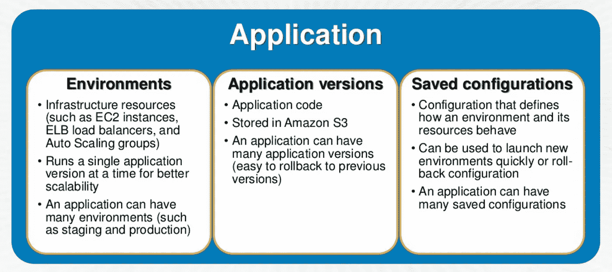
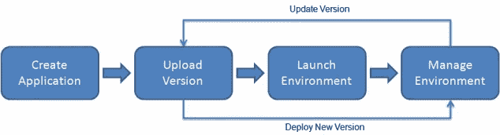
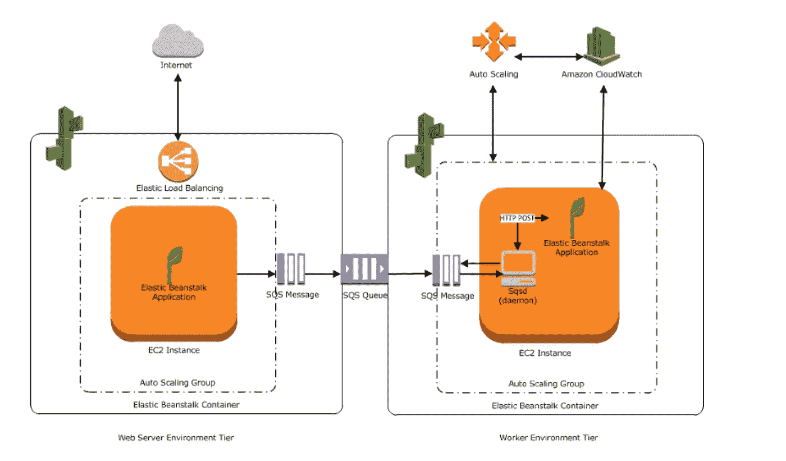

# AWS 弹性豆茎

> 原文：<https://blog.devgenius.io/aws-elastic-beanstalk-bb02422d61de?source=collection_archive---------14----------------------->

# AWS 弹性豆茎

*   AWS Elastic Beanstalk 有助于在 AWS 云中快速部署和管理应用程序，而不必担心运行这些应用程序的基础架构。
*   弹性 Beanstalk 降低了管理复杂性，而不会限制选择或控制。
*   通过简单的上传，Elastic Beanstalk 可以为应用程序实现自动化的基础设施管理和代码部署，包括
*   应用平台管理
*   容量供应
*   负载平衡
*   自动缩放
*   代码部署
*   健康监控
*   一旦应用程序被上传，Elastic Beanstalk 会自动启动一个环境，创建并配置运行代码所需的 AWS 资源。环境启动后，可以对其进行管理并用于部署新的应用程序版本
*   由 Elastic Beanstalk 启动的 AWS 资源是完全可访问的，即 EC2 实例可以被存储到
*   Elastic Beanstalk 为开发人员和系统管理员提供了一种简单、快速的方法来部署和管理应用程序，而不必担心 AWS 基础设施。
*   如果要使用的内部 AWS 资源是已知的，并且需要细粒度的控制，那么使用模板的云形成是一个更好的选择

# 弹性豆茎组件

应用

*   弹性 Beanstalk 应用程序是弹性 Beanstalk 组件的逻辑集合，包括环境、版本和环境配置。

应用程序版本

*   应用程序版本是指 web 应用程序的可部署代码的特定的、带标签的迭代
*   应用程序可以有许多版本，每个应用程序版本都是唯一的，并且指向一个 S3 对象
*   可以为一个应用程序部署多个版本来测试差异，并在出现问题时帮助回滚到任何版本

环境

*   环境是部署到 AWS 资源上的版本
*   一个环境一次运行一个应用程序版本，但是同一个应用程序版本可以跨多个环境部署
*   创建环境时，Elastic Beanstalk 会提供运行您指定的应用程序版本所需的资源。

环境配置

*   环境配置标识了定义环境及其相关资源行为方式的参数和设置的集合
*   当环境的配置设置更新时，Elastic Beanstalk 会自动将更改应用到现有资源，或者根据更改删除和部署新资源

配置模板

*   配置模板是创建独特环境配置的起点

# 弹性豆茎建筑

*   弹性 Beanstalk 环境需要一个环境层、平台和
    环境类型
*   环境层决定了 Elastic Beanstalk 是提供资源来支持处理 HTTP(S)请求的 web 应用程序，还是支持处理后台处理任务的 web 应用程序

**网络环境层**

*   其 web 应用程序处理 web 请求的环境层称为 web 服务器层。
*   为 web 环境层创建的 AWS 资源包括一个弹性负载平衡器、一个自动伸缩组、一个或多个 EC2 实例
*   每个环境都有一个指向 ELB 的 CNAME URL，别名为 53 号公路到 ELB URL
*   运行应用程序的每个 EC2 服务器实例都使用一个容器类型，它定义了基础设施拓扑和软件堆栈
*   称为主机管理器(HM)的软件组件运行在每个 EC2 服务器实例上，负责

> 部署应用程序
> 
> 通过控制台、API 或命令行聚合事件和指标以供检索
> 
> 生成实例级事件
> 
> 监控应用程序日志文件中的关键错误
> 
> 监控应用服务器
> 
> 修补实例组件
> 
> 旋转应用程序的日志文件并将其发布到 S3

**工人环境层**

*   其 web 应用程序运行后台作业的环境层称为工作层
*   为工作环境层创建的 AWS 资源包括一个自动缩放组、一个或多个 EC2 实例和一个 IAM 角色。
*   对于工作环境层，如果不存在 SQS 队列，Elastic Beanstalk 还会创建并提供一个
*   当启动一个工作环境层时，Elastic Beanstalk 会为所选择的编程语言安装必要的支持文件，并在自动伸缩组中的每个 EC2 实例上安装一个守护程序，从同一个 SQS 队列中读取数据
*   守护进程负责从 SQS 队列中提取请求，然后将数据发送到在工作环境层中运行的 web 应用程序，该应用程序将处理这些消息
*   Elastic Beanstalk worker 环境支持 SQS 死信队列，该队列可用于存储无法成功处理的消息。死信队列提供了搁置、隔离和分析未成功处理的消息的能力
*   一个环境不能支持两个不同的环境层，因为每个环境层都需要自己的一组资源；工作环境层和 web 服务器环境层都需要一个自动伸缩组，但是 Elastic Beanstalk 只支持每个环境一个自动伸缩组。

# 弹性豆茎和其他 AWS 服务

*   Elastic Beanstalk 支持 VPC，并将 AWS 资源(如实例)投放到 VPC
*   Elastic Beanstalk 支持 IAM 并帮助您安全地控制对 AWS 资源的访问。
*   在创建和部署了弹性豆茎之后，可以使用 CloudFront 在 S3[分发内容](https://jayendrapatil.com/aws-simple-storage-service-s3-overview/)

云迹

*   Elastic Beanstalk 与 CloudTrail 集成在一起，cloud trail 是一个服务，它捕获所有的 Elastic BeanstalkAPI 调用，并将日志文件传递到您指定的 S3 存储桶。
*   CloudTrail 从 Elastic Beanstalk 控制台或从您的代码到 Elastic Beanstalk APIs 捕获 API 调用，并帮助确定向 Elastic Beanstalk 发出的请求、发出请求的源 IP 地址、发出请求的人、发出请求的时间等。

无线电数据系统

*   Elastic Beanstalk 支持在 Elastic Beanstalk 环境中运行 RDS 实例，这是开发和测试的理想环境，但不适用于生产。
*   对于生产环境，不建议这样做，因为它将数据库实例的生命周期与应用程序环境的生命周期联系在一起。因此，如果删除了弹性 beanstalk 环境，RDS 实例也会被删除
*   建议在环境之外启动一个数据库实例，并配置应用程序在 Elastic Beanstalk 提供的功能之外连接到它。
*   使用环境外部的数据库实例需要额外的安全组和连接字符串配置，但它也允许应用程序从多个环境连接到数据库，使用集成数据库不支持的数据库类型，执行蓝/绿部署，以及在不影响数据库实例的情况下拆除环境。

S3

*   Elastic Beanstalk 为创建环境的每个区域创建一个名为*elastic Beanstalk-region-account-id*的 S3 存储桶。
*   Elastic Beanstalk 使用存储桶来存储应用程序版本、日志和其他支持文件。
*   它对其创建的存储桶应用存储桶策略，以允许环境写入存储桶并防止意外删除