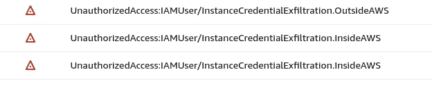

# 带 VPC 端点的 AWS 守卫任务渗出旁路

> 原文：<https://blog.devgenius.io/aws-guardduty-exfiltration-bypass-4720f6ed16a4?source=collection_archive---------1----------------------->

2022 年 1 月 20 日，[亚马逊 AWS 在 GuardDuty 中引入了](https://docs.aws.amazon.com/guardduty/latest/ug/guardduty_finding-types-iam.html#unauthorizedaccess-iam-instancecredentialexfiltrationinsideaws)新的威胁检测规则。

[GuardDuty](https://aws.amazon.com/guardduty/) 是一项 AWS 服务(仅 30 天免费)，可以检测你的 AWS 账户中的可疑活动；例如，如果 EC2 实例(基本上是云中的一个虚拟机)正在 AWS IPs 上执行端口扫描，它会向您发出警报。

**当 EC2 实例证书用于从一个 IP 地址调用 API 时，新的警报会通知您，该 IP 地址属于与运行相关 EC2 实例的 AWS 帐户不同的 AWS 帐户。**

新发现的名称是:

*   *unauthorized access:iam user/instanceredentialexfiltration。内幕*

AWS 内部凭证泄露*的新警戒*

# 这是什么意思？

EC2 实例凭据是通过 EC2 元数据服务(端点:[*http://169 . 254 . 169 . 254*)](http://169.254.169.254))提供的临时凭据，当 AWS 身份和访问管理(IAM)角色附加到某个实例时，该凭据可用于该实例上运行的任何应用程序。

根据附加到实例的 IAM 角色中定义的权限，这些凭据可用于恶意调用 API。

如果攻击者能够使用例如 RCE、XXE 或 SSRF 漏洞来访问 EC2 的元数据服务，则他可以扮演附加到实例的角色，并在 AWS 组织中执行横向移动或权限提升。

从实例元数据服务转储 EC2-元宇宙角色的命令

# 以前怎么样？

在 2022 年 1 月 20 日之前，如果凭证被盗，攻击者可以使用**任何** AWS 帐户来绕过检测。

如果攻击者试图在受危害的 AWS 主机(例如攻击者的笔记本电脑)之外使用这些凭据，将会触发警戒警报，并通过签名通知安全团队:[*unauthorized access:iam user/instanceredentialexfiltration。*](https://docs.aws.amazon.com/guardduty/latest/ug/guardduty_finding-types-iam.html#unauthorizedaccess-iam-instancecredentialexfiltrationoutsideaws)*。*

**

**AWS* 外证件外漏警戒*

*然而，攻击者可以使用 EC2 实例来绕过检测，因为警报只检测凭证是否在 AWS 的之外使用**，而不是受害者的特定 AWS 帐户。***

*绕过旧检测的步骤:*

*   *攻击者获得了对 EC2 实例的访问权*
*   *攻击者转储 EC2 附加的角色凭证*
*   *攻击者在自己的 AWS 帐户上生成一个云外壳或 EC2 实例*
*   *攻击者在其云外壳或 EC2 实例中导入窃取的凭证*

# *VPC 端点*

*对于新的威胁检测，无法执行上述步骤，因为 AWS 还会检测到*内部的*泄漏。这意味着 AWS 将检查执行 API 请求的 IP 是否与用于验证 API 调用的 IAM 角色的同一个 AWS 帐户相关联。*

*一旦亚马逊发布了新的检测渗透测试仪，[尼克·弗里切特](https://twitter.com/Frichette_n/status/1484314130626449417)，使用 [VPC 端点](https://docs.aws.amazon.com/vpc/latest/privatelink/vpc-endpoints.html)找到了一个旁路。*

*请记住，VPC 终端并不是免费的，尽管它的成本很低。*

*这意味着，如果攻击者能够从 EC2 实例窃取 IAM 凭据，他就可以使用配置为通过 VPC 端点路由流量的个人 EC2 实例中的凭据，因为它们不会使用公共 IP 来调用 AWS APIs。*

*VPC 端点支持虚拟私有云(VPC)和支持服务之间的连接，而无需使用互联网网关:流量在内部路由到 AWS。*

*有两种类型的 VPC 端点:*

*   ***接口**:子网内具有私有 IP 的网络接口，作为发往 AWS 服务的流量的入口点*
*   ***网关**:去往 S3 或 DynamoDB 服务的流量的路由目标*

*对于旁路，使用第一种类型。*

*为了更快、更容易地实现设置过程的自动化，创建了 [SneakyEndpoints](https://github.com/Frichetten/SneakyEndpoints) (使用[这个分支](https://github.com/notdodo/SneakyEndpoints)进行基于 EU-的部署)。*

*SneakyEndpoint 项目使用 Terraform 为攻击者构建了一个相当完整的环境:*

*   *在私有子网中创建一个 EC2 实例(没有互联网访问)*
*   *创建多个 VPC 端点来与 S3、EC2、RDS、EBS、ECS、RedShift、CloudTrail、STS、CodePipeline、KMS、Lambda、SNS、SQS 服务进行通信*

*要使用该项目:*

1.  *`git clone [https://github.com/notdodo/SneakyEndpoints.git](https://github.com/notdodo/SneakyEndpoints.git)`*
2.  *用要使用的 AWS 配置文件编辑`provider.tf`文件*
3.  *`terraform init`*
4.  *`terraform apply`*
5.  *等待部署，然后使用 EC2 网页使用 SSM 连接到`sneakyendpoints_host`实例*

**

*使用 SSM 连接到 EC2*

*进入 EC2 后，确认实例未连接到互联网。*

**

*无法上网*

*现在在攻击者 EC2 实例中导入 exfiltrated 凭据。*

**

*凭据导入和 EC2 列表*

*继续攻击链，触发任何警戒。*

**

*无 GuardDuty 调查结果*

> *利润！*

*`terraform destroy`一旦攻击完成，不要忘记运行，以免面临无用的计费。*

# *结论*

*没有新的 AWS GuardDuty 威胁检测，凭据导出更容易，因为它在任何 AWS 帐户中只需要一个 Cloud Shell 或一个 EC2。*

**

*这种新的检测方法，即使使用了 SneakyEndpoint 旁路，也不像以前那样简单，亚马逊在保护我们的云环境方面做了大量的工作。*

## *参考*

*   *[https://AWS . Amazon . com/blogs/AWS/Amazon-guard duty-enhancer-of-ec2-instance-credential-exfilling/](https://aws.amazon.com/blogs/aws/amazon-guardduty-enhances-detection-of-ec2-instance-credential-exfiltration/)*
*   *[https://docs . AWS . Amazon . com/guard duty/last/ug/guard duty _ find-types-iam . html # unauthorized access-iam-instance cecredentialysionsensideaws](https://docs.aws.amazon.com/guardduty/latest/ug/guardduty_finding-types-iam.html#unauthorizedaccess-iam-instancecredentialexfiltrationinsideaws)*
*   *[https://docs . AWS . Amazon . com/VPC/last/private link/VPC-endpoints . html](https://docs.aws.amazon.com/vpc/latest/privatelink/vpc-endpoints.html)*
*   *[https://twitter.com/Frichette_n/status/1484314130626449417](https://twitter.com/Frichette_n/status/1484314130626449417)*
*   *[https://github.com/Frichetten/SneakyEndpoints](https://github.com/Frichetten/SneakyEndpoints)*