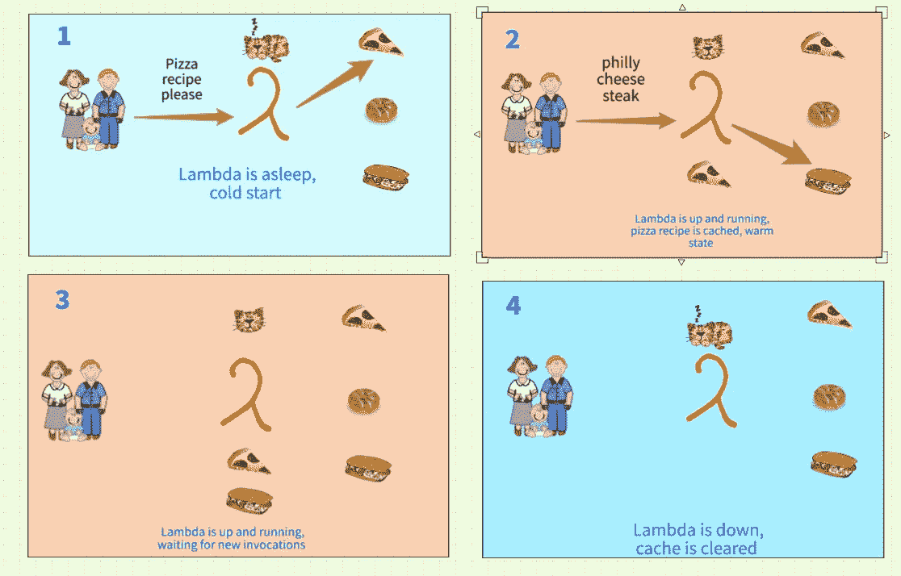
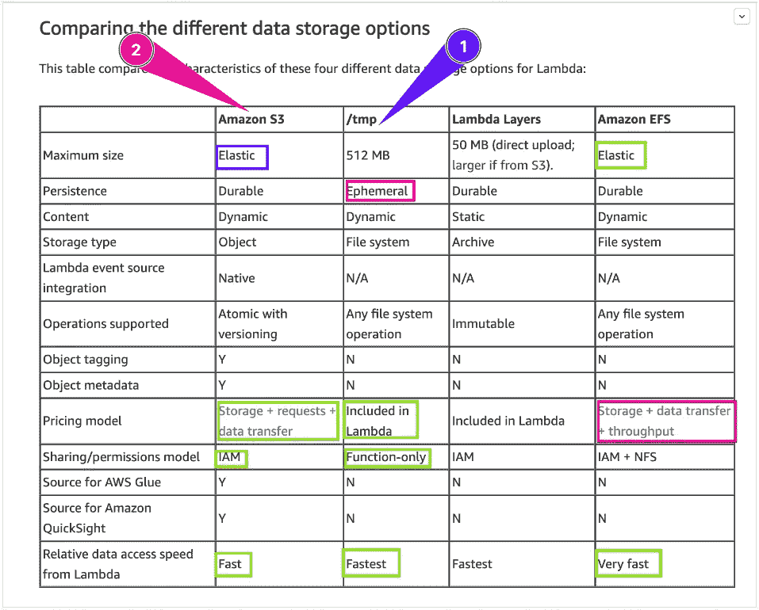

# AWS Lambda 缓存？为什么？又是怎么做到的？

> 原文：<https://blog.devgenius.io/aws-lambda-caching-why-and-how-bd3c2d500c?source=collection_archive---------0----------------------->


使用 Lambda 缓存

Why？

AWS Lambda 中的缓存策略是我在编写代码时不常考虑的，特别是当需求集中在执行一个原子任务时，众所周知，运行 Lambda 函数的成本很低，通常不超过几秒钟就可以满足调用请求。

对 Lambda 生命周期的误解以及 Lambda 依赖第三方数据的情况可能会导致一些性能问题。

例如，我遇到了一个场景，Lambda 每次需要向 *confluent Kafka* 主题发布 *Avro* 消息时，都必须从 *confluent Kafka registry* 获取一些 Avro 模式，由于在代码中保存模式是一个糟糕的做法，因为模式可能随时发生变化，这将要求我们在所有环境中重新部署 Lambda，我想到了一种可以缓存模式，并定期刷新这些模式并将它们从模式注册表中取出的方法。

促使我探索 Lambda 函数的缓存选项的两个原因是:

*   调用 AWS 帐户之外的另一个服务的成本，在那里我们运行 lambda 函数。
*   对被叫服务的配额限制(在某些情况下，你被限制在每秒一定数量的呼叫)。

How？

根据 ***CloudGuru*** 的分析，“ *AWS Lambda 通常会在 45-60 分钟的不活动状态后终止功能，尽管空闲功能有时可以提前很多时间终止，以释放其他客户所需的资源。”*



这意味着 Lambda 将处于 ***warm*** 状态，并准备好接收调用，它不会在处理一个事件后立即消失，所以如果 Lambda 经常被调用，考虑缓存是一个好主意。以下是一些可用的选项，可以帮助您提高性能并最大限度地减少服务时间:

> Lambda 运行时环境中的缓存

这个选项是最容易实现的，开发人员不需要特意设置任何基础设施，或者使用其他库。

通过在处理程序范围之外定义一个**全局**变量*，并在 Lambda 第一次被调用时初始化它，只要 Lambda 还活着*，你就可以访问变量值。**

*在下面的代码中，我在*处理程序*作用域之外的**全局**作用域中定义了*模式*，并使用 *fetch_schema()* 函数在 ***null*** 的情况下初始化模式，或者如果不是第一次调用 Lambda，则返回 ***缓存的*** 模式。*

```
*import json

schema = ""

def lambda_handler(event, context):
 **global schema**    schema = fetch_schema()
    return {
        'statusCode': 200,
        'body': json.dumps('Hello from Lambda!')
    }

def fetch_schema():
 **global schema**    print("Schema is : "+ schema)
    if not schema:
        # call schema registery and fetch schema 
        schema = fetch_schema_by_id_from_registry()
    return schema 

def fetch_schema_by_id_from_registry():
    print("Getting schema Id thru SchemaRegistryClient")
    return "hey there"*
```

> *2)缓存工具 python 库*

*第二个选项也很容易实现，但是你必须使用 ***Cachetools*** 库来管理 Lambda 中的缓存。*

> *这个模块提供了各种记忆集合和装饰器，包括 Python 标准库的 [@lru_cache](http://docs.python.org/3/library/functools.html#functools.lru_cache) 函数装饰器的变体。对于本模块来说，*缓存*是一个固定最大大小的[可变](http://docs.python.org/dev/glossary.html#term-mutable)映射[。当缓存已满时，即通过添加另一个项目，缓存将超过其最大大小，缓存必须基于合适的](http://docs.python.org/dev/glossary.html#term-mapping)[缓存算法](http://en.wikipedia.org/wiki/Cache_algorithms)选择要丢弃的项目。
> 来源:[https://pypi.org/project/cachetools/](https://pypi.org/project/cachetools/)*

```
*import json
from cachetools import cached, LRUCache, TTLCache

def lambda_handler(event, context):
    schemaId = event['schemaId']
    schema = fetch_schema(schemaId)
    return {
        'statusCode': 200,
        'body': json.dumps('Hello from Lambda!')
    }

**@cached(cache=TTLCache(maxsize=1024, ttl=600))** def fetch_schema(schemaId):
    return fetch_schema_by_id_from_registry()

def fetch_schema_by_id_from_registry():
    print("Getting schema Id thru SchemaRegistryClient")
    return "hey there"*
```

> *3) Lambda 缓存 python 库*

**lambda-cache* 帮助你从一个调用到另一个调用缓存 lambda 函数中的数据。它利用 lambda 函数的[执行上下文](https://docs.aws.amazon.com/lambda/latest/dg/runtimes-context.html)的内部存储器来跨多个调用存储数据，这:*

*   *减少后端系统的负载*
*   *减少 lambda 的执行时间*
*   *保证函数在缓存过期后引用最新数据*

## *使用 Lambda 缓存库提供了 3 个选项:*

*   *缓存单个参数*
*   *机密管理器中的缓存*
*   *S3 的缓存*

```
*@ssm.cache(parameter='/production/app/var1', max_age_in_seconds=30)
@ssm.cache(parameter='/production/app/var2', max_age_in_seconds=60)
def handler(event, context):
  var1 = getattr(context,'var1')
  var2 = getattr(context,'var2')
  response = do_something(var)
    return response*
```

> *比较不同的数据存储选项*

*AWS 网站上的下表提供了不同数据存储选项之间的比较，正如您可以在(1)中看到的，它被认为是最快的，因为数据被缓存在 Lambda 函数中，但有大小限制。(2)如果您担心文件大小，S3 更合适，但是它比选项(1)慢，因为 Lambda 必须从 S3 请求数据。*

*因此，要选择一个缓存选项，您必须考虑您的情况:
1)我是否有一个大文件要缓存？还是小的？— **内存**2)数据/文件多久更改一次？— **频率**
3)如果需要，我如何恢复缓存？— **缓存控制***

**

*来源:[https://AWS . Amazon . com/blogs/compute/choosing-between-AWS-lambda-data-storage-options-in-we B- apps/](https://aws.amazon.com/blogs/compute/choosing-between-aws-lambda-data-storage-options-in-web-apps/)*