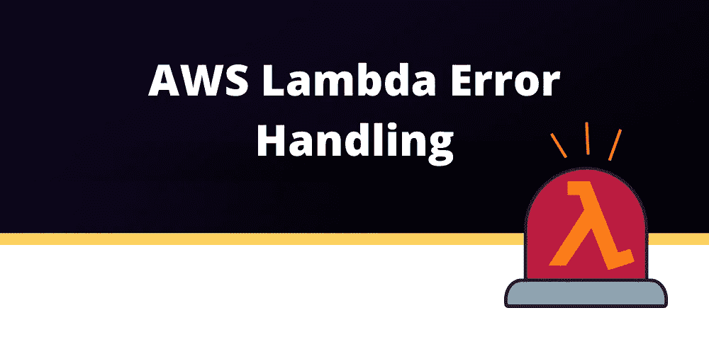
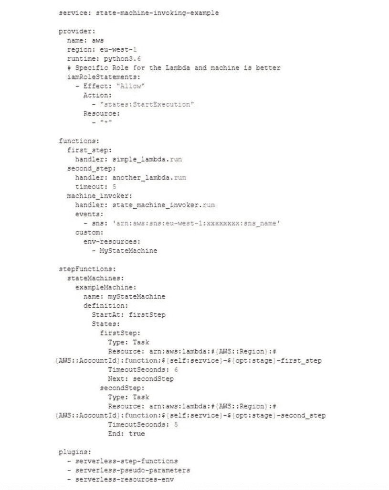
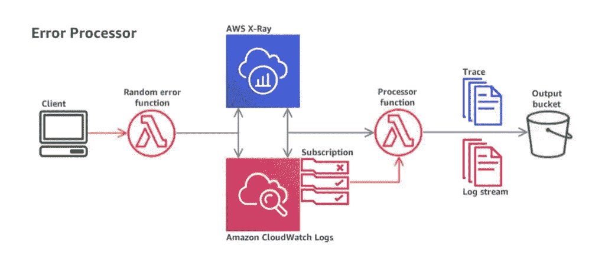
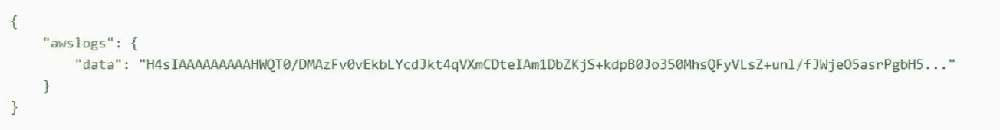
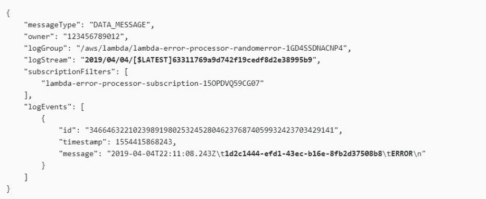
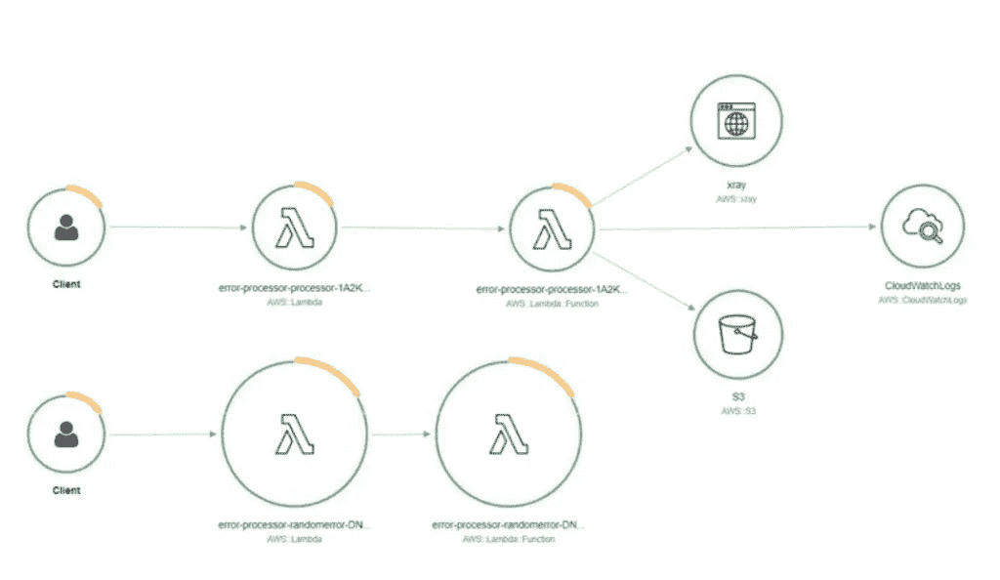
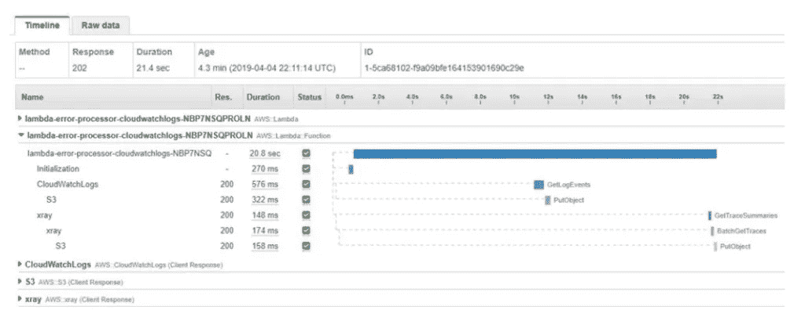
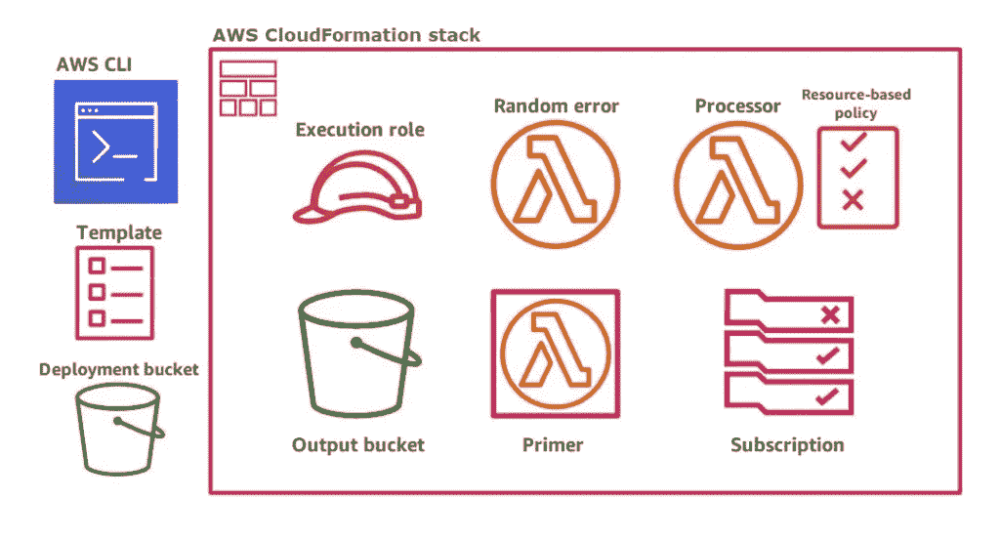

# AWS Lambda 错误处理

> 原文：<https://blog.devgenius.io/aws-lambda-error-handling-dfe2285f9a85?source=collection_archive---------1----------------------->

在本文中，我们将讨论您需要了解的关于 AWS Lambda 错误处理的基础知识，以及一些使用阶跃函数和 X 射线的流行方法。不管你是 AWS Lambda 专家还是 Lambda 新用户，**总有新东西要学。您可能已经遇到过 Lambda 错误，这些错误看起来很有挑战性，因为运行 [Lambda 重试](https://dashbird.io/knowledge-base/aws-lambda/retries-and-idempotency/)的机制通常会使您难以跟踪无服务器应用程序中发生的变化。**

[无服务器](https://dashbird.io/knowledge-base/basic-concepts/what-is-serverless/)不完全是关于直接执行 [Lambda 函数](https://dashbird.io/knowledge-base/aws-lambda/anatomy-of-a-lambda-function/)的代码，而是你的整个系统的**不同类型的架构。这个体系结构中的分布式节点由于异步事件而被激活，这就是这个系统的组成部分。**

> 每个节点都必须设计成一个单独的部分，有自己的 API。

为了学习如何准确定义所有这些节点，你必须知道如何处理 Lambda 错误。此外，也有必要适当地处理 Lambda 重试行为。

因此，让我们直接进入**AWS Lambda 重试和错误是如何工作的**，以及围绕它的所有讨论。

# Lambda 重试行为

Lambda 函数可能会失败(*它们将会失败*)，当它们失败时，是因为以下情况之一:

*   [**内存不足**](https://dashbird.io/event-library/aws-lambda/aws-lambda-out-of-memory/) —如果内存不足，Lambda 通常会以消息*“进程在完成请求前退出”终止**“内存大小”*始终与*“最大已用内存”相同*你可以在这里了解更多关于资源分配和 AWS Lambda 内存[。](https://dashbird.io/knowledge-base/aws-lambda/resource-allocation-and-performance/)
*   **引发未处理的异常** —可能是因为编程错误、外部 API 故障或收到无效输入而发生。
*   **超时** — *'* [*任务在 X 秒后超时*](https://dashbird.io/event-library/aws-lambda/aws-lambda-task-timed-out-after/) *'* 当 Lambda 因运行时间超过预先配置的超时持续时间而剧烈关闭时，出现消息。最大值是五分钟，默认值是六秒。

当故障发生时，它将在某个时间点发生，您很可能会注意到基于这些行为的 **Lambda 重试:**

*   **基于流的事件** —如果当前事件仅为 [DynamoDB 流](https://dashbird.io/knowledge-base/dynamodb/dynamodb-streams/)和 AWS Kinesis 数据流。当它发生时，AWS 再次触发这些失败的 Lambda 函数，直到它们被成功处理或直到数据过期，AWS 将阻塞事件源，直到它发生。
*   **同步事件** —在使用 SDK 的同步调用或 [API 网关](https://dashbird.io/knowledge-base/api-gateway/what-is-aws-api-gateway/)等事件源中，被调用的应用负责创建它从**λ**获得的基于响应的重试。这种情况是最不有趣的，因为它类似于单一的错误处理。
*   **异步事件** —对于大多数事件源，Lambda 调用是异步发生的。这意味着没有任何 app 会响应失败。因此， **AWS 框架会自行处理**。它会以完全相同的事件再次触发 Lambda，这在接下来的大约 3 分钟内几乎会发生两次(在一些零星的情况下，它甚至会花费 6 个小时，而连续重试的次数可能会有所不同)。如果所有的重试都失败了，就必须记录这个事件，而不是把它扔掉。这就是为什么至关重要的死信队列(DLQ)功能能够通过接收这类事件的 [AWS SQS](https://dashbird.io/knowledge-base/sqs/introduction-to-sqs-queue-service/) 来配置 DLQ。

# AWS Lambda 重试行为的后果

每个 Lambda 都可以用同一个输入多次执行**，而*“调用者”*并不知道它的发生。为了多次成功地执行相同的操作，Lambda 必须是“幂等的”**幂等性**意味着当相同的输入多次运行时，不会产生额外的效果。**

值得一提的是，**无服务器函数并不是幂等项**的唯一例子。一个标准的模型是 API 网络:当一个请求没有收到响应时，相同的请求将被重复发送。

例如，在无服务器架构中，当 Lambda 在收到响应之前超时，就会出现类似的情况。尽管这是一件非常意外的事情，但在某些情况下，错误的重试处理可能会导致严重的问题(数据库(DB)结构违规)。

# 什么是 AWS 幂等？

幂等性的定义表明它是计算机科学和数学中特定运算的性质。除了第一次应用之外，它可以多次应用而不会破坏结果。但是，还是有些混乱。

> 如果您希望多次执行同一个操作，但实际上不是重试，会发生什么情况？

假设 Lambda 接收到一个用户操作日志作为输入，它单独负责将该操作日志记录到数据库中。在这个例子中，我们需要区分 Lambda 的触发输入和重试情况，因为它们是相同的，因为用户再次启动了相同的操作。

**将 Lambda 的请求 ID 作为输入本身的一部分是正确的解决方案。**只有在 Lambda 重试时，您才能获得相同的 ID。为了能够提取它，可以使用 Node.js 中的 *context.awsRequestId* 或者任何其他语言中的适当字段。这个方法的作用是**提供了搜索重试执行的一般方法。**

利用请求 ID 作为真正的等幂并不总是一个方便的解决方案。您可能已经注意到，在前面的例子中，这个 ID 也应该保存在 DB 中。这样，下面的调用将意识到是否需要添加新记录。还有一个解决方案，就是**使用一些内存中的数据存储**。然而，这可能会增加相当大的开销。

# 利用自动气象站阶跃函数建立自动气象站λ误差处理控制系统

AWS Lambda 错误处理可以用不同的方式完成，比如利用包装器。另一方面， **AWS 步骤函数**已经被证明对于构建一个无服务器应用程序非常有益，它将适当地处理重试和错误，使步骤函数成为一个有效的解决方案。您可以在我们的[步进函数终极指南](https://dashbird.io/blog/ultimate-guide-aws-step-functions/)中了解更多关于 AWS 步进函数的信息。

# 迈出下一步

假设**应用程序必须执行多个操作来响应事件**。通过用相同的λ组合它们，**代码将不得不分别检查每个操作**。

> 如果你想保持你的λ幂等，应该重做吗？

请记住，这可能会导致严重的头痛。如果你了解了[单片](https://dashbird.io/knowledge-base/well-architected/monolith-vs-microservices/)应用和我们提到的阶跃函数例子之间的区别，这将会有所帮助。在单片应用程序中，**应用程序本身可以负责强制重试**，因为它能够在它们之间等待，而这在无服务器中是不可能的。

然而，使用**阶跃函数**，您可以**在单独的λ**上运行每个操作。此外，您可以为每种特定情况定义它们之间合适的转换。您还可以**控制重试的行为**——它们的延迟时间和次数。这样，您可以很快调整到最适合您的特定情况。当你认为这是正确的步骤时，你甚至会禁用它。即使单个 Lambda 需要，创建步进机**可能是禁用不想要的重试行为**的最直接的解决方案。

# 如何对 Lambda 实现阶跃函数？

您可能知道，所有可用的**阶跃函数触发器都非常有限**；唯一可用的触发器是 API Gateway，包括利用 SDK 的手动执行。

为了成功部署这个 Lambda，你必须**利用无服务器框架**，以及令人难以置信的*‘无服务器-资源-环境’*插件，这样它就可以**轻松通过状态机 ARN** 。此外，您必须确保使用*‘无服务器伪参数’*和*‘无服务器步进函数’*，以便能够定义状态机，如下例所示:

您可以看到，实现 SNS 事件的人工选择是为了触发状态机而特意做出的**，它可以作为初始步骤 Lambda 的输入进行访问。一切都将变得幂等，因为我们**故意将状态机的执行命名为调用者*‘Lambda 请求 ID’*如果这个调用程序 Lambda 发生重试， **AWS 将给予它相同的请求 ID。******

在那之后， **AWS 不会再执行状态机**，因为它有相同的名字。理论上，状态机的执行名也是其输入的**部分。尽管这种解决方案在许多情况下是有利的，但你应该知道**它也会增加大量的复杂性开销**，进一步影响系统的整体[可观察性和调试。](https://dashbird.io/blog/debugging-serverless-apps-with-dashbird/)**

# 关于阶跃函数错误处理机制的注意事项

理解 [Step 函数的错误处理](https://dashbird.io/blog/aws-step-functions-error-handling/)机制与 AWS Lambda 错误处理机制有很大不同是很重要的。对于每个任务状态，可以设置一个**超时持续时间占位符**，在任务没有及时完成的情况下，*会进行状态转换。将产生超时*错误。这种特殊的超时在某种程度上是无限的。此外，在执行 Lambda 的任务的典型情况下，情况**不会是相同的**。Lambda 的**实际超时持续时间**只能由它的**预配置值**决定，利用这种方法不能再长了。因此，必须确保**您已经配置了任务超时**，因此**等于 Lambda 的超时**。默认情况下，任务的重试行为是禁用的，可以通过某种方式进行配置。

# AWS Lambda 误差处理器示例应用程序

错误处理器示例应用程序展示了如何利用 [AWS Lambda](https://dashbird.io/blog/complete-aws-lambda-handbook-beginners-part-1/) 来处理来自 AWS CloudWatch 日志订阅的事件。现在， **CloudWatch 日志将允许您调用 Lambda** 函数，如果**日志条目匹配特定模式**。该应用程序中的订阅将监控函数日志组中所有带有单词*错误*的条目。作为响应，它将**调用一个处理器 Lambda 函数。**处理器函数随后将检索导致此错误的请求的完整日志流和跟踪数据，并存储它们以便以后使用。

功能代码可在以下文件中找到:

*   处理器— [处理器/index.js](https://github.com/awsdocs/aws-lambda-developer-guide/blob/master/sample-apps/error-processor/processor/index.js)
*   随机误差— [random-error/index.js](https://github.com/awsdocs/aws-lambda-developer-guide/blob/master/sample-apps/error-processor/random-error/index.js)

您可以通过 AWS CloudFormation 和 AWS CLI 在几分钟内快速部署示例。

# 事件结构和架构

这个示例应用程序利用了这些 AWS 服务:

*   **亚马逊 S3**——它将存储应用程序输出和部署工件。
*   **Amazon CloudWatch Logs** —收集日志，但是当日志条目匹配过滤模式时，它也会调用一个函数。
*   **AWS X 射线** —生成服务地图，索引搜索所需的轨迹，并收集轨迹数据。
*   **AWS Lambda** —将所有跟踪数据发送到 X 射线，将日志发送到 CloudWatch 日志，并运行功能代码。

当在应用程序中发现 Lambda 函数时，它会随机产生错误。如果 CloudWatch 日志在函数的日志中检测到单词 *ERROR* ，它将为处理器函数提供一个事件进行处理。

CloudWatch 记录消息事件

解码时，数据包含日志事件的详细信息。该函数将使用所有这些细节来成功地**识别日志流**并且**解析日志消息**，因此它将获得导致该错误的特定请求的 ID。

处理器功能将利用从 CloudWatch 日志事件中获得的信息来下载导致错误的请求**的 [X 射线](https://dashbird.io/blog/tracing-lambda-functions-with-aws-x-ray/)轨迹和完整日志流。**两者都将**储存在 AWS S3 桶内。**此外，为了成功完成跟踪时间和日志流，该函数将在开始访问数据之前等待一小段时间。

# AWS X 射线仪器

应用程序利用 AWS X 射线来测试 **race 函数调用**以及函数对 AWS 的所有**调用。** X 射线利用从功能接收的跟踪数据创建**服务图**，这对**错误识别有重要帮助。**这个特定的服务图展示了随机错误函数，该函数为一些特定的请求生成错误。此外，它展示了调用 CloudWatch 日志、亚马逊 S3 和 X 射线的处理器函数。

这两个已配置的 Node.js 函数在模板内提供**主动跟踪**，并在代码中使用 AWS X-Ray SDK (Node.js)进行检测。除了主动跟踪之外，Lambda 标签还会向所有传入的请求添加一个**跟踪头**，并且它们会向 AWS X-Ray 发送一个带有**计时细节**的跟踪。此外，随机错误功能利用 X-Ray SDK 来记录注释中的请求 ID 和用户信息。这些注释被附加到跟踪中，所以**您可以使用它们来定位特定请求的跟踪。**

处理器函数将从 CloudWatch Logs 事件中获取请求 ID，并利用 AWS SDK for JavaScript 在 X-Ray 中搜索该特定请求。它还利用了 **AWS SDK 客户端**，X-Ray SDK 通过这些客户端下载日志流和跟踪。之后，**它会将它们存储在输出桶中。**X-Ray SDK 将记录所有这些呼叫，并且**它们将作为子段**出现在跟踪中。

# AWS CloudFormation 模板和其他资源

该应用程序在两个 Node.js 模块中实现，并使用 shell 脚本和 AWS CloudFormation 模板进行部署。该模板将创建**处理器函数**、**随机错误函数**，以及所有以下**支持资源**:

*   **执行角色** —是一个 IAM 角色，允许有权限的功能访问其他 AWS 服务。
*   **初始函数** —是一个附加函数，其目的是调用随机误差函数来创建一个特定的日志组。
*   **定制资源** —是另一个 AWS CloudFormation 定制资源，它将在部署期间调用 primer 函数，因此它将确保这个特定的日志组存在。
*   **CloudWatch Logs 订阅** —当*错误*字被成功记录时，触发处理器功能的日志流的订阅。
*   **基于资源的策略** —是关于处理器功能的特定权限声明，允许通过 CloudWatch 日志调用。
*   **亚马逊 S3 桶** —是一个输出存储位置(处理器功能)。

如果你试图**解决将 Lambda** 与 CloudFormation 成功集成的限制，模板将提供一个**附加功能**，它将**在部署**期间运行。所有的 Lambda 函数总是带有一个特定的 CloudWatch 日志组，该日志组将**存储所有函数执行的输出**。此外，在第一次调用该函数之前，不会创建这个日志组。

**创建依赖于日志组唯一存在的订阅，应用程序需要利用第三个 Lambda 函数来调用随机错误函数。**该模板还包括 primer 函数的内联代码。每个 AWS CloudFormation 定制资源都能够在部署期间调用它。*依赖*属性将确保**基于资源的策略**和**日志流**是在订阅之前**创建的。**

# Dashbird 如何帮助您更快、更轻松地处理 AWS Lambda 错误？

**无服务器架构**从根本上改变了我们开发、部署和监控应用的方式。正如你现在所知道的，像 AWS Lambda 这样的服务也有自己的限制和特性:有限的内存和执行时间，重试行为，以及许多其他可能产生副作用的服务，这些副作用很容易成为**监控噩梦**。

为计算、数据存储、队列等组合多个服务。放大了问题。潜在问题的数量因整个云堆栈中的交互和依赖性而成倍增加。

大规模运行这样的架构更具挑战性。在每个流量级别，我们不能期望堆栈的行为是一致的。例如，AWS Lambda 函数的伸缩速度可能会比数据库更快。

Dashbird 旨在**为开发人员提供轻松解决此类复杂问题的方法**，同时在任何无服务器架构中实现高度可见性和高质量。

**Dashbird 是由无服务器开发人员创建的，用于无服务器开发人员**增强专门针对 AWS 服务的大规模监控和操作。通过**持续收集和过滤您的日志数据**，Dashbird **会自动实时**检测您所有的代码异常、超时、配置错误和其他异常**，如果有错误或即将发生的事情，会立即向您发送**通知**。**

最重要的是，该平台将基于 [AWS 架构良好的框架](https://sls.dashbird.io/aws-well-architected-framework-serverless)为您提供**可操作的见解**，帮助您改进基础设施，使其在任何规模下都真正可靠，并能够随着时间的推移承担额外的复杂性。

你可以[免费试用一下大鸟](https://dashbird.io/features/):

*   没有代码更改
*   不需要信用卡
*   简单的两分钟设置
*   获得所有高级功能
*   **立即开始处理您的数据并排除故障**

# 包扎

无服务器架构中的 AWS Lambda 错误处理可能看起来相当混乱，但是尽管很难理解它如何影响您的整个系统，但彻底理解它是至关重要的。知道如何**成功管理 AWS Lambda 重试行为**很重要，对于步骤函数也是如此。上下文参数中的每个重试计数器字段无疑是一个已经丢失的特性。

除了本文提到的技术之外，还有各种其他方法可以帮助处理 AWS Lambda 错误，利用包装器只是一个例子。

我们今天讨论的具有阶跃函数的架构在很多情况下都非常有用，AWS Lambda 错误处理就是其中之一。即使它有助于适当地控制 Lambda 重试，它也鼓励元素的**分离**，这在无服务器的世界中是一个很好的实践。

## 延伸阅读:

*   [AWS Lambda 中的 Python 错误处理](https://dashbird.io/blog/python-aws-lambda-error-handling/)
*   [如何在 Lambda 调试上节省数百小时](https://dashbird.io/blog/how-to-save-hundreds-hours-debugging-lambda/)
*   [6 种降低成本的方法](https://dashbird.io/blog/saving-money-aws-lambda/)
*   [为什么 AWS CloudWatch 不是最好的无服务器调试？](https://dashbird.io/blog/aws-console-serverless-debugging/)