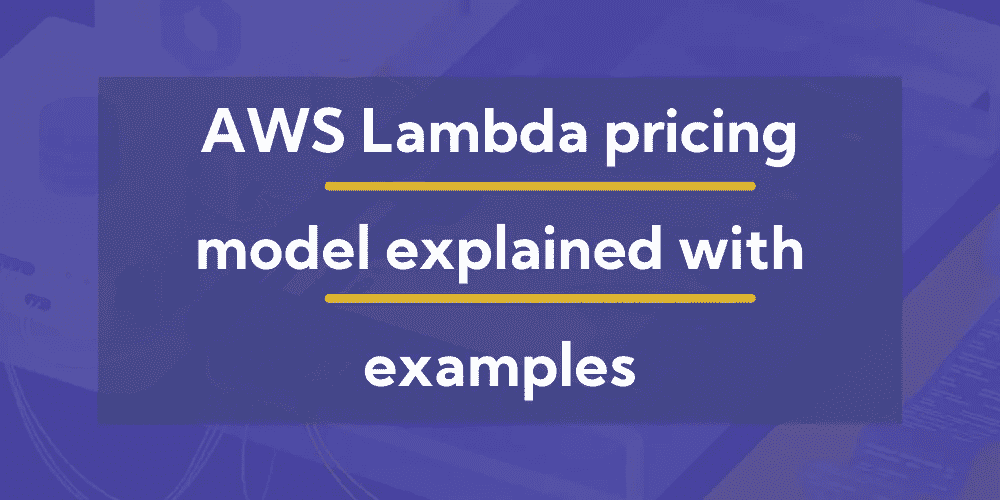

# AWS Lambda 定价模型举例说明

> 原文：<https://blog.devgenius.io/aws-lambda-pricing-model-explained-with-examples-79193e67c6da?source=collection_archive---------2----------------------->

在本文中，我们将介绍 AWS Lambda 定价模式的来龙去脉，它是如何工作的，您可能会考虑哪些额外费用，以及细则中有哪些内容。

金钱使世界运转。不幸的是，它是生活中几乎所有领域的必需品。你可以不喝或少喝一点，但这会让一切变得更难。如果你希望拥有它，首先，你需要一如既往地给予它。就连 AWS Lambda 也不是免费的。

简而言之，你有了一个想法，并且正在突破实现它。你需要使用 AWS Lambda 让它更容易、更漂亮，或者出于某种原因，更容易维护。你需要为 AWS Lambda 付费。那样的话，你的产品就会有出头之日，最终会把钱还给你。要想能够赚到，首先需要投资。

AWS Lambda 价格的一个好处是，你将**只为你使用的东西**付费。他们的服务没有预先设定好的套餐，你最终会为你可能根本用不到的东西付费。这就是为什么 AWS Lambda 决定让它尽可能简单，这是一个非常棒的功能。

# AWS Lambda 的服务如何收费？

AWS Lambda 根据用户对其功能的**请求数量**和**持续时间**向用户收费，持续时间是代码需要执行的时间。当您的代码开始运行以响应一个事件时， [AWS Lambda](https://aws.amazon.com/lambda/) 计算一个请求。它将对**使用的所有函数的请求总数**收费。**持续时间的计算方式是**从代码开始执行到返回或终止，四舍五入到最接近的 **1 毫秒**。AWS **Lambda 定价**取决于用户用来分配给函数的[内存量。](https://dashbird.io/blog/lower-aws-lambda-bill-increasing-memory/)

# 解释 AWS Lambda 定价模型

通常，Lambda 调用不是独立的。一个 Lambda 函数由来自一个 [API 网关](https://dashbird.io/knowledge-base/api-gateway/what-is-aws-api-gateway/)、S3 桶或者几乎任何其他 AWS 服务的事件触发**。这些服务都有额外的费用，其中一些还附带免费等级。**

# AWS Lambda 自由层

Lambda 自由层包括每月 400，000 GB 秒的计算时间**。它不会在年度 AWS 免费层期限结束时自动过期。现有的和新的 AWS 客户都可以无限期地使用它。**

400，000 秒相当于每月 110 个小时的 Lambda 计算时间，而且这只是在您为它们配置了 1 GB 内存的情况下。

对于 128 MB 的默认配置，您将获得 880 小时，而 256 MB 每月仍有 440 小时。

但是请记住，这也是反过来的。如果您配置 10 GB 的内存，您只能在空闲层获得十分之一的时间，即每月 11 个小时。

让我们来看一些计算示例:

如果我们忽略空闲层节省，运行一个函数一秒钟(1000 毫秒)和 128 MB 内存一百万次，将花费您 2.10 美元。在 128 MB 内存中，1 毫秒的成本为 0.0000000021 美元，乘以千得出第二个价格为 0.0000021 美元，乘以一百万得出 2.10 美元。

现在，让我们看看我们会为免费层支付多少钱。首先，我们必须将(1) GB 秒转换为 128 MB 秒，因为在本例中我们没有使用 1 GB 的内存。128 MB 是 1 GB 的八分之一，因此我们可以简单地将该值乘以 8。

400，000 千兆位秒= 3，200，000 128 兆位秒

我们的功能每月运行 1，000，000 个 128 兆秒，因此在免费层允许运行的 3，200，000 个以内，我们不为此支付一分钱。

如果您的函数使用 10.240 MB 的最大内存配置，同样的**一秒*一百万次调用**示例将花费$166.70，因为现在您将为每毫秒支付更多的费用，而不是$0.0000000021，一毫秒花费$0.0000001667。

我们还可以通过将(1) GB 秒到 10GB 秒除以 10 来检查空闲层将为我们节省多少。

400，000 千兆秒= 40，000 10GB 秒

1，000，000 10GB 秒— 40，000 10GB 秒= 960，000 10GB 秒

免费层在这里为我们节省了 40，000 10GB 秒，约合 6.5 美元。

# API 网关自由层

API 网关免费层，用于 API 网关请求触发的 Lambda 函数，包括每月**100 万个免费请求**。在花费之后，每 100 万次请求将花费 0.20 美元，或者每一次请求将花费 0.0000002 美元。API 网关免费层在 12 个月后到期。

对于我们之前的例子，如果我们假设事件源是 API Gateway，我们在前 12 个月不需要改变计算，因为我们只发出 100 万个免费请求。之后，我们需要在最终价格上增加 0.20 美元。

在 10 GB 内存的例子中，这并没有改变太多的账单，但第一个 128 MB 的例子仍然会花费我们的钱，即使我们不离开 Lambda 空闲层。

# Dashbird 的 Lambda 成本计算器

如果这些信息是有帮助的，但它仍然让你很难计算你需要支付的价格，[使用我们的 AWS Lambda 成本计算器](https://dashbird.io/lambda-cost-calculator/)。这可能有助于**根据个人使用情况确定你需要为 AWS Lambda 服务**支付的费用。点击此链接，计算你自己的 AWS Lambda 价格。

# AWS Lambda 定价范围内的额外费用

人们大多不喜欢**的小字**，通常他们不会通读。这就是为什么我们在 [Dashbird](https://dashbird.io/) 已经阅读了全部内容，我们希望将它传递给你们。这样，你将避免任何不必要的和不愉快的经历。

为了避免不必要的情况，你需要知道关于定价模式、额外费用等的一切。**AWS Lambda 定价车型是否有任何额外收费？**有，有。仔细看完这个，就不会有不愉快的惊喜了。

如果您使用了任何其他 AWS 服务或数据传输，发生额外费用的可能性会显著增加。无论选择哪一级，都将向您收费。在这个例子中，如果你的功能是从亚马逊 S3 读取和写入数据，你将为读取/写入请求和存储在亚马逊 S3 的所有数据付费。

我们将列出一些将被追加费用的**案例，这样，您就可以跟进所做的所有更改。如果您的 Lambda 函数开始外部数据传输，您将按 [EC2](https://aws.amazon.com/ec2/) 数据传输速率付费。**

另外值得一提的是[亚马逊 DynamoDB](https://aws.amazon.com/dynamodb/) **对数据存储****吞吐能力****数据传输**收费。另一方面，亚马逊 S3 对**存储**、**请求**、数据**传输**收费。

# AWS Lambda 定价示例

AWS Lambda 定价示例将在本节中介绍，由已经提到的 AWS Lambda 价格构成。

你给你的函数分配了 **512 MB 的内存**，并在一个月内执行了**300 万次**。考虑到它每次运行 1 秒钟，您将按每月计算时间(在本例中为 18.34 美元)和每月请求(在本例中为 0.40 美元)计费。因此，**的总账单金额将为每月 18.74 美元**。

也就是说， [AWS Lambda 在削减成本方面令人惊叹](https://dashbird.io/blog/serverless-survey-results-benefits/)，我们有很多公司通过[转向无服务器](https://dashbird.io/blog/migrating-to-serverless-making-it-work/)而成功节省大笔资金的例子。[可口可乐北美公司](https://dashbird.io/blog/serverless-case-study-coca-cola/)已经从自动售货机部门的无服务器化中获益良多，以至于他们已经将无服务器化作为开发部门的一项要求。

知道你需要什么和它的价格是实现你的想法并把它们变成现实的第一步。

*延伸阅读:*

[6 尝试并测试了有效的 Lambda 成本优化策略](https://dashbird.io/blog/aws-lambda-cost-optimization-strategies/)

[如何测试 JavaScript Lambda 函数？](https://dashbird.io/blog/test-javascript-lambda-functions/)

[使用 Dashbird 进行调试:λ任务在 X 秒后超时](https://dashbird.io/blog/task-timed-out-after-x-seconds/)

[无服务器可观测性和实时调试](https://dashbird.io/observability/serverless-observability-real-time-debugging/)