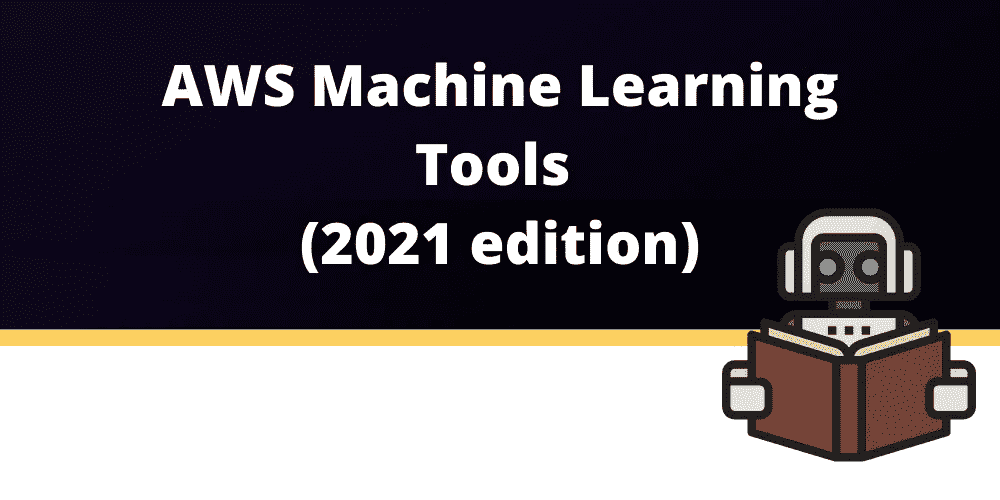

# 2021 年的 AWS 机器学习工具

> 原文：<https://blog.devgenius.io/aws-machine-learning-tools-in-2021-68c6ad29f250?source=collection_archive---------4----------------------->

本文原载于[https://dash bird . io/blog/AWS-machine-learning-tools-2021-edition/](https://dashbird.io/blog/aws-machine-learning-tools-2021-edition/)

当你想**在一个快速发展的行业中保持领先地位时**，机器学习(ML)无疑是一个趋势性的解决方案。今天，**的创新公司**已经将领先的机器学习工具很好地集成到了他们的流程中。相比之下，你的起步可能会慢得可怕。或者也许你只是没有时间或资源来投资运行自己的机器学习培训基础设施。

AWS 仅在其**机器学习**类别中就提供了超过 **20 种服务**，这还不包括集成了软机器学习功能的其他服务。**服务范围广泛，从低级产品**如 SageMaker，它有助于为您的学习环境构建和管理基础设施，到**高级系统**如 Rekognition，它带有用于图像识别的预建机器学习模型。

因此，根据你的问题，你可以开始在 AWS 的基础设施上训练你自己的模型，或者简单地将你的数据注入预训练的模型，以从中提取额外的价值。

本文将介绍 AWS 目前提供的机器学习服务。

# AWS 机器学习的基础

虽然你可以从容器或虚拟机中手工构建你的机器学习基础设施，但亚马逊 SageMaker 形成了 AWS 必须提供的所有机器学习工具的基础。这是一项简化所有机器学习任务的服务，从**准备数据**和**建立模型到训练**，以及**部署**它。SageMaker 是第一个用于机器学习的集成云 IDE。

# 开发工具

亚马逊是一家利用开源和 AWS 内部项目的知识为你提供改进代码库和基础设施的建议的公司。他们也为你提供所有的工具来开始软件开发。

[**亚马逊代码大师**](https://aws.amazon.com/codeguru/) 是一款机器学习驱动的**静态代码分析工具**目前可用于 Python 和 Java。它在流行的开源存储库和亚马逊内部存储库上接受培训，并且**根据行业最佳实践**给你改进代码的提示。

CodeGuru 做静态分析的同时， [**亚马逊 DevOps Guru**](https://aws.amazon.com/devops-guru/) 是一个支持机器学习的云监控服务。它会自动监控您的基础架构，并针对最佳实践提供警报和见解。

# 文本工具

AWS 有许多机器学习驱动的工具，可以帮助你理解、修改和创建文本。如果你想**构建对话式用户界面**或**总结文本**，它们是可以适应的。

[**亚马逊理解**](https://aws.amazon.com/comprehend/) 进行**自然语言处理和文本分析**帮助你理解文本情感，将文本相互关联。

[**亚马逊 Lex**](https://aws.amazon.com/lex/) 是一项**使用语音和文本构建对话界面**的服务。借助 Lex，您可以在自己的应用程序中使用与 Alexa 相同的深度学习引擎。

[**亚马逊 Textract**](https://aws.amazon.com/textract/) **从扫描文档中提取文本和数据**。它不仅仅是 OCR，而是由机器学习模型支持，这些模型分析了许多类型的文档，可以识别表单中字段的内容和表格中存储的信息。

你可以用 [**亚马逊转录**](https://aws.amazon.com/transcribe/) 到**把任何语音记录变成文本**。如果你需要反过来， [**亚马逊波利**](https://aws.amazon.com/polly/) 会从任何文本合成栩栩如生的语音。

[**亚马逊翻译**](https://aws.amazon.com/translate/) 通过**将每一篇文本**翻译成你选择的语言来迎合你的多语言需求。

# 商业工具

带有 business focus 的 AWS 机器学习工具帮助您完成**运营和销售任务**。

在 Amazon.com 的核心预测技术 [**亚马逊预测**](https://aws.amazon.com/forecast/) 的帮助下，现在可以**为自己的应用建立预测模型**。

[**亚马逊欺诈检测器**](https://aws.amazon.com/fraud-detector/) 可以轻松**识别潜在的欺诈性在线活动**，例如在线支付欺诈和创建虚假账户。

[**亚马逊 Kendra**](https://aws.amazon.com/kendra/) 是一个机器学习驱动的企业搜索服务，**帮助你的员工找到他们需要的数据**。

亚马逊个性化让你用 Amazon.com 上使用的相同系统为你的应用个性化客户推荐。

# 图像和视频工具

如果你需要**从视频或照片中分析视觉数据**，你也会发现 AWS 的一些机器学习支持。

[**亚马逊 Rekognition**](https://aws.amazon.com/rekognition/) 可以**扫描视频和图像寻找物体和人**。这允许您仅根据内容来验证、排序和整理媒体。

[**AWS DeepLens**](https://aws.amazon.com/deeplens/) 是 AWS 提供的**硬件**。它配有一个完全可编程的摄像头，可以用来为你的特定任务训练机器学习模型。教程和指南也伴随着这一点，以立即开始。

[**AWS 全景**](https://aws.amazon.com/panorama/) 是一个运行在边缘的计算机视觉服务。这允许**需要低延迟**或**没有持续可用的互联网连接**的用例。

# 制造工具

对于未来的工厂，AWS 提供了一些全新的机器学习解决方案，可以**消除制造过程中的人为错误**，无论是发现产品缺陷还是故障机器。

[**亚马逊望风视觉**](https://aws.amazon.com/lookout-for-vision/) 利用计算机视觉发现产品缺陷**自动化质检**。

[**亚马逊寻找设备**](https://aws.amazon.com/lookout-for-equipment/) **通过分析传感器数据检测设备异常行为**。

[**Amazon Lookout for Metrics**](https://aws.amazon.com/lookout-for-metrics/)自动**检测指标**中的异常并识别其**根本原因**。

[**亚马逊 Monitron**](https://aws.amazon.com/monitron/) 是一个端到端的系统，自动**检测工业机械**中的异常行为，使您能够对潜在故障采取主动行动，减少计划外停机时间。

# 其他工具

除了我们已经列出的大型机器学习工具，AWS 还提供一些更多的**实验音频和医疗保健服务**。

[**亚马逊健康湖**](https://aws.amazon.com/healthlake/) 帮你搞清楚**医疗保健数据**。它符合 HIPAA 标准，因此您的组织在处理敏感数据时将**安全** **。**

有了[**AWS deep composer**](https://aws.amazon.com/deepcomposer/)，你就有了一个人工智能的**键盘，它可以在机器学习模型的帮助下，将你的旋律转化成独特的歌曲**。虽然这偏离了众所周知的艺术家创作音乐的方式，但它可以带来新的歌曲创作方式。

[**AWS DeepRacer**](https://aws.amazon.com/deepracer/) 给你一辆机器学习模型驾驶的 1/18 比例自主**赛车。你可以在家里训练它，用你自己的跑酷，然后参加全球赛车联盟的比赛，看看你的训练有没有什么优点。**

# 摘要

AWS 有一个庞大的机器学习服务目录，就在你的指尖，为你过程的每个阶段和不同的用例提供**解决方案。**

如果你已经是一名机器学习专家，你可以从 SageMaker 开始[减轻云中基础设施供应的负担](https://dashbird.io/knowledge-base/basic-concepts/what-is-serverless/)并扩展到数百台机器。这样，你可以更快地进入工作中有趣的部分，而不必等上好几天才能完成工作。

如果你只是想利用机器学习的力量对你已经存在的数据获得**新的见解**，而不需要在内部建立自己的机器学习技能，那么有大量的解决方案可供商业、开发、文本和基于图像的用例使用。

*延伸阅读:*

[采用 AWS Lambda 的机器学习](https://dashbird.io/blog/machine-learning-in-aws-lambda/)

[5 必须为您的初学者工具包安装 AWS 无服务器工具](https://dashbird.io/blog/5-core-aws-serverless-tools-starterkit/)

[监控无服务器应用的终极指南](https://dashbird.io/blog/ultimate-guide-monitoring-serverless-applications/)