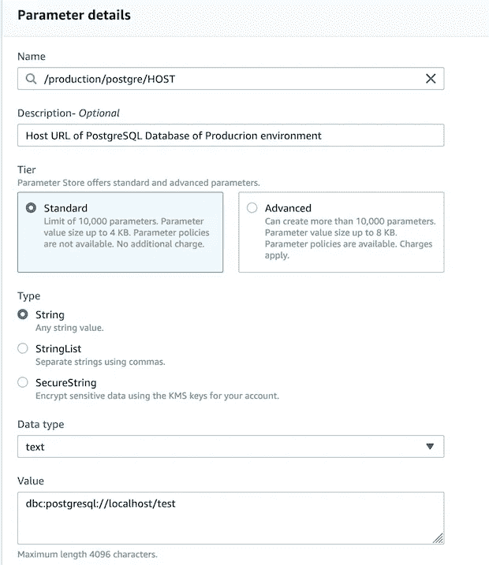
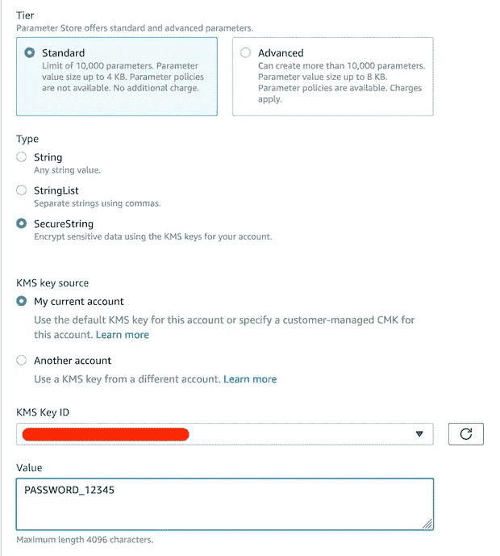
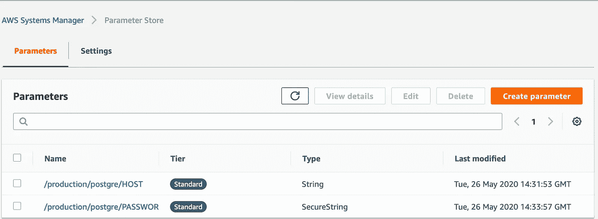
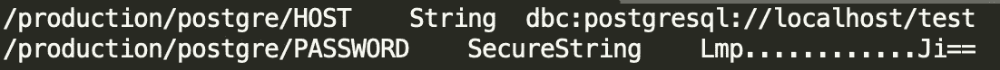
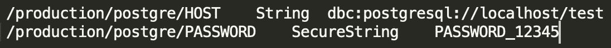

# AWS 参数存储:存储秘密值的替代方法

> 原文：<https://blog.devgenius.io/aws-parameters-store-another-way-to-store-secret-values-e586d7013a9b?source=collection_archive---------3----------------------->


照片由[乔丹·哈里森](https://unsplash.com/@jordanharrison?utm_source=medium&utm_medium=referral)在 [Unsplash](https://unsplash.com?utm_source=medium&utm_medium=referral) 上拍摄

这篇文章并不是说 AWS 参数存储(PS)是存储项目秘密值的最安全的方式。这只是一个关于存储值的另一种(相对安全的)方法的简介。

您必须已经将项目秘密值存储在某个文件夹中，或者在执行 run 命令时将其导出，或者最糟糕的是，将它们存储在您的代码中。AWS PS 允许您实时获取这些值。

Parameters Store 是一个非常简单的设置和获取服务，您可以通过控制台或 cli 直接在 AWS 上添加参数，然后通过 aws-sdk 或 cli 获取参数。让我们看一个存储 PostgreSQL 凭据的示例:

# 设置参数

登录 AWS 控制台，在“服务”下，转到“系统管理器”。在左侧面板的应用程序管理下，您会看到参数存储。选择后，点击创建参数。

让我们在这里添加数据库主机 URL。我们将在这里选择类型为**字符串**，数据类型为**文本**



添加数据库的主机 URL

现在我们将密码设置为一个**安全字符串**，它将使用 AWS KMS 密钥将密码存储为加密文本。



添加参数后，您的控制台将如下所示。当我们获取它时，键的命名将更有意义。



# 获取参数

您可以在代码中使用 aws cli 或 aws-sdk 获取这些参数。现在，我们将使用 aws cli。

我们将使用以下命令获取我的 postgre 生产数据库的所有参数:

```
*aws ssm get-parameters-by-path --path “/production/postgre/” 
--recursive —-output text*
```



带有加密密码文本的结果

# 我们做了什么，得到了什么？

## **输入**

**aws ssm** :使用 aws cli 访问 Systems Manager 服务。

**get-parameters-by-path** :我们提到我们想要获得路径下的所有键名。我们将键命名为路径，这样一个环境的所有子键名都可以在一个路径下。

**—Path "/production/postgre/"**:我们要从中提取的路径

**—递归**:检索一个层次内的所有参数

***—* 输出文本** *:* 明确提到输出应该显示为文本而不是 json。这将覆盖 aws 配置文件中的输出设置。

## **输出**

在上面的截图中，我只显示了相关的信息，包括键名、数据类型和键值。如果你注意到，我们设置我们的密码为 *PASSWORD_12345* 但是我们得到了一个加密文本 *Lmp……Ji==* 。为了获取解密值，我们在命令 ***— with-decryption*** 中增加了一个选项

所以我们最后的命令是:

```
*aws ssm get-parameters-by-path --path “/production/postgre/” 
--recursive —-output text —-with-decryption*
```



使用解密的密码文本提取的结果

## 我们如何利用这些？

我认为有两种方法可以使用参数存储。

1.  在应用程序的入口文件中，在启动主应用程序之前，调用一个使用 aws-sdk 的方法来获取这些参数并在代码中使用。

```
const result = await ssm.getParametersByPath({ Path: fetchPath, WithDecryption: true, MaxResults: 10, NextToken: token }).promise();
```

2.编写一个 shell 脚本，获取这些参数，并在启动之前将其导出到您的应用程序中。

```
# Prints result of aws commandfor result_row in $(aws ssm get-parameters-by-path — path “$path” — recursive — with-decryption — output text); do echo $result_row
done
```

# 注意:

这只是一个设置和获取的例子。命名密钥、获取技术、加密和解密有不同的方式，每种方式都取决于特定的应用程序部署过程。

[**AWS 秘密管理器**](https://aws.amazon.com/secrets-manager/) 你可能也会感兴趣。