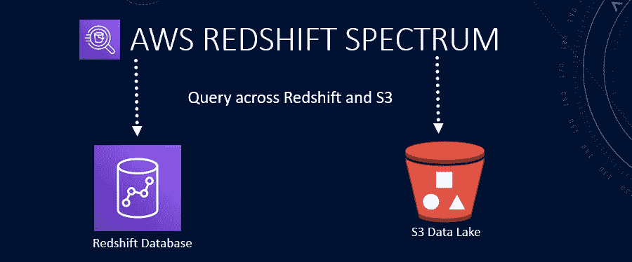

# 自动气象站红移光谱揭示了 S3 红移数据

> 原文：<https://blog.devgenius.io/aws-redshift-spectrum-expose-s3-data-in-redshift-2ae573028ce?source=collection_archive---------7----------------------->

**使用 AWS 红移**



AWS 红移光谱

红移光谱是亚马逊红移网络服务的一部分，提供了一个公共平台来提取/查看数据库以及 S3 数据湖中的数据。我们可以从两个服务中查询数据，而不必在它们之间移动数据。我们可以有效地从亚马逊 S3 的文件中查询和检索结构化和半结构化数据，而不必将数据加载到亚马逊红移表中。红移光谱查询采用并行性，因此针对大型数据集的查询运行速度很快。我们可以通过定义文件的结构并将其注册为外部数据目录中的表来创建红移光谱表。

与 S3 相比，自动气象站红移数据仓库是一个昂贵的数据存储。红移频谱通过将不经常访问的数据从其主存储(如红移)中移出，并将经常使用的数据保留在 RDS 中，有助于节省存储成本。

我们使用数据定义语言(DDL)命令在 Amazon Redshift 中创建和管理外部表。在我们的红移谱表被定义之后，我们可以像查询和连接任何其他 Amazon 红移表一样查询和连接这些表。但是，我们不能对外部表执行更新操作。当我们更新我们的亚马逊 S3 数据文件时，可以立即在亚马逊红移中查询这些数据。

SQL 脚本可以在 [GitHub](https://github.com/hnawaz007/pythondataanalysis/tree/main/AWS%20Redshift%20Spectrum) 上获得。代码演练可以在 [YouTube](https://www.youtube.com/watch?v=p09xfO8TtVo) 上找到。

AWS 红移光谱使我们能够:

*   在 AWS 红移中直接查询 S3 数据，无需移动数据
*   在单个查询中组合 S3 和 AWS 红移表
*   S3 数据更新立即在自动气象站红移。不需要 ETL。

**创建外部模式**

基于 S3 创建外部表的第一步是创建外部模式。外部模式引用外部数据目录中的数据库，并提供 IAM 角色 ARN，该角色授权我们的集群代表我们访问 Amazon S3。我们发出以下命令来创建一个外部模式。

```
create external schema adventureworks_external
from data catalog
database dev'
iam_role 'arn:aws:iam::123456789012:role/myspectrum_role'
create external database if not exists;
```

一旦创建了模式，我们就可以开始在这个模式中创建外部表。要创建外部表，您必须是外部模式的所有者或超级用户。为了创建外部表，我们运行下面的 CREATE EXTERNAL TABLE 命令。

```
create external table adventureworks_external.sales(
salesid integer,
listid integer,
sellerid integer,
buyerid integer,
eventid integer,
dateid smallint,
qtysold smallint,
pricepaid decimal(8,2),
commission decimal(8,2),
saletime timestamp)
row format delimited
fields terminated by '\,'
stored as textfile
location 's3://awssampledbuswest2/tickit/spectrum/sales/'
table properties ('numRows'= 60398);
```

一旦我们的表创建成功，我们就可以像查询常规红移表一样查询它。让我们对这个表执行下面的查询来查看数据。查询成功执行，我们利用红移光谱查询了 S3 天体。我们可以把这个当作一个普通的红移表，把它加入到现有的原生红移表中。我们可以从两个服务发出查询连接表来执行数据分析。

如果我们希望看到外部表的底层 S3 血统，那么我们可以运行下面的查询。AWS 将这些信息保存在几个特殊的伪列中。这给了我们 S3 路径，文件等。

```
select 
     "$path", 
     "$size", 
     "$spectrum_oid"
from spectrum.sales_part
```

一种常见的做法是将较大的事实表保存在亚马逊 S3 中，将较小的维度表保存在亚马逊红移中。一旦我们将数据加载到外部表中，它们就可以在 Redshift 中使用，我们可以在分析中将它们作为常规表进行查询和连接。

这就是我们在 AWS 红移服务中展示 S3 数据的方式。我们可以通过 AWS 红移直接查询 S3 数据，并将 S3 数据与现有的 AWS 红移数据相结合。

**结论**

*   我们已经成功地在 AWS 红移中创建了 AWS 光谱外部模式。
*   我们在 AWS 红移中创建了一个外部表。
*   我们查询并结合了 S3 数据和现有的 AWS 红移表。
*   SQL 脚本可以在[这里](https://github.com/hnawaz007/pythondataanalysis/tree/main/AWS%20Redshift%20Spectrum)找到