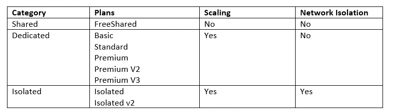

# AZ-204—Azure 应用服务的构建模块

> 原文：<https://blog.devgenius.io/az204-building-blocks-of-azure-app-service-e2c1e9065aca?source=collection_archive---------10----------------------->

这篇文章是 AZ-204 认证的几篇文章的一部分。在本文中，我将讨论 Azure 应用服务的关键组件。

# 什么是 Azure 应用服务

Azure App Service 是微软 Azure 的一个产品，用于托管 web 应用、REST APIs 和移动后端。

## 优势

使用 Azure App 服务有很多好处。主要的如下:

*   自动缩放支持
*   持续集成/部署支持
*   与 Linux 的兼容性

## 限制

在技术的世界里，也有局限性。理解它们也很重要。

*   共享定价层不支持应用服务
*   Linux 和 Windows 应用不能驻留在同一个应用服务计划中
*   在 2021 年 1 月 21 日之前，Linux 和 Windows 应用服务不能存在于同一个资源组中。

# Azure 应用服务计划

应用服务计划类似于一个具有计算能力的服务器集群，可以在其中运行资源。一个应用服务计划可以托管多个应用，应包含以下内容:

*   地区
*   操作系统
*   虚拟机实例的数量
*   虚拟机实例的大小
*   定价层—免费、共享、基本、标准、高级、高级 v2、高级 V3、独立

## 定价等级

[定价层](https://azure.microsoft.com/en-au/pricing/details/app-service/windows/)决定云服务的使用成本。这些定价层级分为三类—共享专用&独立

## 缩放比例

如前所述，应用服务计划是一个虚拟机集群。每个应用都存在于服务计划内的所有虚拟机上。扩展发生在应用服务计划级别，以增加/减少应用服务计划的计算资源。不可能横向扩展单个应用程序。

*   水平扩展(向外/向内)—增加/减少虚拟机数量。
*   垂直扩展(向上/向下)—更改应用服务计划的定价等级。

# 应用服务部署

有两种部署模式

*   手动— Git、AzCli、Zip 部署、FTP/S
*   自动— Azure DevOps、GitHub、BitBucket

## 使用部署插槽

部署插槽有助于消除部署期间的停机时间。不同的插槽管理不同的应用程序版本。生产请求被路由到生产插槽，而应用程序的新版本被部署在一个或多个非生产插槽上。一旦部署结束，Azure 将在生产和非生产插槽中交换应用程序，以便在不停机的情况下部署新功能。

# 认证和授权

Azure 应用服务和 Azure 功能具有现成的身份验证和授权功能。

认证和授权模块执行以下操作。

*   使用指定的提供程序验证用户
*   验证存储并刷新令牌
*   管理身份验证会话
*   将标识信息注入请求标头

## 优势

*   易于整合身份验证机制，无需编写代码，也不需要任何技术知识。
*   易于使用不同的登录提供商，如谷歌，FB，Azure 广告，Twitter 等。，带 Azure App 服务。

## 身份提供者

身份提供者创建、维护和管理身份信息，同时向应用程序提供身份认证服务。当与外部用户共享您的应用和资源时，Azure AD 是共享的默认身份提供者

**微软身份平台**

*   目的— Microsoft Identity platform 帮助用户使用他们的 Microsoft 帐户登录应用程序。
*   符号端点— /。授权/登录/aad
*   如何— [配置 Azure 广告认证— Azure 应用服务|微软文档](https://docs.microsoft.com/en-us/azure/app-service/configure-authentication-provider-aad)

**脸书**

*   目的— Microsoft Identity platform 帮助用户使用他们的脸书帐户登录应用程序。
*   符号端点— /。认证/登录/facebook
*   如何— [配置 Azure 广告认证— Azure 应用服务|微软文档](https://docs.microsoft.com/en-us/azure/app-service/configure-authentication-provider-aad)

**谷歌**

*   目的— Microsoft Identity platform 帮助用户使用他们的 Google 帐户登录应用程序。
*   符号端点— /。认证/登录/谷歌
*   如何— [配置谷歌认证— Azure 应用服务|微软文档](https://docs.microsoft.com/en-us/azure/app-service/configure-authentication-provider-google)

**推特**

*   目的— Microsoft Identity platform 帮助用户使用他们的 Twitter 帐户登录应用程序。
*   符号端点— /。认证/登录/推特
*   如何— [配置 Twitter 认证— Azure 应用服务|微软文档](https://docs.microsoft.com/en-us/azure/app-service/configure-authentication-provider-twitter)

**打开 ID 连接**

*   目的— Microsoft Identity platform 帮助用户使用符合 [OpenID Connect 规范](https://openid.net/connect/)的自定义身份验证提供程序登录应用程序。
*   符号端点— /。授权/登录/<providername></providername>
*   如何— [配置 OpenID 连接提供商— Azure 应用服务|微软文档](https://docs.microsoft.com/en-us/azure/app-service/configure-authentication-provider-openid-connect)

## 认证流程

有两种身份验证流程:

*   没有提供商 SDK 的情况下，这个流程最适合遗留应用，也被称为*服务器导向流程*或*服务器流程*。比如身份提供者(针对 ex-Google、FB、微软)会处理认证，开发者不需要在 app 服务内部编写额外的代码来进行认证。
*   **对于提供者 SDK** ，这是认证的推荐选择，该流被称为*客户端导向流*或*客户端流*。在这种方法中，开发人员将向应用服务添加代码。接下来，该代码将使用 Provider SDK 独立地与身份提供者连接，并包含为身份验证返回的令牌。

# 用于管理应用服务的 Az Cli 命令

## 使用 AzCli 创建 Web 应用程序

az webapp up —位置 <mylocation>—名称 <myappname>— html</myappname></mylocation>

## 更改后重新部署 Web 应用程序

az webapp up —位置 <mylocation>—名称 <myappname>— html</myappname></mylocation>

## 清理资源

az 组删除—名称 <resource_group>—无等待</resource_group>

# 下一步是什么？

*   [管理应用程序设置](https://tarunbhatt9784.medium.com/az204-manage-application-settings-fe9436a82be2?sk=24095272ce7be32786bcdf276da97c6f)
*   [应用缩放](https://tarunbhatt9784.medium.com/az-204-application-scaling-88952d2124d3?sk=7b8c91565d3e4da5b7be9e03fc1f42a5)
*   [App 服务部署槽](https://tarunbhatt9784.medium.com/az204-app-service-deployment-slots-88f0c7762ef8?sk=4ceac1943313c418dc6091aa5f7256f7)

页（page 的缩写）s-Medium 是一个阅读、写作和向其他作者学习的绝佳平台。如果你想加入我的旅程，今天就加入 [medium](https://tarunbhatt9784.medium.com/membership) 。